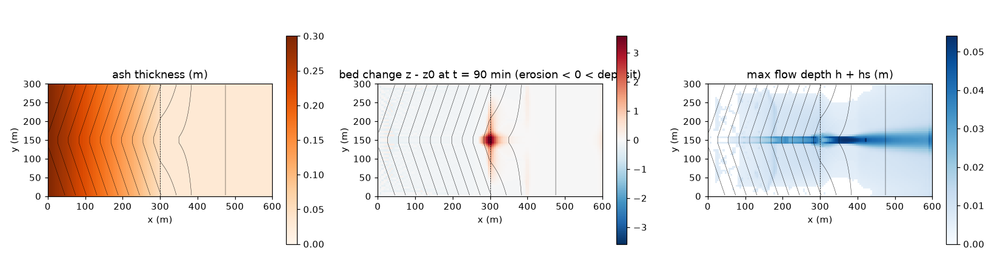
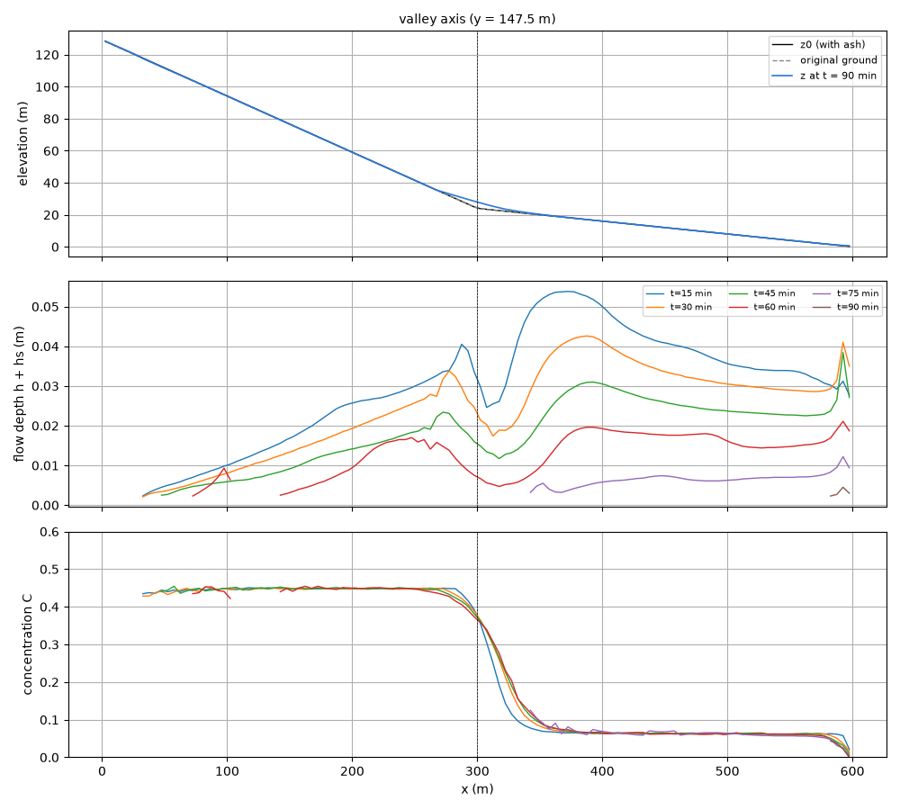
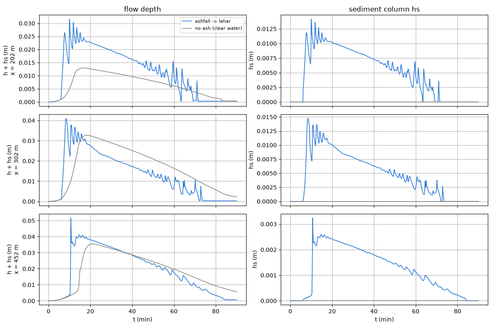

# examples/ashfall_lahar — 降灰 → 降雨 → 泥流(ラハール)の発生と堆積

火山灰の**降灰厚分布を初期条件として与え**、その後の降雨で斜面の表面流が
灰を侵食して泥流になり、谷出口の扇状地に堆積するまでを一つの計算で追う
例題です。発生源の指定(崩壊深や流入ハイドログラフ)は要りません。
降灰層を「侵食できる土層」として与えるだけで、**侵食起動型**の経路
(表面流 → 侵食・濃度上昇 → 混合体の流下 → 減速・堆積)が動きます。
対照として同じ地形・降雨で降灰なし(清水の洪水)を並べます。

| ケース | ファイル | 内容 |
|---|---|---|
| 降灰あり | param.txt | 降灰層 sd(0.30 → 0.05 m)+ 降雨 40 mm/h × 60 分 + 土石流モデル |
| 降灰なし(対照) | param_noash.txt | 元地形に同じ降雨。土砂プロセスなし |

## 実行

```
make                                   # ../../bin/encflow へのリンク
python3 make_init.py z       > z.txt       # 降灰後の地表(元地形 + 降灰厚)
python3 make_init.py z_noash > z_noash.txt # 元地形(対照用)
python3 make_init.py ash     > ash.txt     # 降灰厚(土層厚 sd として与える)
./encflow param.txt                    # 約 2 分(90 分の計算)
./encflow param_noash.txt
python3 plot_results.py                # figs/ に 3 枚の図 + 数表
```

## 初期条件の与え方(この例題の要点)

降灰層は**土層厚 sd(可動層)**として与え、**地表標高 z にも上乗せ**
します。ENCflow では z − sd が元の地山なので、

- `fn_z` = 元地形 + 降灰厚(make_init.py z)
- `fn_sd` = 降灰厚(make_init.py ash。f_sdtype=1)

の 2 枚を前処理で作ります。降灰厚だけを sd にすると、侵食が灰の底に
達した所で止まります(灰を使い切る挙動)。元の表土も削れる想定なら
sd に表土厚を足します。

地形は西の山体斜面(tanθ=0.35。谷底 15 m の台形谷が中央に流れを集める)
→ x=300 m の谷出口 → 緩勾配の扇状地(tanθ=0.08)、東辺は自由流出です。
降灰は火口側(西)で 0.30 m、谷出口で 0.05 m、扇状地で 0.03 m の一方向
分布にしました。

土石流モデルの設定は `f_debris = 1`、E-D は高橋型の平衡濃度緩和
(`f_dbed = 1`。堆積係数 δd=0.01)、抵抗則は Voellmy(`f_dbres = 4`、
μ=0.05・ξ=500)、間隙水連行 `f_dbwet = 1`(飽和度 0.8)、停止した土砂は
`f_dbstop = 1` で地形に固定します。浸透は無視しています(新鮮な降灰の
クラストは浸透能が低い = 安全側の概算。浸透能を与えるなら fn_gwflow の
Horton 型 `gw_infil_mmh`。その場合 f_dbwet は 0 に)。

## 結果



左: 降灰厚。中: 終了時(90 分)の地形変化(青 = 侵食、赤 = 堆積)。
右: 流動深 h+hs の最大値。斜面全体の灰が薄く削られ、谷出口に扇状の
堆積ローブができます。



谷筋の縦断。上: 地形(降灰後・元地形・終了時)。中: 流動深の時間発展。
下: 濃度 C。斜面上では C ≈ 0.45(ほぼ飽和 = 泥流)、谷出口で勾配が
落ちると C ≈ 0.07 まで下がって(土砂を置いて)清水に近い流れとして
扇状地を下ります。



3 地点(斜面 x=202 m、谷出口 302 m、扇状地 452 m)の流動深と土砂柱状量。
降灰ありは到達が早く(μ の小さい泥流は清水より速い)、ピークが高く、
降雨が止むと速やかに引きます。

| 量 | 値 |
|---|---|
| 降灰の総量 | 18,449 m³ |
| 侵食された灰 | 9,434 m³(51%) |
| 扇状地ローブ(厚さ 0.1 m 以上、x 250〜400 m)| 約 8,200 m³、最大厚 3.6 m、幅 約 50 m |
| 東辺から流出した固体 | 43 m³ |
| 谷出口の最大流動深(降灰あり / なし) | 0.041 m(8.3 分)/ 0.033 m(18.3 分) |
| 谷出口の最大流速(降灰あり / なし) | 1.7 m/s / 0.65 m/s |

固体の台帳(Σhs + (1−λ)Σ(z−z0) + 流出)は機械精度で閉じます。

## 読み方の注意

- 流動深が数 cm と薄いのは、集水域が小さく(谷出口上流 0.09 km²)、
  降雨 40 mm/h の流出が 1 m³/s 程度だからです。泥流は薄いシート流として
  谷底全体を流れ、谷出口で止まって厚いローブ(3.6 m)を作ります。
  規模感を変えるには lx(集水域)と降雨強度を上げます(dt は CFL に
  合わせて)。
- 斜面上の侵食はセル規模のまだら(±0.2 m)になります。急斜面の薄い
  飽和流では侵食と堆積がセルごとに入れ替わる数値的なリル化で、
  積分した侵食量(51%)が頑健な量です。
- 上流端近くの谷壁にも薄い堆積が出ます(壁沿いの低速セルで
  f_dbstop が働くため)。扇状地のローブの読みには影響しません。
- プローブの流動深が周期 1〜2 分で ±10% ほど振動するのは**ロール波**
  (表面流が自励的に作る周期的な段波)です。濃度 C は揺れず(標準偏差
  0.0002)、峰は斜面を波速 約 2 m/s(平均流速 1.8 m/s)で下っていきます
  (5 秒出力で確認)。斜面のフルード数は 3〜4 で、Voellmy の乱流項は
  シェジー型(抵抗 ∝ V²)なので Fr > 2 で一様流が不安定になる古典的な
  領域にあります。対照の清水(Manning、Fr ≈ 1.8)は滑らかです。現象として
  は妥当ですが、振幅・周期は格子幅と dt の離散化に依存するので定量的な
  意味は持たせないでください。

## 設計の経緯(試行で分かったこと)

1. **江頭構成則(f_dbres=2)は細粒の灰では使えない**: 層流抵抗が
   (d/h)² に比例するため、d50=1 mm・h=数 cm では抵抗がほぼ消え、速度が
   数十 m/s に発散した。江頭則は d50 が cm 以上の石礫型の抵抗則。
   細粒スラリーには Voellmy(μ 小)かクーロン+Manning(f_dbres=1)。
2. **クーロン降伏(f_dbres=1、φ=30°)では扇状地を流下できない**:
   C≈0.45 の混合体の降伏勾配は tanφ·sC/(1+sC) ≈ 0.25 で、扇状地勾配
   0.05〜0.08 では谷出口で即座に止まる。間隙水圧の高い細粒スラリーの
   見かけ摩擦として μ=0.05 の Voellmy を採用した。
3. **江頭・芦田の E-D(f_dbed=2)は侵食が速すぎる**: 侵食速度が |V| に
   比例し、降雨開始 15 分で斜面の灰 16,000 m³ がほぼ全て剥がれた。
   高橋型緩和(f_dbed=1、δe=0.0007)では 60 分で 51%。
4. **堆積の位置は δd にほとんど依らない**(0.05 → 0.001 でローブの
   先端が 50 m 伸びる程度)。谷出口で平衡濃度が 0.45 → 0.1 に落ちる
   こと自体が堆積を決めている。
5. V 字谷(谷底 1 セル)では全量が 1 列に集中して非現実的な厚さに
   なるため、谷底 15 m の台形谷にした。

## 感度実験の入口

- `db_mu`(0.05 → 0.1): 扇状地での停止位置が手前に移る
- `db_deltd`(0.01 → 0.05): 谷出口直下へより集中
- 降雨(prval): 強度を上げると侵食が深くなり、灰を使い切る範囲が広がる
- `fn_gwflow` + `gw_infil_mmh`: 浸透能と降雨強度の差が泥流発生の有無を
  決める(降灰クラストの数 mm/h と、浸透の良い地表の数十 mm/h を比べる)
- `ash.txt` を 0 にした列を作れば「降灰のない支流」との合流も試せる
