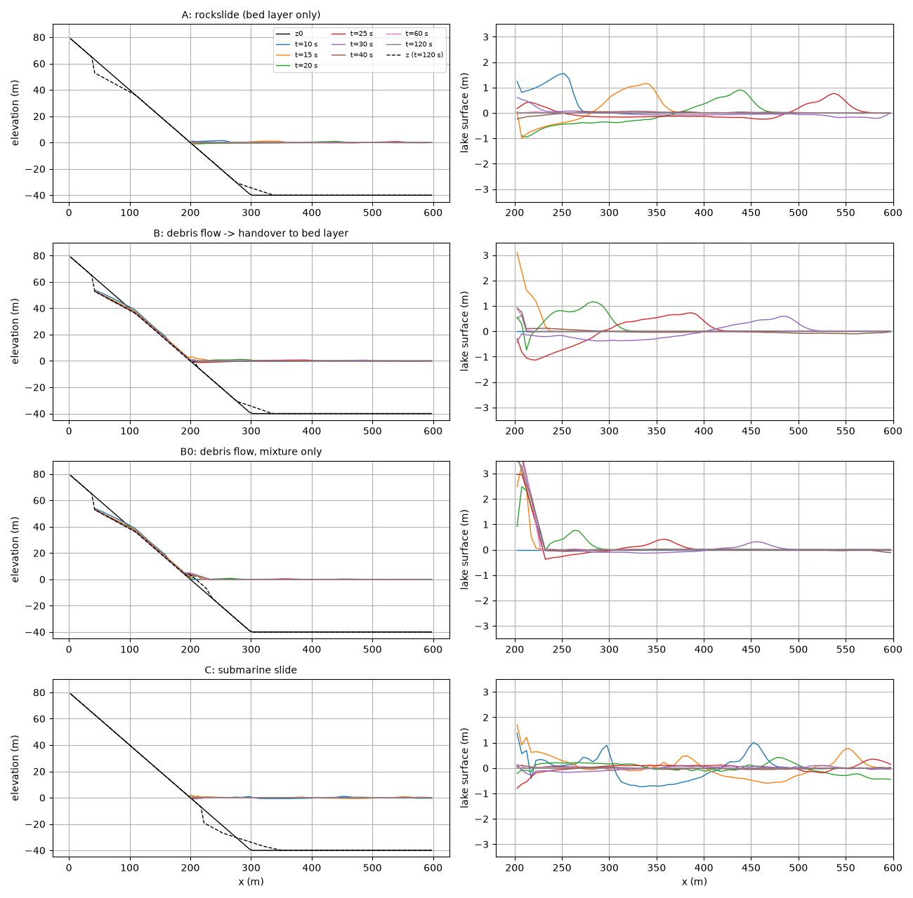
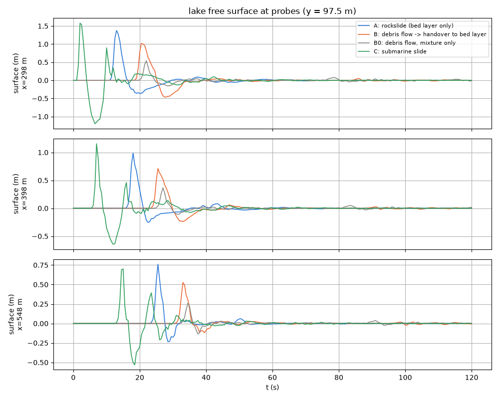
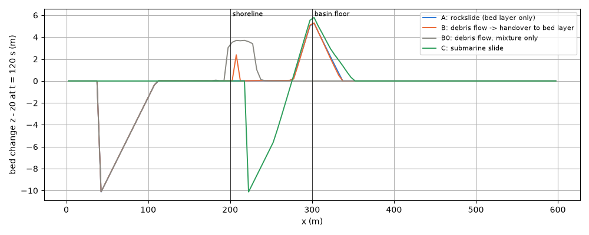
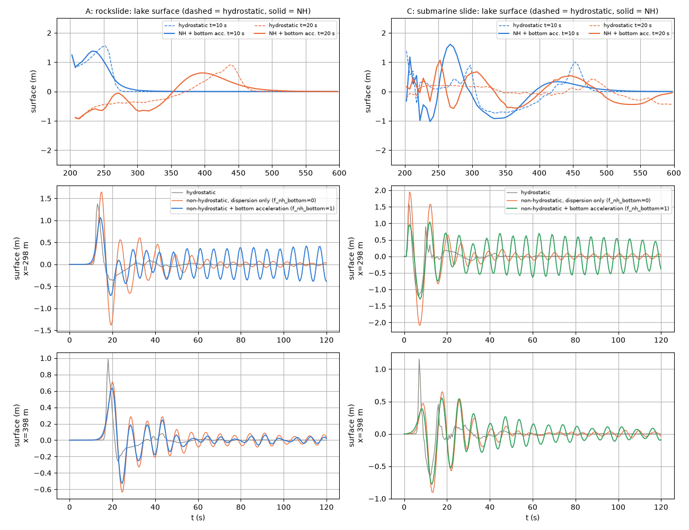

# landslide_tsunami — 地滑り・土石流の水域突入と津波(理想化ケース集)

崩壊土塊が湖(貯水池・湾)に突入して水面波を発生させる現象を、
**動く底層 f_bedslide**(developer.md §61、docs/landslide_tsunami_plan.md)と
土石流モデル(f_debris)の組み合わせで概算する 4 つのパターンと、そのうち
底層だけの 2 つ(A・C)に **1 層非静水圧補正**(developer.md §69)を重ねた
変種。実務で使いそうな型ごとに設定を整理し、同じ地形・同じ崩壊体積で
結果を並べられるようにしてある。コード変更なし(設定のみ)。

## 共通の幾何

600 m × 200 m、dx = dy = 5 m。x < 200 m は勾配 0.4 の斜面(汀線 x = 200 m、
静水面 e0 = 0)、水中も同じ勾配で下り x ≥ 300 m は平坦な湖底(z = −40 m)。
西辺は山側(壁)、東・北・南は長波放射境界。水域は「解く海」の型
(海域マスクを使わず初期水位 f_htype=2 で表す。海域マスクの海は解かない
ので津波源にならない)。崩壊は体積 19,110 m³ の平面すべり
(すべり面勾配 0.25、下端で地表に抜ける。make_init.py)。

## 4 つのパターン

| ケース | 設定ファイル | 陸上 | 水中 | 用途 |
|---|---|---|---|---|
| A | param_rockslide.txt | 底層 hb(fn_bsinit) | 底層 hb | 乾いた大規模崩壊(岩屑なだれ・山体崩壊)の突入。慣性なし・浮力込み駆動水頭で陸上から水中まで一本 |
| B | param_debrisflow.txt | 土石流モデル(混合体 hs。慣性あり) | 滞水域で底層 hb に引き渡し(bs_hplunge) | 水を多く含む土石流の突入。突入の運動量交換は混合体(浅水方程式)が担い、減速後に底層へ |
| B0 | param_mixture_only.txt | 混合体 | 混合体のまま(引き渡しなし) | B の対照。一層モデルの限界(水中を走らない)を見る |
| C | param_submarine.txt | — | 水中斜面の土塊を底層として可動化 | 海底地滑り(引き波先行の津波) |

B の引き渡し設定は次の 4 つ。理由は下の「知っておくべき性質」に。

```
bs_hplunge  = 2.0   ! 滞水深 2 m 以上のセルで引き渡す
f_bsplunge  = 1     ! 滞水深は静水時(初期水面 − 現在の底面)で判定
f_bsvplunge = 1     ! 混合体の速度が底層の終端速度以下に落ちてから引き渡す
bs_tstop    = 15.0  ! 低速が 15 s 続いたセルだけ地形に固定
```

## 非静水圧版(A と C)

| ケース | 設定ファイル | 補正 | 見るもの |
|---|---|---|---|
| A_nh0 / C_nh0 | param_rockslide_nh0.txt / param_submarine_nh0.txt | f_nonhydrostatic=1、f_nh_slope=1(底面勾配項) | 伝播の分散性だけ |
| A_nh / C_nh | param_rockslide_nh.txt / param_submarine_nh.txt | 上記 + f_nh_bottom=1(動く底面の加速度項) | 分散性 + 底面変位→水面の短波の減衰(Kajiura フィルタの 1 層近似) |

B・B0(土石流モデル f_debris)には非静水圧補正を重ねられない(init で停止。
混合体の自由表面 E + Hs が射影の前提と合わないため)。

## 実行方法

```
cd examples/landslide_tsunami
make                                   # ../../bin/encflow へのリンクと入力(z.txt, slide.txt, submarine.txt)
./encflow param_rockslide.txt          # 静水圧: 各 3〜7 s(120 s の計算。gfortran、4 スレッド)
./encflow param_debrisflow.txt
./encflow param_mixture_only.txt
./encflow param_submarine.txt
./encflow param_rockslide_nh0.txt      # 非静水圧: 15〜35 s(CG の反復が 1 ステップ 250〜900 回)
./encflow param_rockslide_nh.txt
./encflow param_submarine_nh0.txt
./encflow param_submarine_nh.txt
python3 plot_results.py                # figs/*.png と数表
```

出力は result_A / result_B / result_B0 / result_C と result_A_nh0 / result_A_nh /
result_C_nh0 / result_C_nh。Hb(底層厚)・Vb(底層速度)・Hs(混合体の土砂柱状量)・
Z(地形)・E(水位 = z+h。混合体セルの自由表面は E + Hs)と probes/ の時系列。

## 結果: 静水圧の 4 パターン(2026-09-30。gfortran、dt = 0.05 s)



左: 中央断面(y = 97.5 m)の地盤と自由表面 z+h+hs の時間発展。破線は
t = 120 s の地形。右: 湖面の拡大。



湖内 3 点(斜面下端 x = 298、湖央 398、対岸側 548 m)の水面時系列。
伝播速度は √(g·40) ≈ 20 m/s。



t = 120 s の地形変化。A・B・C はいずれも湖底平坦部の縁(x ≈ 300 m)に
堆積が集まり、B0(混合体のみ)は汀線から 50 m 以内に積み上がる。

| ケース | 汀線帯の堆積(x 200〜275 m) | 湖底(275〜350 m) | 到達 | 先頭波 x=298 m | x=548 m |
|---|---|---|---|---|---|
| A 岩屑なだれ | 213 m³ | 18,820 m³ | 332 m | +1.40 m(13 s) | +0.77 m(25 s) |
| B 土石流→引き渡し | 199 m³ | 18,077 m³ | 338 m | +1.26 m(21 s) | +0.65 m(34 s) |
| B0 混合体のみ | 11,401 m³ | 0 m³ | 252 m | +1.27 m(22 s) | +0.58 m(35 s) |
| C 海底地滑り | 1 m³ | 17,569 m³ | 348 m | +1.58 m(2 s)/−1.19 m | +0.73 m(15 s)/−0.63 m |

読み方:

- **A と B は水中ランアウトと堆積がほぼ同じ**。A は発火直後から終端速度で
  動くため汀線到達が早く(8 s)、B は陸上を慣性のある混合体で流下して
  突入後に引き渡す(16 s)。先頭波の高さはどちらも +1.3〜1.4 m。
- **B0 は水中を走らない**。混合体は水面が平らになると駆動を失うので、
  突入直後の柱高増加による波(+1.2 m)は出るが、土砂は汀線に残る。
  地形の結果(堆積の位置・厚さ)を使うなら B か A を使う。
- **C は引き波が先行**。スカー(x 220〜290 m)で底面が下がって水面が
  下がり、堆積側で上がる。x = 298 m では発火直後に堆積前線の隆起で
  +1.6 m、続いてスカーからの −1.2 m。
- B の Log の「plunge speeds」は、引き渡し時の混合体速度(3.7 m/s)と底層の
  終端速度(7.2 m/s)の体積重み平均。混合体は突入セルに達する前に水柱と
  混ざって減速しており、このケースでは引き渡しで運動量を失っていない
  (下の偏りの項)。

## 結果: 非静水圧との比較(2026-10-06)



上: 中央断面の湖面(細線 = 静水圧、太線 = 非静水圧 + 加速度項)。中・下:
斜面下端(x = 298 m)と湖央(x = 398 m)の水面時系列(灰 = 静水圧、橙 =
非静水圧・加速度項なし、青/緑 = 非静水圧 + 加速度項)。

| ケース | x=212 m | x=298 m | x=398 m | x=548 m | 水中の底層: 停止 / 移動中 (m³) |
|---|---|---|---|---|---|
| A 静水圧 | +1.53@8s / -1.08 | +1.37@13s / -0.36 | +0.99@18s / -0.25 | +0.76@25s / -0.24 | 18,400 / 710 |
| A 非静水圧(加速度項なし) | +1.58@8s / -1.07 | +1.65@15s / -1.38 | +0.71@20s / -0.64 | +0.38@27s / -0.36 | 18,416 / 694 |
| A 非静水圧 + 加速度項 | +1.53@8s / -1.06 | +1.06@15s / -0.71 | +0.64@20s / -0.53 | +0.35@26s / -0.29 | 15,264 / 3,846 |
| C 静水圧 | +1.80@13s / -2.74 | +1.58@2s / -1.20 | +1.16@7s / -0.64 | +0.70@15s / -0.53 | 19,099 / 11 |
| C 非静水圧(加速度項なし) | +2.19@10s / -3.00 | +1.95@2s / -2.08 | +0.65@18s / -0.90 | +0.43@25s / -0.49 | 19,048 / 62 |
| C 非静水圧 + 加速度項 | +1.86@12s / -2.32 | +1.04@12s / -1.29 | +0.56@17s / -0.78 | +0.36@25s / -0.43 | 16,163 / 2,947 |

各欄は 最高@時刻 / 最低 (m)。底層の欄は 120 s 時点の停止・移動中の体積。

- **分散性で遠地の先頭波は半減する**。湖央(x = 398)で 0.99 → 0.64〜0.71 m、
  対岸側(548)で 0.76 → 0.35〜0.38 m(A)。土塊の長さ(70 m)と水深(40 m)
  の比が小さく(kH ≈ 1〜3)、1 層 NH の分散関係 ω² = gHk²/(1 + k²H²/4)で
  波が分裂・減衰する領域にある。静水圧(分散なし)は遠地の波高を 2 倍程度
  過大に見る側にある。
- **加速度項は近地(堆積域の直上)に効く**。斜面下端(x = 298)の先頭波は
  加速度項なしで 1.65 / 1.95 m(静水圧より高い: 土塊前面の 1〜2 セルの
  底面変位を減衰なく水面に写す)、加速度項ありで 1.06 / 1.04 m(Kajiura
  フィルタで短波を落とす)。遠地への影響は 1 割以内。
- **【限界】底層との自励振動**。加速度項ありでは斜面下端に周期 6 s・
  ±0.4〜0.5 m の振動が 120 s まで減衰せず残る(developer.md §69.10)。
  1 層 NH の分散関係は短波で ω → √(4g/H)(T = 6.3 s)に飽和し群速度が 0
  になるため、土塊前面が励起した短波が発生場所に留まり、底層の駆動水頭
  Φ = z + r·h を揺らして底層の一部(A 3,800 m³、C 2,900 m³)が停止判定を
  満たさず動き続ける。加速度項なしでは ±0.1 m 程度。**堆積域直上の水位や
  停止体積にはこの振動が乗る**ので、近地の波高は加速度項ありの先頭波
  (最初の 20 s)だけを使い、以後の振動は読まない。本筋は多層 NH か底層の
  慣性で、どちらも現行の方針の外(docs/nonhydrostatic_plan.md §16.6)。
- 用途の目安: 遠地(湖央以遠)の波高が目的なら非静水圧(どちらでも)、
  堆積域直上の近地波形は加速度項ありの先頭波、停止・堆積の地形は静水圧
  または加速度項なし。計算時間は静水圧の 3〜8 倍(CG の反復)。

## 知っておくべき性質(設定の理由)

- **崩壊面は地表に抜ける平面で与える**。深さ一定の箱型は下流側に壁の
  ある穴になり、表面勾配駆動の慣性なし流は段差を登れず土塊が穴に残る
  (混合体でも同じ)。
- **突入時に汀線帯が一時的に離水する**。突入で水が沖へ押し出され、
  十数秒間、汀線帯の水深が 0.1 m 程度まで落ちる。この間に底層が失速して
  即時固定されると汀線に人工的なローブが残るので、bs_tstop(離水の
  継続時間以上。ここでは 15 s)で固定に持続時間を要求する。
- **引き渡しは静水時の水深で判定する**(f_bsplunge=1)。現在の水深で
  判定すると、離水中に到着した混合体が手渡されずに汀線に残る。
- **引き渡しは減速後に**(f_bsvplunge=1)。速いうちは慣性のある混合体と
  して水柱に運動量を渡し、底層の終端速度以下に落ちてから引き渡す。
  高速突入(眉山 1792 型、30〜50 m/s)では引き渡し時の「混合体 ≫ 底層」に
  なり得るので、Log の plunge speeds で確認する。
- **偏りの向きは事例で逆**(landslide_tsunami_plan.md §4.4)。水中発火(C)は
  終端速度に即達するため近地波が過大側、高速の陸上突入は引き渡しや
  陸上から続く底層(A)がその場で水中の終端速度に落ちるため過小側。
  高速突入は B の経路(陸上 = 混合体)を推奨。
- **近地の波形は概算**。静水圧版は分散性なし(浅水方程式)で、水の抗力・
  付加質量なし。貯水池・狭い湾・浅い沿岸など長波近似の成り立つスケールが
  適所。分散性が要る規模(土塊の長さが水深の数倍以下)では非静水圧版を
  使う(上の「非静水圧との比較」の限界を踏まえて)。

## 感度実験の入口

- bs_mu / bs_xi(底層の摩擦・乱流係数): 走行距離と速度 → 造波効率。
  混合体側の db_mu / db_xi とは別名(慣性の有無で校正値が異なる)。
- bs_rho: 浮力比 r = ρw/ρs。水中の駆動 (1−r)∇z と摩擦の低下を同時に決める。
- 崩壊体積・崩壊深(make_init.py の BLOCKS): 波高はおおむね体積に比例。
- 水中斜面の勾配(make_init.py の地形): 緩くすると底層は湖底に達する前に
  止まり、汀線寄りに堆積する(地形で汀線ローブを表現する正しい方法)。
- dt: 深い水域では √(gH) で決まる。40 m で dt=0.05 s、dx=5 m は CFL≈0.2。

## 関連

- 設計と検証: docs/landslide_tsunami_plan.md、docs/developer.md §61
- 非静水圧補正: docs/nonhydrostatic_plan.md(§16 動く底面)、developer.md §69(§69.10 動く底面の加速度項と底層との結合)、users_guide/swflow.md
- 自己検定テスト: test/bedslide(速度の解析解・45° 回転斜面・突入・引き渡し)、test/nhbottom(動く底面の加速度項。規定隆起の理論比較と海底地滑りとの結合)
- 利用者ガイド: docs/users_guide/geomorph.md「動く底層・地滑り津波」
