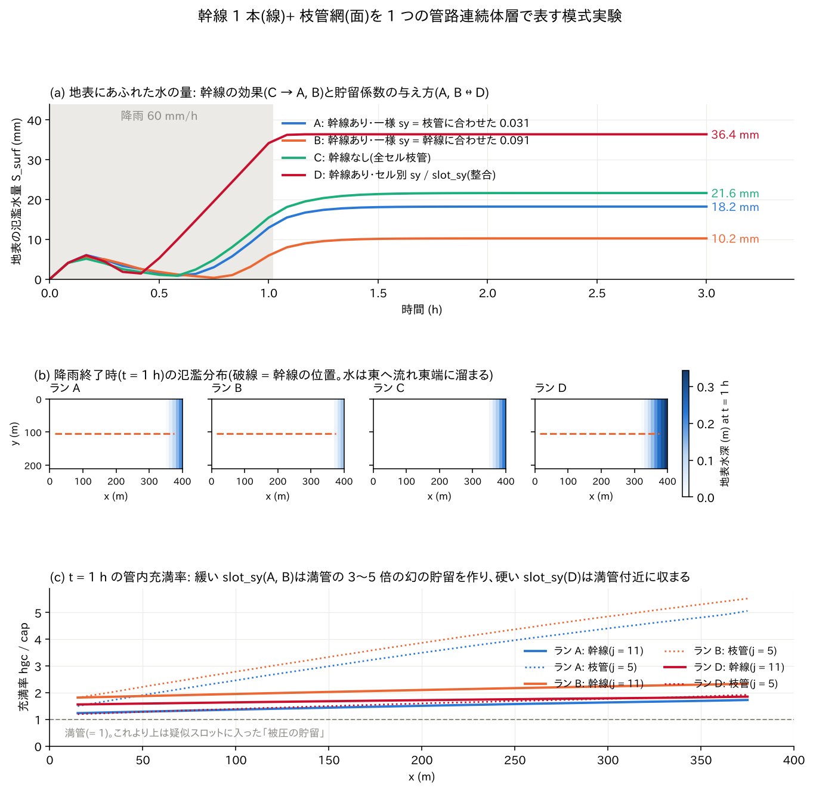
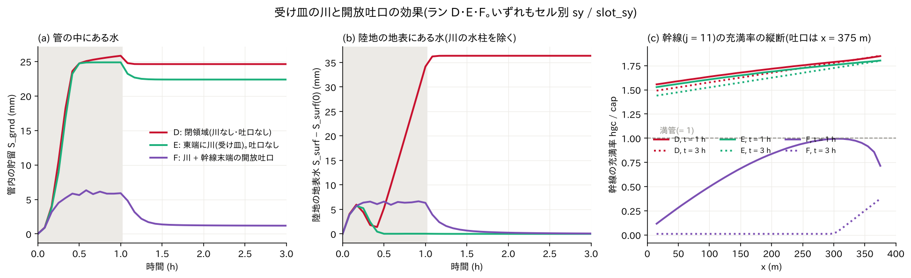

# sewer_hybrid — 幹線 1 本(線)+ 枝管網(面)を 1 つの管路連続体層で表す都市排水の模式実験

街の下水道(雨水管)は、各街路の下を通る細い**枝管**の網と、それらを
集めて川や海へ運ぶ太い**幹線**でできています。ENCflow は、この管網を
「管路連続体層」(`f_gwconduit`)という**地下の 1 層**で表します。
管を 1 本 1 本たどる代わりに、各セルに「管がどれだけの水を貯められるか」
「隣のセルへどれだけ流せるか」を数値で与え、地下の水位(管内水頭)を
セルごとに追う考え方です。

この例題は、**太い幹線と細い枝管を同じ 1 つの層に同居させられるか**、
また**そのときに貯留係数の与え方で答えがどれほど変わるか**を、
400 m × 210 m の一様斜面に 60 mm/h の雨を 1 時間降らせて確かめる
模式実験です(設計の記録は developer.md §46.5)。コードの変更は不要で、
入力ファイルだけで組み立てています。初めて管路層に触れる人が
「パラメータの意味」と「結果の読み方」を学ぶことを目的にしています。



## 1. 管路連続体層の 5 つのパラメータ(初学者向け)

セルごとに与える値は 5 つです。いずれも gen_data.py が**管の諸元
(直径 D、粗度 n、1 セル内の管の長さ、埋設深)から換算**して書き出します。

| パラメータ | 意味 | 換算式(このケース) |
|---|---|---|
| `cap`(貯留容量、m) | 管の総体積をセル面積で割った「柱状の深さ」。管が満杯のときに地下に入っている水の量 | A·L/Δx²。枝管 D = 0.4 m、L = 10 m → 0.0126 m(12.6 mm) |
| `cnd`(通水能密度、m²/s) | 満管・単位動水勾配のときに単位幅あたり流せる流量。隣のセルへの流れやすさ | C/Δx、C = (1/n)·A·R^(2/3)。枝管 0.208、幹線 2.40 |
| `bot`(管底標高、m) | 管の底の高さ。水頭(管内の水位)の基準になる | 枝管は地表 − 2 m、幹線は地表 − 5 m |
| `sy`(貯留係数) | 水頭が 1 m 上がると柱状の水が何 m 増えるか。**管が満杯になるまで**(不圧)の値で、cap ÷ 管の高さ | 枝管 0.0126/0.4 = 0.031、幹線セル 0.0911/1.0 = 0.091 |
| `slot_sy`(疑似スロットの貯留係数) | 管が満杯になった**あと**(被圧 = 圧力がかかった状態)に水頭が 1 m 上がると増える水の量。小さいほど「硬い」圧力応答 | 物理的には ≈ 0 だが、数値安定のため sy の 1/5〜1/50 を与える |

これに加えて、地表との水のやり取りを決める**枡の密度**(`inlet`、個/m²)
と、管の出口である**吐口**(`fn_gwc_outfall`、ラン F)があります。
雨は地表に降り、枡から管に入り(堰式。満管になると管内水頭が地表より
高くなったときだけオリフィス式に**噴出**)、管の中を幹線へ集まります。

**疑似スロットと「幻の貯留」**: 満管になった管に無理に水を押し込むと、
現実には圧力だけが上がって水はほとんど増えません。数値モデルでは
これを「管の天井に細いスロット(溝)が立っている」と見なし、スロットの
幅に相当する slot_sy だけ水が増えることにして圧力(水頭)を計算します
(Preissmann スロット)。slot_sy を大きく取ると計算は楽になりますが、
実在しない水がスロットに大量に溜まり、地表にあふれるはずの水を地下に
隠してしまいます。これが「幻の貯留」で、この例題の主役の 1 つです。

## 2. 構成

| 項目 | 値 |
|---|---|
| 領域・格子 | 400 m × 210 m、40 × 21 セル(Δx = 10 m)。東へ下る一様斜面(勾配 0.005)。地表の粗度 n = 0.03。四周は壁(ラン E・F では東端 2 列が川) |
| 降雨 | 60 mm/h を 1 時間(0〜60 分)、61 分で 0 へ。総雨量 61.0 mm |
| 枝管網 | 全セルに D = 0.4 m、n = 0.013、セルあたり 10 m(街路 1 本)、埋設 2 m。枡は全セル 1 個(0.01 個/m²) |
| 幹線 | 行 j = 11 の i = 2〜38 に D = 1.0 m、n = 0.013、埋設 5 m。幹線セルは「幹線 + 枝管」の合算 cap、水頭底は幹線の管底。満管能力 1.70 m³/s(勾配 0.005)に対し、領域の降雨流出は 1.40 m³/s |
| 計算 | dt = 0.02 s、3 時間。管路層の側方流束は √勾配則(`f_gwc_fluxlaw = 2`)。地下水の他の層は使わない |
| 出力 | 30 分ごとの地表水深 H・水位 E・管内貯留 Hgc の分布、Log.txt の水収支(S_surf = 地表、S_grnd = 管内) |

| ラン | 幹線 | sy / slot_sy | 川と吐口 | ねらい |
|---|---|---|---|---|
| A | あり | 一様 0.0314 / 0.03(枝管に合わせた値) | なし | 幹線セルの貯留係数が小さすぎる(水頭が約 3 倍過大に上がる) |
| B | あり | 一様 0.0911 / 0.03(幹線に合わせた値) | なし | 枝管セルの貯留係数が大きすぎる(枝管の応答が約 3 倍鈍る) |
| C | なし(全セル枝管) | 一様 0.0314 / 0.03 | なし | 幹線の効果を見るための対照 |
| D | あり | **セル別マップ**(幹線 0.0911、枝管 0.0314。slot = sy/5) | なし | 幹線・枝管とも整合した「正解」。`fn_gwc_sy` / `fn_gwc_slot_sy`(§46.5 (5)) |
| E | あり | D と同じ | 東端 2 列を川(水位 1.5 m 固定)にする。吐口なし | 地表の氾濫水が川へ落ちて系外へ出る効果 |
| F | あり | D と同じ | 川 + 幹線末端 (38, 11) の開放吐口(`fn_gwc_outfall`、Cd·A = 0.47 m²) | 幹線が川へ直接放流できるときの管内水頭と氾濫 |

A・B の slot_sy = 0.03 は sy と同程度の「緩い」値です。2026-08 の実装
当時は陽解法の時間刻みの上限(幹線の通水能で dt ≤ 0.061 s)との折り合い
でこうせざるを得ませんでした。現在はサブサイクリング(§46.5 (4))が
あるので、D 以降は物理寄りの硬い slot_sy(sy/5)をそのまま使えます
(この設定では dt = 0.02 s が上限 0.037 s より小さいので分割数 N = 1)。

| ファイル | 内容 |
|---|---|
| `gen_data.py` | 管諸元 → cap / cnd / bot / sy / slot の換算と、`data_sewer/` の全マップの生成(川の系・吐口のマップを含む) |
| `param_A.txt`〜`param_F.txt` | 各ランのパラメータ。出力は `result_A/`〜`result_F/` |
| `plot_sewer.py` | 図 2 枚(`sewer_hybrid_result.png`、`sewer_hybrid_outfall.png`) |

## 3. 実行

```bash
python3 gen_data.py                 # data_sewer/ を生成(換算した値を画面に表示)
for r in A B C D E F; do ../../bin/encflow param_$r.txt; done   # 各 70〜110 秒(4 コア)
python3 plot_sewer.py               # 図を描く
```

`gen_data.py` の表示で、枝管の満管通水能 C = 2.08 m³/s、幹線 24.0 m³/s、
幹線の満管能力 1.70 m³/s(勾配 0.005)と、降雨 60 mm/h の領域流出
1.40 m³/s を見比べてください。「幹線はぎりぎり雨を運べる太さ」という
設定です。

## 4. 図の読み方(ラン A〜D)

**(a) 地表にあふれた水の量 S_surf の時系列。** 降り始めの 10 分は枡から
管に入りきらない雨が地表に 5〜6 mm 溜まり、管に吸い込まれていったん減り
ます。管が満杯になる(ラン D では約 35 分)と、枡から**噴出**した水と
吸い込めない雨で地表の水が増え始め、降雨終了(1 時間)でほぼ頭打ちに
なります。幹線がないラン C(21.6 mm)より幹線のあるラン A(18.2 mm)・
B(10.2 mm)は氾濫が少なく、幹線が確かに水を運んでいます。ところが
貯留係数を整合させたラン D は **36.4 mm** で、A・B の 2〜3.5 倍です。
A・B は緩い slot_sy のせいで、本来あふれるはずの水を地下の「幻の貯留」に
隠していました。**スカラーの sy の選び方(A ↔ B の差 8 mm)が幹線そのものの
効果(C − A = 3.4 mm、C − B = 11.4 mm)と同じ大きさ**で、答えを左右して
います。これが sy と slot_sy をセル別に与える機能(§46.5 (5))を作った
直接の理由です。

**(b) 降雨終了時の地表水深の分布。** 一様斜面なので地表の水は東へ流れ、
四周が壁のため東端に湛水します(破線が幹線)。どのランも分布の形は同じで、
量だけが違います。「どの街区が浸水するか」を見る実験ではなく、
総量と時系列を比べる実験だということを覚えておいてください。

**(c) 降雨終了時の管内充満率 hgc / cap。** 1 が満管です。緩い slot_sy の
A・B では枝管(点線)が満管の 3〜5 倍、幹線(実線)が 1.7〜2.3 倍の水を
「スロット」に溜めています。管の体積を超える分は実在しない水です。硬い
slot_sy の D では幹線・枝管とも 1.5〜1.9 倍に収まり、超えた分は地表に
あふれています(それでも 2 倍近いのは sy/5 がまだ緩いため。実用では sy/50
が既定です。§64)。

## 5. 川と吐口の効果(ラン E・F)



A〜D は四周が壁の閉じた箱で、管の出口がありません。実際の下水道は
幹線の末端が川や海に**吐口**で開いています。E・F では東端の 2 列を
「川」(海域マスク `fn_sw` に潮位モジュールで水位 1.5 m を固定)にし、
地表の水が崖から川へ落ちて系外へ出るようにしました。F ではさらに
幹線末端 (38, 11) に開放吐口を置きます(受け水頭は隣の川の水位。
逆流防止フラップ付き)。幹線末端の管底は 1.125 m なので、吐口は川面の
少し上にある構成です。

**(a) 管の中にある水 S_grnd。** 川があるだけのラン E では、管は 30 分で
満杯(25 mm)になり、雨が止んでも 22 mm が管の中に残ったままです(出口が
ないので抜けない)。吐口のあるラン F では管内の水は最大 6 mm にとどまり、
雨が止むと 30 分で 1 mm まで抜けます。**幹線が川へ放流できる**ことの効果が
そのまま見えています。

**(b) 陸地の地表にある水。** Log の S_surf は川セルの水柱(固定水位)も
含むので、図では t = 0 の値を引いて陸地の分だけにしています。ラン E では
降り始めの 10 分に 6 mm ほど溜まったあと、地表はほぼ乾いたままです。
満杯になった管は水頭がちょうど地表付近にあり、枡から入った雨を管の中を
通して下流端まで運び、川のそばの枡から**噴出**させて川へ落とします。
管網が「満管のまま水を通すコンベア」として働いている状態で、計算上は
氾濫が起きませんが、現実には全ての枡が噴き上がる状態です。ラン F では
降雨中に陸地に 6〜7 mm の水が乗っています。満杯でない管への流入は堰式
(q = cw·h^1.5)で、雨 60 mm/h を飲み込むには枡の周りに 7 mm ほどの水深が
必要なためです。雨が止むと 30 分で 1 mm 以下になります。

**(c) 幹線の充満率の縦断。** D・E は満管の 1.5〜1.8 倍(疑似スロットの
被圧)のまま 3 時間変わりません。F では降雨終了時に下流ほど低い 0.1〜1.0
(吐口の近くで 0.7)、3 時間後には上流側がほぼ空(0.01)で、吐口から 100 m の
区間に川の水位で決まる水だけが残ります(吐口の管底 1.125 m < 川の水位
1.5 m なので、川面より下の管は空になりません)。

水の行き先を整理すると(総雨量 61.0 mm に対して)、E は 38.6 mm が崖から
川へ、22.4 mm が管内に残留、F は 56.3 mm が**吐口から川へ**、3.4 mm が崖から
川へ、1.2 mm が管内に残留です。F の幹線は雨の 9 割以上を運び切っており、
満管能力 1.70 m³/s ≳ 流出 1.40 m³/s の見積もりと整合します。

## 6. 所見(数値)

| ラン | 最終 S_surf(地表、mm) | 最終 S_grnd(管内、mm) | S_total(mm) | 備考 |
|---|---:|---:|---:|---|
| A | 18.2 | 42.8 | 61.0 | 幻の貯留で氾濫を過小評価 |
| B | 10.2 | 50.8 | 61.0 | 同上(より大きく) |
| C | 21.6 | 39.4 | 61.0 | 幹線なし |
| D | 36.4 | 24.6 | 61.0 | 整合した貯留係数 |
| E | 0.0(陸地) | 22.4 | 101.3(川の水柱 78.9 を含む) | 川あり。崖から川へ 38.6 mm |
| F | 0.1(陸地) | 1.2 | 80.2(同上) | 川 + 吐口。吐口から川へ 56.3 mm(4491 m³)、崖から 3.4 mm |

- 閉じた A〜D では S_total = 総雨量 61.0 mm が 1e-13 の丸めで保存されます。
  E・F の Log の S 列は川セルの水柱(1.5 m × 42 セル)を**陸地の面積**(798 セル)で
  割った 78.9 mm を含み、川へ出た分(崖からの落ち込みと吐口の放流)だけ
  S_total が減ります。吐口から川への累積放流体積は計算終了時に画面に
  表示されます(F: "outfall discharge total = 4.4909E+03 m3")。
- 幹線の通水能が陽解法の時間刻みの上限を支配します(エッジ 24 m³/s、
  Δx = 10 m で dt ≤ 0.061 s、硬い slot_sy ではさらに 0.037 s)。この例題は
  dt = 0.02 s で上限内ですが、より硬い slot_sy や細かい格子ではサブ
  サイクリングが自動で分割します(画面の "subcycles = N")。
- 同じ構成を 30 分の短い回帰テストにしたのが [test/sewer_wq](../../test/sewer_wq/)
  (水質モジュールを重ね、噴出水を下水として大腸菌の拡散を追う)です。
  海抜下の系の排水(負の管底・海域吐口・機場)は
  [test/coastal_drain](../../test/coastal_drain/)、横坑集水は [examples/qanat](../qanat/)。

## 7. この実験から決まったこと(設計の記録)

実験は 2026-08-23 に行われ、developer.md §46.5 の次の決定の根拠になりました。
いずれもその後に実装済みです。

1. **管諸元 → パラメータの換算は前処理で行う**(コード不変)。gen_data.py の
   `pipe_params()` がそのまま手本です。
2. **開放吐口**(§46.5 (3)・(8b) → `fn_gwc_outfall`)。実装前は管路から地表へ
   出る経路が被圧時の噴出だけで、降雨後も管内の水が抜けませんでした(A〜D の
   S_grnd が 25〜51 mm 残る)。ラン F がこの機能の実演です。
3. **sy・slot_sy のセル別化**(§46.5 (5) → `fn_gwc_sy` / `fn_gwc_slot_sy`)。
   A ↔ B の差が幹線の効果と同桁だったことが根拠。ラン D が実演です。
4. **サブサイクリング**(§46.5 (4))。硬い slot_sy を使えるようにする前提。
5. **幹線と枝管の同一インスタンス同居は機構的に成立**します。セル間の
   通水能はエッジで小さい方(min 規約)を取るので、枝管 → 幹線の取り付けが
   枝管側で律速されることが自然に表現されます。別系統を同じセルで併用する
   必要(下水道 × 岩盤)がない限り、多重インスタンスは不要です。
6. 当時は管底標高マップの負値が拒否されたため、地盤の基準面を +8 m して
   回避しました(gen_data.py の `z_of`)。現在は負値が許容され
   (§46.5 (7))、海抜下の管底をそのまま与えられます。

## 8. 制約と発展

- 一様勾配・閉境界の模式実験なので、浸水の空間パターンの検証には向きません。
  実都市では標高データ、管網図から換算したセル別マップ、川や海の受け皿を
  組み合わせます(手順は [users_guide/gwflow.md](../../docs/users_guide/gwflow.md) の
  都市下水道の節)。
- 管の中を 1 つの水頭で表すため、1 セル内の幹線と枝管の水頭差(取り付け管の
  損失)は表せません。断面形を持つ準 1 次元の「埋設河道」モジュールを作るか
  どうかは、SWMM 参照解との比較で不足が示されてから判断します(§46.5 末尾)。

## 関連文書

- [docs/users_guide/gwflow.md](../../docs/users_guide/gwflow.md) — 管路連続体層(`&list_gwflow_conduit`)の全パラメータ・吐口・換算式
- [docs/users_guide/tide.md](../../docs/users_guide/tide.md) — 川・海の水位を固定する潮位モジュール(ラン E・F)
- developer.md §46.5(拡張方針の決定と実装記録)、§64(既定値)
- [docs/gwconduit_plan.md](../../docs/gwconduit_plan.md) — 管路層の計画(段階案)
