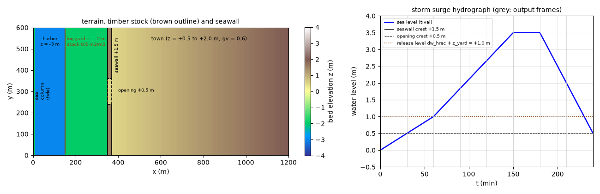
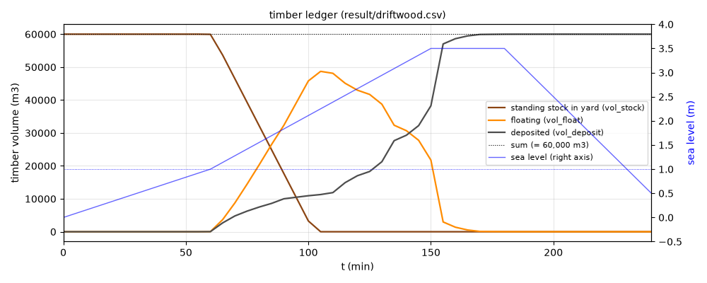
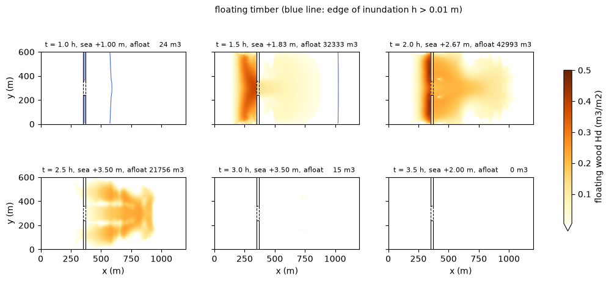
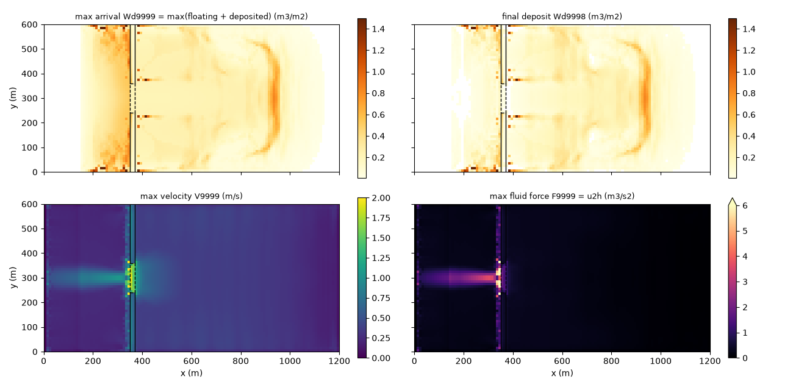
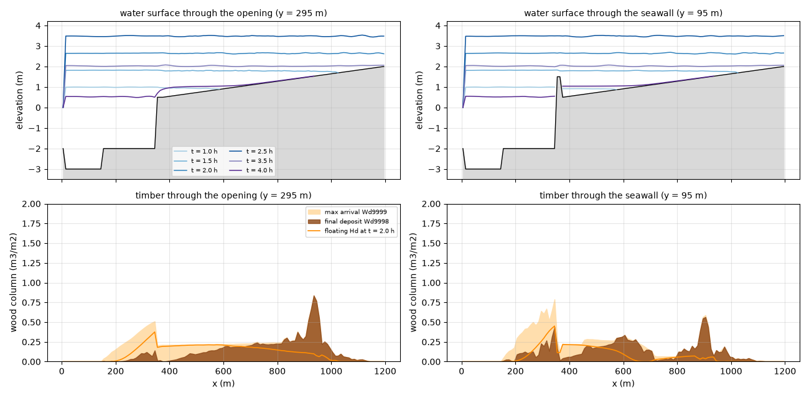

# timberyard — 高潮による貯木場からの材木流入(伊勢湾台風型の理想化ケース)

海岸の貯木場に浮かぶ材木が高潮の水位上昇で係留を失って流出し、防潮壁を
越えた氾濫流に乗って市街地へ流入・堆積する現象を、
**流木モジュール fn_driftwood**(docs/users_guide/driftwood.md、developer.md §50)と
**潮位強制 fn_tide**(users_guide/tide.md)の組み合わせで概算する。
1959 年伊勢湾台風で名古屋港の貯木場から流出した原木が市街地を襲った型の
現象を、実務で組むときの「型」を示すのが目的で、コード変更なし(設定のみ)。
本体 1 ケース+設定の意味を示す感度ケース 3 つ。

## 幾何と設定



左: 地形と材木ストック(茶の枠)・防潮壁(黒)・開口部(破線)。右: 高潮の
ハイドログラフと、開口部天端・防潮壁天端・材木の流失開始水位。

1,200 m × 600 m、dx = dy = 10 m(120 × 60 セル)。西から順に:

| x (m) | セル番号 i | 地形 | 役割 |
|---|---|---|---|
| 0〜10 | 1 | z = −3 m、海域マスク | 潮位強制の入口(高潮ハイドログラフ) |
| 10〜150 | 2〜15 | z = −3 m | 港湾水面(通常セル+初期水位) |
| 150〜350 | 16〜35 | z = −2 m | **貯木場**。材木ストック 0.5 m³/m² × 200 m × 600 m = **60,000 m³** |
| 350〜370 | 36〜37 | z = +1.5 m | 岸壁・防潮壁。中央 y = 240〜360 m(j = 25〜36)は **開口部 z = +0.5 m** |
| 370〜1,200 | 38〜120 | z = +0.5 → +2.0 m の緩勾配 | 市街地。建物を空隙率 **gv = 0.6**(建物占有 40 %)で表す |

初期水位は T.P. 0 m 一定(f_htype=2。港湾・貯木場が湛水、陸は乾燥)。
潮位は西端 1 列の海域セルに一様時系列で与え、0 → +1.0 m(60 分。天文潮)→
**+3.5 m(150 分。ピーク)**→ 30 分維持 → +0.5 m(240 分)。東・北・南の辺は
既定の壁(閉じた低地 = 防潮壁背後のゼロメートル地帯)。dt = 0.5 s、4 時間
(Cn_max ≈ 0.42)。計算時間は 1 分弱。

材木はラワン原木級(代表直径 dw_dlog = 0.6 m、材比重 dw_sglog = 0.5 →
喫水 0.3 m。浮力平衡から自動導出)。流木パラメータは次のとおり
(param.txt)。

```
&list_driftwood
  fn_dwstock = 'stock.txt'  ! 貯木場セルのみ 0.5 m3/m2(計 6 万 m3)
  dw_dlog = 0.6             ! 代表直径 (m)
  dw_sglog = 0.5            ! 材比重 → 喫水 0.3 m
  dw_wrec = 2.0e-4          ! 流失レート (m/s)。0.5 m3/m2 が 42 分で流失
  dw_hrec = 3.0             ! 流失の水深閾値 = 平常水深 2.0 m + 1.0 m
  dw_vrec = 0.0             ! 流速閾値なし(浮けば流失)
  dw_wstop = 0.005          ! 接地堆積レート (m/s)
  dw_vstop = 0.02           ! 低速堆積の流速閾値 (m/s。市街地で滞留したら堆積)
/
```

## 組み方の要点(設定の理由)

1. **貯木場・港湾の水面を海域マスクにしない**。海域セルには材木ストックを
   置けず、流木の移流も働かない。浸水と材木輸送を解く範囲はすべて通常
   セル+初期水位(f_htype=2)で表し、海域マスク+潮位強制(fn_tide)は
   沖側の境界列(ここでは西端 1 列)だけにする。津波土砂と同じ流儀
   (users_guide/geomorph.md「海域マスクと土砂の行き先」)。hsea0 = 2.0 m は
   海セルの見かけ水柱厚(海が供給側になる浸水で乾燥判定・境界水深・摩擦を
   賄う値。users_guide/tide.md)。
2. **材木ストックは貯木場のセルにだけ** fn_dwstock で与える(make_terrain.py
   が stock.txt を書く)。一様値 dw_stock0 では市街地の立木も「流木化」して
   しまう。
3. **発生は水理的流失を「高潮による係留切れ・浮上」として使う**。
   dw_hrec を貯木場の平常水深(2.0 m)より高い 3.0 m にすると、水位が
   +1.0 m を越えたとき(t = 60 分)に初めて流失が始まり、発生が高潮と同期
   する。dw_vrec = 0(浮けば流失)、dw_wrec は高潮の継続時間内に全量が
   流失するレート(0.5 m³/m² ÷ 2.0e-4 m/s = 2,500 s ≈ 42 分 → 105 分に
   流失完了)。侵食連行(dw_droot)や土砂・地形変化モジュールは不要。
4. **防潮壁・開口部は地形で表す**。天端 +1.5 m の壁と、低所 +0.5 m の
   開口部(陸閘・水門の開口、老朽区間など)。この高潮は壁を 2 m 越えるので、
   開口部の役割は「高潮の立ち上がり期に流入が集中する場所」になる(下の
   「知っておくべき性質」)。
5. **市街地の建物は空隙率 fn_gv** で表す(0.6)。材積の換算は柱状量 × gv ×
   セル面積(柱状量 m³/m² は空隙部の面積あたりの量)。
6. **堆積は 2 経路**。接地(水深 < 喫水 0.3 m)の dw_wstop と、低速停滞の
   dw_vstop(流速 < 0.02 m/s)。市街地は高潮ピークに池のように湛水して
   流れが止まるので、市街地の堆積の大半は dw_vstop で起きる。再流動は
   既定の dw_wfloat = 0(堆積した材木は動かない = 市街地の残留を上限側で
   見る)。この 2 つが「どこに残るか」を決める校正パラメータ(感度ケース a, b)。

## 実行方法

```
cd examples/timberyard
make                                   # ../../bin/encflow へのリンク
python3 make_terrain.py                # z.txt sw.txt gv.txt stock.txt
./encflow param.txt                    # 本体(約 1 分)
python3 plot_results.py                # figs/*.png と数表

# 感度ケース(任意。result_* に出力。plot_results.py の数表に比較行が加わる)
./encflow param_vstop0.txt             # a: dw_vstop = 0(低速堆積なし)
./encflow param_refloat.txt            # b: 再流動あり(dw_wfloat = 0.005, dw_vfloat = 0.05)
python3 make_terrain.py 4.0            # c 用の地形 z_wall4.txt(防潮壁天端 +4.0 m)
./encflow param_wall4.txt              # c: 防潮壁が高潮を越えない(流入は開口部のみ)
```

出力(result/): H(水深)・V(流速)・**Hd(流動材木の柱状量)**・**Wd(堆積材木)**の
30 分ごとのフレーム、最終フレーム(9998)、期間最大(H9999・V9999・
**Wd9999 = 最大到達量 max(流動+堆積)**・F9999 = 最大流体力 u²h)、
driftwood.csv(材積台帳。5 分ごと)。

## 結果(2026-09-30。gfortran、dt = 0.5 s)



材積台帳(driftwood.csv)。貯木場の残ストック・流動・堆積の 3 台帳の総和は
常に 60,000 m³(閉領域なので機械精度で保存)。流失は水位が +1.0 m を越えた
60 分に始まり 105 分に完了(流動材木のピーク 48,705 m³)。堆積は 2 段階で、
流失直後に貯木場内で起きる緩やかな分(〜10,000 m³)と、**高潮ピークの
水位維持期(150〜160 分)に市街地の流れが止まって一気に起きる分**。



流動材木 Hd の時間発展(青線は浸水縁)。t = 1.0 h: 開口部から市街地の
浸水が先行(材木はまだ貯木場)。1.5 h: 流失した材木が開口部背後から市街地へ
入る。2.0 h: 防潮壁が全面越流(水位 +2.67 m)し、材木は壁の全長を越えて
市街地の奥(x ≈ 900 m)へ。2.5 h: 市街地が +3.5 m まで湛水して流れが止まり
堆積が進む。3.0 h: ほぼ全量が堆積。



左上 Wd9999(最大到達量 = ハザードマップ)、右上 Wd9998(最終堆積)、
左下 V9999(最大流速)、右下 F9999(最大流体力)。流速・流体力は開口部に
集中する(1.9 m/s)が、材木の最終堆積は y 方向にほぼ一様で、市街地の奥
x ≈ 900〜950 m に弧状の堆積の峰がある(停滞した瞬間の流動材木の前線)。



開口部を通る行(y = 295 m)と防潮壁の行(y = 95 m)の断面。上: 水面の時間
発展、下: 最大到達量(薄茶)・最終堆積(濃茶)・t = 2.0 h の流動材木(橙)。

| 区域 | 最終堆積 (Wd9998 × gv × 面積) | 割合 | 最大柱状量 |
|---|---|---|---|
| 港湾(x 10〜150 m) | 0 m³ | 0 % | — |
| 貯木場(150〜350 m) | 14,828 m³ | 24.7 % | 1.76 m³/m² |
| 岸壁・防潮壁(350〜370 m) | 1,286 m³ | 2.1 % | 0.48 m³/m² |
| 市街地(370〜1,200 m) | **43,885 m³** | **73.1 %** | 1.82 m³/m² |
| 合計 | 60,000 m³ | 100 % | |

市街地の内訳(x 370〜500 / 500〜700 / 700〜900 / 900〜1,200 m): 5,889 /
15,128 / 11,505 / 11,364 m³。開口部背後の 12 行(y 240〜360 m。全 60 行の
20 %)の堆積は 9,842 m³(市街地の 22 %)で、y 方向の集中はない。材木の
到達範囲(Wd9999 > 0.01 m³/m²)は市街地 4,980 セル中 4,432 セル(89 %)、
最遠 x ≈ 1,130 m(東端近く)。市街地の最大水深 3.11 m、最大流速 1.28 m/s
(開口部 1.91 m/s)。

| 時刻 | 潮位 | できごと |
|---|---|---|
| 30 分 | +0.5 m | 開口部を越えて市街地の浸水が始まる |
| 60 分 | +1.0 m | 貯木場の水深が dw_hrec = 3.0 m を越え、材木の流失が始まる |
| 78 分 | +1.5 m | 防潮壁の全面越流 |
| 105 分 | +2.25 m | 流失完了。流動材木のピーク 48,705 m³ |
| 150〜180 分 | +3.5 m | 高潮ピーク。市街地が湛水して流れが止まり、材木の大半が堆積 |
| 195 分 | +2.75 m | 流動材木がほぼゼロ(全量堆積) |
| 240 分 | +0.5 m | 引き潮。市街地は開口部から排水中(水位 +1.55 m) |

### 感度ケース

| ケース | 設定 | 市街地への到達量 Σ Wd9999 | 最終堆積 市街地 | 貯木場 | 浮遊残 | 系外流出 |
|---|---|---|---|---|---|---|
| 本体 | param.txt | 54,646 m³ | **43,885** | 14,828 | 0 | 0 |
| a | dw_vstop = 0(低速堆積なし) | 65,564 | 1,041 | 0 | 39,238 | 14,318 |
| b | 再流動あり(dw_wfloat = 0.005, dw_vfloat = 0.05) | 72,633 | 449 | 2,599 | 33,773 | 15,646 |
| c | 防潮壁天端 +4.0 m(流入は開口部のみ) | 51,574 | 31,254 | 20,235 | 1 | 7,484 |

「到達量」は市街地セルの Wd9999 の総和(期間最大の包絡なので 60,000 m³ を
超え得る)。系外流出は台帳の差 60,000 − (ストック+流動+堆積)(西端の
海域セルへ出た分)。

## 結果の読み方

- **Wd9999 は「どこまで届くか」、Wd9998 は「どこに残るか」**。Wd9999 は
  期間最大の到達量 max(流動+堆積)の包絡値で、通過しただけのセルにも値が
  残る(= ハザードマップ用)。最終的な堆積分布・質量勘定には最終フレーム
  Wd9998 を使う。材積への換算は柱状量 × gv × セル面積(plot_results.py の
  数表)。閉領域なので台帳の総和は初期ストック 60,000 m³ と機械精度で一致
  する(driftwood.csv の各行で確認できる)。
- **家屋被害の指標**: 水そのものの流体力は F9999(= u²h。清水なので実務
  慣行の u²h と同一。×ρw で単位幅作用力 N/m)。本ケースでは開口部
  (最大 13 m³/s²)とその背後 x ≈ 370〜500 m(市街地内の最大 1.1 m³/s²)に
  集中する。
- **材木の家屋への衝突力**はモデル内部では計算しない(個別衝突は適用限界)
  が、衝突力式の入力はすべて出力から得られる。実務標準(国総研資料 905
  §4.3)は流木の衝撃力を「礫の衝撃力算定式を準用し、速度は流れの流速・径は
  流木の最大直径」として算出する後処理方式なので、ENCflow の最大流速 V9999
  (または流速フレーム)と代表材の諸元(dw_dlog)をその式(あるいは FEMA
  P-646 の流木衝突式)に与えれば、指針整合の衝突力マップを作れる。材木が
  どの家屋群に届くかは Wd9999・Hd で判定する。

## 知っておくべき性質(設定の理由)

- **流失のタイミングは dw_hrec で高潮に同期させる**。閾値を平常水深に
  合わせると計算開始と同時に流失が始まり、高潮前に材木が港内へ散る。
  平常水深+余裕(ここでは +1.0 m)にすることで「水位が上がって係留が
  外れる」時刻を潮位で指定できる。dw_wrec は流失の所要時間(ストック ÷
  レート)で決める。
- **開口部の役割は時期で変わる**。高潮の立ち上がり期(30〜78 分)は開口部
  だけから流入し、最初の材木(1.5 h)は開口部の背後に入る。ピークでは壁を
  2 m 越えるため材木は壁の全長を越え、最終堆積は y 方向にほぼ一様になる。
  流速・流体力(V9999・F9999)は開口部に集中したまま残るので、「流入が
  開口部に集中する」ことは流体力の分布に現れ、堆積分布には現れない。
  壁が高潮を越えない感度ケース c(天端 +4.0 m)でも、幅 120 m の開口部から
  30 分で市街地は +3.5 m まで湛水し、開口部の噴流(2.2 m/s)が材木をより
  奥へ運ぶ(x 900〜1,200 m に 13,432 m³)。防潮壁の効果を見るには、
  開口部の幅を狭める・ピーク水位を天端以下にするなどのシナリオ比較が要る。
- **市街地の堆積の大半は「停滞」で起きる**(dw_vstop)。市街地は東・北・南が
  壁の閉じた低地で、高潮ピークに湛水して流れが止まる(V < 0.02 m/s)。
  そこで流動材木がその場で堆積し、停滞した瞬間の前線が x ≈ 900〜950 m の
  弧状の峰になる。**dw_vstop = 0(感度 a)にすると材木は水深 > 喫水である
  限り浮いたままで、引き潮で開口部から港・海へ戻る**(市街地の最終堆積
  1,041 m³、浮遊残 39,238 m³、系外流出 14,318 m³)。到達範囲(Wd9999)は
  本体とほぼ同じ(89 % → 100 %)なので、**「どこまで届くか」は堆積
  パラメータに鈍感、「どこに残るか」は敏感**。市街地の残留を上限側で
  見るなら本体、引き潮で戻る分を見込むなら a を使う。
- **貯木場に残る 25 %** は、流失した材木が貯木場内の静水(V < 0.02 m/s)で
  直ちに dw_vstop により再堆積したもの。実際には波浪・港内流で動く分で、
  dw_vstop = 0(感度 a)では残留 0 になる。市街地への流入量の上限側評価
  にはこちらを使う。
- **再流動を有効にすると引き潮が市街地を掃く**(感度 b)。dw_wfloat > 0 では
  停滞期に堆積した材木が引き潮の流れ(V > dw_vfloat)で再び浮き(累積
  堆積 70 万 m³・再流動 69 万 m³ = 11 往復分の入れ替わり)、最終的に市街地に
  残るのは 449 m³。本体(残留上限)と b(残留下限)の 2 ケースで幅を示す
  のが実務的。
- **材木は水と同速で移流する(慣性なし・個別材木なし)**。t = 1.5 h に
  材木の前線(x ≈ 600 m)が浸水縁(x ≈ 1,000 m)より遅れているのは、流失が
  浸水開始より 30 分遅いためで、材木の独自の運動によるものではない。
  個別の材木の軌跡・向き・回転、家屋・橋脚への引っ掛かりは対象外
  (users_guide/driftwood.md「モデル化していないもの」)。
- **東・北・南の辺は壁(既定)**。市街地が閉じた低地として +3.5 m まで
  湛水する(伊勢湾台風の名古屋南部の型)。背後に排水先のある市街地なら
  users_guide/boundary.md の境界を与える。

## 感度実験の入口

- 高潮のピーク水位・継続時間(tival): 越流量と停滞期の長さ → 到達範囲と
  堆積量。ピークを天端(+1.5 m)以下にすると流入は開口部だけになる。
- 防潮壁の天端(make_terrain.py の引数)・開口部の幅と天端(make_terrain.py の
  J_OPEN 相当の行範囲・z): 流入の集中と噴流の流速 → F9999 と到達距離。
- dw_vstop・dw_wfloat・dw_vfloat: 上記のとおり「どこに残るか」を決める。
- dw_dlog・dw_sglog: 喫水(接地堆積の水深)。材比重 0.5 で喫水 = 直径の半分。
  乾燥した針葉樹(0.4)なら浅く、水を含んだ広葉樹(0.8 以上)なら深い。
- fn_gv: 建物占有率。空隙率を下げると同じ材積で柱状量が増え、流速も上がる。
- dw_hrec・dw_wrec: 流失の開始時刻と所要時間(高潮との同期)。

## 関連

- 機能の説明・パラメータ表: docs/users_guide/driftwood.md、潮位: users_guide/tide.md
- 適用事例の一覧: docs/users_guide/usecases.md(「高潮による貯木場からの材木流入」)
- 設計と検証: docs/developer.md §50(流木モジュール)
- 自己検定テスト: test/driftwood
