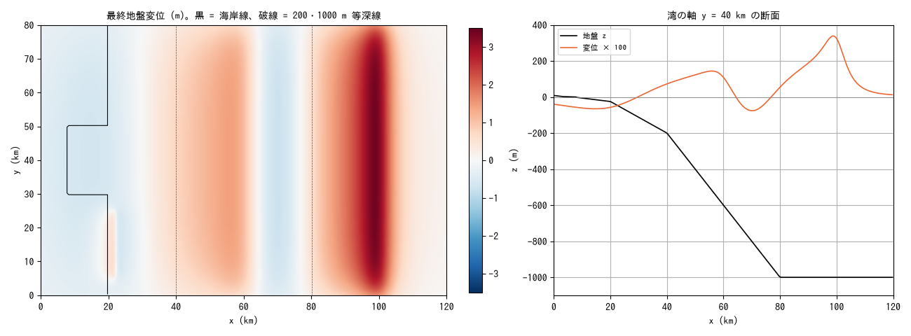
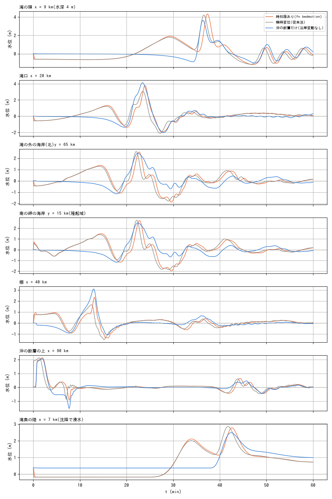
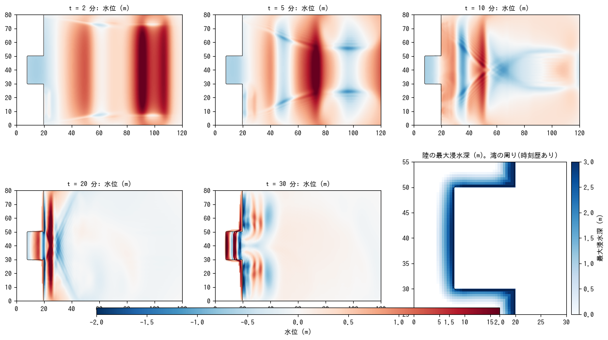

# tsunami_coast — 沿岸の沈降・隆起と沖の断層津波の時間差(fn_bedmotion)

断層による地盤変動は沖の海底だけでなく海岸と陸にも及ぶ。東北地方太平洋沖地震
では沿岸が 0.5〜1 m 沈降し、関東地震では相模湾沿岸が 1〜2 m 隆起した。
[fn_bedmotion](../../docs/users_guide/bedmotion.md) は陸・海を区別せずに
地盤高 z を時刻歴で動かす(水柱 h は変えず、水面は地盤と一緒に動く)ので、
**沈降域へ向かう押し波・隆起域から広がる波・沈降した平野の浸水**が、沖の
断層の津波と同じランで計算される。この例題は湾のある理想化海岸でそれを
3 ケース比較する。コード変更なし(設定のみ)。

## 設定

- 領域 120 km × 80 km、Δx = Δy = 500 m。西が陸(海岸線 x = 20 km)、
  y = 30〜50 km に奥行き 12 km の湾(頭 x = 8 km。水深 2 → 25 m)。棚
  (25 → 200 m、x = 20〜40 km)、斜面(→ 1000 m、x = 80 km)。陸は水際から
  5 km までが 0.5 m/km の海岸平野(沈降 0.6 m で 1.2 km が海面下)。東・北・
  南は長波放射境界、「解く海」(f_htype=2、静水面 0)。
- 断層([fault2disp_all.txt](fault2disp_all.txt) → bm/。走向 N-S、西へ傾斜):

| セグメント | 位置・形状 | すべり | 時刻 | 効果 |
|---|---|---|---|---|
| 1 深部(海岸直下) | 上端 x = 60 km・深さ 8 km、幅 40 km、傾斜 20° | 5 m | t = 0、20 s | 海岸〜湾が 0.5〜0.6 m 沈降、棚の外側(x ≈ 40〜60 km)が 0.7〜1.4 m 隆起 |
| 2 浅部(沖) | 上端 x = 100 km・深さ 5 km、幅 30 km、傾斜 15° | 8 m | t = 30 s、20 s | 主津波(沖で 3.4 m 隆起、沈降 −1.4 m) |
| 3 分岐断層(湾口の南) | 上端 x = 22 km, y = 15 km・深さ 1 km、幅 8 km、傾斜 60° | 2 m | t = 0、10 s | 岬と周辺の棚が 0.5〜0.8 m 隆起 |

| ケース | 設定 | 意味 |
|---|---|---|
| 時刻歴あり | param_full.txt(bm/bmlist.txt。5 s 刻み 11 枚) | fn_bedmotion の本来の使い方 |
| 瞬時変位 | param_inst.txt(最終変位を t = 0 に) | 従来の「初期水位・地盤を変動後の値にシフト」と同じ |
| 沖の断層だけ | param_offshore.txt(bm_off/。セグメント 2 のみ) | 沿岸の地盤変動を無視した場合 |

```
make                        # リンク、z.txt、bm/(fault2disp)、bm_off/
./encflow param_full.txt    # 各 20 s(gfortran、4 スレッド。dt = 1.5 s、60 分)
./encflow param_inst.txt
./encflow param_offshore.txt
python3 plot_results.py     # figs/*.png と数表
```

## 結果







| プローブ | 時刻歴あり: 到達 (min) / 最高 / 最低 (m) | 瞬時変位: 到達 / 最高 / 最低 | 沖の断層だけ: 到達 / 最高 / 最低 |
|---|---:|---:|---:|
| 湾の頭 x = 9 km(水深 4 m) | 18.2 / 4.33 / -1.18 | 18.1 / 4.21 / -1.15 | 25.1 / 3.64 / -1.01 |
| 湾口 x = 20 km | 4.0 / 3.79 / -1.97 | 3.8 / 3.05 / -2.12 | 12.0 / 4.13 / -2.01 |
| 湾の外の海岸(北)y = 65 km | 2.7 / 2.55 / -1.88 | 2.6 / 2.59 / -1.79 | 10.1 / 2.45 / -1.15 |
| 南の岬の海岸 y = 15 km(隆起域) | 0.5 / 2.71 / -1.97 | 0.5 / 2.75 / -1.86 | 10.1 / 2.50 / -1.17 |
| 棚 x = 40 km | 3.3 / 2.33 / -1.35 | 3.8 / 1.66 / -1.50 | 3.8 / 3.09 / -1.05 |
| 沖の断層の上 x = 90 km | 1.4 / 2.14 / -0.94 | 0.8 / 2.13 / -0.88 | 1.5 / 2.07 / -1.53 |
| 湾奥の陸 x = 7 km(沈降で浸水) | 27.5 / 2.78 / -0.18 | 27.4 / 2.85 / -0.18 | 38.9 / 2.48 / 0.37 |

到達 = 水深の変化が 0.1 m を超える時刻(地盤と一緒に動く分は水深を変えない
ので、波と流入だけを拾う。陸のプローブでは浸水開始)。湾奥の陸の最大浸水深は
時刻歴あり 2.96 m、瞬時 3.03 m、沖だけ 2.11 m。陸の浸水面積は 301 / 300 / 267 km²。

- **沿岸変動を入れると海岸の擾乱は 10 分早く始まる**。沖の断層だけでは
  海岸への到達が 10 分(湾口 12 分、湾の頭 25 分)だが、海岸直下の沈降と
  棚外側の隆起が t = 0 に起きると、海岸では 2.6〜2.7 分、岬(隆起域)では
  0.5 分から水位が動く。プローブの時系列(湾の頭・湾口・海岸)で、最初の
  ゆっくりした押し波(1〜1.5 m、10〜15 分)が沈降域への流入と棚の隆起からの
  波で、その後の 20〜25 分の鋭い波が沖の断層の津波である。
- **沈降した平野の浸水**: 湾の頭では沈降(−0.6 m)で水面がいったん下がり、
  周囲からの流入で回復する過程がそのまま押し波になる。湾奥の陸は 27.5 分から
  浸水し(沖だけなら 38.9 分)、最大浸水深 3.0 m(沖だけ 2.1 m)。沈降した
  土地は津波が引いた後も水面下に残る(60 分で水深 0.7 m。沖だけは 1.0 m の
  残留との差は地盤高の差)。
- **湾内の応答**: 沈降域への流入と沖の津波が湾内で重なり、湾の頭の最高水位は
  4.3 m(沖だけ 3.6 m)。湾口では瞬時変位 3.05 m に対し時刻歴あり 3.79 m
  (+24%)、棚では 1.66 m に対し 2.33 m(+40%)と、**50 秒程度の時間差でも
  重なり方が変わる**。これは深部(t = 0)と浅部(t = 30 s)の波の位相差が、
  棚上で干渉するためである。瞬時変位(従来法)は到達時刻と全体の振幅は
  ほぼ合うが、近地の波形の細部は時間差に依存する。
- 岬の隆起(セグメント 3)は 0.5 分で局所の正の波を出し、南の海岸の最初の
  波になる(−0.6 m の引きの後 1.5 m の押し)。

## 注意

- 海域マスク(sw > 0)のセルは地盤が動かないので、津波計算は「解く海」
  (f_htype=2)の型で行う。
- 沈降域への流入は「波」というより数分かけた水位の回復として出る。海岸の
  地形(堤防・河口・平野の勾配)と格子解像度で大きく変わる。
- 変位モデルの時間履歴(セグメントの t_r・立ち上がり)は現実の地震では
  よく分かっていないことが多く、ここでは仮定である。
- 変動の空間スケール(数十 km)は水深より十分長いので静水圧で足りる。
  短い変位(分岐断層・海底地滑り)の近地では非静水圧の f_nh_bottom を使う。
