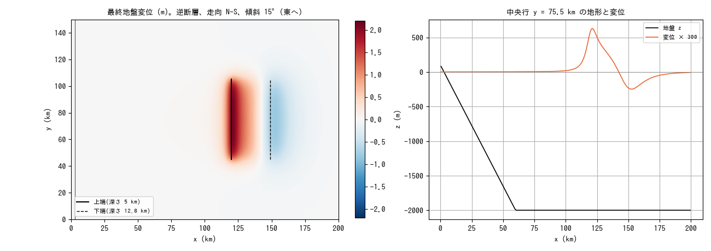
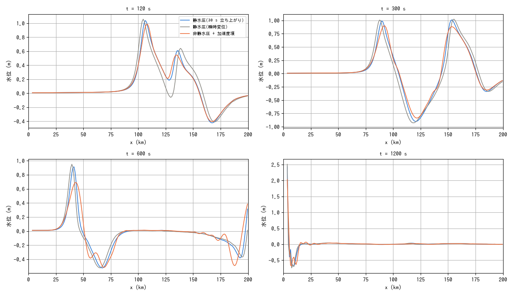
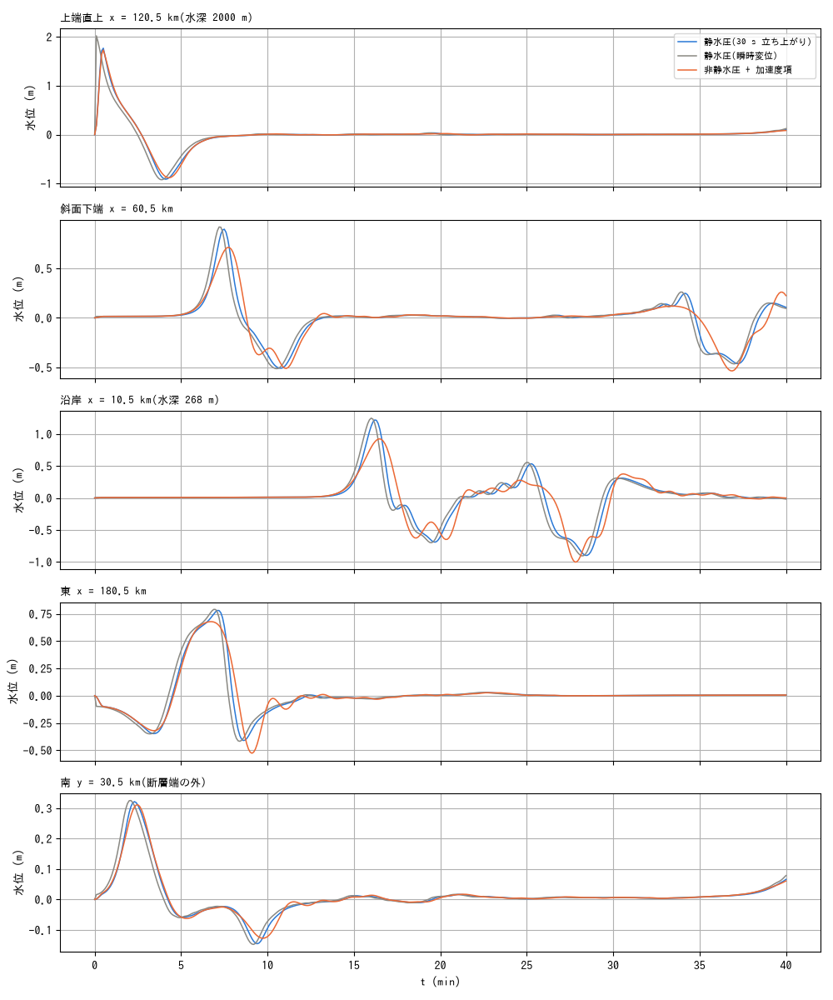

# tsunami_fault — 断層パラメータから津波を発生させる(fn_bedmotion + utils/fault2disp)

理想化した逆断層の地盤変位を [utils/fault2disp](../../utils/fault2disp/README.md)
(Okada 1985)で求め、[規定底面運動 fn_bedmotion](../../docs/users_guide/bedmotion.md)
で地盤高 z を時刻歴で動かして津波を発生・伝播・遡上させる例。コード変更なし
(設定のみ)。静水圧 / 瞬時変位 / 非静水圧 + 加速度項の 3 ケースを比べる。

## 設定

- 領域 200 km × 150 km、Δx = Δy = 1 km。x ≥ 60 km は水深 2000 m の平坦な海、
  x < 60 km は海岸へ向かう一様斜面(x = 0 で +100 m。汀線 x ≈ 2.9 km)。
  西辺は陸(壁)、東・北・南は長波放射境界。「解く海」の型(f_htype=2、
  静水面 e0 = 0)。
- 断層(fault2disp.txt): 走向 N-S(上端中心 x = 120 km, y = 75 km)、傾斜 15°
  (東へ下がる)、長さ 60 km、幅 30 km、上端深さ 5 km、すべり 5 m、逆断層
  (rake 90°)、t = 0 から 30 s の半正弦立ち上がり。最終変位は最大隆起 2.10 m
  (x ≈ 121 km、上端の直上)、最大沈降 −0.82 m(x ≈ 152 km、下端の先)。
  スナップショットは 3 s 間隔の 11 枚(bm/)。

```
make                        # encflow へのリンク、z.txt、bm/(fault2disp の実行)
./encflow param_h.txt       # 静水圧(30 s 立ち上がり)
./encflow param_inst.txt    # 静水圧、最終変位を t = 0 に瞬時に与える(初期水位方式と同等)
./encflow param_nh.txt      # 非静水圧(f_nonhydrostatic=1)+ 動く底面の加速度項(f_nh_bottom=1)
python3 plot_results.py     # figs/*.png と数表
```

計算時間は静水圧 8 s、非静水圧 22 s(gfortran、4 スレッド。dt = 2 s、40 分)。

## 結果







| プローブ | 静水圧(30 s 立ち上がり) 最高 (m) / 到達 (s) / 最低 (m) | 静水圧(瞬時変位) 最高 (m) / 到達 (s) / 最低 (m) | 非静水圧 + 加速度項 最高 (m) / 到達 (s) / 最低 (m) |
|---|---:|---:|---:|
| 上端直上 x = 120.5 km(水深 2000 m) | 1.768 / 30 / -0.912 | 2.022 / 6 / -0.922 | 1.732 / 30 / -0.882 |
| 斜面下端 x = 60.5 km | 0.896 / 450 / -0.509 | 0.918 / 432 / -0.513 | 0.712 / 462 / -0.536 |
| 沿岸 x = 10.5 km(水深 268 m) | 1.220 / 972 / -0.898 | 1.248 / 960 / -0.906 | 0.924 / 990 / -1.003 |
| 東 x = 180.5 km | 0.781 / 426 / -0.411 | 0.791 / 414 / -0.418 | 0.679 / 402 / -0.527 |
| 南 y = 30.5 km(断層端の外) | 0.322 / 138 / -0.145 | 0.325 / 126 / -0.148 | 0.311 / 150 / -0.127 |

- **立ち上がり時間の効果**は小さい。30 s(断層の幅を波が横切る時間 30 km /
  140 m/s ≈ 210 s より短い)では、震源直上の最大水位が 2.02 → 1.77 m に
  なる以外、伝播後の波高は 2〜3% の差で、到達は 12〜18 s 遅れる(立ち上がりの
  重心)。瞬時変位の 1 枚のスナップショットは従来の「初期水位 = 地盤変位」の
  与え方と同じ結果になる。
- **非静水圧**: 幅 30 km の隆起と 15 km 程度の沈降は水深 2000 m に対し
  kH ≈ 0.4〜0.8 で、1 層 NH の分散(ω² = gHk²/(1 + k²H²/4))が伝播中に波を
  分散させ、先頭波の後ろにうねりが続く。先頭波高は斜面下端で 0.90 → 0.71 m
  (−20%)、沿岸で 1.22 → 0.92 m(−24%)、東で 0.78 → 0.68 m(−13%)。
  加速度項(Kajiura フィルタの 1 層近似)の寄与は震源直上の 1.77 → 1.73 m
  (−2%。kH が小さいので F ≈ 1)で、差の大半は伝播の分散による。この規模の
  震源では静水圧(分散なし)が沿岸の波高を 2〜3 割過大評価する側に出る
  (長波の分散は津波の遠地・短い震源で知られた性質)。反復は CG で平均 216 回
  /ステップ(全域 27,000 セル)。
- 南の点(断層の端の外)では 3 ケースの差は 4% 以内。

## 経緯度で与える(fault2disp_ll.txt)

`f_lonlat = 1` で断層位置を経緯度で与えると、横メルカトル投影(UTM・平面
直角座標系が特殊形。原点・縮尺・偽距は namelist)で格子座標に変換し、
走向を子午線収差で格子北基準に補正する。fault2disp_ll.txt は中央子午線
141°E・原点緯度 34°N の投影に格子の左下隅 (140.0°E, 34.0°N) と上端中心
(141.30°E, 34.68°N) を置いた例で、実行すると変換結果が表示される
(x_ll ≈ −91.9 km、上端中心 x ≈ 27.5 km = 格子内 119.3 km、収差 +0.17°)。

## 使い方のメモ

- 実際の断層は fault2disp.txt のセグメント表(≤ 50)で与える。位置は格子の
  投影座標 (m) で、経緯度からの変換は利用者側。時間差破壊は t_r(k)、
  セグメントごとの立ち上がりは t_rise(k)・f_rise(k)。
- 急な海底地形の上の断層では fn_z を与えて水平変位の寄与 u_h·∇z
  (Tanioka & Satake 1996)を加える。
- 地震で誘発される海底地滑りは f_bedslide を同じランに置ける
  (fn_bedmotion は増分適用。docs/users_guide/bedmotion.md)。
