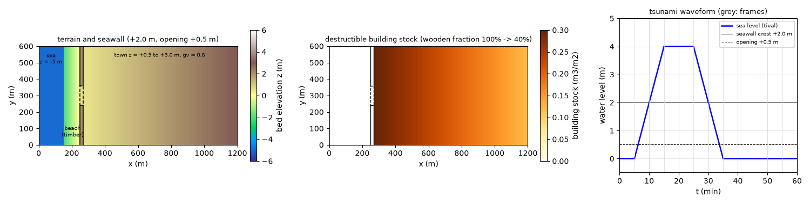
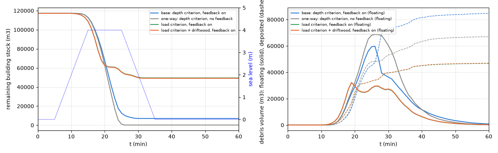
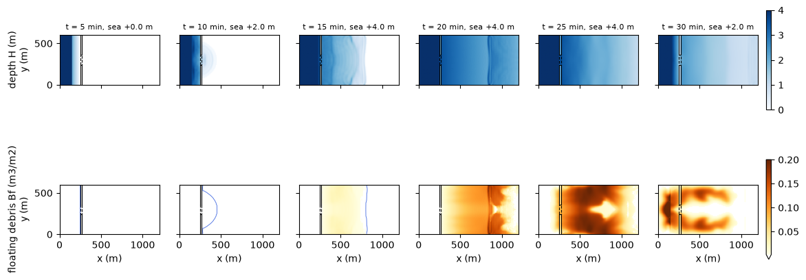
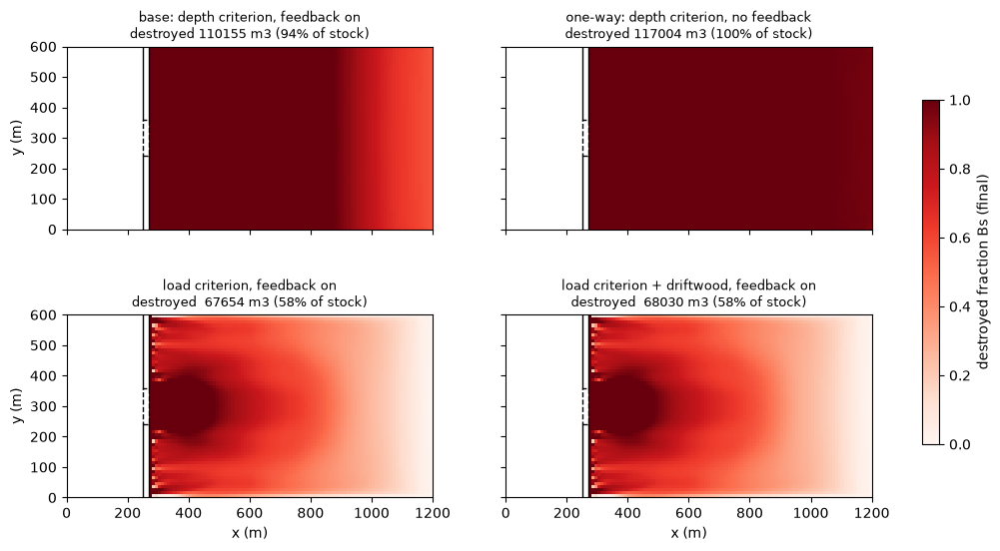
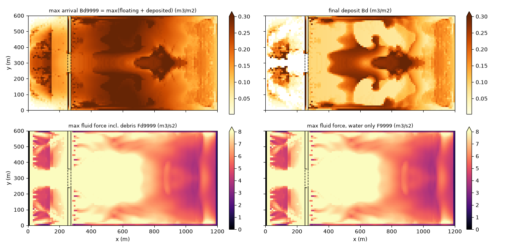
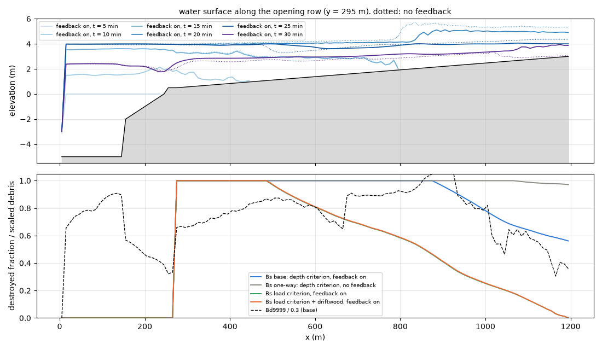

# tsunami_town — 津波の市街地遡上による家屋破壊・瓦礫の流動・堆積(理想化ケース)

海岸の低平な市街地に津波が遡上し、木造家屋を破壊して瓦礫を内陸へ運び、
堆積させる現象を、**家屋破壊・瓦礫モジュール fn_bldgdebris**
(docs/users_guide/bldgdebris.md、developer.md §63)と**潮位強制 fn_tide**
(津波波形)、比較ケースでは**流木モジュール fn_driftwood**(§50)の組み合わせで
概算する。被害関数型の破壊判定、瓦礫のラスタ輸送、破壊に伴う空隙率の変化が
流れへ返る効果、流木による破壊力の増加、の 4 点を同じ地形・同じ波形で
並べられるようにしてある。コード変更なし(設定のみ)。本体 1 ケース+
比較ケース 3 つ。

## 幾何と設定



左: 地形と海岸堤防(黒)・開口部(破線)。中: 破壊可能な家屋ストック(木造率込み。
海側 100 % → 内陸 40 %)。右: 津波の波形(先行波のみの理想化)。

1,200 m × 600 m、dx = dy = 10 m(120 × 60 セル)。西から順に:

| x (m) | セル番号 i | 地形 | 役割 |
|---|---|---|---|
| 0〜10 | 1 | z = −5 m、海域マスク | 潮位強制の入口(津波波形) |
| 10〜150 | 2〜15 | z = −5 m | 海(通常セル+初期水位 = 解く海) |
| 150〜250 | 16〜25 | z = −2 → 0 m | 浜・貯木場。流木ケースでは材木ストック 1.0 m³/m²(計 60,000 m³) |
| 250〜270 | 26〜27 | z = +2.0 m | 海岸堤防。中央 y = 240〜360 m(j = 25〜36)は**開口部 z = +0.5 m** |
| 270〜1,200 | 28〜120 | z = +0.5 → +3.0 m の緩勾配 | 市街地。建物空隙率 **gv = 0.6**。家屋ストック 0.3 m³/m² × 木造率(100 % → 40 %)= **計 117,180 m³**。破壊可能割合 fn_bdfrac = 木造率 |

初期水位は T.P. 0 m 一定(f_htype=2)。津波は西端 1 列の海域セルに一様時系列で
与え、5 分後から 10 分で **+4.0 m** に達し 10 分維持、10 分で 0 m に戻る
(先行波のみ。堤防天端 +2.0 m を 2 m 越える)。東・北・南の辺は既定の壁。
dt = 0.5 s、1 時間。計算時間は 1 ケース 1 分強。

瓦礫は代表寸法 0.3 m・見かけ比重 0.5(喫水 0.15 m)。本体の破壊判定は浸水深
(f_bdcrit=1)で、閾値 1.0 m から 3.0 m への線形ランプ(東北津波の木造家屋
被害関数の幅の近似)、破壊レート 5.0e-4 m/s(0.3 m³/m² が 10 分で全壊)、
沈下率 0.3、低速堆積の流速閾値 0.05 m/s、空隙率への帰還あり(f_bdgv=1)。

| ケース | 設定ファイル | 判定 | 帰還 | 流木 | 用途 |
|---|---|---|---|---|---|
| 本体 | param.txt | 浸水深 1.0〜3.0 m | あり | — | 被害関数型の破壊判定+帰還 |
| 片方向 | param_oneway.txt | 同上 | **なし** | — | 帰還の効果の対照 |
| 荷重 | param_load.txt | 荷重 1.0〜4.0 m³/s² | あり | — | 流体力ベースの判定 |
| 荷重+流木 | param_load_dw.txt | 同上 | あり | **あり** | 流木による破壊力の増加 |

## 組み方の要点(設定の理由)

1. **海・浜・市街地を海域マスクにしない**。海域セルには瓦礫・流木を置けず
   移流も働かないため、浸水と輸送を解く範囲はすべて通常セル+初期水位で
   表し、海域マスク+潮位強制は西端 1 列だけにする(examples/timberyard
   と同じ流儀)。津波は沖側の水位時系列として受ける(発生・伝播は外部)。
2. **家屋ストック fn_bdstock に木造率を織り込む**。瓦礫化可能材積は
   0.3 m³/m² × 木造率で、内陸ほど RC 造・耐津波構造が増える想定。
   **fn_bdfrac(= 木造率)**が空隙率帰還の上限を決める: 全壊しても RC 造の
   占有は残るので gv は gv0 + (1 − gv0)·fw までしか上がらない。
3. **浸水深判定は被害関数の読み替え**。閾値 1(1.0 m)で破壊が始まり、
   閾値 2(3.0 m)で破壊可能率 1 になる線形ランプ。被害関数の中央値を
   2 閾値の中点、幅をランプ幅と読む。破壊レートは「全壊に要する時間 =
   ストック ÷ レート」で決める(ここでは 10 分 = 押し波の維持時間)。
4. **荷重判定(f_bdcrit=2)の閾値は F9999 の単位**(m³/s²。清水規格化)。
   水のみの最大流体力 F9999 の分布を見て、「ここまでは全壊、ここから先は
   無被害」の 2 値を閾値 1・2 に置く。流木・瓦礫の項は荷重 Fd9999 に
   含まれる(下の読み方)。
5. **流木ケースの流失閾値 dw_hrec は浜の平常水深より高く**(3.0 m)。
   津波で水位が上がって初めて材木が流失する(timberyard と同じ流儀)。
6. **空隙率への帰還 f_bdgv** は同一ケースで 0/1 を切り替えて比較する
   (片方向ケース)。帰還ありでは破壊したセルの水が広い面積に広がって
   水位が下がり、内陸の破壊が減る。

## 実行方法

```
cd examples/tsunami_town
make                                   # ../../bin/encflow へのリンク
python3 make_terrain.py                # z sw gv bdstock bdfrac dwstock の各 .txt
./encflow param.txt                    # 本体(約 1 分)
./encflow param_oneway.txt             # 帰還なし
./encflow param_load.txt               # 荷重判定
./encflow param_load_dw.txt            # 荷重判定+流木
python3 plot_results.py                # figs/*.png と数表(result_* があるものだけ描く)
```

出力(result/): H・V の 5 分ごとのフレーム、**Bf(流動瓦礫)・Bd(堆積瓦礫)・
Bs(家屋の破壊率)**、期間最大(H9999・V9999・F9999・**Bd9999 = 瓦礫の最大
到達量**・**Fd9999 = 流木・瓦礫込みの最大流体力**)、bldgdebris.csv(材積台帳。
1 分ごと)。流木ケースは Hd・Wd・driftwood.csv も。

## 結果(2026-10-01。gfortran、dt = 0.5 s)



左: 残存する家屋ストック(4 ケース)と津波波形。右: 流動瓦礫(実線)と堆積
瓦礫(破線)。破壊は堤防が越流される 10 分頃に始まり、押し波の維持期
(15〜25 分)に進む。帰還ありの本体(青)は 94 % で止まり、帰還なし(灰)は
全壊する。荷重判定(緑・橙)は 58 % で、流木の有無でほぼ重なる。



本体ケースの浸水深 H(上)と流動瓦礫 Bf(下)の時間発展。10 分: 開口部から
浸水が始まり、瓦礫の発生が堤防背後に現れる。15〜20 分: 全面越流で市街地が
+4 m まで湛水し、瓦礫は前線とともに内陸へ(x ≈ 900 m)。25 分: 瓦礫の
ピーク(59,779 m³ が浮遊)。30 分: 引き波で瓦礫が海側へ戻り始める。



最終の破壊率 Bs。浸水深判定(上段)は市街地のほぼ全域が全壊になるが、
帰還あり(左)では内陸(x > 900 m)の破壊率が 0.5〜0.9 に留まる。荷重判定
(下段)は開口部背後の噴流域で全壊、堤防の越流部(y 方向の縞)で高く、
内陸へ向かって線形に減る。流木の有無(左右)の差は目に見えない。



本体ケースの瓦礫の最大到達量 Bd9999(左上)、最終堆積(右上)、流木・瓦礫
込みの最大流体力 Fd9999(左下)、水のみの F9999(右下)。瓦礫は市街地の
全域に届き(到達 x ≈ 1,195 m = 東端)、最終堆積は開口部の噴流の軸と内陸の
停滞域に集中する。引き波で海へ出た瓦礫(浜・海の着色)も見える。



開口部を通る行(y = 295 m)の断面。上: 水面の時間発展(実線 = 帰還あり、
点線 = 帰還なし)。25 分の時点で帰還なしの水面は +5 m 超まで積み上がる
(空隙 0.6 の狭い貯留に水が押し込まれる)のに対し、帰還ありは +4 m 付近
(全壊したセルの空隙が 1 になり、同じ水が広い面積に広がる)。下: 破壊率
(4 ケース)と瓦礫の最大到達量(本体。0.3 で正規化)。

| ケース | 破壊材積 | 破壊率 | 最終堆積 | 浮遊残 | 系外流出(海へ) | 市街地の最大水深 |
|---|---|---|---|---|---|---|
| 本体(浸水深・帰還あり) | **110,155 m³** | **94.0 %** | 84,716 | 844 | 24,595 | 4.91 m |
| 片方向(帰還なし) | 117,004 | 99.9 % | 66,936 | 320 | 49,749 | 5.93 m |
| 荷重判定 | 67,654 | 57.7 % | 46,670 | 245 | 20,739 | 4.92 m |
| 荷重判定+流木 | 68,030 | 58.1 % | 46,907 | 266 | 20,857 | 4.92 m |

本体の内訳(x 270〜500 / 500〜800 / 800〜1,200 m): 38,430 / 40,793 / 30,931 m³
(全壊 / 全壊 / 81 %)。系外流出は台帳の差 ストック総量 − (残ストック+
浮遊+堆積)で、引き波に乗って海域セルへ出た分。流木ケースの材木は 60,000 m³
のうち 35,655 m³ が流失し、11,564 m³ が堆積、23,971 m³ が海へ戻った。

## 結果の読み方

- **Bs(破壊率)は最終フレームが被害率マップ**。棟数・金額への換算は
  後処理(ストック × Bs × gv × 面積で瓦礫材積、建物台帳で棟数)。
- **Bd9999 は「どこまで届くか」、最終フレームの Bd は「どこに残るか」**
  (流木の Wd9999 / Wd9998 と同じ使い分け)。材積への換算は柱状量 × gv ×
  セル面積で、gv は帰還で変わるため**台帳 CSV の値を使う**(CSV は現在の
  gv で換算済み。閉領域なら総和がストック総量と機械精度で一致し、本ケースは
  海域セルへの流出分だけ減る)。
- **Fd9999 と F9999 の差が浮遊物の寄与**。本ケースでは差は最大 5 %
  (開口部の噴流域)で、破壊率への影響は 0.4 ポイント。材木 60,000 m³ が
  浸水域 70 ha に広がると柱状量 0.1 m³/m² 程度にしかならず、水柱 3〜5 m に
  対する付加質量は数 % に留まるため。流木が堰き止めや家屋への引っ掛かりで
  **集中**する効果はラスタでは表現しない(users_guide/driftwood.md の
  適用限界)ので、本モジュールの流木項は「希薄に混じった流れの平均的な
  荷重増」として読む。個別材の衝撃荷重は従来どおり V9999 と代表径の
  後処理(国総研 905 §4.3、FEMA P-646)。
- **帰還の効果は水位と破壊率の両方に現れる**。帰還なしでは市街地が
  「空隙 0.6 の狭い容器」のまま満たされて水位が高く、全壊する。帰還ありでは
  全壊した海側の空隙が開いて水が広がり、内陸の浸水深が下がって破壊率が
  減る(94 %)。同時に引き波で海へ戻る瓦礫も半減する(24,595 vs 49,749 m³)
  = 内陸に残る瓦礫が増える。どちらが現実に近いかは、破壊後の敷地が
  「流れを通す更地」になるか「瓦礫で塞がれたまま」かで変わる。本モジュールは
  前者(堆積瓦礫は空隙を再び塞がない)で、後者は対象外。

## 知っておくべき性質(設定の理由)

- **浸水深判定は「浸水深だけ」で決まる**ので、流木・瓦礫を含めた連鎖は
  荷重判定(f_bdcrit=2)でしか表れない。実務の被害関数と直結するのは
  浸水深判定、連鎖を見るのは荷重判定、と使い分ける。両方の閾値を同じ
  被害実績から当てるには、水のみの F9999 と H9999 の分布を被害率と
  突き合わせるのが実務的。
- **荷重判定の閾値 1.0〜4.0 m³/s² は本ケースの F9999 の分布から置いた
  校正値**(中央値 5〜9、内陸で 4〜5)で、実務値ではない。閾値を上げると
  破壊が海側に集中し、流木・瓦礫の寄与(数 %)が閾値際のセルで効くように
  なるが、寄与の大きさ自体は変わらない。
- **破壊レートは曝露時間との兼ね合い**。bd_wdes を大きくすると閾値を
  超えた瞬間にほぼ全壊(被害関数の「瞬時判定」に近づく)、小さくすると
  押し波の継続時間が効く(短い津波では壊れ残る)。
- **沈下率 bd_fsink は「その場に残る瓦礫」の下限**。0.3 ではストックの
  3 割がその場で堆積し、残り 7 割が浮遊して内陸・海へ運ばれる。
  到達範囲の上限側評価には 0 を使う。
- **引き波で瓦礫が海へ戻る**。閉領域でないため台帳の差が系外流出になる。
  引き波後に市街地に残る瓦礫(最終 Bd)と、海へ出た瓦礫(漂流物として
  港湾・航路の問題)の比は dw/bd の低速堆積閾値(bd_vstop)と再流動
  (bd_wfloat、既定なし)に敏感。
- **東・北・南の辺は壁(既定)**。市街地が閉じた低地として満たされる。
  背後に排水先がある市街地なら users_guide/boundary.md の境界を与える。

## 感度実験の入口

- 津波のピーク水位・継続時間(tival): 浸水深判定の破壊率は水位に、荷重
  判定は流速(越流の落差・開口部の噴流)に敏感。
- 堤防の天端・開口部の幅(make_terrain.py): 荷重判定の空間パターンを決める。
- fn_bdfrac(木造率)・fn_gv: 耐津波化・都市化のシナリオ。ストックと fw を
  同時に差し替える(README の「組み方の要点」2)。
- bd_hcrit / bd_hcrit2、bd_fcrit / bd_fcrit2: 被害関数の中央値と幅。
- bd_wdes、bd_fsink、bd_vstop、bd_wfloat: 上記「知っておくべき性質」。
- 流木の量と置き場所(dwstock.txt): 流木項の寄与は「水柱に対する材木の
  柱状量」で決まる。集中した貯木場(timberyard 型)を開口部の正面に置くと
  寄与が大きくなる。

## 関連

- 機能の説明・パラメータ表: docs/users_guide/bldgdebris.md、流木: users_guide/driftwood.md、潮位: users_guide/tide.md
- 適用事例の一覧: docs/users_guide/usecases.md
- 設計と検証・文献照合: docs/developer.md §63(家屋破壊・瓦礫モジュールと空隙率の状態化)
- 自己検定テスト: test/bldgdebris(保存則・片方向結合・帰還の体積保存・リスタート)、test/gvchange(空隙率変更の単体検定)
- 同型の例題: examples/timberyard(高潮による貯木場からの材木流入)
