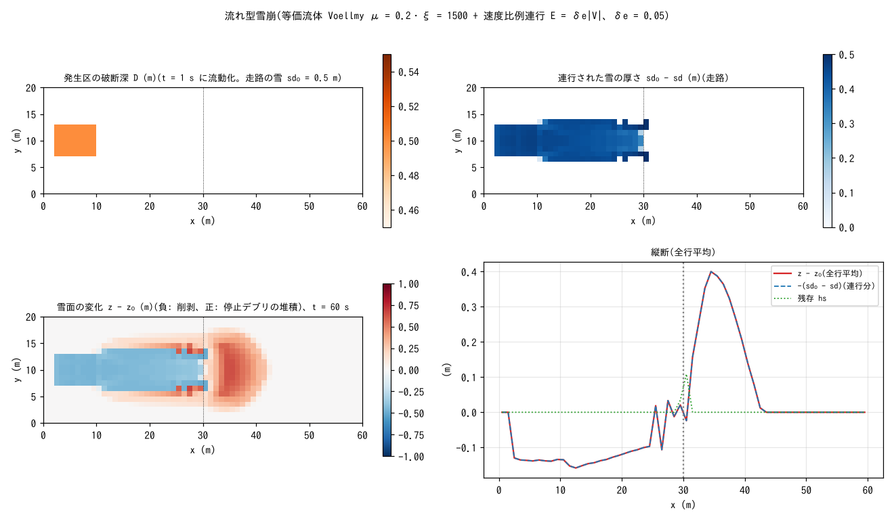

# test/avalanche — 流れ型雪崩(等価流体 Voellmy + 速度比例連行)の疎通と保存則

土砂流動モデルを援用した**流れ型雪崩**の構成(developer.md §28.8 の
「雪崩への適用」、users_guide/geomorph.md の雪崩の項)の検定です。
Voellmy 抵抗則の等価流体(`f_dbres = 4`)に、走路の雪を削り込む
**速度比例連行** E = δe|V|(`f_dbed = 4`。連行のみ、堆積は停止 `f_dbstop`)を
組み合わせ、発生区の破断で流動化した雪が走路の雪を取り込んで成長し、
遷緩点下で停止・堆積する一連の過程を検定します。入れ物の読み替えは
sd = 連行可能な雪の厚さ、hs = 流動中の雪の実質体積、z = 雪面込み標高
(z − sd = 地山)、fluv_porosity = 雪の空隙率です。

## 構成

| 項目 | 値 |
|---|---|
| 地形 | slope_break(tanθ = 0.4 の斜面 → x = 30 m から平坦)、60 m × 20 m(Δx = 1 m) |
| 雪 | 走路の雪 sd₀ = 0.5 m(全域、z は雪面込み)、空隙率 λ = 0.1(C* = 0.9、hs ≈ 雪厚) |
| 発生区 | 破断深 D = 0.5 m を i ∈ [3, 10], j ∈ [8, 13] に与え(`make_init.py`)、t = 1 s に一斉流動化。疑似間隙水 relsat = 0.15 |
| 抵抗則 | Voellmy μ = 0.2、ξ = 1500 m/s²(雪崩の慣用域) |
| 連行 | δe = 0.05(V = 5 m/s で 0.25 m/s の削り込み)。濃度 C ≥ `db_cmin` = 0.02 の密な流動体セルのみ(希薄な裾の暴走防止) |
| 停止 | 低速凝集 `f_dbstop = 1`(停止 → 雪面 z へ固定)、w_stop = 0.1 |
| 時間 | dt = 0.02 s、60 s(全停止) |

| ファイル | 内容 |
|---|---|
| `Check_avalanche.py <save>` | (1) 固体台帳 |Σhs + (1 − λ)Σ(z − z₀)| < 1e-9、(2) 共動更新 max|(sd − sd₀) − (z − z₀)| < 1e-10、(3) 連行の活性: 走路(発生区外)で min(sd − sd₀) < −0.05 m、(4) 成長: 連行固体 / 放出固体 > 0.2、(5) 停止: 残存 Σhs /(放出 + 連行)< 0.3 |
| `Fig.py` | 下の図 `figs/avalanche.png` |

## 実行

```bash
make
./Run.sh          # dbinit 生成 → 実行 → Check(1 秒)
./Run_MPI.sh 4    # MPI。state.dat が逐次とバイト一致
python3 Fig.py    # figs/avalanche.png
```

## 図



左上: 発生区の破断深 D = 0.5 m。右上: 連行された雪の厚さ sd₀ − sd。
発生区から遷緩点までの走路で雪が全層(0.5 m)削り取られています。
左下: 雪面の変化 z − z₀。走路は削剥で負、遷緩点の下流 x = 30〜42 m に
停止デブリが最大 0.67 m 堆積しています。右下: 縦断(全行平均)。
z − z₀ と −(sd₀ − sd) の 2 本が重なるのは共動更新の恒等(z と sd が
同じ量だけ動く)そのもので、残存 hs はほぼゼロです。

## 所見

| 検定 | 計算値 | 判定 |
|---|---|---|
| (1) 固体台帳 | −1.2e-13 m·cell | PASS |
| (2) 共動更新 | 1.1e-14 m | PASS |
| (3) 連行の活性 | 走路 min(sd − sd₀) = −0.500 m(全層) | PASS |
| (4) 成長 | 連行固体 60.1 / 放出固体 21.6 = 2.78 倍 | PASS |
| (5) 停止 | 残存 Σhs /(放出 + 連行)= 0.035 | PASS |

- 連行で雪崩は放出量の約 3.8 倍に成長し、遷緩点下で 96.5% が停止・
  堆積します。台帳と共動更新は機械精度です。
- 連行可能層は既存の土層厚 sd を読み替えて与え、共動更新・台帳・
  クランプ・2 パス MPI 構造をすべて再利用しています(新規状態・新
  パラメータなし。δe は `db_delte` を共用)。積雪モジュール(SWE)とは
  結合しない設計で、SWE → sd は前処理で変換します(§28.8)。
- 煙型雪崩は対象外、発生はシナリオ(破断深の指定)、衝撃圧は雪密度で
  換算する、という限界をユーザーガイドに明記しています。

## 関連文書

- [docs/users_guide/geomorph.md](../../docs/users_guide/geomorph.md) — 雪崩(流れ型)の設定の型、μ/ξ の慣用域、読み替えの対応表
- developer.md §28.8(等価流体モード、速度比例連行 f_dbed=4、雪崩援用の設計判断)
- [test/volcano](../volcano/)(Voellmy 等流の解析解)、[test/slide](../slide/)(瞬時流動化)
