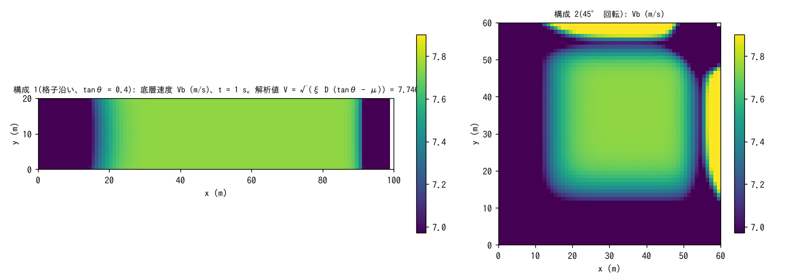
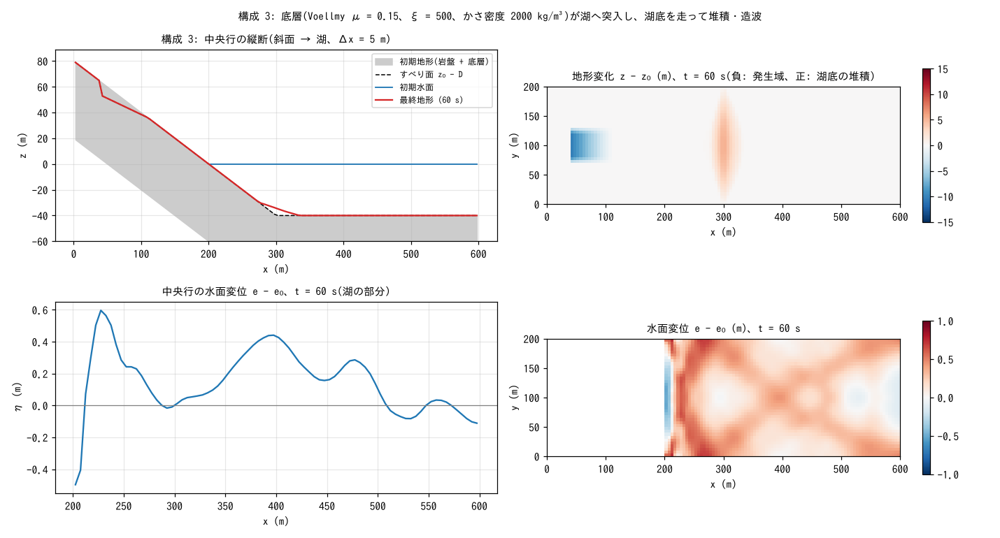
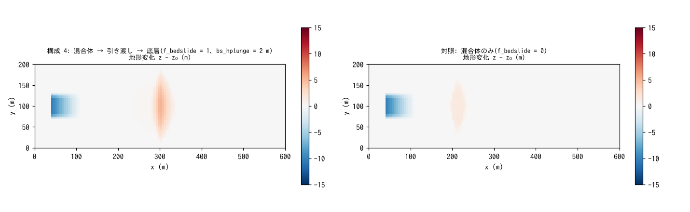

# test/bedslide — 動く底層(f_bedslide): Voellmy 速度の解析値、斜面 → 湖の突入、混合体からの引き渡し

地滑り津波のための**動く底層**モジュール(`&list_geomorph` の
`f_bedslide = 1`。水の下を走る土塊を、水面を持ち上げる慣性なしの底層
hb として解く。docs/landslide_tsunami_plan.md、developer.md §61)の
検定です。4 つの構成からなり、reference 比較ではなく `Check_bedslide.py`
の自己検定(台帳・速度・輸送・造波)で合否を決めます。

1. **格子沿いベンチマーク**(`param_bench.txt`): 等勾配斜面(tanθ = 0.4)の
   全域に厚さ D = 1 m の底層を置き、Voellmy 則(μ = 0.1、ξ = 200)の
   終端速度 V = √(ξ D (tanθ − μ)) = 7.746 m/s と、内部セルの速度 Vb
   および断面通過体積を比べる。
2. **45° 回転ベンチマーク**(`param_rot.txt`): 同じ斜面と層を格子に対して
   45° 回転させたもの。8 方向配分の正規化誤り(√2 倍)を捕まえる格子
   依存の検出器。
3. **斜面 → 湖**(`param.txt`): 斜面上の土塊(19,110 m³)を 1 s で可動化し、
   湖へ突入して湖底を走り、堆積・造波する。台帳・水体積・水中走行・
   造波・発火台帳を検定。
4. **混合体からの引き渡し**(`param_plunge.txt` と対照 `param_mix.txt`):
   陸上は土石流の混合体(hs)として流れ、滞水深 2 m 以上のセルで底層 hb へ
   引き渡す(`bs_hplunge`)。対照(引き渡しなし)では湖底に達しない
   ことと比べる。

## 構成

| 項目 | 構成 1 | 構成 2 | 構成 3 / 4 |
|---|---|---|---|
| 格子 | 100 m × 20 m、Δx = 1 m | 60 m × 60 m、Δx = 1 m | 600 m × 200 m、Δx = 5 m |
| 地形 | 等勾配 tanθ = 0.4(`zbench.txt`) | 45° 回転した等勾配(`zrot.txt`) | 斜面 → 湖(水面 0 m、湖底 −40 m。`z.txt`) |
| 底層 | 全域一様 D = 1 m、t = 0 で可動化 | 同左 | 斜面上の平面すべり面 D(`db.txt`)、t = 1 s で可動化 |
| 抵抗則 | Voellmy μ = 0.1、ξ = 200、かさ密度 2000 kg/m³(乾燥 = 浮力なし) | 同左 | Voellmy μ = 0.15、ξ = 500、2000 kg/m³(水中では r = 0.5) |
| 時間 | dt = 0.05 s、1 s | 同左 | dt = 0.05 s、60 s |

底層の更新は表面勾配駆動・慣性なしで、安定条件を自動サブサイクル
(`bs_cfl = 0.4`)で満たします。層の端を作らず全域一様層にするのは、
有限の帯では動いた先の堆積が地表に乗り後続が段差を登れず詰まるため
です(`make_init.py` の注釈)。

| ファイル | 内容 |
|---|---|
| `make_init.py zbench|dbbench|zrot|dbrot|z|db` | 地形・底層厚の生成(定数は Check と対) |
| `Check_bedslide.py bench|tsunami|plunge` | 構成 1・2: (1) 台帳 Σdz = Σdsd = 0・岩盤面不変、(2) 内部セルの Vb が V に 0.5% 以内、(3) 断面通過速度が V に 10% 以内。構成 3: 台帳、Σh 不変、湖底堆積、造波、発火台帳。構成 4: 固体・水の台帳、引き渡し体積、湖底到達、対照は到達しない |
| `Fig.py` | 下の図 `figs/*.png` |

## 実行

```bash
make
./Run.sh          # 入力生成 → 構成 1・2 → Check bench → 構成 3 → Check tsunami → 構成 4・対照 → Check plunge(約 7 秒)
./Run_MPI.sh 4    # MPI。state.dat・geomorph_bedslide.dat が逐次とバイト一致(-O2 厳密数学)
python3 Fig.py    # figs/bench.png, tsunami.png, plunge.png
```

## 図



左: 構成 1 の底層速度 Vb(t = 1 s)。内部 100 セルは解析値 7.7460 m/s に
**0.00%** で一致し、上流端(希薄化)と下流壁(堆積の背水)だけが外れます。
右: 構成 2(45° 回転)。内部 79 セルの Vb は解析値に 0.14% で一致し、
斜面に対して斜めに走る格子でも等方に動くことが分かります。



構成 3。左上: 中央行の縦断。すべり面(破線)の上の土塊が 60 s で湖へ
突入し、湖底(−40 m)の平坦部 x ≥ 300 m まで走って 5.2 m 堆積しています
(灰色は岩盤 + 底層、赤が最終地形)。右上: 地形変化の分布。発生域の
低下(青)と湖底の堆積(赤)。左下・右下: 水面変位。突入点の後ろの
引き波と、湖を横切って広がる先頭波(最大 0.73 m)が見えます。



構成 4(左)と対照(右)。陸上を土石流(混合体)として流れた土塊は、
引き渡しありでは滞水深 2 m 以上のセルで底層になって湖底を走り(堆積
5.2 m、引き渡し 17,658 m³ = 放出の 92%)、引き渡しなしでは汀線付近で
止まって湖底には達しません(平坦部の堆積 0 m)。

## 所見

| 検定 | 計算値 | 判定 |
|---|---|---|
| 構成 1: 内部 Vb | 7.7460 m/s(解析 7.7460、0.00%) | PASS |
| 構成 1: 断面通過速度 | 7.519 m/s(−2.9% = 壁 2 行の境界層 2·ld/ny と一致) | PASS |
| 構成 2: 内部 Vb | 7.736〜7.746 m/s(0.14%) | PASS |
| 構成 2: 断面通過速度 | 7.175 m/s(−7.4%。壁端 + 階段断面) | PASS |
| 構成 3: 台帳 / Σh | Σdz −1.6e-12、max|Δ(z − sd)| 3e-13 / Σh 不変(−6e-4 m·cell) | PASS |
| 構成 3: 湖底堆積 / 造波 | 平坦湖底 max dz 5.18 m / 水面最大 0.47 m(湖底平坦部) | PASS |
| 構成 3: 発火台帳 | 放出 19,110 = 停止 16,660 + 移動中 2,450 m³ | PASS |
| 構成 4: 引き渡し | 17,658 m³、湖底 max dz 5.17 m。対照 0.00 m | PASS |

- 45° 回転ベンチマークは、8 方向配分の正規化を誤ると通過速度が √2 倍に
  出る(実検出の記録 §61)ための検出器で、格子沿いとの差は 4.6% に
  収まっています。
- 構成 3 は段階 0(混合体のみ。work/slide_tsunami)で汀線 50 m 以内で
  停止していた水中ランアウトを底層で解消したことを示します。混合体は
  突入時の柱高増加が直接波になるのに対し、底層は水中を走りながら底面を
  持ち上げるため、同じ体積でも近地波は低く、堆積は湖底まで達します。
- 構成 4 の引き渡しは `f_bsplunge = 1`(滞水深は初期水面基準)、
  `f_bsvplunge = 1`(混合体の速度が底層の終端速度以下に落ちてから)、
  `bs_tstop = 10 s`(低速が続いたセルだけ固定)で運用しています(§61.5〜61.10)。
- MPI np = 2, 4 は -O2 厳密数学ビルドで 3 構成とも逐次とバイト一致
  (-Ofast では津波構成のみ fast-math のビルド間差。§28.5 の既知事項)。

## 関連文書

- [docs/users_guide/geomorph.md](../../docs/users_guide/geomorph.md) — 動く底層の設定(`f_bedslide`、`fn_bsinit`、`bs_*`、引き渡し)
- [docs/landslide_tsunami_plan.md](../../docs/landslide_tsunami_plan.md) — 設計計画(§6 検証、§4.7 引き渡し)
- developer.md §61(実装・検証記録・残作業・引き渡し)
