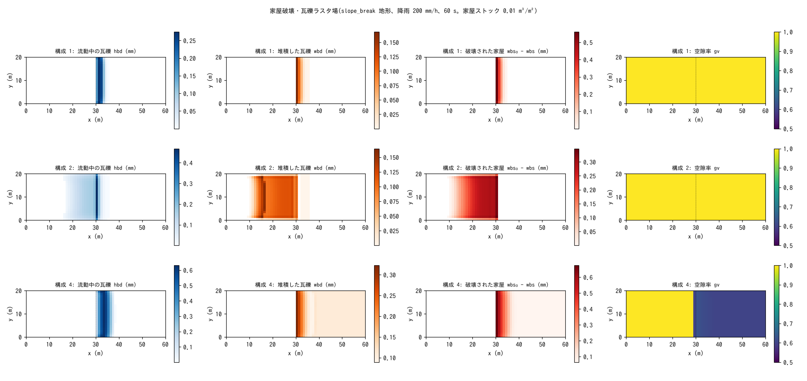

# test/bldgdebris — 家屋破壊・瓦礫ラスタ場(fn_bldgdebris)の疎通・保存則・片方向結合

家屋ストックが浸水深または流体力で破壊されて瓦礫になり、流木と同じ
ラスタ場(流動中 hbd、堆積 wbd)として運ばれる**家屋破壊・瓦礫モジュール**
(`fn_bldgdebris`、[ユーザーガイドの家屋瓦礫の章](../../docs/users_guide/bldgdebris.md)、
developer.md §63)の検定です。瓦礫の柱状量は空隙面積基底なので、
材積保存は現在の空隙率 gv で重み付けして検定します。流木との同時有効化
が流木側を変えないこと(片方向結合)、空隙率への帰還 `f_bdgv` が水体積を
保存すること、リスタート、既定値の同値も検定します。

## 構成

共通: slope_break 地形、60 m × 20 m(Δx = 1 m)、降雨 200 mm/h、60 s、
四周壁、家屋ストック 0.01 m³/m²、瓦礫の代表寸法 5 mm、見かけ比重 0.5。

| 構成 | ファイル | 内容 |
|---|---|---|
| 1 | `param.txt` | 浸水深判定(`f_bdcrit = 1`: 4〜8 mm の線形ランプ)、沈下率 0.3、片方向(`f_bdgv = 0`) |
| 2 / 2′ | `param_dw.txt` / `param_dwonly.txt` | 流木 + 瓦礫(荷重判定 `f_bdcrit = 2`)/ 流木のみ。両者の state.dat・driftwood.dat がバイト一致 = 片方向結合 |
| 3 | `param_rt1.txt` → `param_rt2.txt` | リスタートの分割継続(通しとバイト比較) |
| 4 / 4′ | `param_gv.txt` / `param_gv0.txt` | 平坦部 gv = 0.6(`gv.txt`)で空隙率帰還あり / なし。Log の総貯水量 S(t) が一致 = 水体積保存 |
| 5 / 5′ | `param_min.txt` / `param_minx.txt` | 空の `&list_bldgdebris` と既定値の明示のバイト一致 |

| ファイル | 内容 |
|---|---|
| `Check_bldgdebris.py <save>` | (1) 材積保存 |Σ(hbd + wbd) gv + Σwbs − Σwbs₀| < 1e-9、(2) 活性: 破壊 > 1e-3 かつ堆積 > 1e-3 m·cell、(3) 到達: 平坦部の max(hbd + wbd) > 0 |
| `gv.txt` / `bdstock_min.txt` | 構成 4 の空隙率分布 / 構成 5′ のストック |
| `Fig.py` | 下の図 `figs/bldgdebris.png` |

## 実行

```bash
make
./Run.sh          # 構成 1 → 2・2′ → リスタート → 4・4′ → 5・5′。すべて通れば PASS(約 8 秒)
./Run_MPI.sh 4
python3 Fig.py    # figs/bldgdebris.png
```

## 図



上段(構成 1): 浸水深判定。平坦部の湛水が 4 mm を超える遷緩点直下の
1〜3 セルで家屋が破壊され(右から 2 列目)、瓦礫は流動中(左)と
堆積(中)に分かれ、下流 5 m ほどまで到達します。
中段(構成 2): 荷重判定。斜面上の射流の流体力でも破壊が起き、斜面の
下半分の家屋が壊れて瓦礫が流下・堆積しています。流木を同時に有効化
しても流木の結果は流木のみの計算とバイト一致します。
下段(構成 4): 平坦部の空隙率 0.6(右)。瓦礫の柱状量は空隙面積基底
なので同じ体積でも値が大きく出ます。瓦礫の堆積が空隙率に帰還しても
総貯水量 S(t) は帰還なしと一致します。

## 所見

| 構成 | 材積保存 | 破壊 / 堆積 (m·cell) | 平坦部到達 | 判定 |
|---|---|---|---|---|
| 1 浸水深判定 | 2.7e-14 | 0.023 / 0.0069 | 0.38 mm | PASS |
| 2 流木 + 瓦礫(荷重判定) | 2.7e-14 | 0.083 / 0.039 | 0.57 mm | PASS。2′ と state.dat・driftwood.dat がバイト一致 |
| 3 リスタート | bldgdebris.dat・state.dat が通しとバイト一致 | | | PASS |
| 4 空隙率帰還 | 6.6e-14 | 0.084 / 0.076 | 0.81 mm | PASS。S(t) が 4′ と一致 |
| 5 既定値 | −9.9e-12 | 15.2 / 6.8 | 0.11 m | PASS。5′ とバイト一致 |

- 材積は gv の重み付きで機械精度で保存され、空隙率の変更が水体積を
  保存することも確かめられます(§63.6 B2)。
- 瓦礫 → 流れの作用は空隙率帰還だけで、流木 → 瓦礫は荷重判定の付加
  質量を通じた一方向です(2 と 2′ の一致がその証明)。
- 実地への展開例は examples/tsunami_town(流木なし / あり、判定 1 / 2、
  帰還 0 / 1 の比較)です。

## 関連文書

- [docs/users_guide/bldgdebris.md](../../docs/users_guide/bldgdebris.md) — 破壊判定(`f_bdcrit`)、沈下率、空隙率帰還、パターン別の推奨値
- developer.md §63(設計、検証計画と記録 A1〜B2、既定値)
