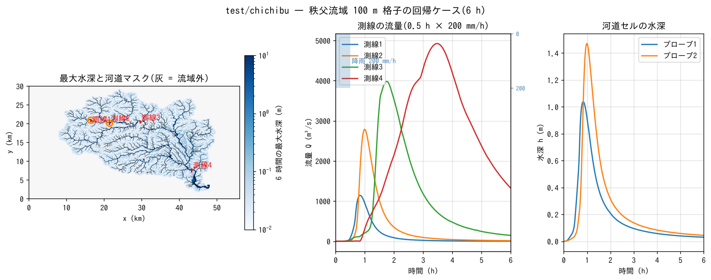

# test/chichibu — 秩父流域 100 m 格子の実地形回帰ケースと派生実験群

荒川上流・秩父流域(560 × 300 セル、Δx = 100 m)の実地形に 200 mm/h × 30 分の
一様降雨を与える**流域規模の回帰ケース**です。ENC 格子の実地形での
挙動(河道マスクによる河道セルの粗度、斜面〜河道の集水、洪水波の伝播)を
固定し、移流スキーム・開口補正・解像度・河道表現の設計判断の多くが
この流域で評価されました(developer.md §68 の一連の記録)。`param.txt` が
reference を持つ回帰ケース、ほかの `param*.txt` は §68 の実験の再現用です。
同じ流域の 200 m 格子の教材は [tutorials/chichibu](../../tutorials/chichibu/)。

## 構成(回帰ケース param.txt)

| 項目 | 値 |
|---|---|
| 領域・格子 | 56 km × 30 km、560 × 300 セル(Δx = 100 m)。`data_chichibu/`(標高 `Chichibu_100m_filled2.txt`(窪地処理済み)、流域マスク、河道マスク) |
| 粗度 | 斜面 n = 0.15、河道セル(fn_rw)n = 0.02 |
| 降雨 | 0〜30 min に 200 mm/h、以後 0(プロセスは地表流のみ。浸透・遮断なし) |
| 計算 | 動的波(f_govequation = 0)、既定の ENC 設定(f_advection_scheme = 3、f_opening_dynamic = 1、f_dry_head_cap = 1)。`p_adv_upwind_index = 0.1`、dt = 2.5 s、6 h |
| 記録 | 測線 1〜4(本流の上流から下流。x = 16.5 / 21.5 / 29.6 / 43.3 km)の流量、プローブ 2 点(測線 1・2 上の河道セル)の水深 |

| ファイル | 内容 |
|---|---|
| `Run.sh` / `Run_MPI.sh N` | Log.txt を reference と比較(ULP = 1) |
| `Fig.py` | 下の図 `figs/chichibu.png` |
| `Plot_chichibu_flux.plt` / `Plot_chichibu_map.plt` / `Plot_flux.plt` | gnuplot での流量・分布の表示 |

## 実行

```bash
make
./Run.sh          # 6 h の計算(4 コアで数分)+ reference 比較
./Run_MPI.sh 4
python3 Fig.py    # figs/chichibu.png
```

## 図



左: 6 時間の最大水深(対数色)。降雨は斜面から河道へ集まり、本流と
支川の河道セル(黒点)に水深数 m の流れができます。谷底の低地にも
浸水(1 m 前後)が広がっています。中: 測線 1〜4 の流量。上流から下流へ
ピークが大きく遅くなり、最下流の測線 4 では XXQ4 m³/s @ XXT4 h です。
右: プローブの水深。降雨終了(0.5 h)の後も河道の水深は 1 時間以上
増え続け、斜面からの集水の遅れがわかります。

## 所見

| 測線 | 位置 | ピーク流量 (m³/s) | ピーク時刻 (h) |
|---|---|---|---|
XXTABLE

- reference は既定設定(スキーム 3・動的開口補正)の Log です。
  `Run.sh` の判定は PASS(本書作成時)。
- このケースは収束の目安でもあります: 同じ流域の 50 / 100 / 200 m 格子で
  最下流ピークが解像度とともに変わる(細かいほど大きい。tutorials/chichibu の
  補足節に 200 / 100 / 50 m の比較)。河道の実表現(段差状の河床、1 セル幅)が
  移流スキームの差を生む主因で、§68.14〜68.20 に診断があります。

## 派生実験(param_*.txt)

いずれも reference を持たず、`./encflow param_xxx.txt` で実行して
`result_xxx/` に出力します(`dir_result` が設定済み)。名前の接尾辞:
`_s1` / `_s3` = f_advection_scheme 1 / 3、`_noadv` = 移流項なし
(f_govequation = 1)、`base` = 開口補正なし、`dyn` = f_opening_dynamic = 1。

| 群 | ファイル | 内容 | 記録 |
|---|---|---|---|
| 移流スキーム | `param_base_{noadv,s1,s3}.txt` | 開口補正なしでのスキーム比較(100 m) | §68.8 続報、§68.12 |
| 動的開口補正 | `param_dyn_{noadv,s1,s3}.txt`、`param_dyn2_{s1,s3}.txt` | f_opening_dynamic = 1(河道エッジ)/ 2(全エッジ) | §68.14 |
| 供給元の限定 | `param_dyn_s3_donor1.txt` | f_advection_donor = 1(河道—河道エッジの供給元を河道セルに限る) | §68.18 |
| 乾燥受け手の頭打ち | `param_cap.txt` | f_dry_head_cap = 1(現在は既定。reference とバイト一致) | §68.16 |
| 解像度 | `param50_*.txt`(`data_chichibu_50m`)、`param200_*.txt`(tutorials の 200 m データ)、`param500_*.txt` / `param500r_*.txt`(`data_chichibu_500m`。r = 100 m 河道マスクから集約) | 50 / 200 / 500 m 格子での base / dyn × s1 / s3 | §68.14、§68.18 |
| サブグリッド河道幅 | `param_w{50,100}_{s1,s3}.txt`(`width_chichibu{50,100}.txt`)、`param200_w{50,100}_s3.txt` | fn_width による河道幅の指定(100 m = 格子幅、50 m) | §68.12、§68.24 |
| 高さ 0 堤防(壁付き自然河岸) | `param_lev0*_s1.txt`、`param_lev1_{s1,s3}.txt`、`param_lev5_s3.txt` | &list_channel の bank0 / f_bank_datum / f_bank_aggr / f_bank_opening の組合せ(lev0 = 開口補正なし、lev1 = あり、lev5 = bank0 = 5 m) | §68.12、§68.25、§68.29 |
| 縦断の測線 | `param_reach_{s1,s3}.txt`、`record_reach.txt`、`path_mainstem.csv` | 本流に沿う 12 測線(s = 0〜42 km(path_mainstem.csv の本流に沿う路長。測線 12 は旧測線 4))で洪水波の減衰を追う | §68.17 |

主な結果(最下流の測線 4 のピーク、§68.19 の表より): スキーム 1 と 3 の差は
動的開口補正で縮まり(3 の 3773 → 4857 m³/s)、f_advection_donor = 1 で
さらに 5656 m³/s(100 m)と 50 m 格子の値へ近づきます。壁付き自然河岸
(lev1)は 6 h 完走しますが Runge 12%・ex_flux 多発と荒く、自然河岸には
壁なしの幅モードを使うのが推奨です(§68.25、§68.29)。

## 関連文書

- [tutorials/chichibu](../../tutorials/chichibu/README.md) — 同じ流域の 200 m 教材(手順・補足の解像度比較)
- [docs/users_guide/geoinfo.md](../../docs/users_guide/geoinfo.md) — 地形・マスク・河道マスクの入力
- developer.md §68(ラスタ河道の移流と開口補正の設計記録: §68.7、68.12、68.14、68.16〜68.20、68.24、68.25、68.29)
