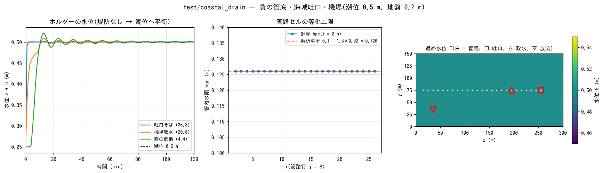

# test/coastal_drain — 海抜下ポルダーの排水: 負の管底・海域吐口・機場

地盤 0.2 m のポルダーと潮位 0.5 m 一定の海(ゼロメートル地帯)で、管路
連続体層(`f_gwconduit`、[ユーザーガイドの地下水の章](../../docs/users_guide/gwflow.md))
の 3 つの機能を同時に検査する回帰テストです(developer.md §46.5 (7)(8))。

- (7) **負の管底標高**(`fn_gwc_bot` = −1.8 m。地表 0.2 m の 2 m 下)
- (8b) **海域セルの吐口**(`fn_gwc_outfall`。潮位との水頭差で放流、フラップ付き)
- (8a) **機場**(`&list_struct_pump` の `f_pump_src = 1` = 管路から直接取水)

堤防がないため海がポルダーへ浸入し、全系が潮位に向かって平衡します。
この終状態が解析的に決まる(全域の水位 = 潮位、管内水頭 = 吐口の
等化上限)ので、回帰比較に加えて検算に使えます。

## 構成

| 項目 | 値 |
|---|---|
| 領域・格子 | 300 m × 150 m、30 × 15 セル(Δx = 10 m)。地盤 z = 0.2 m、東端の 2 列が海(`sw.txt`、z = −2 m) |
| 水 | 初期 h₀ = 0.05 m、潮位 0.5 m 一定(`titype = 2`)。n = 0.03 |
| 管路 | 行 j = 8 の i = 2〜26 に 1 本(`cnd.txt`)。容量 cap = 0.1 m、管底 −1.8 m、スロット sy 0.02、枡 0.01、吐口は i = 26(海セル (27, 8) に放流) |
| 機場 | (20, 8) の管路から取水し、hgc > 0.05 m で 0.04 m³/s を西の低地 (4, 4) へ放流(域内還元) |
| 時間 | dt = 0.25 s、2 h。プローブ 3 点(吐口そば、取水、放流先) |

| ファイル | 内容 |
|---|---|
| `Run.sh` / `Run_MPI.sh N` | Log.txt を reference と比較(ULP = 0、Runge 列除外) |
| `Run_stiff.sh` | 硬い変種 `param_stiff.txt`(slot_sy = 0.002 → サブサイクル N = 2)。reference なし。解析平衡 hgc = 0.1 + 1.3 × 0.002 = 0.1026 で検算 |
| `gen_data.py` | `data_cd/` の生成の記録(データはコミット済み) |
| `Fig.py` | 下の図 `figs/coastal_drain.png` |

## 実行

```bash
make
./Run.sh          # 2 h の計算(数十秒)+ reference 比較
./Run_MPI.sh 2
./Run_stiff.sh
python3 Fig.py    # figs/coastal_drain.png
```

## 図



左: 水位の時系列。吐口そばのセルは海の浸入で 1 分以内に潮位へ、西の
低地は機場の放流水も受けて振動しながら 20 分で潮位 0.5 m に収束します。
中: 管路セルの管内水頭 hgc の最終分布。全セルが解析平衡
0.1 + (0.5 − (−0.8)) × 0.02 = 0.1260 m(管頂水頭 −0.8 m と潮位の差 1.3 m 分の
スロット貯留)に 4 桁で一致します。潮位より低い水頭の管内水は重力吐口で
は吐けない、という「海抜下の系は機場が必須」の数値実証です。右: 最終の
水位 E。全域 0.5 m(h = 0.30 m)で、海との水頭差 ΔH = 0 でフラップは閉じ、
逆流しません。

## 所見

| 検定 | 計算値 | 解析値 |
|---|---|---|
| 最終水位 E | 0.4994〜0.5000 m(全域) | 潮位 0.5 m |
| 管路セル hgc(全 25 セル) | 0.1260 m | cap + (0.5 − (−0.8))·slot_sy = 0.1260 m |
| 吐口の累積放流 | 5.448 m³(画面 "outfall discharge total") | — |
| 回帰 | Log.txt が reference に ULP = 0 | PASS |

- 負の管底マップは実装前は par_stop で拒否されていました(§46.5 (7))。
- np = 1, 2, 4 の全場出力・Log が逐次と一致し、-fcheck=all の逐次・np = 2 が
  クリーン完走します。
- 機場は平衡到達後も域内循環を続けます。内水排除を完結させるには堤防で
  海と切り、機場の放流先を海側(域外)にする実務構成にしてください
  (users_guide/structure.md のポンプの節)。下水道との水質結合は
  [test/sewer_wq](../sewer_wq/)。

## 関連文書

- [docs/users_guide/gwflow.md](../../docs/users_guide/gwflow.md) — 管路連続体層(`&list_gwflow_conduit`: cap / cnd / bot / outfall / inlet)
- [docs/users_guide/structure.md](../../docs/users_guide/structure.md) — ポンプ(`f_pump_src`)
- developer.md §46.5(管路連続体層の拡張 (4)〜(8) の設計と検証)
