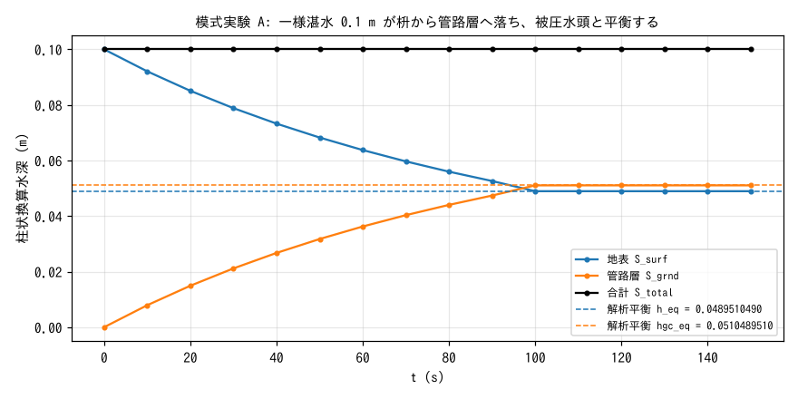
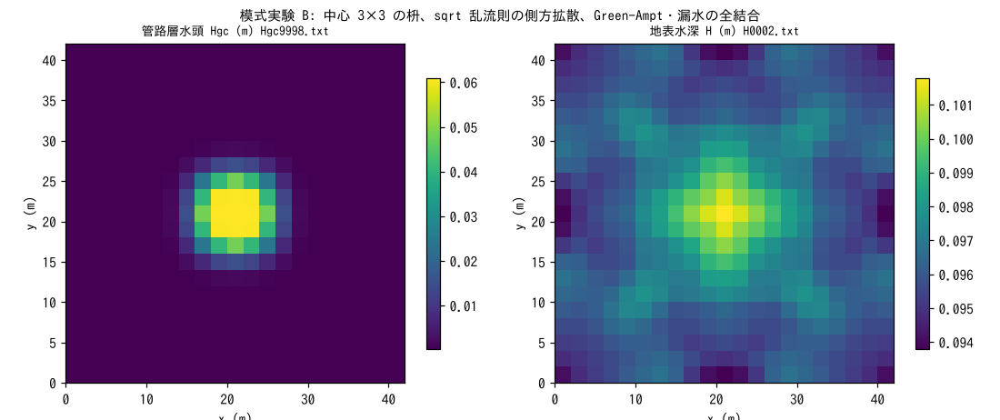

# test/conduit — 管路連続体層(f_gwconduit)の解析平衡と全結合の対称性

下水道網・岩盤亀裂網・農地暗渠などのサブグリッド管路網を等価な連続体
として表す**管路連続体層**(`&list_gwflow` の `f_gwconduit = 1`、
[ユーザーガイドの地下水の章](../../docs/users_guide/gwflow.md#管路連続体層f_gwconduit1list_gwflow_conduit))
の検証ケースです。2 つの模式実験からなります(developer.md §46)。

- **模式実験 A**(`param.txt`): 一様湛水が枡から管路層へ落ち、満管後に
  被圧水頭が立ち上がって地表水位と平衡する。側方流なしで全セルが同じ
  常微分方程式に従うため、**平衡値が解析的に決まり**、画面の S_surf /
  S_grnd がそれに表示全桁で一致することを確かめる。reference あり。
- **模式実験 B**(`param_lat.txt`): 枡を中心 3×3 セルだけにし、管路層内の
  sqrt 乱流則の側方拡散、Green-Ampt 鉛直浸透、管路 ⇔ 土層の漏水・浸入水を
  すべて有効にして、全結合経路の質量保存と 8 方向等方性(点対称・転置
  対称)を確かめる。

## 構成

| 項目 | 模式実験 A | 模式実験 B |
|---|---|---|
| 領域・格子 | 42 m × 42 m、21 × 21 セル(Δx = 2 m)、平坦 z = 0、n = 0.05、四周壁 | 同左 |
| 初期条件 | 一様湛水 h₀ = 0.1 m | 同左 |
| 枡 | 全セル一様 `gwc_inlet = 0.01` 個/m²(100 m² に 1 個) | 中心 3×3 セルのみ(`data_conduit/inlet.txt`) |
| 管路層 | 容量 `gwc_cap = 0.05` m(柱状)、埋設深 2 m、不圧貯留係数 0.05、疑似スロット 0.001、側方通水なし | 側方 sqrt 乱流則(`f_gwc_fluxlaw = 2`)、コンダクタンスあり |
| 土層 | なし(不浸透地表) | Green-Ampt 浸透 + 管路 ⇔ 土層の漏水・浸入水 |
| 時間 | dt = 0.05 s、150 s(管路層は毎ステップ更新) | dt = 0.05 s、120 s |

模式実験 A の解析平衡: 管路水頭の底 zbot = z₀ − 2 = −2 m、管頂水位
hcrown = zbot + cap/sy = −1 m。平衡では地表水位 h が被圧水頭
hcrown + (hgc − cap)/slot_sy に等しく、かつ h + hgc = 0.1 m なので

  hgc_eq = 51.1/1001 = 0.0510489510… m、h_eq = 0.1 − hgc_eq = 0.0489510489… m

| ファイル | 内容 |
|---|---|
| `param.txt` / `param_lat.txt` | 模式実験 A / B |
| `data_conduit/inlet.txt` | B の枡密度分布(中心 3×3 のみ非ゼロ) |
| `Run.sh` / `Run_MPI.sh N` | A の回帰テスト(逐次 / MPI) |
| `Run_lat.sh` / `Run_lat_MPI.sh N` | B の実行(result_lat/) |
| `Fig.py` | 下の図 `figs/*.png` を描く |

## 実行

```bash
make
./Run.sh            # A: Log.txt を reference と比較(ULP = 1)
./Run_MPI.sh 4
./Run_lat.sh        # B: result_lat/ に出力(約 2.5 分)
./Run_lat_MPI.sh 4  # B の MPI。逐次とビット一致するのが規律
python3 Fig.py      # figs/equilibrium.png, figs/lateral.png(数表も表示)
```

## 図



地表 S_surf は枡の堰式 → オリフィス式の流入で減り、管路層 S_grnd が
増えて、約 100 s で両者が解析平衡値(破線)に達し、以後は振動なく
静止します。合計 S_total は 0.1 m のまま 14 桁不変です。平衡到達後に
振動が出ないのは、満管時の流入量を平衡条件で制限する eq_inflow の
働きです(§46.4)。



左: 最終時刻(120 s)の管路層水頭 Hgc。中心 3×3 の枡から入った水が
sqrt 乱流則の 8 方向コンダクタンスで放射状に広がり、中心は容量 0.05 m
を超えて被圧しています(最大 0.06 m)。分布は点対称・転置対称が誤差 0.0
(ビット厳密)で、ENC の 8 方向配分の等方性を示します。右: 同時刻の
地表水深 H。枡へ向かう地表流と、被圧した中心からの浸入水・漏水の
やり取りで 0.094〜0.101 m のゆるい起伏ができています。

## 所見

| 量 | 計算値 | 解析値 |
|---|---|---|
| A: S_surf(150 s) | 0.04895104895105 m | h_eq = 0.04895104895105 m |
| A: S_grnd(150 s) | 0.05104895104895 m | hgc_eq = 0.05104895104895 m |
| A: S_total | 0.10000000000000 m で全時刻不変 | 0.1 m |
| B: S_total | 0.10000000000000 m で不変(120 s) | — |
| B: Hgc の点対称・転置対称 | 最大偏差 0.0 | — |

- 模式実験 A は、枡の流入則(堰 → オリフィス)、満管後の疑似スロット
  被圧枝、地表との平衡という管路層の基本動作が、解析平衡に**表示全桁で**
  一致することの確認です。
- 模式実験 B は、側方拡散・鉛直浸透・漏水・浸入水のすべてを同時に
  働かせても質量が保存され、分布が厳密に対称であることの確認です。
  MPI np = 1, 2, 4 の Log は逐次と完全一致します(§46.4)。
- リスタート往復(75 s で保存 → 復元して 150 s まで)が一気通しとビット
  一致することも §46.4 で確認しています。
- 実地への展開例は [examples/qanat](../../examples/qanat/)(横坑集水)と
  [examples/sewer_hybrid](../../examples/sewer_hybrid/)(都市下水道)
  です(§46.5: 幹線・横坑は管路層の単一インスタンス内のセル別マップ
  不均質で表す)。

## 関連文書

- [docs/users_guide/gwflow.md](../../docs/users_guide/gwflow.md) — 管路連続体層のパラメータ(容量・埋設深・貯留係数・枡・流束則・吐口)
- developer.md §46(設計・検証記録・拡張方針)
