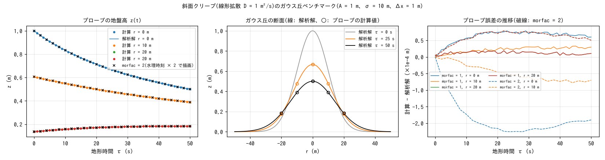

# test/creep — 斜面クリープ(線形拡散)のガウス丘ベンチマーク

地形変化モジュールの斜面クリープ(`&list_geomorph` の `f_creep = 1`、
[ユーザーガイドの地形変化の章](../../docs/users_guide/geomorph.md))を、
等方線形拡散 ∂z/∂t = D∇²z の解析解で検定します。水は置かず(h₀ = 0、
降雨なし)、地形変化だけが動くケースです。あわせて、地形更新だけを
加速する係数 **morfac** について、morfac = 2 × 25 s が morfac = 1 × 50 s
と同じ地形を与えること(MORFAC 方式の等価性)を確かめます
(developer.md §19 の地形変化モジュールの実装)。reference との比較ではなく
解析解との比較で合否を判定する、環境非依存のテストです。

## 構成

| 項目 | 値 |
|---|---|
| 領域・格子 | 101 m × 101 m、101 × 101 セル(Δx = 1 m)、四周壁 |
| 初期地形 | ガウス丘 z = A exp(−r²/2σ²)、A = 1 m、σ = 10 m(user_geoinfo `gaussian_hill`。中心セル (51, 51)) |
| クリープ | 拡散係数 D = 1 m²/s、毎ステップ更新(dts = dt = 0.1 s)。陽解法の安定条件 D dts (1/dx² + 1/dy²) ≤ 1/2 → dts ≤ 0.25 s |
| 時間 | dt = 0.1 s、50 s(`param.txt`、morfac = 1)/ 25 s(`param_morfac2.txt`、morfac = 2。地形時間は同じ 50 s) |
| 計測 | プローブ 4 点: 丘の中心 r = 0、x 方向 r = 10, 20 m、y 方向 r = 20 m。1 s 毎に z を記録 |

解析解(地形時間 τ = 水理時刻 × morfac):

  z(r, τ) = A σ² / (σ² + 2Dτ) · exp(−r² / (2(σ² + 2Dτ)))

τ = 50 s で σ² + 2Dτ = 200 m² となり、丘の高さは 1 m → 0.5 m、幅は √2 倍に
広がります。

| ファイル | 内容 |
|---|---|
| `param.txt` / `param_morfac2.txt` | morfac = 1(50 s)/ morfac = 2(25 s) |
| `Check_analytic.py` | プローブ CSV の z(t) を解析解と比較し、最大絶対誤差 < 5e-3 m で PASS |
| `Fig.py` | 下の図 `figs/profile.png` を描く |

A・σ・D・中心セルは `param.txt`、`src/user_geoinfo.f90` の
`gaussian_hill`、`Check_analytic.py` の 3 箇所で対になっています。
変えるときは同時に変えてください。

## 実行

```bash
make
./Run.sh          # 2 ケースを実行し、Check_analytic.py で解析解と比較(両方 PASS で PASS)
./Run_MPI.sh 4
python3 Fig.py    # figs/profile.png
```

## 図



左: プローブの地盤高 z(t)(点)と解析解(線)。4 点とも線の上に乗り、
morfac = 2 の結果(×。水理時刻を 2 倍して地形時間で描画)も同じ曲線に
重なります。中: 解析解の断面(τ = 0, 25, 50 s)とプローブの計算値(○)。
右: 計算 − 解析解の推移。morfac = 1 では最大 7.9e-5 m(丘の高さの
0.008%)、morfac = 2 では 2.3e-4 m で、いずれも時間離散化 O(dts) の
範囲です(morfac は実効時間刻みを 2 倍にするので誤差も約 3 倍)。

## 所見

| ケース | 最大絶対誤差(4 プローブ) | 判定(許容 5e-3 m) |
|---|---|---|
| morfac = 1、50 s | 7.76e-5 m(r = 0)、3.3e-5(r = 10)、1.9e-5(r = 20) | PASS |
| morfac = 2、25 s | 2.29e-4 m(r = 0)、7.6e-5(r = 10)、7.9e-5(r = 20) | PASS |

- クリープは 4 近傍の保存形フラックス(5 点ラプラシアン)で、等方線形
  拡散に厳密に整合するため解析解と直接比べられます。x 方向と y 方向の
  r = 20 m のプローブが同じ値になること(等方性)も確認できます。
- 土砂体積は反対称フラックスの集計により機械精度で保存されます。
- morfac の等価性は、「1 回の計算 = morfac 回の同一イベント分の地形
  変化」という解釈の根拠です。差は O(dts) の時間離散化だけです。
- このケースは将来 8 近傍化する際の検出器でもあります: 重みの正規化を
  誤ると実効拡散係数が D からずれ、解析解との比較で直ちに現れます
  (§19)。
- MPI np = 1, 2, 4 のプローブ CSV は逐次とビット一致します(§19 の検証記録)。

## 関連文書

- [docs/users_guide/geomorph.md](../../docs/users_guide/geomorph.md) — `f_creep`、`creep_d`、`morfac`、`dt_geomorph`
- developer.md §19(地形変化モジュールの実装: morfac・クリープ・安定条件・検証記録)
