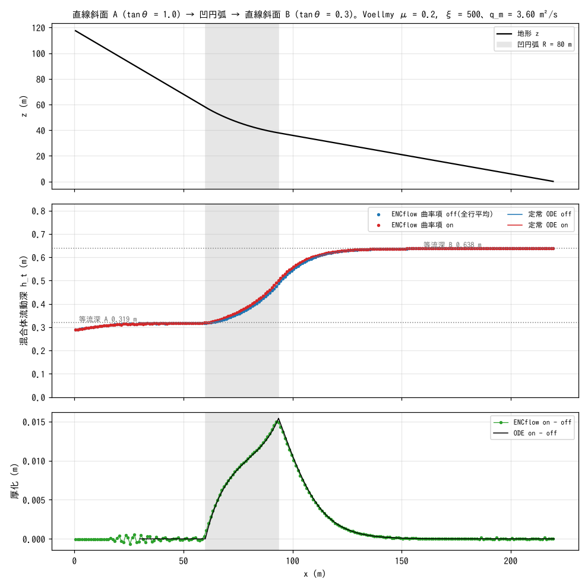

# test/curvature — 土石流・雪崩の曲率項(f_dbcurv)の定常 1 次元検定

斜面の凹円弧で遠心加速度が降伏摩擦を増やす**曲率項**(`&list_geomorph`
の `f_dbcurv = 1`。土石流・雪崩・火砕流などの混合体流動 f_debris 系で
使う)の検証ケースです(developer.md §28.10)。直線斜面 A → 凹円弧 →
直線斜面 B の 1 次元地形に混合体を定常流入させ、Voellmy 抵抗則の定常流を
曲率項 off / on で比べます。基準は、水平座標系・Ni 補正・圧力・移流・
Voellmy・曲率項を含む**定常 1 次元常微分方程式(ODE)の数値積分**で、
reference 比較ではなく `Check_curvature.py` の自己検定で合否を決めます
(test/volcano と同じ型)。

## 構成

| 項目 | 値 |
|---|---|
| 地形 | 直線斜面 A(tanθ = 1.0、x ≤ 60 m)→ 半径 80 m の凹円弧(両斜面に接する)→ 直線斜面 B(tanθ = 0.3)。東端 x = 220 m で z = 0(`make_init.py` が `zinit.txt` を生成) |
| 格子 | 220 m × 8 m、220 × 8 セル(Δx = 1 m)。`p_diagratio = 0`(1 次元性を保つ) |
| 流入 | 西端の 8 セルから一定流入 16 m³/s、土砂濃度 0.8 → 単位幅の混合体流量 q_m = 3.6 m²/s |
| 流動則 | `f_debris = 1`、`f_dbed = 0`(河床との交換なし = 等価流体)、`f_dbres = 4` Voellmy(μ = 0.2、ξ = 500 m/s²)、停止速度 0.05 m/s |
| 境界 | 東辺は自由流出(斜面 B の射流をそのまま通す) |
| 時間 | dt = 0.02 s、80 s(定常に達する)。最終状態を `save_off/` / `save_on/` の `state.dat` に保存 |

定常 1 次元 ODE(水平座標系。q_m = u h_t 一定):

  (g_e − u²/h_t) dh_t/dx = g_e(−z′ − μF) − g_e u²/(ξ h_t)、
  g_e = g/(1 + z′²)、F = 1 + a_c/√(g g_e)、a_c = u² z″/√(1 + z′²)

F が曲率項で、off では F = 1 です。直線部では z″ = 0 なので曲率項は
消え、両構成とも Voellmy の等流深 h_n = (q_m²/(ξ (tanθ − μ)))^{1/3}
(A: 0.319 m、B: 0.638 m)に収束します。

| ファイル | 内容 |
|---|---|
| `param_on.txt` / `param_off.txt` | 曲率項あり / なし(`f_dbcurv` 以外同一) |
| `make_init.py` | 地形 `zinit.txt` の生成(定数は Check と対) |
| `Check_curvature.py` | `state.dat` から全行平均の流動深 h_t(x) を読み、(1) 等流 A、(2) 等流 B と on/off 差、(3) 円弧上の ODE との一致、(4) 厚化 on − off の ODE 比を判定 |
| `Fig.py` | 下の図 `figs/profile.png` を描く(Check の関数を借りるため検定の出力も表示) |

## 実行

```bash
make
./Run.sh          # zinit.txt 生成 → off → on を実行 → Check_curvature.py(PASS/FAIL)
./Run_MPI.sh 4    # MPI。save_*/state.dat が逐次とバイト一致するのが規律
python3 Fig.py    # figs/profile.png
```

## 図



上: 地形。灰色の帯が凹円弧の区間(x = 60〜94 m)です。中: 定常の混合体
流動深 h_t(全行平均)。点が ENCflow(青 off、赤 on)、線が定常 ODE
です。直線部ではどちらも Voellmy の等流深に乗り、円弧で A の等流深
から B の等流深へ遷移します。ENC の遷移は ODE よりわずかに上流側で
立ち上がりますが、円弧上の平均は ODE に 1% 以内で一致します。下: 曲率項
による厚化 on − off。円弧上で遠心加速度が降伏摩擦を増やし、流れが
減速・厚化します。ENCflow の差(緑)と ODE の差(黒)が円弧の全区間で
重なり、下流への減衰の形も一致します。

## 所見

| 検定項目 | 計算値 | 基準 | 判定 |
|---|---|---|---|
| (1) 等流 A の <h_t>(off / on) | 0.3165 m | 等流深 0.3188 m(−0.7%、許容 5%) | PASS |
| (2) 等流 B の <h_t>(off / on) | 0.6375 m | 等流深 0.6376 m(−0.02%) | PASS |
| (2′) 直線部の on/off 差 | 0.00% | < 1%(曲率項は z″ = 0 で消える) | PASS |
| (3) 円弧上の <h_t>(off / on) | 0.3881 / 0.3983 m | ODE 0.3844 / 0.3945 m(+0.9〜1.0%、許容 10%) | PASS |
| (4) 円弧上の厚化 on − off | 0.0103 m | ODE 0.0100 m(比 1.02、許容 0.7〜1.4) | PASS |

- 曲率項の効果(厚化 1 cm、3%)は小さいものの、ODE の差と 2% で一致し、
  実装が定式どおりであることを示します。効果が小さいのは、この構成の
  遠心加速度 u²/R ≈ 1.6 m/s² が重力の 16% 程度で、Voellmy の速度依存項が
  支配的なためです。
- 行平均で比べるのは、Voellmy 等流が横断方向に一様にならないことがある
  ためですが、§28.11 の修正(降伏停止判定を辺の速さで行う)後は斜面 B の
  行間のばらつきが 0.0% になっています。
- 設計の経緯(§28.10): 当初の「土塊を円弧に放出して Coulomb 質点の停止
  位置と比べる」設計は、変形する土塊が質点として振る舞わない(前縁の
  減速と積み上がりで散逸する)ため成立せず、定常流入の差分比較に改めました。
- MPI np = 2, 4 で `state.dat` が逐次とバイト一致(両構成)。

## 関連文書

- [docs/users_guide/geomorph.md](../../docs/users_guide/geomorph.md) — 混合体流動(f_debris)、抵抗則 `f_dbres`、曲率項 `f_dbcurv`
- developer.md §28.10(曲率項の設計・検証・経緯)、§28.11(降伏停止判定の修正)
- 同型の自己検定: [test/volcano](../volcano/)(Voellmy 等流の 1 次元ベンチマーク)
