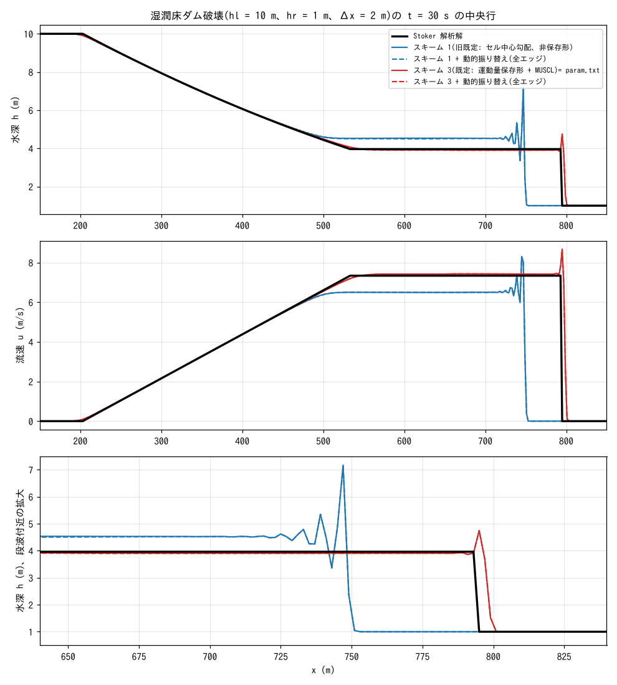
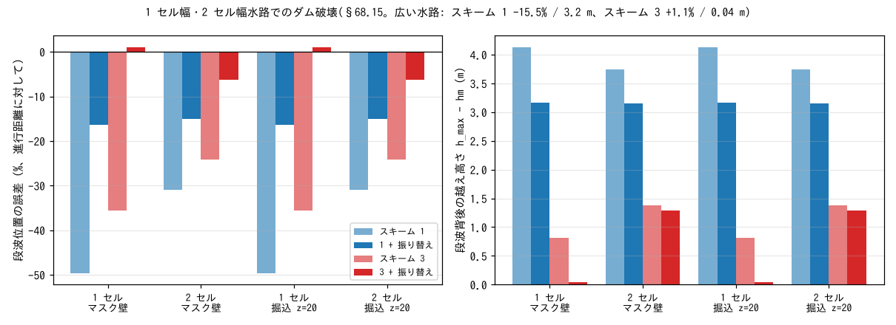

# test/dambreak — 湿潤床のダム破壊(Stoker 解析解による移流スキームの検証)

段波(不連続)の速度と背後の状態が解析的に分かる、Stoker (1957) の湿潤床
ダム破壊問題です。移流項の離散化の良否がそのまま段波の位置と波形に
現れるため、ENCflow の移流スキーム(`f_advection_scheme`)の判定基準
として設計されました(developer.md §68.4)。運動量保存形スキーム 2・3 の
導入(§68.6)、1 セル幅河道の通水能問題と動的振り替え(§68.15)、
乾いた高い地盤への漏れを止める f_dry_head_cap(§68.16)は、いずれも
このケースで定量化・判定しています。

## 構成

| 項目 | 値 |
|---|---|
| 領域・格子 | 1000 m × 400 m、500 × 200 セル(Δx = Δy = 2 m) |
| 地形・粗度 | 平坦 z = 0、無摩擦、四周とも壁 |
| 初期条件 | x < 500 m で h = 10 m、x ≥ 500 m で h = 1 m(user_initial `dambreak_step`)、流速 0 |
| 時間刻み | dt = 0.05 s、30 s(Cn ≈ 0.35)。10 s 毎に h と u を出力 |
| 解析解(t = 30 s) | 中間状態 hm = 3.962 m、um = 7.337 m/s、段波速度 s = 9.814 m/s、段波位置 x = 794.4 m、希薄波頭 x ≈ 203 m(いずれも壁に達しない) |

幅 400 m は、側壁の影響(壁沿いの前線遅れ)が 30 s の間に中央行へ届かない
幅として選んでいます(当初の 40 m では中央行の段波速度が 8% 遅く評価
された。§68.4)。ny = 200 は MPI np = 4 の帯最低 2 行を満たします。

| ファイル | 内容 |
|---|---|
| `param.txt` | 基準ケース(reference あり)。`&list_enc` は重力補正・超過流出抑制・hcap = 1、風上係数 0.5、適応 RK 閾値 1.5 を明示。移流スキームは書いていないので**現行の既定(3: 運動量保存形 + MUSCL)** |
| `param_scheme1.txt` | `f_advection_scheme = 1`(旧既定のセル中心勾配スキーム。非保存形)。比較用 |
| `param_scheme3.txt` | `f_advection_scheme = 3` を明示したもの。既定が 3 になったため `param.txt` と同じ結果 |
| `param_dyn_s1.txt` / `param_dyn_s3.txt` | スキーム 1 / 3 に `f_opening_dynamic = 2`(塞がれた開口の動的振り替えを全エッジに)を加えたもの。広い水路では壁沿い以外に効果はない |
| `Check_stoker.py` | 中央行を 1 次元プロファイルとして解析解と比較し、段波位置・hm・um の誤差、段波背後の越え高さ、L1 誤差、行間偏差を表示。`stoker.csv` を書く(合否判定なし。回帰は Log.txt) |
| `Make_incised.py` | 1 セル幅・2 セル幅水路のダム破壊(§68.15)の地形・マスク・パラメータを生成 |
| `Plot_dambreak.plt` / `Plot_dambreak.py` | 対話表示・簡易図化(従来のスクリプト) |
| `Fig.py` | 下の図 `figs/*.png` を描く |

## 実行

```bash
make
./Run.sh                   # 逐次。Log.txt を reference と比較し、続けて Check_stoker.py を実行
./Run_MPI.sh 4             # MPI 4 ランク。逐次と同じ Log になるのが規律

# 移流スキームと動的振り替えの比較(結果は result_<名前>/ に)
for p in param_scheme1 param_dyn_s1 param_dyn_s3; do
  ./encflow $p.txt
  RESDIR=$(grep dir_result $p.txt | sed "s/.*'\(.*\)'.*/\1/") PARAM=$p.txt python3 Check_stoker.py
done

# 1 セル幅・2 セル幅水路(§68.15)。24 ケースを生成して実行
python3 Make_incised.py
for p in param_m[12]_*.txt param_ch[12]_*.txt; do
  ./encflow $p
  RESDIR=$(grep dir_result $p | sed "s/.*'\(.*\)'.*/\1/") PARAM=$p python3 Check_stoker.py
done

python3 Fig.py             # figs/profile.png, figs/incised.png
```

Check_stoker.py の段波位置は「h が (hm + hr)/2 を横切る位置」、hm・um は
解析的な平坦区間の中央 50% の平均、越え高さは段波背後の h の最大 − hm です。
hl・hr・段差位置は `src/user_initial.f90` の `dambreak_step` と同期して
います。

## 図



上・中: t = 30 s の中央行の水深 h と流速 u。黒が Stoker 解析解です。
既定のスキーム 3(赤)は希薄波・中間状態・段波のすべてで解析解に
重なり、段波位置の誤差は +1.3%(進行距離に対して。1.8 セル)です。
旧既定のスキーム 1(青)は段波が 15% 遅く、中間状態の水深が 14% 高く
流速が 11% 低い。非保存形の離散化では段波を横切る運動量流束が保存
されず、Rankine–Hugoniot の跳躍条件を満たさないためです。
下: 段波付近の拡大。スキーム 1 は段波背後に 2Δx の激しい振動
(h が 3.3 → 7.2 m)を伴い、スキーム 3 は前線の 1 セルに 0.8 m の
スパイクが立つだけで背後は平坦です(スパイクの原因は連続式のエッジ
水深 (h_c + h_n)/2 で、時間刻みや保護機構によらない空間離散化の性質。
§68.6)。動的振り替え(破線)は広い水路では実線と重なります。



同じ問題を、1 セル幅(ny = 5 の第 3 行)または 2 セル幅の水路に押し
込めたものです。堤内地は無効セル(マスク壁)または水面より高い乾燥セル
(掘込地形 z = 20 m)。左が段波位置の誤差、右が段波背後の越え高さです。
1 セル幅の水路では、斜め方向の交換相手がすべて壁になるため ENC の
8 方向配分のうち斜め分の通過幅が使えず、振り替えなしでは段波が
スキーム 1 で −50%、スキーム 3 で −36% と大きく遅れます。
動的振り替え(`f_opening_dynamic = 2`)で塞がれた通過幅を軸エッジに
振り替えると、1 セル水路の値は広い水路の値(−16% / +1.1%)に戻ります。
2 セル水路ではスキーム 3 + 振り替えでも −6% が残ります(各セルが
片側だけ壁に接する幾何で横断方向の運動量交換が非対称になるため。
未解析、handoff)。マスク壁と掘込地形は全組合せで桁まで同じ値です。

## 所見

広い水路(`param.txt` の格子)、t = 30 s、中央行:

| 設定 | 段波位置 | hm | um | 背後の越え高さ | L1(h) | L1(u) |
|---|---:|---:|---:|---:|---:|---:|
| スキーム 3(既定、`param.txt`) | +1.25% | −1.2% | +1.2% | 0.01 m | 0.006 | 0.021 |
| スキーム 3 + 振り替え 2 | +1.25% | −1.5% | +1.2% | 0.00 m | 0.006 | 0.021 |
| スキーム 1(旧既定) | −15.45% | +14.3% | −11.4% | 3.21 m | 0.051 | 0.171 |
| スキーム 1 + 振り替え 2 | −15.45% | +13.8% | −11.5% | 3.21 m | 0.050 | 0.171 |

1 セル・2 セル水路(段波位置の誤差 / 越え高さ。マスク壁と掘込地形は同値):

| 水路 | スキーム 1 | 1 + 振り替え | スキーム 3 | 3 + 振り替え |
|---|---|---|---|---|
| 1 セル | −49.7% / 4.12 m | −16.4% / 3.16 m | −35.6% / 0.81 m | **+1.1% / 0.05 m** |
| 2 セル | −30.9% / 3.74 m | −15.0% / 3.15 m | −24.2% / 1.38 m | −6.3% / 1.28 m |

- **段波の速度が正しく出ること**が運動量保存形スキーム(2・3)を既定に
  した根拠です。スキーム 1 では限定器を正しくしても(§68.5)段波の遅れと
  背後の振動は残り、離散化の構造(非保存形 + 両側平均の平滑化)の限界で
  あることがこのケースで確認されました。
- 1 セル水路 + 振り替えで広い水路の値に戻ることは、1 セル幅の河道を
  ラスタのまま流す ENC の使い方(tutorials/chichibu)の裏付けです。
- `f_dry_head_cap`(既定 1)により、掘込地形の乾いた高い堤内地はマスク壁と
  厳密に等価に扱われます。導入前は、掘込地形のスキーム 1 と 2 セル水路の
  スキーム 3 が「水面より高い乾燥セルへ水が登る」漏れで発散していました
  (§68.15〜16)。Make_incised.py が生成する `_c1` 付き(cap = 1 明示)の
  ケースは、既定が 1 になったため無印と同じ結果です。
- 回帰テストの規律: 逐次の Log.txt が reference に一致(Runge 列を除き
  ULP = 1)、MPI np = 1, 2, 4 も同一であること。reference の更新は結果の
  妥当性を確認してから(CLAUDE.md)。
- 計算時間の目安(4 スレッド): 基準ケース 12 s。

## 関連文書

- developer.md §68.4(設計と基準値)、§68.5(限定器の修正)、§68.6
  (運動量保存形移流)、§68.15(1 セル・2 セル水路)、§68.16(f_dry_head_cap)
- [docs/users_guide/swflow.md](../../docs/users_guide/swflow.md) —
  `f_advection_scheme`、`f_opening_dynamic`、`f_dry_head_cap` の説明と使い分け
- 参考文献: Stoker, J. J. (1957) *Water Waves*; Stelling & Duinmeijer (2003)
  の運動量保存形スタガード格子スキーム(スキーム 2・3 の原型)
