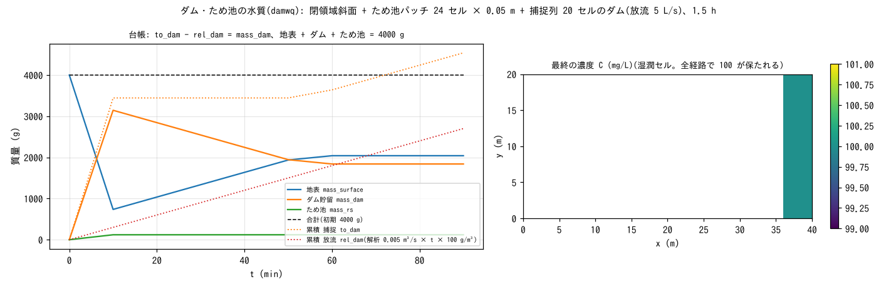

# test/damwq — ダム(完全混合)とため池の水質台帳: 解析解との全桁一致

構造物モジュールのダム(捕捉列から取水し一定量を放流)とため池パッチ
(容量に達するまで吸収)に、水質の**完全混合プール**と**ため池同伴**を
結合した経路(developer.md §30.7)の検定です。閉領域斜面に初期濃度
100 mg/L の水 0.05 m(総質量 4000 g)を置き、1.5 時間で

- 質量の閉合: mass_surface + mass_dam + mass_rs = 4000 g、to_dam − rel_dam = mass_dam
- 解析解: 放流質量 rel_dam = 0.005 m³/s × 5400 s × 100 g/m³ = 2700 g、
  ため池 to_rs = mass_rs = 容量 1.2 m³ × 100 g/m³ = 120 g
- 濃度の一様性: 捕捉 → 完全混合 → 放流・ため池吸収の全経路で C = 100 mg/L

を reference 比較と `Check_damwq.py` で確かめます。

## 構成

| 項目 | 値 |
|---|---|
| 領域・格子 | 40 × 20 セル(`z.txt` の閉領域斜面)、初期 h₀ = 0.05 m、四周壁 |
| 構造物 | ダム: 捕捉列 20 セルから取水し一定量 5 L/s を放流。ため池: パッチ 24 セル × 0.05 m(`rscap.txt`、i = 15〜18, j = 8〜13) |
| 水質 | 初期濃度 `wq_c0 = 100` mg/L、減衰・地下水なし |
| 時間 | dt = 0.1 s、5400 s |

| ファイル | 内容 |
|---|---|
| `Run.sh` | Log.txt・wq.csv を reference と比較(ULP = 0)→ `Check_damwq.py closure` → `uniform` |
| `Check_damwq.py closure|uniform` | 台帳の閉合(相対 1e-6)と各経路の活性 / 最終 C 場の湿潤セルが 100 ± 0.1 |
| `Fig.py` | 下の図 `figs/damwq.png` |

## 実行

```bash
make
./Run.sh
./Run_MPI.sh 4
python3 Fig.py    # figs/damwq.png
```

## 図



左: 台帳の時系列。最初の 10 分で斜面の水がダムの捕捉列に集まり
(to_dam が 3450 g まで急増)、ため池は容量 1.2 m³ 分の 120 g を吸収して
満杯のまま止まります。ダムの貯留質量は一定の放流(rel_dam、点線 =
解析解の直線)で減り、放流された水が地表に戻って地表の質量が増えます。
50 分以降は放流水が再び捕捉列へ届いて to_dam が再び増え、地表の質量は
2000 g 付近で平衡します。合計は 4000 g で不変です。右: 最終の濃度分布。
斜面(ダムの放流水)もダム下流も 100 mg/L で、濃度は全経路で保たれています。

## 所見

| 検定 | 計算値 | 解析値 | 判定 |
|---|---|---|---|
| 放流質量 rel_dam(5400 s) | 2700.0000 g | 2700 g | 全桁一致 |
| ため池 to_rs = mass_rs | 120.00000 g | 120 g | 全桁一致 |
| to_dam − rel_dam = mass_dam | 4539.4250 − 2700.0000 = 1839.4250 g | mass_dam 1839.4250 | 一致 |
| 総質量 | 4000.0000 g | 4000 g | PASS |
| 最終濃度(湿潤セル) | 100.0000 mg/L | 100 | PASS |

- 完全混合プールの放流濃度が入力濃度に一致する系の厳密解に、台帳が
  出力全桁で一致します。
- ダムの貯留質量 M はリスタートで save / restore され、復元後の
  mass_dam が連続ランと全桁一致します(§30.7)。
- 構造物の設定は [docs/users_guide/structure.md](../../docs/users_guide/structure.md)
  (ダム・ため池・ポンプ・カルバート)。

## 関連文書

- [docs/users_guide/wq.md](../../docs/users_guide/wq.md)、[docs/users_guide/structure.md](../../docs/users_guide/structure.md)
- developer.md §30.7(ダム完全混合・ため池同伴の実装と検証)
