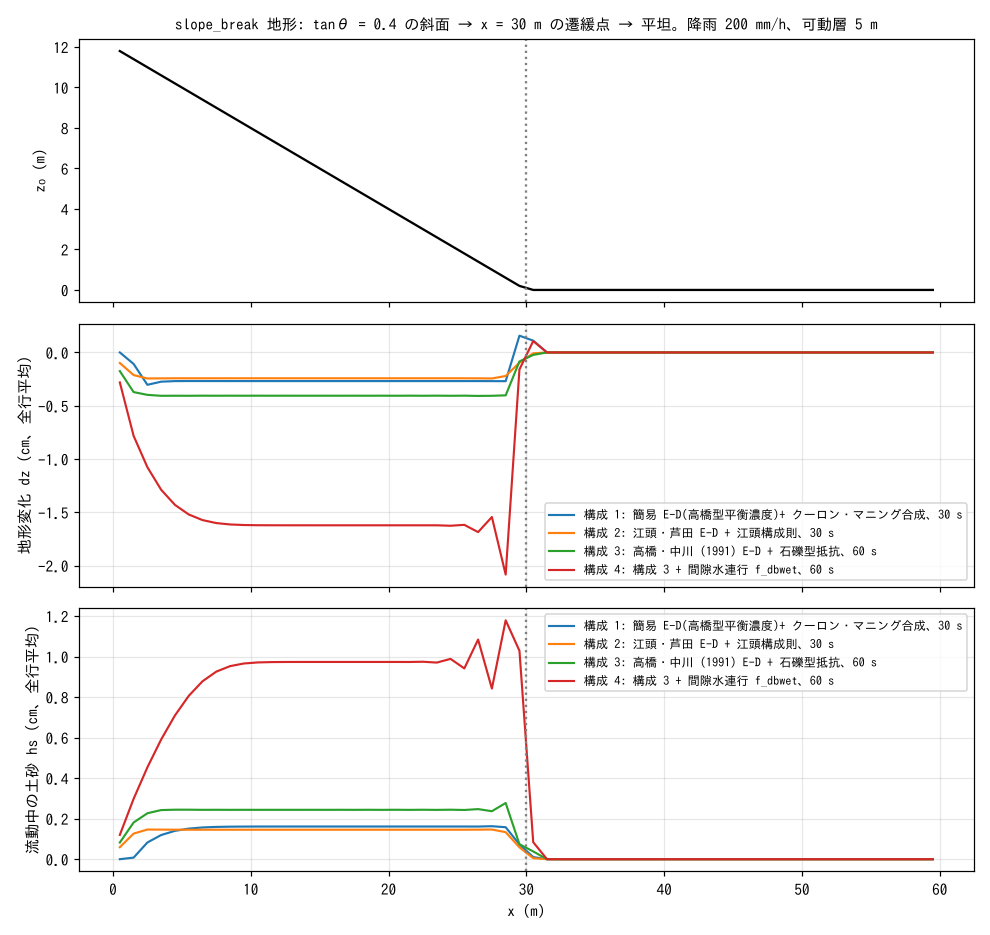
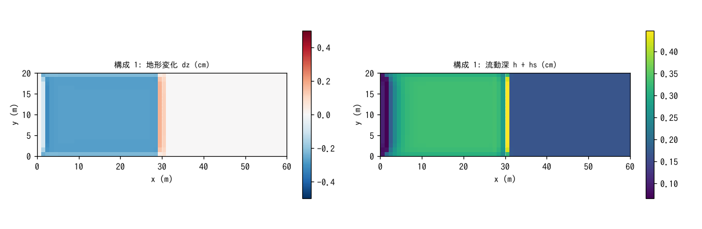

# test/debris — 土石流(侵食・堆積 E-D)の疎通と保存則: 4 つの構成則

単層混合体方式の土石流モデル(`f_debris = 1`。地表水 h と土砂柱状量 hs の
単層で表し、河床との侵食・堆積 E-D と抵抗則を切り替える。
docs/debris_plan.md、developer.md §28)の疎通・保存則の検定です。
slope_break 地形(tanθ = 0.4 の斜面 → x = 30 m の遷緩点 → 平坦)に
200 mm/h の降雨を与え、斜面で侵食した土砂が遷緩点下へ運ばれる過程を
4 つの構成則の組合せで走らせます。定量ベンチマークではなく、
**固体総量の保存・共動更新の恒等・活性(侵食が起き土砂が到達する)**を
`Check_debris.py` で検定します(§28.3、§28.5〜7)。

## 構成

共通: 60 m × 20 m(Δx = 1 m)、可動層 sd₀ = 5 m、空隙率 λ = 0.4(C* = 0.6)、
降雨 200 mm/h、dt = 0.02 s、四周壁(閉領域 = 台帳が閉じる)。

| 構成 | ファイル | E-D 式 `f_dbed` | 抵抗則 `f_dbres` | 時間 | 検定モード |
|---|---|---|---|---|---|
| 1 | `param.txt` | 1: 高橋型平衡濃度 C∞(θ) への緩和(δe = 0.0007、δd = 0.05) | 1: クーロン + マニング合成(φ = 35°) | 30 s | 既定 |
| 2 | `param_eg.txt` | 2: 江頭・芦田 (1992) | 2: 江頭構成則(d50 = 0.05 m、反発係数 0.85) | 30 s | eg |
| 3 | `param_tk.txt` | 3: 高橋・中川 (1991) 式 (12)(27) | 3: 石礫型 式 (22)〜(25) | 60 s | eg |
| 4 | `param_tkwet.txt` | 3 + 間隙水連行 `f_dbwet = 1`(渓床飽和 s_b) | 3 | 60 s | wet |

検定項目: (1) 固体総量保存 |Σhs + (1 − λ)Σ(z − z₀)| < 1e-9(E-D の反対称
交換の帰結)、(2) 共動更新の恒等 max|(sd − sd₀) − (z − z₀)| < 1e-10(z と
土層厚 sd が同じ量だけ動く)、(3) 活性: 斜面侵食 min dz < −1e-3 m かつ
平坦部への土砂到達(構成 1 は遷緩点下の堆積 max dz、eg モードは max hs)、
(4) wet モードのみ水台帳 |Σh − 降雨総量 + λ s_b Σdz| < 1e-9(連行した
間隙水の分だけ地表水が増える)。

| ファイル | 内容 |
|---|---|
| `Check_debris.py <save> [eg|wet]` | 上記の検定(`save*/state.dat` を読む) |
| `Fig.py` | 下の図 `figs/*.png` |

## 実行

```bash
make
./Run.sh          # 4 構成を順に実行し、それぞれ Check。すべて PASS で PASS(数秒)
./Run_MPI.sh 4    # MPI。state.dat が逐次とバイト一致(-O2 厳密数学ビルドで)
python3 Fig.py    # figs/profile.png, figs/map.png
```

## 図



上: 地形。中: 地形変化 dz(全行平均、cm)。どの構成でも斜面全体が
薄く侵食され(構成 1〜3 で 0.2〜0.4 cm、構成 4 で 1.6 cm)、遷緩点の
直前で侵食が強まり、構成 1 では遷緩点直下に堆積(+0.2 cm)が現れます。
下: 流動中の土砂 hs(cm)。斜面上に一定の濃度で運ばれ、遷緩点を越えた
平坦部では急減します(希薄なシート流では θ_e ≈ 0 のため平坦部の堆積は
遅く、短時間の検定では hs の到達を活性の証拠とします)。構成 4 の
間隙水連行は、侵食した河床の間隙水を流れに加えるため地表水が増え
(Σh 4.0 → 7.5 m·cell)、流速と侵食がさらに増す正のフィードバックが
見えます(侵食 −0.44 → −2.2 cm)。



構成 1 の地形変化(左)と流動深(右)。横断方向に一様な侵食と、遷緩点
直下 1〜2 セルの堆積帯、平坦部の薄い水膜が見えます。

## 所見

| 構成 | 固体総量 Σhs + (1 − λ)Σdz | 共動更新 | 活性(min dz / 到達) | 水台帳 |
|---|---|---|---|---|
| 1 | −1.8e-13 | 7e-14 | −0.32 cm / 遷緩点下堆積 +0.18 cm | — |
| 2 江頭 | 7e-13 | 9e-14 | −0.25 cm / max hs 0.15 cm | — |
| 3 高橋・中川 | 2.2e-13 | 7e-14 | −0.44 cm / max hs 0.09 cm | — |
| 4 + 間隙水連行 | 2.2e-13 | 9e-14 | −2.2 cm / max hs 1.1 cm | 1.1e-13 |

- 固体総量と共動更新は 4 構成とも機械精度で成り立ちます。E-D の
  交換量は時刻 n の場から 2 パスで求めて適用する構造(§28.2 の OpenMP
  競合の実バグの教訓)で、np = 1, 2, 4 の state.dat は逐次とバイト一致
  します(-O2 厳密数学ビルド。-Ofast ではビルド間に ULP 差。§28.5)。
- このケースは**疎通と保存則**の検定です。構成則の定量的な妥当性は
  文献照合の残作業として debris_plan.md に記録されています(未成熟
  土石流域の係数、掃流状域の堆積式など)。
- 瞬時流動化(f_release)と斜面安定判定(f_slide)は [test/slide](../slide/)、
  等価流体モード(交換なし)は [test/volcano](../volcano/) で検定します。

## 関連文書

- [docs/users_guide/geomorph.md](../../docs/users_guide/geomorph.md) — 土石流の設定(`f_dbed`、`f_dbres`、`f_dbwet`、停止 `f_dbstop`)
- [docs/debris_plan.md](../../docs/debris_plan.md) — 設計全文と文献照合の残作業
- developer.md §28.1〜28.7(構成、実バグ、検証記録、江頭・高橋中川則、間隙水連行)
