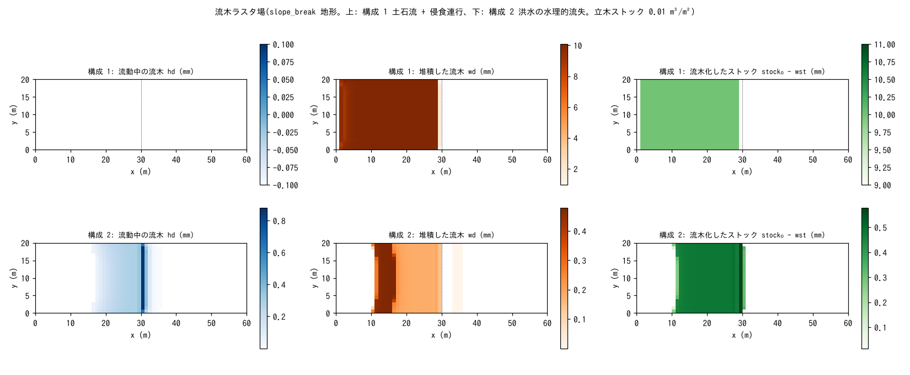

# test/driftwood — 流木ラスタ場(fn_driftwood)の疎通・保存則・リスタート

流木を「立木ストック wst → 流動中 hd → 堆積 wd」の 3 つのラスタ場で表す
流木モジュール(`fn_driftwood`、[ユーザーガイドの流木の章](../../docs/users_guide/driftwood.md)、
developer.md §50)の検定です。発生の 2 経路(土石流の侵食連行、洪水の
水理的流失)をそれぞれ 1 構成で走らせ、材積保存・活性・遷緩点下への
到達を `Check_driftwood.py` で検定します。あわせてリスタートの分割継続と
既定値の同値検定を行います。

## 構成

共通: slope_break 地形(tanθ = 0.4 → x = 30 m から平坦)、60 m × 20 m
(Δx = 1 m)、降雨 200 mm/h、四周壁(閉領域 = 材積台帳が閉じる)、
立木ストック 0.01 m³/m²、代表直径 0.02 m、材比重 0.5(喫水 0.01 m)。

| 構成 | ファイル | 発生経路 | 時間 |
|---|---|---|---|
| 1 | `param.txt` | 土石流(`f_debris = 1`)の渓床侵食が根系深 `dw_droot = 2 mm` を超えると流木化(侵食連行)→ 混合体と同速で流下 → 低速凝集域で堆積 | 30 s |
| 2 | `param_flood.txt` | 地形変化なし。斜面シート流の水深・流速が閾値を超えると流失(水理的流失)→ 平坦部の湛水域で減速・堆積 | 60 s |
| 3 | `param_rt1.txt` → `param_rt2.txt` | 構成 1 を 15 s で保存し、復元して 30 s まで継続。通しの `save/` とバイト比較 | 15 + 15 s |
| 4 / 4′ | `param_min.txt` / `param_minx.txt` | `&list_driftwood` を空にした既定値の構成と、既定値を明示した構成のバイト一致(§62) | 60 s |

| ファイル | 内容 |
|---|---|
| `Check_driftwood.py <save> [stock0]` | (1) 材積保存 |Σhd + Σwd + Σwst − stock₀ nx ny| < 1e-9、(2) 活性: 流木化 > 1e-3 かつ堆積 > 1e-3 m·cell、(3) 到達: 平坦部(i ≥ 30)の max(hd + wd) > 0 |
| `Fig.py` | 下の図 `figs/driftwood.png` |

## 実行

```bash
make
./Run.sh          # 構成 1 → 2 → リスタート分割 → 既定値の同値。すべて通れば PASS(数秒)
./Run_MPI.sh 4    # MPI。state.dat・driftwood.dat が逐次とバイト一致(-O2 厳密数学ビルドで)
python3 Fig.py    # figs/driftwood.png
```

## 図



上段(構成 1): 土石流の侵食(約 3 mm)が根系深 2 mm を超え、斜面全域の
立木が流木化しています(右)。30 s の時点で流動中の流木はなく(左)、
全量が斜面上と遷緩点直上流に堆積しています(中。混合体の低速凝集域で
接地)。平坦部にはわずか(1.9 mm)が到達しています。
下段(構成 2): 水理的流失。斜面の下半分で立木が流失し(右)、遷緩点
直上の湛水の縁に流動中の流木が集まり(左)、斜面中腹と平坦部の湛水域
で減速して堆積しています(中)。

## 所見

| 構成 | 材積保存 | 流木化 / 堆積 (m·cell) | 平坦部到達 max(hd + wd) | 判定 |
|---|---|---|---|---|
| 1 土石流 + 侵食連行 | 0.0 | 5.60 / 5.60(全量堆積) | 1.9 mm | PASS |
| 2 洪水の水理的流失 | 3.0e-13 | 0.188 / 0.101 | 0.88 mm | PASS |
| 3 リスタート分割継続 | driftwood.dat・state.dat が通しとバイト一致 | | | PASS |
| 4 既定値の同値 | save_min と save_minx がバイト一致(stock₀ = 0.001 で (1)〜(3) も PASS) | | | PASS |

- 材積(ストック + 流動 + 堆積)は閉領域で機械精度で保存されます。
- 喫水は Braudrick & Grant (2000) の円柱浮力平衡の厳密解で求めます
  (sg = 0.5 では線形近似 hf = sg·D と一致するためこのケースの数値は
  不変。§50.4)。
- 流木は水理に片方向(流れ → 流木)で、家屋瓦礫 [test/bldgdebris](../bldgdebris/)
  との同時有効化でも流木台帳は不変です。
- MPI np = 1, 2, 4 は -O2 厳密数学ビルドで逐次とバイト一致します。
  -Ofast では逐次と MPI のビルド間に fast-math の ULP 差が出るため、
  `Run_MPI.sh` の逐次比較は警告扱いです(§50.3)。

## 関連文書

- [docs/users_guide/driftwood.md](../../docs/users_guide/driftwood.md) — 発生 2 経路、停止・再流動、パターン別の推奨値
- developer.md §50(設計・検証記録・文献照合)、§62(既定値)
