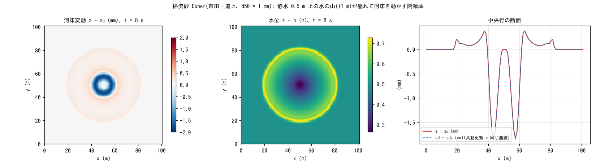

# test/fluvial — 掃流砂 Exner(f_fluvial)の疎通と保存則

河床変動の基本モジュール、掃流砂輸送 + Exner 方程式(`&list_geomorph` の
`f_fluvial = 1`、流砂量式は芦田・道上)の疎通・保存則の検定です
(developer.md §19、§20)。閉領域の静水の上に水の山(wave_hump、+1 m)を
置いて崩し、環状波の下で河床が動くことと、土砂体積の保存・共動更新の
恒等を `Check_fluvial.py` で確かめます。定量ベンチマーク(等流 × 給砂
平衡の解析解)は残作業として記録されています(§19)。

## 構成

| 項目 | 値 |
|---|---|
| 領域・格子 | 101 m × 101 m、101 × 101 セル(Δx = 1 m)、平坦 z₀ = 0、四周壁 |
| 初期条件 | 静水 h₀ = 0.5 m + 中央のコサイン型の山(+1 m、半径 15 m。`wave_hump`) |
| 土層 | 厚さ sd₀ = 10 m(床クリップが発火しない厚さ)、空隙率 0.4 |
| 流砂 | 芦田・道上式、d50 = 1 mm、限界無次元掃流力 0.05、水中比重 1.65、1 エッジ・1 更新の変動上限 0.05 m |
| 時間 | dt = 0.1 s、8 s(毎ステップ更新)。終了時に `save/state.dat` |

| ファイル | 内容 |
|---|---|
| `Check_fluvial.py <save>` | (1) 土砂体積保存 |Σ(z − z₀)| < 1e-9(反対称フラックスの帰結)、(2) 共動更新 max|(sd − sd₀) − (z − z₀)| < 1e-10、(3) 活性 max|z − z₀| > 1e-4 m |
| `Fig.py` | 下の図 `figs/fluvial.png` |

## 実行

```bash
make
./Run.sh          # 実行 → Check(1 秒)
./Run_MPI.sh 4    # MPI。state.dat が逐次とバイト一致するのが規律
python3 Fig.py    # figs/fluvial.png
```

## 図



左: 8 s 後の河床変動。山の崩れで流速が最大になる半径 5〜10 m の環で
最大 1.9 mm 洗掘され、その内側(中心)と外側(半径 15〜35 m)に薄く
堆積しています。模様は円対称です(ENC の 8 方向配分の等方性)。
中: 同時刻の水位。環状波が半径 30 m まで広がっています。右: 中央行の
断面。z − z₀ と sd − sd₀ が完全に重なるのが共動更新の恒等(河床が
動いた分だけ土層厚も変わる)です。

## 所見

| 検定 | 計算値 | 判定 |
|---|---|---|
| (1) Σ(z − z₀) | −4.6e-17 m·cell | PASS(機械精度) |
| (2) max|(sd − sd₀) − (z − z₀)| | 1.1e-14 m | PASS |
| (3) max|z − z₀| | 1.86 mm | PASS(> 0.1 mm) |

- エッジごとの反対称フラックスを集計する Exner 更新なので、土砂体積は
  機械精度で保存されます。
- 1 エッジ・1 更新の変動上限 `fluv_dzmax` と土層の床クリップは安全装置
  で、このケースでは発火しません(sd₀ = 10 m)。
- MPI np = 1, 2, 4 の state.dat は逐次とバイト一致し、リスタート往復
  (sd が発展した状態の save → restore → save)もバイト一致します(§19)。
- 河道マスク(rw)付きの通水断面の扱いは [tutorials/chichibu](../../tutorials/chichibu/)
  のサブグリッド河道、浮遊砂・ウォッシュロードは [test/suspend](../suspend/)、
  [test/wash](../wash/) を参照してください。

## 関連文書

- [docs/users_guide/geomorph.md](../../docs/users_guide/geomorph.md) — `f_fluvial`、流砂量式、粒径・空隙率、変動上限
- developer.md §19(地形変化モジュールの実装・検証記録)、§20(河床変動の設計)
