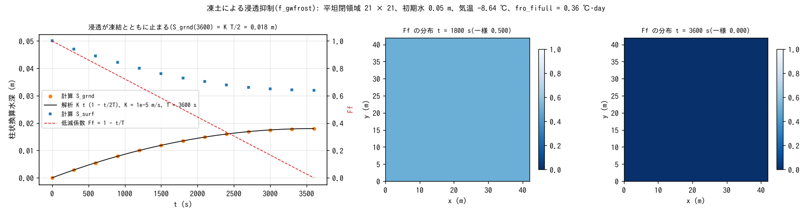

# test/frost — 凍土による浸透抑制(f_gwfrost)の解析検証

融雪期の出水(凍った地面の上を流れる融雪水)のための、気温連動の
浸透能低減モジュール(`&list_gwflow` の `f_gwfrost = 1`、developer.md §16.4)の
検定です。度日ベースの凍結指数 FI(℃·day)を積算し、低減係数
Ff = max(fro_fmin, 1 − FI/fro_fifull) を浸透能に乗じます。一定気温で
FI が線形に増えるよう設計すると地下貯留の時間変化が解析的に決まり、
reference 比較で全桁一致を確かめます。

## 構成

| 項目 | 値 |
|---|---|
| 領域・格子 | 42 m × 42 m、21 × 21 セル(Δx = 2 m)、平坦、四周壁 |
| 水 | 初期 h₀ = 0.05 m 一様。Green-Ampt 浸透 `gw_ksv_mmh = 36`(K = 1e-5 m/s、psif = 0 で一定浸透能)、側方なし。土層 1 m |
| 気象 | 気温 −8.64 ℃一定 → ΔFI = 8.64 × dt/86400 = 5e-5 ℃·day/step |
| 凍土 | `fro_fifull = 0.36` ℃·day(t = 3600 s で完全凍結)、`fro_fmin = 0`(完全凍結 = 不浸透) |
| 時間 | dt = 0.5 s、3600 s。低減係数 Ff を 1800 s 毎に出力 |

Ff(t) = 1 − t/T(T = 3600 s)なので、地下貯留は S_grnd(t) = K t (1 − t/2T)、
離散形では S_grnd(3600) = K·dt·(7200 − 7201/2) = 0.0179975 m です。

| ファイル | 内容 |
|---|---|
| `Run.sh` / `Run_MPI.sh N` | Log.txt を reference と比較(ULP = 0) |
| `Fig.py` | 下の図 `figs/frost.png` |

## 実行

```bash
make
./Run.sh
./Run_MPI.sh 4
python3 Fig.py    # figs/frost.png
```

## 図



左: 地下貯留 S_grnd(●)は解析解 K t (1 − t/2T)(黒)に乗り、低減係数
Ff(赤破線)が 1 → 0 へ落ちるにつれ浸透が止まります。地表水 S_surf は
その分だけ減ります。中・右: Ff の分布。t = 1800 s で一様 0.5、
t = 3600 s で一様 0(完全凍結)です。

## 所見

| 量 | 計算値 | 解析値 |
|---|---|---|
| S_grnd(3600 s) | 0.01799750000000 m | 0.0179975 m(全 14 桁一致) |
| Ff(1800 s) / Ff(3600 s) | 0.5000 / 0.0000 | 0.5 / 0 |

- 中間時刻も全て厳密に一致します(reference PASS)。
- 融解(fi0 = 0.36、Ta = +8.64、ct = 0.5)で Ff(1800) = 0.25・Ff(3600) = 0.5、
  積雪断熱(swe = 0.1 m)で Ff(3600) = 1 − e⁻¹ = 0.6321 が厳密に出ること、
  リスタート往復(gwflow_frost.dat が FI を運ぶ)が直行ランと Log ビット
  一致することも §16.4 の検証記録にあります。
- `fro_fifull` の既定 20 ℃·day は Stefan 式による凍結深 0.25 m 相当の
  実用値で、このテストの 0.36 は解析検証用の人工値です(§64)。

## 関連文書

- [docs/users_guide/gwflow.md](../../docs/users_guide/gwflow.md) — `f_gwfrost`、`fro_*`
- developer.md §16.4(モデル・状態・検証記録)、§64(既定値)
