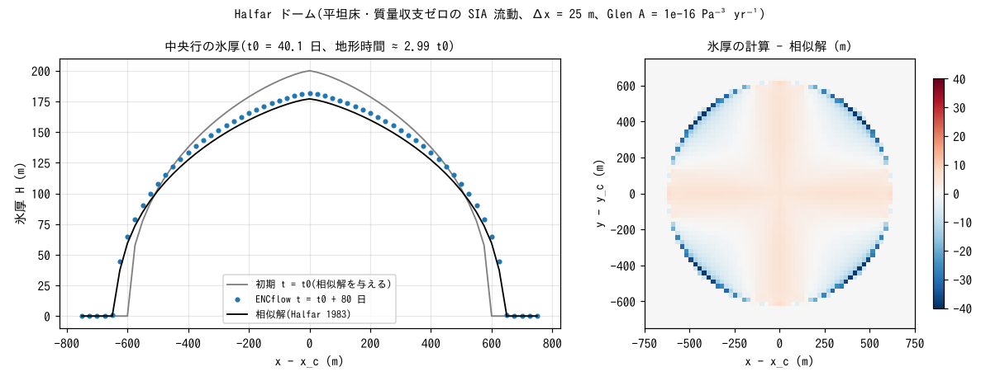
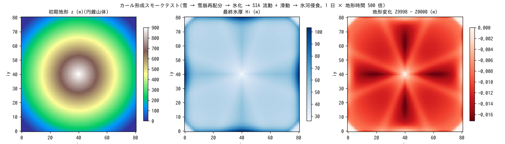

# test/glacier — 氷河モジュール: Halfar ドームの相似解とカール形成スモークテスト

氷河モジュール(`fn_glacier`、[ユーザーガイドの氷河の章](../../docs/users_guide/glacier.md))
の検証ケースです。3 つの構成からなります(docs/glacier_plan.md §7、
developer.md §45)。

1. **Halfar ドーム**(`param.txt`): 平坦床・質量収支ゼロの氷帽が浅氷近似
   (SIA)の流動で広がる問題。Halfar (1983) の相似解と比べる定量ベンチマーク。
2. **カール形成スモークテスト**(`param_cirque.txt`): 円錐山体に気温減率・
   標高依存の降水を与え、雪 → 雪崩再配分 → 氷化 → SIA 流動 + Weertman
   滑動 → 氷河侵食の全プロセスを有効化して、「氷河が形成され、その下で
   侵食が起きる」ことと保存量の健全性を確かめる。
3. **既定値の同値検定**(`param_min.txt` / `param_minx.txt`): 4 つの物性値を
   省略した構成と明示した構成の save と Log がバイト一致する(§65)。

## 構成

| 項目 | Halfar ドーム | カール形成 |
|---|---|---|
| 領域・格子 | 1525 m × 1525 m、61 × 61 セル(Δx = 25 m)、平坦 | 81 × 81 セル、円錐山体(`data/zcone.txt`) |
| 初期氷厚 | t = t₀ の相似解 H(r) = H₀ [1 − (r/R₀)^{4/3}]^{3/7}、H₀ = 200 m、R₀ = 600 m(`data/hi0.txt`) | なし(雪から氷化) |
| 気象 | 気温 −30 ℃ 一定(融解・降水なし。質量収支ゼロ) | 気温減率で山頂側が雪、降水は標高倍率で山頂側ほど多い |
| 流動 | SIA、Glen A = 1e-16 Pa⁻³ yr⁻¹(n = 3) | SIA + Weertman 滑動(gl_as = 1e-13)+ 侵食(gl_kg = 1e-4)。氷化は加速のため時定数を極小に |
| 時間 | dt = 60 s、1 日。地形時間倍率 gl_morfac = 80 → 流動は 80 日 ≈ 2 t₀(t₀ = 40.1 日) | dt = 30 s、1 日 × 500 ≈ 1.4 年 |

Halfar の相似解: H(r, t) = H₀ (t₀/t)^{1/9} [1 − ((t₀/t)^{1/18} r/R₀)^{4/3}]^{3/7}、
t₀ = (1/(18Γ)) (7/4)³ R₀⁴/H₀⁷、Γ = 2A(ρ_i g)³/(n + 2)。初期(t₀)から
地形時間 80 日だけ進めると t ≈ 3 t₀ で、中心の厚さは 200 → 177 m、半径は
600 → 640 m に広がります。

| ファイル | 内容 |
|---|---|
| `Make_input.py` | `data/hi0.txt`(Halfar 初期氷厚)と `data/zcone.txt`(円錐山体)の生成 |
| `Check_halfar.py` | 最終氷厚 Hi9998 と相似解の平均・最大・中心誤差、S_total(氷の水当量)の保存を判定 |
| `Check_cirque.py` | 氷河形成(max Hi > 1 m)、氷河下侵食(dz < −0.01 m)、隆起なし、NaN なしを判定 |
| `Fig.py` | 下の図 `figs/*.png` を描く |

## 実行

```bash
make
./Run.sh          # 入力生成 → Halfar → カール → 2 つの Check → 既定値の同値検定。すべて通れば PASS
./Run_MPI.sh 4
python3 Fig.py    # figs/halfar.png, figs/cirque.png
```

## 図



左: 中央行の氷厚。初期(灰)から 80 日流動させた計算(青点)は相似解
(黒)に重なります。右: 氷厚の計算 − 相似解の分布。誤差の大半は氷縁の
1 セル幅に集中しています(相似解は氷縁で勾配が無限大のため、半セルの
位置ずれでも数十 m の厚さ差になる)。内部は ±5 m で、軸方向と対角方向で
符号の違う弱い模様(8 方向配分の離散化の跡)が見えます。



左: 初期の円錐山体。中: 1 日(地形時間 1.4 年)後の氷厚。山体全面が
氷に覆われ(最大 104 m)、谷筋(ENC の 8 方向)に沿って厚くなっています。
右: 地形変化。全域で負(侵食のみ、隆起なし)で、氷が厚く速い 8 方向の
筋で侵食が大きい。定量ベンチマークではなく、全経路の疎通と符号の
健全性を見るための図です。

## 所見

| 検定 | 計算値 | 基準 | 判定 |
|---|---|---|---|
| Halfar 平均絶対誤差 | 2.35 m(H₀ の 1.2%) | < 4 m | PASS |
| Halfar 最大絶対誤差 | 38.6 m(氷縁) | < 45 m(縁 1.5 セルずれ相当) | PASS |
| Halfar 中心誤差 | 4.7 m | < 許容(流れないと 23 m) | PASS |
| 氷体積 S_total の相対変化 | 〜1e-15 | 機械精度 | PASS |
| カール: max Hi / min dz / max dz | 103.6 m / −0.017 m / 0 | > 1 m / < −0.01 m / ≤ 0 | PASS |
| 既定値の同値検定 | save・Log がバイト一致、"(default)" 4 行 | — | PASS |

- SIA の流動が相似解に平均 1.2% で一致し、反対称フラックスの集計により
  氷体積が機械精度で保存されます。
- カール形成は「氷河が形成され山体上部が侵食される」ことの疎通確認で、
  侵食物は系外へ排出されます(画面の WARNING 行がその量。
  glacier_plan.md §7「既知の妥協」)。
- 氷温・多温構造、カービング、氷底水系などは持ちません。10⁴ 年スケール
  の圏谷形成を定量的に確かめる長期ケースは将来拡張の候補です(同 §7)。

## 関連文書

- [docs/users_guide/glacier.md](../../docs/users_guide/glacier.md) — `&list_glacier` のパラメータ、推奨値
- [docs/glacier_plan.md](../../docs/glacier_plan.md) — 設計計画、§7 検証と既知の妥協
- developer.md §45(氷河モジュールの実装)、§65(既定値の整備)
