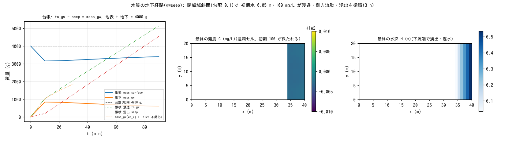

# test/gwseep — 水質の地下経路(浸透 → 側方流動 → 湧出)の台帳閉合

水質モジュール(`fn_wq`、[ユーザーガイドの水質の章](../../docs/users_guide/wq.md))の
うち、溶存物質が地表水から地下水へ浸透し、側方流動で運ばれ、下流端で
湧出して再び地表へ戻る**地下経路**(developer.md §30.5)の検定です。
閉領域斜面に初期水 0.05 m・濃度 100 mg/L(総質量 4000 g)を置き、3 時間の
循環で質量が保存され、台帳(wq.csv)が to_gw − seep = mass_gw で閉じ、
濃度が全経路で 100 mg/L に保たれることを reference 比較と
`Check_gwseep.py` の両方で確かめます。遅延係数 `wq_rg = 1e12`(完全不動化)
の構成も検定します。

## 構成

| 項目 | 値 |
|---|---|
| 領域・格子 | 40 × 20 セル、Δx = 1 m、勾配 0.1 の斜面(`z.txt`)、四周壁 |
| 水 | 初期 h₀ = 0.05 m 一様。Green-Ampt 浸透 360 mm/h(psif = 0)+ 非線形 Boussinesq 側方流動 36,000 mm/h、土層 0.2 m、sy = 0.2(毎ステップ更新) |
| 水質 | 初期濃度 100 mg/L(減衰なし)。構成 2 `param_rg.txt`: `wq_rg = 1e12` |
| 時間 | dt = 0.1 s、5400 s(構成 2 は 1800 s) |

| ファイル | 内容 |
|---|---|
| `Run.sh` | Log.txt と wq.csv を reference と比較(ULP = 0)→ `Check_gwseep.py closure` → 構成 2 → `Check_gwseep.py immobile` |
| `Check_gwseep.py closure|immobile <wq.csv>` | 台帳 to_gw − seep = mass_gw と総質量 4000 g(相対 1e-6)、輸送の活性 / 完全不動化(seep ≈ 0、mass_gw = to_gw) |
| `Fig.py` | 下の図 `figs/gwseep.png` |

## 実行

```bash
make
./Run.sh
./Run_MPI.sh 4
python3 Fig.py    # figs/gwseep.png
```

## 図



左: 台帳の時系列。地表の質量は最初の 10 分で浸透により 3160 g へ減り、
その後は湧出で地表へ戻って増え、地下の質量は 840 g から減ります。
累積の浸透 to_gw と湧出 seep はともに初期質量を超えて増え続け(循環で
初期質量の 1.3 倍が地下を経由)、その差 597.60 g が地下の質量 597.60 g に
出力全桁で一致します。合計は 4000.0000 g で不変です。不動化(一点鎖線)
では地下の質量が to_gw に等しく増え続けます。中: 最終の濃度。湧出・
湛水した下流端の湿潤セルが 99.997〜99.998 mg/L で、浸透 → 湧出の全経路で
濃度が保たれています。右: 最終の水深(下流端に湛水)。

## 所見

| 検定 | 計算値 | 判定 |
|---|---|---|
| to_gw − seep = mass_gw | 5143.075 − 4545.473 = 597.602 g(mass_gw 597.602) | PASS |
| 総質量 mass_surface + mass_gw | 4000.0000 g | PASS |
| 濃度の連続性 | 湿潤セル 99.9968〜99.9975 mg/L(初期 100) | — |
| 不動化(wq_rg = 1e12) | seep ≈ 0、mass_gw = to_gw が全桁一致 | PASS |
| 回帰 | Log.txt・wq.csv が reference に ULP = 0 | PASS |

- 濃度のわずかなずれ(5e-5)は地下側の 1 ステップ遅れの既知の近似で、
  自己制限的です(§30.5)。
- リスタート往復(1.5 h で分割)で最終 C 場がビット一致、MPI np = 1, 2, 4 の
  C / H / Log と wq.csv の台帳 4 列が逐次と一致します。
- Kd 分配は [test/kdpart](../kdpart/)、ダム・ため池は [test/damwq](../damwq/)、
  下水道との結合は [test/sewer_wq](../sewer_wq/)。

## 関連文書

- [docs/users_guide/wq.md](../../docs/users_guide/wq.md) — 水質モジュールの経路と台帳(wq.csv の列)
- developer.md §30.5(地下経路 W3 の実装・検証)
