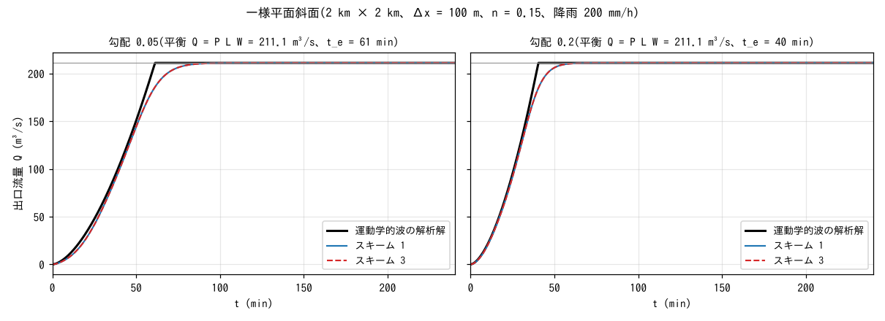
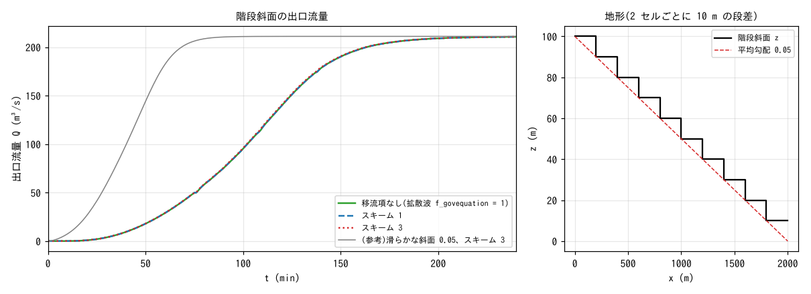
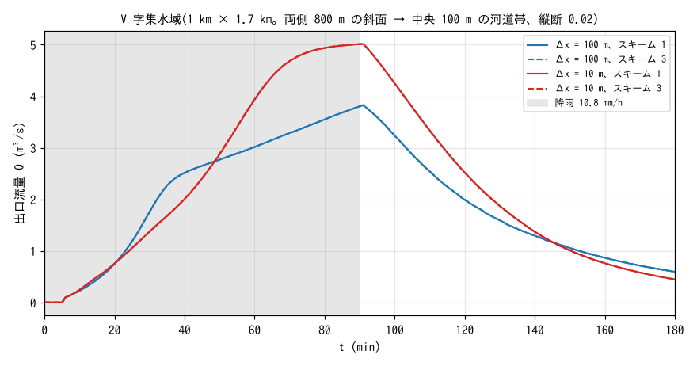

# test/hillslope — 斜面流の移流スキーム比較(運動学的波の解析解・階段斜面・格子収束)

chichibu(実地形)で移流スキーム 1 と 3 の流出が大きく違うことが分かった
とき、その差が河道でなく斜面流から来ている可能性を切り分けるために作った
ケース群です(developer.md §68.18、§68.20)。滑らかな斜面・階段斜面・
V 字集水域の 3 種類の理想地形で、スキーム 1(旧既定: セル中心勾配、
非保存形)とスキーム 3(既定: 運動量保存形 + MUSCL)、および移流項なし
(拡散波 `f_govequation = 1`)を比べます。結論は「**斜面流では差が出ない**。
chichibu の差は深く速い河道の流れが段差を落ちるところで生じる」で、
その根拠がこのケースです。reference との回帰比較はせず、解析解・格子
収束・スキーム間の一致を見ます。

## 構成

`Make_hillslope.py` が地形とパラメータファイルを生成します(定数はこの
スクリプトに集約)。全ケース共通: Manning 粗度は斜面 n = 0.15、東辺は
自由流出、出口手前に測線 1 本(全行をまたぐ)を置いて流量を 1 分毎に
記録します。

| ケース | 地形 | 降雨 | 格子・dt | 比べるもの |
|---|---|---|---|---|
| 平面 `p05` / `p20` | 一様平面斜面 2 km × 2 km、勾配 0.05 / 0.20 | 200 mm/h を 10 h(計算は 4 h) | Δx = 100 m、dt = 5 s | スキーム 1・3 と運動学的波の解析解 |
| 階段斜面 `sp05` | 2 セルごとに 10 m の段差(平均勾配 0.05) | 同上 | 同上 | 移流項なし・スキーム 1・3 |
| V 字集水域 `c100` / `f10` | 1 km × 1.7 km。両側 800 m の斜面(勾配 0.05)が中央 100 m の河道帯(縦断 0.02、n = 0.15)に集まる。斜面 n = 0.015 | 10.8 mm/h × 90 min | Δx = 100 m(dt 2 s)/ 10 m(dt 0.25 s) | 格子収束とスキーム 1・3 |

平面斜面の運動学的波の解析解: 単位幅流量 q = α h^{5/3}、α = √S₀/n。
一様降雨 P のもとで立ち上がりは q(L, t) = α (P t)^{5/3}、平衡到達時刻は
t_e = (L/(α P^{2/3}))^{3/5}、平衡流量は q_e = P L(L は測線の面までの
斜面長 1900 m)。幅 W = 2 km で Q_e = P L W = 211.1 m³/s です。

| ファイル | 内容 |
|---|---|
| `Make_hillslope.py plane` / `stairplane` / `vcat` | 地形 `z_*.txt`・粗度 `rn_*.txt`・`param_*.txt` の生成(stairplane は plane の後に) |
| `param_*_s1.txt`(リポジトリに収録)/ `param_*_s3.txt`(生成。.gitignore) | スキーム 1 / 3 |
| `Fig.py` | 下の図 `figs/*.png` と数表 |

## 実行

```bash
make
python3 Make_hillslope.py plane && python3 Make_hillslope.py stairplane && python3 Make_hillslope.py vcat
for p in param_*.txt; do ./encflow $p; done     # 11 ケース。f10 の 2 本は各 1.5〜15 分、他は 1〜3 分
python3 Fig.py                                   # figs/plane.png, stair.png, vcat.png と数表
```

## 図



一様平面斜面の出口流量。スキーム 1(青)と 3(赤破線)は完全に重なり、
平衡流量は解析解の P L W = 211.1 m³/s に 4 桁で一致します。立ち上がりは
運動学的波(黒)より緩やかで、90% 到達が勾配 0.05 で 63 分(解析 57 分)、
0.20 で 42 分(同 38 分)です。運動学的波は水深の拡散を無視するため
前線が鋭く、浅水方程式の解がそれより鈍るのは正しい挙動です。



2 セルごとに 10 m の段差がある階段斜面(右)の出口流量(左)。移流項なし・
スキーム 1・3 の 3 本が重なります(ピーク 210.70 / 210.70 / 210.72 m³/s、
50% 到達 105 分で同一)。段差で失われる運動エネルギーは速度水頭
u²/2g ≈ 0.01 m(流速 0.5 m/s)で、段差 10 m に比べて無視できるため、
段差での散逸の扱いが違っても結果は変わりません。参考に描いた滑らかな
斜面(灰)より到達が 40 分以上遅いのは、各段の踊り場に水が溜まってから
次の段へ落ちるためです。



V 字集水域の出口流量。Δx = 100 m と 10 m で波形が変わりますが
(ピーク 3.83 → 5.02 m³/s)、各格子でスキーム 1 と 3 は重なります。
格子間の差は斜面と河道帯の解像(100 m では河道帯が 1 セル幅、斜面が
8 セル)と、測線の位置(出口手前のセル境界 x = 950 m と 995 m で集水
面積が 5% 違う)によるもので、スキームの差ではありません。

## 所見

| ケース | スキーム 1 | スキーム 3 | 備考 |
|---|---|---|---|
| 平面 0.05 | 211.11 m³/s(平衡) | 211.11 | 解析 P L W = 211.1。90% 到達 63 分(運動学的波 57 分) |
| 平面 0.20 | 211.11 | 211.11 | 90% 到達 42 分(同 38 分) |
| 階段斜面 0.05 | 210.70 | 210.72 | 移流項なし 210.70。3 者とも 50% 到達 105 分 |
| V 字 100 m | 3.828 @ 91 分 | 3.828 | 3 h 流出体積 21,148 m³ |
| V 字 10 m | 5.015 @ 91 分 | 5.015 | 同 25,041 m³(降雨総量 27,540 m³) |

- **滑らかな斜面・階段斜面・V 字集水域のいずれでも、スキーム 1 と 3 は
  3〜4 桁まで一致します。** chichibu で見られたスキーム差(§68.18:
  差の 87% が河道セルを含むエッジから)は斜面流の離散化によるものでは
  ありません。
- 差が出るかどうかは幾何ではなく流れの regime で決まります(§68.20)。
  速度水頭が段差より十分小さい斜面流(薄い・粗い・遅い)では、段差での
  散逸を移流項がどう扱っても結果に効きません。河道セルは深く(2〜10 m)
  滑らか(n 0.02)で速く(15〜25 m/s)、速度水頭 11〜30 m が段差 2〜5 m を
  上回るため、散逸の扱いの差がそのまま流出の速さに出ます
  (test/bendloss の stair3 と test/dambreak を参照)。
- 平衡流量が解析値に一致することは、降雨の付与と自由流出境界、測線の
  流量積算が整合していることの確認でもあります。

## 関連文書

- developer.md §68.18(風上供給元の河道限定 f_advection_donor と chichibu の診断)、§68.20(段差での散逸と運動量交換の機構。階段斜面の追試)
- [test/dambreak](../dambreak/)(段波の跳躍条件)、[test/bendloss](../bendloss/)(階段状 1 セル水路)
- [docs/users_guide/swflow.md](../../docs/users_guide/swflow.md) — `f_advection_scheme`、`f_govequation`
