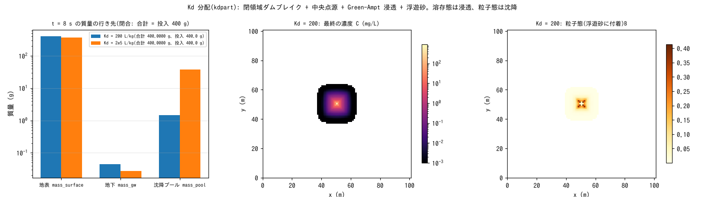

# test/kdpart — 水質の平衡分配(Kd)と粒子態沈降の台帳閉合・単調性

溶存態と粒子態(浮遊砂に付着)への**平衡分配**(`wq_kd`)と、粒子態の
沈降を表面蓄積プールへ送る `f_wq_settle = 1`(developer.md §30.6 の K1)の
検定です。[test/suspend](../suspend/) と同じ閉領域ダムブレイクに、中央セルの
点源 50 g/s(8 s で 400 g)、Green-Ampt 浸透、浮遊砂を重ね、投入質量が
地表・地下・沈降プールの 3 つに過不足なく配分されること(閉合)と、
Kd を 1000 倍にすると沈降が増え浸透が減ること(単調性)を reference 比較と
`Check_kdpart.py` で確かめます。

## 構成

| 項目 | 値 |
|---|---|
| 領域・格子 | 101 m × 101 m、Δx = 1 m、平坦、四周壁。静水 0.5 m + 水の山(+1 m) |
| 浮遊砂・浸透 | `f_suspend = 1`(sd₀ = 10 m)、Green-Ampt 36 mm/h(psif = 0) |
| 水質 | 点源 (51, 51) に 50 g/s 一定。構成 1 `param.txt`: Kd = 200 L/kg(Css 数 kg/m³ で溶存比 fd ≈ 0.5)。構成 2 `param_hi.txt`: Kd = 2e5 L/kg(粒子態支配) |
| 時間 | dt = 0.1 s、8 s |

| ファイル | 内容 |
|---|---|
| `Run.sh` | Log.txt・wq.csv を reference と比較 → `Check_kdpart.py closure`(両構成)→ `monotonic` |
| `Check_kdpart.py closure|monotonic` | in_point = mass_surface + mass_gw + mass_pool(相対 1e-6)、settle・to_gw・mass_pool の活性 / Kd 増で settle 増・to_gw 減 |
| `Fig.py` | 下の図 `figs/kdpart.png` |

## 実行

```bash
make
./Run.sh
./Run_MPI.sh 4
python3 Fig.py    # figs/kdpart.png
```

## 図



左: 8 s 後の投入質量 400 g の行き先(対数軸)。Kd = 200 では大半が地表水に
残り、浸透した溶存態 0.044 g、沈降した粒子態 1.47 g。Kd = 2e5 では粒子態
支配になり、沈降 37.5 g に増え、浸透は 0.027 g に減ります。どちらも
3 つの合計が 400.0000 g に一致します。中: Kd = 200 の最終濃度。点源から
環状波に乗って広がっています。右: 粒子態(浮遊砂に付着した分)。

## 所見

| 量 | Kd = 200 | Kd = 2e5 | 判定 |
|---|---|---|---|
| mass_surface / mass_gw / mass_pool (g) | 398.49 / 0.0441 / 1.470 | 362.44 / 0.0275 / 37.53 | — |
| 閉合 合計 − 投入 400 g | 0.000000 | 0.000000 | PASS |
| 単調性 settle_g | 1.47 → 37.5(増) | | PASS |
| 単調性 to_gw_g | 4.41e-2 → 2.75e-2(減) | | PASS |

- 溶存比 fd = 1/(1 + Kd·Css) で、浸透は溶存態だけ、沈降は粒子態だけが
  対象です。浮遊砂のないセル(hs = 0)は fd = 1 なので、Kd を大きく
  しても浸透はゼロにはなりません(設計どおり。§30.6)。
- E-D フラックスとの厳密結合(河床交換層の金属 / 砂比)は、K1 の実流域
  適用で不足が示されてからの保留課題です(wq_metal_plan.md §5)。

## 関連文書

- [docs/users_guide/wq.md](../../docs/users_guide/wq.md) — `wq_kd`、`f_wq_settle`、台帳の列
- developer.md §30.6(K1 の実装・検証)、[docs/wq_metal_plan.md](../../docs/wq_metal_plan.md)
