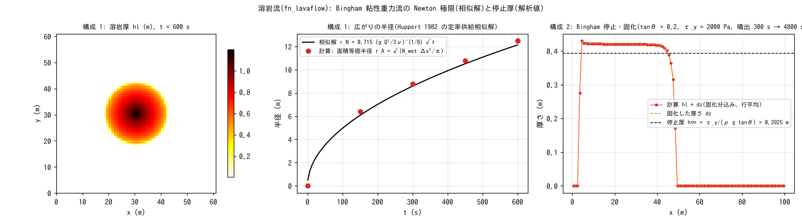

# test/lava — 溶岩流(fn_lavaflow): Huppert 相似解と Bingham 停止厚

溶岩流モジュール(`fn_lavaflow`。Bingham 粘性重力流 + 固化。
[ユーザーガイドの溶岩流の章](../../docs/users_guide/lavaflow.md)、developer.md §51)の
検定です。reference 比較なしの解析解検定で閉じます([test/volcano](../volcano/)
と同じ流儀)。

1. **Huppert**(`param.txt`): 平坦床・中央 1 セルの定率噴出(降伏応力 0 =
   Newton 極限)。Huppert (1982) の定率供給軸対称相似解
   r_N = 0.715 (g Q³/3ν)^{1/8} √t と、面積等価半径・成長則・台帳を比べる。
2. **Bingham**(`param_ty.txt`): 等勾配斜面(tanθ = 0.2)の上流端の列噴火口
   から 300 s 供給して止める。停止厚 h∞ = τ_y/(ρ g tanθ) と固化・台帳を比べる。
3. **既定値の同値**(`param_min.txt` / `param_minx.txt`): 構成 2 と同じ設定で
   `lv_visc`・`lv_vsol` を省略 / 明示し、save と Log がバイト一致(§66)。

## 構成

| 項目 | 構成 1 Huppert | 構成 2 Bingham |
|---|---|---|
| 領域・格子 | 61 m × 61 m、Δx = 1 m、平坦 | 100 m × 8 m、Δx = 1 m、tanθ = 0.2(`zinit.txt`) |
| 噴出 | 中央 (31, 31) に 0.5 m³/s 一定 | 上流端 i = 5 の 8 セルに計 0.5 m³/s を 300 s(重複時刻で階段状に停止) |
| 流体 | ρ = 2600、η = 2e4 Pa·s、τ_y = 0、固化なし | ρ = 2600、η = 2e3 Pa·s、τ_y = 2000 Pa、固化レート 0.005 m/s、停止判定 5e-4 m/s |
| 時間 | dt = 0.5 s、600 s | dt = 0.5 s、4800 s |
| 解析値 | r_N(600 s) = 12.13 m | h∞ = 2000/(2600 × 9.8 × 0.2) = 0.3925 m |

| ファイル | 内容 |
|---|---|
| `make_init.py` | `zinit.txt`(等勾配斜面) |
| `Check_lava.py <save> huppert|bingham` | 構成 1: (1) 台帳 Σhl·A = V_in、(2) 面積等価半径が r_N に 10% 以内、(3) r(tt)/r(tt/2) が √2 に 5% 以内。構成 2: (1) 台帳 Σhl + Σdz = V_in(固化は z への内部移転)、(2) 検定窓(i = 15〜35)の hl + dz が h∞ に 20% 以内・CV < 閾値、(3) 固化率 > 0.7 |
| `Fig.py` | 下の図 `figs/lava.png` |

## 実行

```bash
make
./Run.sh          # 構成 1 → Check → 構成 2 → Check → 構成 3 の同値検定(約 30 秒)
./Run_MPI.sh 4    # MPI。state.dat・lavaflow.dat が逐次とバイト一致(-O2 厳密数学)
python3 Fig.py    # figs/lava.png
```

## 図



左: 構成 1 の 600 s 後の溶岩厚。中央から軸対称に広がります。中: 面積
等価半径の成長。計算(●)は相似解の √t 則に沿い、成長則 r(tt)/r(tt/2) は
√2 に 0.6% で一致します。半径の絶対値は Check_lava の数え方(薄い裾まで
含む)で 13.2 m(+8.5%)、図の 1 cm 以上の面積では 12.5 m(+2.8%)で、差は
前縁の薄い裾の扱いです(エッジ平均厚による前縁の遅れを含む)。
右: 構成 2 の最終の厚さ(行平均)。噴火口の下流 x = 6〜40 m で hl + dz が
0.42 m の平坦な台地になり、停止厚の解析値 0.3925 m に 7.1% で一致し、
全量が固化しています(dz = hl + dz)。

## 所見

| 検定 | 計算値 | 判定 |
|---|---|---|
| 構成 1 (1) 台帳 Σhl·A − V_in | −5.7e-14 m³(V_in = 300 m³) | PASS |
| 構成 1 (2) 面積等価半径 | 13.17 m(r_N 12.13 m、+8.5%、許容 10%) | PASS |
| 構成 1 (3) 成長則 r(tt)/r(tt/2) | 1.423(√2 に 0.6%) | PASS |
| 構成 2 (1) 台帳 (Σhl + Σdz)·A − V_in | 1.2e-11 m³(V_in = 149.75 m³) | PASS |
| 構成 2 (2) 停止厚 <hl + dz> | 0.4203 m(h∞ 0.3925、+7.1%、許容 20%)、CV 0.001 | PASS |
| 構成 2 (3) 固化率 | 1.000、max dz 0.43 m | PASS |
| 構成 3 既定値の同値 | save・Log がバイト一致、"(default)" 2 行 | PASS |

- 停止厚の +7% は停止判定 `lv_vsol` の打切りによる上振れ
  h∞ + √(v_sol h/(coef (2h + h₀) S)) を含みます(§51.3)。停止の漸近は遅く、
  検定は「検定時間内に排水が h∞ 近傍へ届く粘度」で組んであります
  (η = 1e4 では 900 s で 29% 上振れ = パラメータ選定の目安)。
- 台帳は注入の厳密加算とエッジ反対称の拡散により機械精度で閉じます。
  リスタート往復(300 s save → restore → 600 s)もバイト一致です。
- 溶岩流は拡散型モジュールの 8 近傍化の候補です(developer.md §61.4)。

## 関連文書

- [docs/users_guide/lavaflow.md](../../docs/users_guide/lavaflow.md) — `&list_lavaflow`(粘性・降伏応力・固化・噴火口)
- developer.md §51(実装・検証記録)、§66(既定値)
