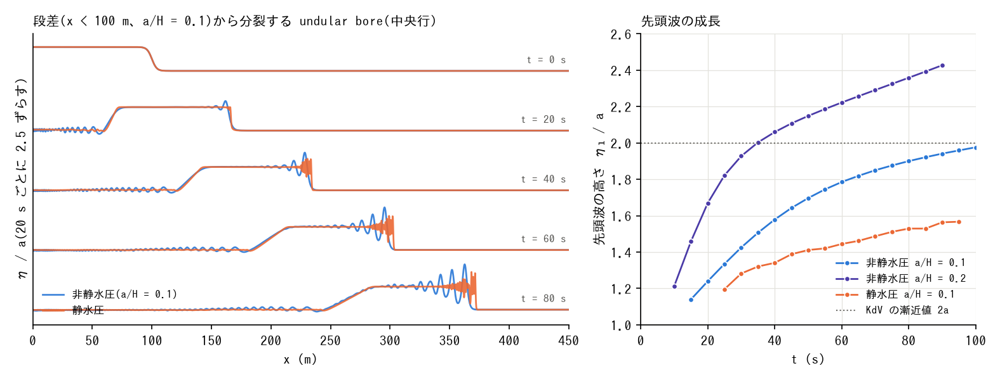

# test/nhbore — 長波の段差から分裂する undular bore(非静水圧補正のソリトン分裂)

docs/nonhydrostatic_plan.md §11 Phase 5、§1 の「河川遡上津波のソリトン分裂・
undular bore」の素過程。平坦床・無摩擦・壁境界の水路(450 m × 8 m、
Δx = Δy = 0.25 m = H/4、32 行)で、H = 1 m、x < 100 m を a/H = 0.1 だけ高く
した段差(tanh 遷移 4 m。user routine `wave_bore`)に右へ進む単純波の流速
u = 2(√(g(H+η)) − √(gH)) を与え、100 s 伝播させる。前面が非線形で立ち、
分散で先頭から波列に分裂する。

- `./Run.sh` / `./Run_MPI.sh N`: param.txt(f_nonhydrostatic=1、CG)の
  回帰テスト(Log.txt。Runge 列除外)。
- `./encflow param20.txt`(a/H = 0.2)、`./encflow param_h.txt`(静水圧)を
  走らせてから `./Bore.py` で、中央行の水面から前面の位置、先頭波の位置と
  高さ η₁/a、波列の山の数、先頭波の速度を表にする。`./Fig.py` で
  `figs/bore.png` に図を描く。

## 図

## 所見(2026-10-05)

| 構成 | η₁/a(t = 50 / 90 s) | 山の数(90 s) | 先頭波の速度 / √(gH)(後半) |
|---|---:|---:|---:|
| 非静水圧 a/H = 0.1 | 1.70 / 1.94 | 5 | 1.075 |
| 非静水圧 a/H = 0.2 | 2.15 / 2.43 | 10 | 1.134 |
| 静水圧 a/H = 0.1 | 1.41 / 1.56(段波背後の数値振動) | 11 | 1.106 |

- 非静水圧では段差の前面が先頭から波列(undular bore)に分裂し、先頭波の
  高さが KdV の undular bore の漸近値 2a(Gurevich & Pitaevskii 1974)に
  単調に近づく(a/H = 0.1 で 90 s に 1.94a、まだ成長中)。先頭波の速度は
  高さ 2a の孤立波の √(gH)(1 + a/H) = 1.10 に対して −2%(壁で対角エッジが
  欠ける水路の効果 −0.9% を含む。test/nhsolitary)。
- a/H = 0.2 では先頭波が 2a を超えて成長する(90 s で 2.43a)。弱非線形の
  KdV と違い、完全非線形の 1 層モデル(Serre/Green–Naghdi 型)の undular
  bore は段差が強いほど先頭波の比が 2 を超える(El, Grimshaw & Smyth 2006)
  のと整合する。100 s は前面が東壁に達しているため除外。
- 静水圧は段波のまま進むが、段波の背後に数値的な振動(1.4〜1.6a)が立つ
  (Stoker 解の検証で見た dt ≤ 0.025 の背後の overshoot と同根。§69.6)。
  分散で分裂する波列とは別物で、山の間隔は格子に依る。
- 先頭波の成長は t ∝ 1/(分散の時間尺度)で遅く、450 m の水路でも漸近値に
  届かない。定量比較には先頭波の高さの時間発展そのもの(図右)を使う。
