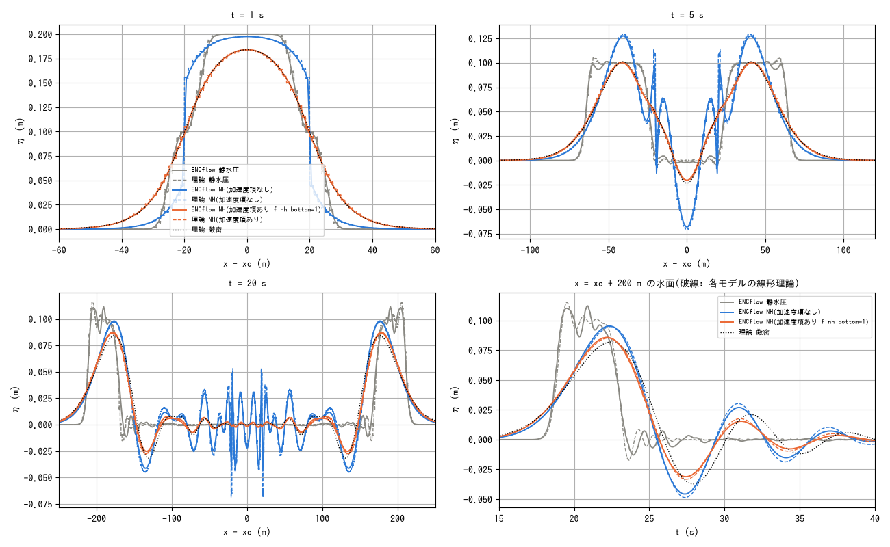
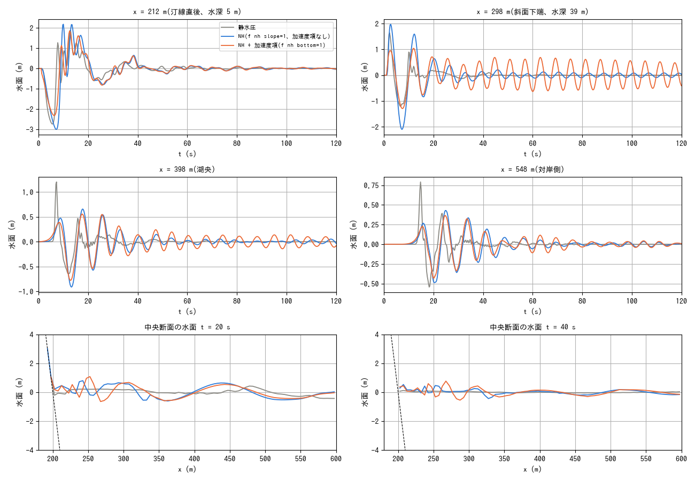

# test/nhbottom — 動く底面の加速度項(f_nh_bottom。Phase 8)

1 層非静水圧(NH)補正に、動く底面の鉛直加速度 z̈_b を源項として加える
研究オプション f_nh_bottom の検証(docs/nonhydrostatic_plan.md §16、
developer.md §69.10)。底面の運動学条件 w_b = ∂z_b/∂t + u·∇z_b を
層平均の鉛直速度 w̄ = (w_s + w_b)/2 に入れると、φ = (h²/4)∇·a −
(h/2)a·∇z_b **− (h/2) z̈_b** となり、追加項は既知の源項に過ぎない。
∂z_b/∂t 自体は静水圧部が既に扱っている(geomorph の契約: h を変えず z を
動かす → 水面 e = z + h がそのまま持ち上がる)。NH が付け加えるのは
水柱を鉛直に加速することへの慣性反力で、底面変位を水面に写すときの
短波の減衰(Kajiura フィルタ)を与える。

線形理論(1 次元・平坦・β = H²/4。Λ は ENC の 1 次元シンボル):

| モデル | 分散 ω² | 強制のフィルタ F(η̈ + ω²η̂ = F z̈̂) |
|---|---|---|
| 静水圧 | gHΛ | 1 |
| NH、加速度項なし | gHΛ/(1 + βΛ) | 1 |
| NH、加速度項あり | gHΛ/(1 + βΛ) | (1 − βΛ)/(1 + βΛ) |
| 厳密(ポテンシャル流) | gk tanh kH | 1/cosh kH |

1 層 NH のフィルタは O(k²H²) まで厳密解に一致し(1 − k²H²/2)、kH ≳ 1 で
強すぎ、kH > 2 で符号が反転する(1 層 NH の適用上限と同じ)。

## 構成 1: 規定底面運動(Hammack 型の区間隆起)

ライブラリ API(m_main_set_value('z'))で底面を時間関数で動かす
ドライバ `uplift.f90`(libencflow.a をリンク。計算本体の外)。
H = 10 m・平坦・無摩擦の 1 次元水路(1000 m × 40 m、Δx = 1.25 m = H/8、
32 行。壁で対角エッジが欠ける影響を 1% 未満にする)。|x − 500| < 20 m
(b/H = 2)を 1 s(b/√(gH) = 2 s より短い = 衝撃的)で 0.2 m(ζ₀/H = 2%)
持ち上げる。箱型のスペクトル sin(kb)/(kb) は最初の零点 kH = 1.57 まで
成分を持ち、1 層 NH のフィルタと Kajiura の差が見える帯域に当たる。

```
make                                  # uplift のビルド(src の libencflow.a から)
./uplift param.txt uplift.txt         # NH + 加速度項(./Run.sh = 回帰テスト)
./uplift param_h.txt uplift.txt       # 静水圧
./uplift param_n.txt uplift.txt       # NH、加速度項なし
python3 Theory.py                     # 線形理論の数表
python3 Fig.py                        # figs/uplift.png と数表
```



上: 断面 t = 1 s(隆起終了)・5 s・20 s。実線 = ENCflow、破線 = 各モデルの
線形理論、点線 = 厳密解。下右: x = x_c + 200 m の水面時系列。

| ケース | η_max ENCflow (m) | t (s) | η_max 理論 (m) | t (s) | ENC/理論 | 理論/厳密 |
|---|---:|---:|---:|---:|---:|---:|
| 静水圧 | 0.1124 | 20.92 | 0.1153 | 19.55 | 0.975 | 1.404 |
| NH(加速度項なし) | 0.0955 | 22.36 | 0.0950 | 22.45 | 1.005 | 1.156 |
| NH(加速度項あり f_nh_bottom=1) | 0.0856 | 22.14 | 0.0850 | 22.25 | 1.007 | 1.035 |
| 厳密(線形ポテンシャル流) | — | — | 0.0821 | 22.45 | — | 1 |

- ENCflow は 3 モデルとも自分の線形理論に一致する(NH は ±0.7%、静水圧は
  箱型のパルスが数値散逸で −2.5%・遅れ 1.4 s)。加速度項の実装が定式
  どおりであることの確認。
- 加速度項によって、先頭波高の厳密解との差が +16% → +3.5% に縮まる
  (静水圧 +40%)。t = 1 s の断面で、隆起直上の水面が箱型(静水圧)から
  丸まった形(NH + 加速度項。厳密解に重なる)になるのがフィルタの効果。
- 隆起区間の縁(x = ±20 m)に出る短波のとげは、1 層 NH のフィルタが
  kH > 2 で負になることの現れで、理論(破線)にも同じものがある
  (plan §16.5 の限界。水柱 h は正のまま)。

**素朴な源項との違い**: 導出どおりの −(h/2) z̈ をそのまま使うと
フィルタは (1 − βk²)/(1 + βk²) で、kH > 2 で符号が反転し(格子スケールで
−1)、隆起区間の縁に短波のとげが出る。実装は源項の半分を同じ Helmholtz
作用素に通した −(h/4)(z̈ + (1 + βL)⁻¹z̈) で、F = 1/(1 + βk²)²(上の表)。
隆起直上の水面形(t = 1 s)は厳密解に重なり、先頭波高の厳密解との差は
+3.9%(素朴な形は +3.5% だが、海底地滑りとの結合で発散する。下記)。
反復回数は底面が動く間だけ約 2 倍(この構成で平均 48 → 57)。

## 構成 2: 海底地滑り(f_bedslide との結合)

examples/landslide_tsunami の C(水中斜面 tanθ = 0.4 の土塊 19,110 m³ を
t = 1 s に可動化。慣性なし Voellmy の底層)と同じ設定を、静水圧 /
NH(f_nh_slope=1。加速度項なし)/ NH + 加速度項で比較する。入力は
`make inputs`(例題の make_init.py)。

```
./encflow param_ls_h.txt      # 静水圧
./encflow param_ls_n.txt      # NH(f_nh_slope=1)、加速度項なし
./encflow param_ls_b.txt      # NH + 加速度項
./encflow param_ls_b025.txt   # 同、dt = 0.025 s(一段遅れの影響)
./encflow param_ls_n025.txt   # 加速度項なし、dt = 0.025 s(対照)
./encflow param_ls_bd.txt     # NH + 加速度項 + 運動量拡散 ν = 0.3 m²/s
python3 Landslide.py          # figs/landslide.png と数表
```



| プローブ | 量 | 静水圧 | NH(f_nh_slope=1、加速度項なし) | NH + 加速度項(f_nh_bottom=1) |
|---|---|---:|---:|---:|
| x = 212 m(汀線直後、水深 5 m) | 最低 (m) | -2.744 | -3.008 | -2.325 |
| x = 212 m(汀線直後、水深 5 m) | 最高 (m) | 1.880 | 2.178 | 1.845 |
| x = 298 m(斜面下端、水深 39 m) | 最低 (m) | -1.201 | -2.097 | -1.291 |
| x = 298 m(斜面下端、水深 39 m) | 最高 (m) | 1.644 | 1.975 | 1.045 |
| x = 398 m(湖央) | 最低 (m) | -0.645 | -0.913 | -0.777 |
| x = 398 m(湖央) | 最高 (m) | 1.203 | 0.658 | 0.557 |
| x = 548 m(対岸側) | 最低 (m) | -0.543 | -0.487 | -0.431 |
| x = 548 m(対岸側) | 最高 (m) | 0.792 | 0.429 | 0.366 |

| プローブ | max\|Δη\| 加速度項あり dt 0.05 vs 0.025 (m) | 同 加速度項なし (m) | 加速度項の効果 max\|η_b − η_n\| (m) |
|---|---:|---:|---:|
| x = 212 m(汀線直後、水深 5 m) | 0.1172 | 0.0765 | 1.9515 |
| x = 298 m(斜面下端、水深 39 m) | 0.2582 | 0.0662 | 1.0287 |
| x = 398 m(湖央) | 0.0273 | 0.0301 | 0.2033 |
| x = 548 m(対岸側) | 0.0108 | 0.0096 | 0.1382 |

- **加速度項の効果は近地で大きい**: 汀線直後(x = 212)で引き波 −3.0 →
  −2.3 m、斜面下端(x = 298。土塊の堆積域の直上)で押し波 2.0 → 1.0 m。
  土塊の前面は 1〜2 セル(kH ≫ 2)なので、加速度項なしの NH(と静水圧)は
  その底面変位をそのまま水面に写し、加速度項は Kajiura フィルタで
  落とす。湖央以遠(x ≥ 398)では差が 0.1〜0.2 m(波高の 20〜30%)。
- **一段遅れ Δt の影響**は dt 半減との差で見ると、遠地では加速度項の
  有無で同程度(0.01〜0.03 m = dt そのものの感度)、近地(x = 298)では
  加速度項ありの方が大きい(0.26 m 対 0.07 m。効果 1.0 m の 1/4)。
  近地の差の大半は下記の捕捉モードの位相差。
- **1 層 NH の遮断周波数に捕捉されるモード**: 斜面下端(水深 39 m)で
  周期 6 s・振幅 ±0.6 m(加速度項なし ±0.12 m、静水圧なし)の振動が
  120 s まで減衰せずに残る。1 層 NH の分散関係 ω² = gHk²/(1 + βk²) は k → ∞ で
  ω → √(4g/H) = 1.0 rad/s(T = 6.3 s)に飽和し、短波はすべてこの周波数で
  群速度 0 = 発生場所に留まる。土塊の前面(格子スケール)がこれを励起し、
  静水圧にはない(格子スケールの波は √(gH) で逃げる)。この振動が
  底層の駆動水頭 Φ = z + r·h を揺らすため、底層の一部(3,000 m³)が
  bs_vstop 以下に 15 s 留まれず 120 s でも「移動中」のまま(加速度項なしは
  49 m³)。運動量の拡散項(param_ls_bd.txt。ν = 0.3 m²/s: 格子スケールの
  e-folding 8 s、波長 100 m は 120 s で 13%)では減衰しない(±0.67 m)=
  自由な格子モードではなく底層との結合の自励振動。底面速度の時間緩和
  (τ = 1 s)は位相遅れで振動を増幅し(±2.7 m)、τ = 2 s は振動を消す
  代わりに加速度項の効果も消すので採用していない(plan §16.6)。本筋は
  多層 NH か底層の慣性。
- 素朴な源項 −(h/2) z̈ では、この格子スケールの結合が正帰還になって
  t ≈ 10 s から発散した(水面 +14 m、底層速度 20 m/s。dt 半減でも +8 m)。
  Helmholtz 平滑化(格子スケールで F → 0)で安定になった(plan §16.6)。

## 回帰テスト

`./Run.sh` / `./Run_MPI.sh N` は構成 1 の param.txt(NH + 加速度項)を
uplift ドライバで実行して reference/Log.txt と比較する(列 4 = Runge は
除外)。np = 2, 4 は逐次 reference と、全有効桁の S 列が 3 行で最終桁 1 だけ
異なる(総和の順序。nhwave_nh と同じ)ほかは一致。構成 2 は比較用(reference なし。
test/bedslide が bedslide 本体の検定)。
