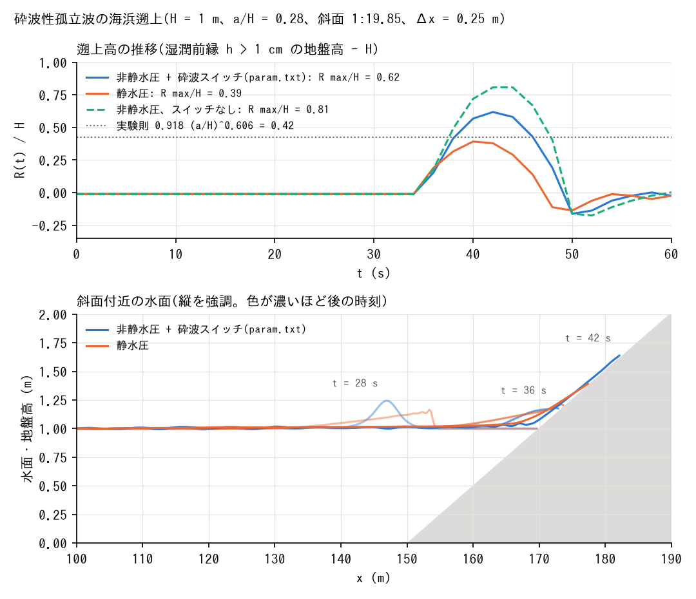
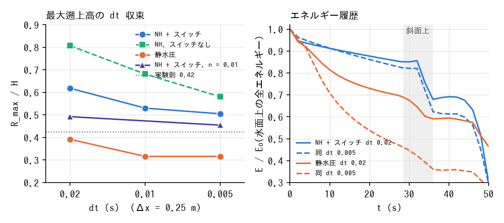
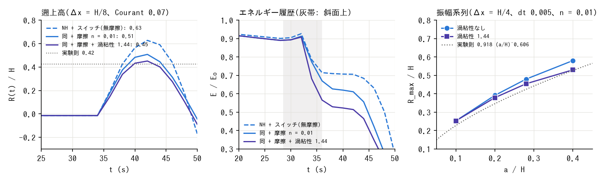

# test/nhbreak — 砕波性孤立波の海浜遡上(非静水圧補正の砕波スイッチと乾湿退化)

docs/nonhydrostatic_plan.md §11 Phase 6、developer.md §69.4。Synolakis (1987) の
構成: 水深 H = 1 m、a/H = 0.28、斜面 1:19.85(脚 x = 150 m。user_geoinfo
`beach_slope`)、孤立波 x0 = 50 m(user_initial `wave_solitary28`)、
Δx = Δy = 0.25 m、32 行、60 s。

- `./Run.sh` / `./Run_MPI.sh N`: param.txt(NH + 砕波スイッチ: 水面勾配
  判定 0.2、縁 8 セル、f_hcap_upwind=2、nh_hmin=0.05)の回帰テスト。
- `./encflow param_h.txt`(静水圧、同じ hcap 2)を走らせてから `./Runup.py`
  で、水深分布の中央行から湿潤前縁の位置 → 遡上高 R(t) = z_front − H、
  最大遡上高 R_max/H、波頂高さの推移を表にし、実験の砕波遡上則
  R/H = 0.918 (a/H)^0.606 = 0.42 と比べる。

## 図

上: 遡上高 R(t)/H(湿潤前縁の地盤高 − H)。静水圧 0.39、NH + 砕波スイッチ
0.62、NH スイッチなし 0.81(実験則 0.42)。下: 斜面付近の水面と地盤
(t = 28, 36, 42 s)。静水圧は斜面の手前で段波化し、NH は砕けずに斜面に
乗る。`./Fig.py` で `figs/runup.png` に生成する(スイッチなしの曲線は
param.txt の f_nh_breaking=0、dir_result='result_ns' の結果があれば描く)。

## 所見(2026-10-05)

| 構成 | R_max/H | 備考 |
|---|---:|---|
| 静水圧(hcap 1 / 2) | 0.455 / 0.392 | 平坦部で早期に段波化して散逸。実験則 0.42 に近い |
| NH、スイッチなし(hcap 1 / 2) | 1.59 / 0.81 | 砕かずに薄い舌で遡上。hcap 1 の 1.59 は非砕波の遡上則 2.57 寄り |
| NH + 勾配判定 0.2、縁 8(hcap 2)= param.txt | 0.62 | 設定に鈍感(勾配 0.15〜0.3、縁 8〜16、フルード 0.5: 0.62〜0.64) |
| NH + SWASH 型 ∂η/∂t 判定(α 0.6〜0.15) | 2.2〜2.7 | この格子では砕波の開始に間に合わない。α 0.1 は発散 |
| NH、深さ閾値 nh_hmin = 0.5 m(hcap 1) | 発散 | 汀線に h = 1.5 m のスパイク(段波先端の両側平均水深。§68.7)。hcap 2 で 0.92 |

- 砕波・段波を含む NH ケースは **f_hcap_upwind = 2 が必須**。
- NH + スイッチは実験則の 1.5 倍。原因の切り分けは下の節(developer.md §69.6)。
- np=2 は逐次と Log・プローブ・水深分布でビット一致(-O2 厳密ビルド。
  init の界面エッジ行の補完漏れを修正後)。

## 底面勾配項と非砕波の遡上(2026-10-05)

- f_nh_slope=1(Version 2)でも砕波スイッチつきの R_max/H は 0.618 で不変
  (砕波遡上の過大は底面勾配項によるものではない)。
- 非砕波 a/H = 0.0185(`param_nb.txt`、`wave_solitary0185`、70 s): 静水圧・
  V1・V2 とも R_max/H = 0.064(前縁 h > 1 mm)。非砕波の遡上則
  2.831√cotβ (a/H)^{5/4} = 0.086(実験 ≈ 0.09)の 75%。NH の寄与はなく、
  Δx = H/4 での乾湿前縁(数 mm の舌)の表現の問題。

## 過大(0.62 対 0.42)の原因切り分け(2026-10-05。developer.md §69.6)

`./Diag.py --run` で派生ケース(dt・初期位置・NH の範囲・摩擦・格子)を
result_x_*/ に走らせ(u, v も出力)、`./Diag.py` で最大遡上高と水面上の
全エネルギー E = Σ[½g((z+h−H)² − max(z−H,0)²) + ½h|u|²] の履歴
(E0 = 2.29 J/m、単位幅、ρ = 1)を表にし、`./Diag.py --fig` で
`figs/runup_diag.png` を描く。波を脚の 30 m 手前に置くケースは
user_initial `wave_solitary28_toe`(x0 = 120 m)。

| 構成 | dt 0.02 | dt 0.01 | dt 0.005 | 汀線到達時 E/E0(dt 0.005) |
|---|---:|---:|---:|---:|
| NH + 砕波スイッチ(param.txt) | 0.618 | 0.530 | 0.505 | 0.62 |
| NH、スイッチなし | 0.807 | 0.681 | 0.581 | 0.73 |
| NH は平坦部のみ(nh_hmin 0.98。斜面は静水圧) | 0.606 | 0.518 | — | — |
| 静水圧(param_h.txt。波は脚の 100 m 手前) | 0.392 | 0.316 | 0.316 | 0.36 |
| 静水圧、波を脚の 30 m 手前に置く | 0.492 | — | **0.417** | 0.50 |
| NH + スイッチ、Manning n = 0.01 | 0.492 | — | 0.455 | 0.60 |
| NH + スイッチ、n = 0.02 / NH スイッチなし、n = 0.01 | 0.366 / 0.555 | — | — | — |
| 静水圧、n = 0.01 / 脚の手前 + n = 0.01 | 0.354 / 0.417 | — | — | — |
| Δx/2: 静水圧(dt 0.01 / 0.0025) | 0.464 | | **0.338**(dt 0.0025) | 0.37 |
| Δx/2: NH + スイッチ(dt 0.01 / 0.0025) | 0.747 | | **0.628**(dt 0.0025) | 0.72 |
| Δx/2: NH + スイッチ、n = 0.01(dt 0.01) | 0.527 | | | |
| 静水圧、波を脚の 5 m 手前に置く(`wave_solitary28_x145`) | 0.581 | — | 0.492 | 0.62 |
| NH + スイッチ、同上 | — | — | 0.543 | 0.71 |

- **dt = 0.02(Courant ≈ 0.28)は収束していない**: dt → 0 で NH + スイッチ
  0.62 → 0.50、静水圧 0.39 → 0.32。dt 依存は静水圧の段波化・乾湿前縁の
  段階にある(NH を平坦部だけにしても同じ幅で下がる。段波の跳躍条件は
  test/dambreak の Stoker 解で dt に依らず正しい)。Courant を固定した
  細分化では逆に R が上がる(Cr に比例する誤差)。
- **Δx = H/4 も NH には粗い**: Δx/2・Cr 0.07 で静水圧 0.34(粗格子の収束値
  0.32 と 7% 以内)、NH + スイッチ 0.63(粗格子 0.50)。差は平坦部での
  孤立波の数値散逸(脚到達時の E/E0 0.82 → 0.91)。粗格子では dt 誤差
  (+22%)と数値散逸(−18%)が打ち消し合って 0.62 ≈ 0.63 になっていた。
- **静水圧の 0.39 は偶然の一致**: 平坦部 100 m で早期に段波化して E の
  4 割を失った結果。波を脚の 30 m 手前に置くと 0.417(これも 30 m で段波化
  した結果)、脚の 5 m 手前(Titov & Synolakis 1995 の配置。無傷の波が脚に
  達する)では静水圧 0.49、NH + スイッチ 0.54(dt 0.005)。無傷の波が斜面で
  静水圧段波になって遡上すると 0.5〜0.6 で、静水圧でも砕波散逸の追加が要る。
- **収束値での NH + スイッチの過大 +50%(0.63)は砕波崩壊の散逸不足**(遡上
  最大時の残存 E 0.71 E0 対 静水圧(脚の手前)0.49 E0)。摩擦 n = 0.01 で
  NH は −20〜30%(静水圧 −10%)、収束値で +10〜20% が残る見込み。
- **定量評価は Courant ≲ 0.1・Δx ≲ H/8 で収束を確認し、摩擦(n ≈ 0.01)を
  与える。** 残る過大は砕波域の明示的散逸(渦粘性・ローラー)の課題。
  静水圧の一致は平坦部の長さに依存する偶然。param.txt は回帰テスト用に
  dt 0.02・Δx = H/4 のまま。

## 砕波域の渦粘性 nh_break_visc(2026-10-05。developer.md §69.7、plan §15)

砕波と判定したセルに ν_b = nh_break_visc·B·h·√(gh)·|∇η| を与え、運動量の
拡散項で散逸させる(Kennedy et al. 2000 相当の 1.44 を使用)。
`./Diag.py --run visc005_nh viscf005_nh viscfine_nh finef0025_nh amp10_v ...`
で走らせ、`./Diag.py --figvisc` で `figs/runup_visc.png` を描く。

| 構成 | R/H | 汀線到達時 E/E0 |
|---|---:|---:|
| NH + スイッチ、Δx = H/4、dt 0.005 | 0.505 | 0.62 |
| 同 + 渦粘性 1.44 | 0.480 | 0.58 |
| 同 + 摩擦 n = 0.01 | 0.455 | 0.60 |
| 同 + 摩擦 + 渦粘性 | 0.429 | 0.56 |
| NH + スイッチ、Δx = H/8・Cr 0.07、無摩擦 | 0.628 | 0.72 |
| 同 + 摩擦 n = 0.01 | 0.508 | 0.67 |
| 同 + 摩擦 + 渦粘性 1.44 | **0.452** | 0.57 |

振幅系列(Δx = H/4、dt 0.005、n = 0.01、波は x0 = 120 m。実験則
R/H = 0.918 (a/H)^0.606):

| a/H | 実験則 | 渦粘性なし | 渦粘性 1.44 |
|---:|---:|---:|---:|
| 0.10 | 0.227 | 0.253 (+11%) | 0.253 (+11%) |
| 0.20 | 0.346 | 0.392 (+13%) | 0.379 (+10%) |
| 0.28 | 0.424 | 0.480 (+13%) | 0.455 (+7%) |
| 0.40 | 0.527 | 0.581 (+10%) | 0.530 (+1%) |

- 収束条件(Δx = H/8、Cr 0.07)+ 摩擦 + 渦粘性で実験則の +8%(目標 ±10%)。
  内訳: 摩擦 n = 0.01 で 0.628 → 0.508(−19%)、渦粘性で 0.508 → 0.452(−11%)。
  細格子ほど前面の |∇η| が立つため渦粘性の散逸が効く(粗格子では −5%)。
- 振幅系列は実験則の冪と整合し、渦粘性の効果は振幅とともに増える
  (a/H = 0.10 では砕波判定が立たず不変)。係数は 1.44 のまま。
- 安定上界のクランプは発動しない。np=1, 2, 4 の Log が一致。
