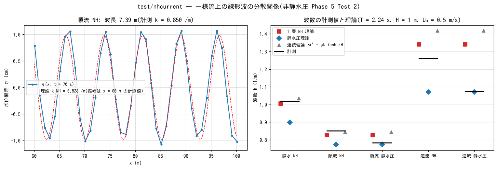

# test/nhcurrent — 一様流上の線形波の分散関係(非静水圧補正の Phase 5 Test 2)

一様流 U₀ の上を進む微小振幅波の分散関係が、1 層非静水圧補正
(`f_nonhydrostatic = 1`、docs/nonhydrostatic_plan.md §11 Phase 5 Test 2、
developer.md §69.8)でも

  (ω − U₀k)² = gH Λ(k) / (1 + βΛ(k))  (ENC の半離散 Λ、β = H²/4)

の形で成り立つことを、順流(波と流れが同じ向き)・逆流・静水の 3 条件と
静水圧計算で確かめる検定です。等流を両端の水位規定で保ち、片端の規定
水位を正弦振動させて波を出し、x = 60〜100 m のプローブ 41 点の位相の
x 勾配から波数 k を測ります(`Current.py`。計算本体の外)。順流 NH
(`param.txt`)が reference を持つ回帰ケースです。

## 構成

| 項目 | 値 |
|---|---|
| 水路 | 200 m × 8 m、800 × 32 セル(Δx = 0.25 m = H/4)、H = 1 m。河床勾配 S = 2.25e-4(`user_geoinfo` の `channel_slope`。西が高い)、n = 0.03 → 等流 U₀ = 0.5 m/s(Fr 0.16) |
| 境界 | 西端・東端の 1 列(32 セルずつ)を水位規定セル群にし、等流の水位を与える。波源側は正弦振動 a = 1 cm、T = 2.24 s(静水で kH ≈ 1)を `stage_w.txt` / `stage_e.txt`(0.1 s 刻み、最初の 2 周期で立ち上げ)で与える |
| NH | 1 層補正、CG(`nh_solver = 2`、`nh_tol = 1e-6`)。規定境界から nh_bc_margin(2H/Δx)以内は静水圧(§69.8 の実バグ対策) |
| 時間 | dt = 0.02 s、110 s。プローブは x = 60.125〜100.125 m の 41 点(1 m 間隔) |

| 構成 | ファイル | U₀ | 波源 | 進行 |
|---|---|---|---|---|
| 順流 NH(回帰) | `param.txt` | 0.5 | 西端 | +x |
| 逆流 NH | `param_c.txt` | 0.5 | 東端 | −x |
| 静水 NH | `param_0.txt` | 0(平坦床) | 東端 | −x |
| 順流 静水圧 | `param_h.txt` | 0.5 | 西端 | +x |
| 逆流 静水圧 | `param_hc.txt` | 0.5 | 東端 | −x |
| 基底流の診断 | `param_osc.txt`(両端水位規定・波なし)、`param_osc_inflow.txt`(区間流入 + 下流水位規定) | 0.5 | なし | §69.9 の再現用 |

| ファイル | 内容 |
|---|---|
| `Run.sh` / `Run_MPI.sh N` | 順流 NH を実行し Log.txt を reference と比較(ULP = 1、Runge 列除外) |
| `Current.py [result_dir ...]` | 窓(順流 45〜95 s、逆流・静水 65〜100 s)の複素振幅 A(x) から k と振幅減衰を求め、NH・静水圧・連続理論の k と並べる |
| `Fig.py` | 下の図 `figs/nhcurrent.png` |

## 実行

```bash
make
./Run.sh                                   # 順流 NH(5500 ステップ、CG 平均 26 反復。数分〜)
for p in param_0 param_c param_h param_hc; do ./encflow $p.txt; done
python3 Current.py                         # 5 ケースの表
python3 Fig.py                             # figs/nhcurrent.png
```

## 図



左: 順流 NH の t = 70 s の水位偏差 η(x)(プローブ 41 点)と、計測した
振幅で描いた理論波数 k_NH の正弦波。波長 7.3 m の波列が位相を揃えて
乗っています。右: 5 ケースの計測 k(黒線)と理論値。静水と順流の NH 計算は
1 層 NH 理論(赤)に乗り、静水圧理論(青)とは 10% 以上離れます。静水圧
計算は静水圧理論に乗ります。逆流(kH ≈ 1.3)は波が流れに逆らって進み、
群速度 c_g − U₀ が小さいため x = 60 m で振幅 0.02 cm まで減衰して位相の
精度が落ちます。

## 所見

| ケース | U₀ | 進行 | k 計測 | k NH 理論 | k 静水圧理論 | k/k_NH | k/k_hyd | 振幅(60 m) |
|---|---:|:-:|---:|---:|---:|---:|---:|---:|
| 静水 NH(param_0) | 0 | −x | 1.019 | 1.005 | 0.898 | 1.014 | 1.135 | 0.91 cm |
| 順流 NH(param) | 0.5 | +x | 0.851 | 0.828 | 0.774 | 1.027 | 1.099 | 0.98 cm |
| 順流 静水圧(param_h) | 0.5 | +x | 0.783 | 0.828 | 0.774 | 0.945 | 1.011 | 0.89 cm |
| 逆流 NH(param_c) | 0.5 | −x | 1.262 | 1.341 | 1.070 | 0.941 | 1.179 | 0.02 cm |
| 逆流 静水圧(param_hc) | 0.5 | −x | 1.074 | 1.341 | 1.070 | 0.801 | 1.003 | 0.17 cm |

(窓: 順流 45〜95 s、逆流・静水 65〜100 s。`python3 Current.py` の出力。
順流 NH の reference 比較は PASS)

- 静水で k が 1 層 NH 理論に +1.4%、順流で +2.7%(静水圧理論とは 10〜13%
  離れる)。静水圧計算は静水圧理論に +1.1%(順流)、+0.3%(逆流)。一様流上でも分散関係が
  (ω − U₀k)² の形で成り立つことの数値確認です。
- 逆流の NH(kH ≈ 1.3)は群速度 c_g − U₀ が小さく、x = 60 m で振幅
  0.02 cm まで減衰して位相の測定誤差が大きい(−6%)。より長い水路か
  大きい振幅で測るのが改善策です。
- **基底流の履歴**(§69.8〜69.9): 規定境界を貫く一様流が上流端のセル列から
  周期 ≈ 2 s で発振して発散する現象は、MUSCL(スキーム 3)の「さらに風上」
  upup が領域外の 0 を読んで反拡散になる実バグでした。修正後は既定の
  保存形移流で等流が定常(40 s で h − 1 = 0)に保たれ、このケースの
  reference は修正後に更新されています(2026-10-05、人間の目視確認)。
  区間流入の区間が壁の角で終わるときの角セルの緩い発振は別件で未解決
  (`param_osc_inflow.txt`。角の行から区間を外せば成長しない)。

## 関連文書

- [test/nhwave](../nhwave/)(閉水槽の定在波の分散関係)、[test/nhwave_nh](../nhwave_nh/)、[test/nhbore](../nhbore/)
- [docs/nonhydrostatic_plan.md](../../docs/nonhydrostatic_plan.md) §11 Phase 5
- developer.md §69.8(Test 2 と結果)、§69.9(基底流の発振の原因と修正)
