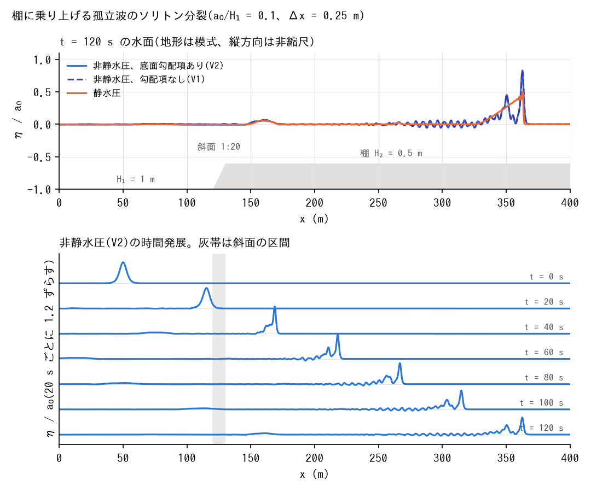

# test/nhshelf — 棚に乗り上げる孤立波のソリトン分裂(底面勾配項の検証)

docs/nonhydrostatic_plan.md §11 Phase 5(ソリトン分裂)・Phase 7(底面勾配項)、
developer.md §69.5。水深 1 m の平坦部 → 1:20 の斜面(x 120〜130 m)→
水深 0.5 m の棚(user_geoinfo `shelf_slope`)に、a/H = 0.1 の孤立波
(x0 = 50 m、`wave_solitary`)を入射。Δx = 0.25 m、32 行、120 s。

- `./Run.sh` / `./Run_MPI.sh N`: param.txt(NH、f_nh_slope=1、CG)の回帰テスト。
- `./encflow param_v1.txt`(勾配項なし)、`./encflow param_h.txt`(静水圧)を
  走らせてから `./Fission.py` で、最終時刻の棚上の水面の極大を数える。

## 図

上: t = 120 s の中央行の水面 η/a0(NH V2・V1・静水圧。地形は模式)。
下: NH(V2)の水面を 20 s ごとに並べたもの。斜面(灰帯)を越えた後、
先頭ソリトンと後続列に分裂していく。`./Fig.py` で `figs/fission.png` に
生成する。

## 所見(2026-10-05)

| 構成 | 棚上の山の数 | 先頭 η/H₂ | 2 番目 η/H₂ |
|---|---:|---:|---:|
| NH、底面勾配項あり(param.txt) | 6 | 0.163 | 0.090 |
| NH、勾配項なし(V1) | 6 | 0.166 | 0.090 |
| 静水圧 | 2(段波) | 0.100 | 0.071 |

NH は先頭ソリトンと後続列への分裂を再現し、静水圧は段波になる。
底面勾配項の効果は先頭で 2%。棚の手前の反射は 0.002 m で同じ。
