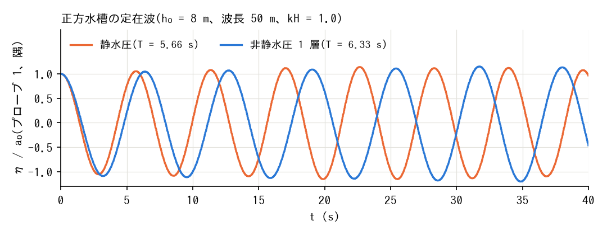
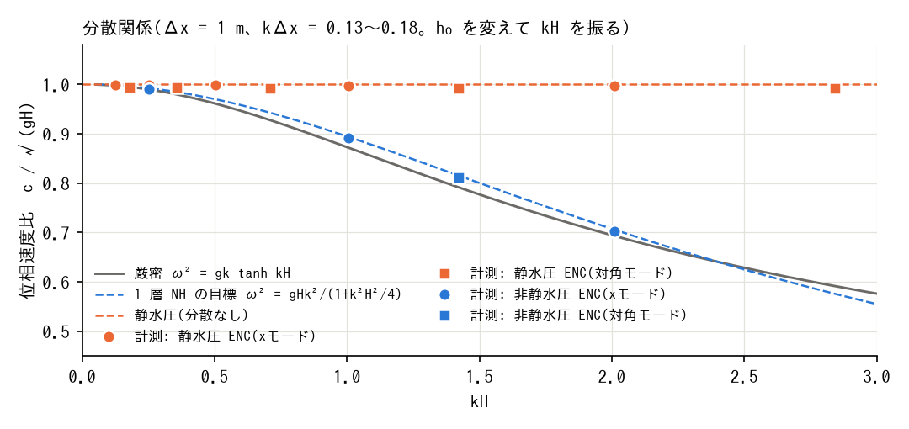

# test/nhwave_nh — 閉じた正方水槽の定在波(非静水圧 1 層補正の回帰テスト)

test/nhwave と同じ水槽(L = 100 m、Δx = 1 m、h0 = 8 m、x モード (4, 0)、
kH = 1.0)に 1 層非静水圧補正(f_nonhydrostatic=1、CG)を掛ける。
docs/nonhydrostatic_plan.md §11 Phase 4。目標周期は ω² = gHΛ/(1 + (H²/4)Λ)
→ 6.34 s(静水圧 5.67 s)。

- `./Run.sh` / `./Run_MPI.sh N`: 回帰テスト(Log.txt。Runge 列除外)。
- 分散関係の走査・所見・図は test/nhwave の README と `Fig.py` にまとめて
  ある(本ケースの結果を静水圧と重ねて描く)。

