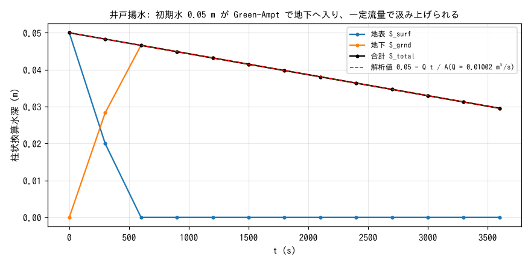
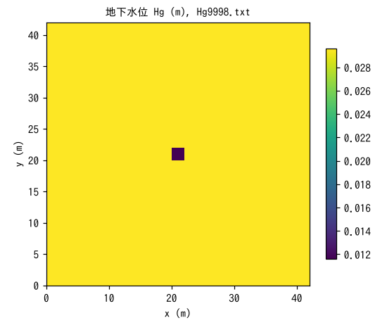

# test/pump — 井戸揚水シンク(f_gwpump)の質量収支

地下水から一定流量を汲み上げる**井戸揚水**(`&list_gwflow` の
`f_gwpump = 1`、`&list_gwflow_pump`。
[ユーザーガイドの地下水の章](../../docs/users_guide/gwflow.md))の
検証ケースです。平坦な閉領域に薄い初期水を置き、Green-Ampt 浸透で
地下へ入れたうえで、全セル等分配の井戸と中央 1 セルの井戸の 2 本で
汲み上げます。需要と実取水が厳密に一致し、全体の貯留が解析値どおり
直線的に減ることを確かめます(developer.md §16.3 の検証記録)。

## 構成

| 項目 | 値 |
|---|---|
| 領域・格子 | 42 m × 42 m、21 × 21 セル(Δx = 2 m)、平坦 z = 0、四周壁 |
| 土層 | 厚さ sd₀ = 1 m、比湧水量 sy₀ = 0.2 |
| 浸透 | Green-Ampt(`gw_ksv_mmh = 360` = 1e-4 m/s、`gw_psif = 0` で一定浸透能に退化)。側方流なし |
| 初期条件 | 地表水 h₀ = 0.05 m(地下水なし) |
| 井戸 1 | 全 441 セルに等分配(`data_pump/wells.txt`)、一定 0.01 m³/s |
| 井戸 2 | 中央セル (11, 11)、時系列指定の定数 2e-5 m³/s |
| 時間 | dt = 0.5 s、3600 s。地下水位 Hg を 1800 s 毎に出力 |

総揚水量 Q = 0.01002 m³/s を領域面積 A = 1764 m² で割ると、貯留の
減少速度は Q/A = 5.68e-6 m/s で、S_total(t) = 0.05 − Q t / A、
S_total(3600 s) = 0.029551020408163 m が解析値です。

| ファイル | 内容 |
|---|---|
| `param.txt` | 上記(reference あり) |
| `data_pump/wells.txt` | 井戸 1 のセルリスト(全セル) |
| `Fig.py` | 下の図 `figs/*.png` を描く |

## 実行

```bash
make
./Run.sh          # Log.txt を reference と比較(ULP = 1、Runge 列を除く)
./Run_MPI.sh 4
python3 Fig.py    # figs/storage.png, figs/map.png
```

## 図



地表の初期水 0.05 m は約 500 s で全量が地下へ浸透し(浸透能 1e-4 m/s
× 500 s = 0.05 m)、地下貯留 S_grnd が立ち上がります。合計 S_total は
最初から一定の傾き −Q/A で直線的に減り、解析値(破線)に重なります。
揚水は地表水の有無によらず最初から地下から汲まれています。



最終時刻(3600 s)の地下貯留 Hg(柱状換算水深)です。井戸 1 は全セル
等分配なので一様に下がり、中央セルだけが井戸 2 の分
(2e-5 m³/s × 3600 s / 4 m² = 0.018 m)だけ余分に低くなっています
(0.0296 → 0.0116 m)。側方流がないため隣接セルには広がりません。

## 所見

| 量 | 計算値 | 解析値 |
|---|---|---|
| S_total(3600 s) | 0.029551020408150 m | 0.029551020408163 m(相対差 4.5e-13) |
| 井戸 1 の需要 / 実取水 | 36.000 / 36.000 m³(100%) | 0.01 × 3600 |
| 井戸 2 の需要 / 実取水 | 0.072 / 0.072 m³(100%) | 2e-5 × 3600 |
| 中央セルの追加低下 | 0.0180 m | 0.072 m³ / 4 m² |

- 需要と実取水が厳密に一致し(画面末尾の `gwflow_pump: well n: demand /
  pumped` 行)、貯留の減少が解析値に 13 桁一致します。
- 需要が貯留を超える場合は初期貯留全量で頭打ちになり負値は出ません
  (§16.3: 需要 1 m³/s の過大ケースで 88.2 m³ 全量)。揚水による海水の
  誘引(test/salt 派生)も同節に記録があります。
- 回帰テストの規律: Log.txt が reference に一致、MPI np = 1, 2, 4 も同一
  であること。

## 関連文書

- [docs/users_guide/gwflow.md](../../docs/users_guide/gwflow.md) — 井戸揚水(`&list_gwflow_pump`: セルリスト・一定流量・時系列)、Green-Ampt
- developer.md §16.3(井戸揚水シンクの設計と検証記録)
