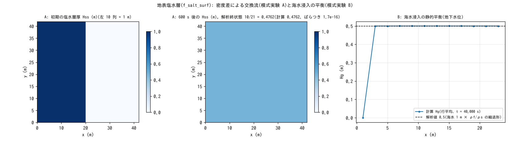

# test/salt — 地表塩水層(f_salt_surf)と海水浸入の平衡

淡水・塩水を密度の違う 2 つの層として扱う塩水モジュール(`fn_salt`、
[ユーザーガイドの塩水の章](../../docs/users_guide/salt.md)、developer.md §47)の
検定です。2 つの模式実験からなります。

1. **模式実験 A**(`param.txt`、reference あり): 一様水深 1 m の閉じた
   プールの左 10 列を塩水(厚さ 1 m)にして仕切りを外す「ロック交換」。
   密度差による交換流で塩水が底に広がり、終状態の塩水層厚が解析値
   10/21 m(塩水体積 / 全面積)に一様になる。地表水深 H は厳密に不変
   (交換流は層間の入れ替えだけ)。
2. **模式実験 B**(`param_sea.txt`、`Run_sea.sh`): 海(潮位 0 m、海水 1 m)に
   接する乾いた陸の帯水層に海水が浸入し、静的平衡で地下水位が
   Ghyben-Herzberg の縮退形 0.5 m に収束する。

## 構成

| 項目 | 模式実験 A | 模式実験 B |
|---|---|---|
| 領域・格子 | 42 m × 42 m、21 × 21 セル(Δx = 2 m)、平坦 z = 0、四周壁 | 24 m × 16 m、12 × 8 セル、陸 z = 1 m、西縁 1 列が海(`sw.txt`) |
| 水 | 一様 h₀ = 1 m、流速 0 | 陸は乾燥(h₀ = 0)。海セルの見かけ水柱厚 1 m、固定潮位 0 m |
| 塩水 | 地表塩水層 `f_salt_surf = 1`、ρf = 1000、ρs = 1025、界面粗度 0.025、初期 `hss0.txt`(左 10 列 = 1 m) | 地下塩水層。帯水層 sd₀ = 3 m(底 −2 m)、sy = 0.2、非線形 Boussinesq 側方流動(毎ステップ) |
| 時間 | dt = 0.1 s、600 s | dt = 0.25 s、40,000 s(分割誤差を抑えるため小さめの dt) |

| ファイル | 内容 |
|---|---|
| `Run.sh` / `Run_MPI.sh N` | A の回帰テスト(Log.txt、ULP = 0) |
| `Run_sea.sh` | B の実行(result_sea/) |
| `Fig.py` | 下の図 `figs/salt.png` |

## 実行

```bash
make
./Run.sh          # A: reference と比較
./Run_MPI.sh 4
./Run_sea.sh      # B(数秒)
python3 Fig.py    # figs/salt.png
```

## 図



左・中: 模式実験 A の塩水層厚 Hss。左 10 列に置いた 1 m の塩水が
600 s で全域に一様に広がり、終状態は解析値 10/21 = 0.4762 m に出力精度
(4 桁)で一致し、セル間のばらつきは機械精度(1.7e-16)です。この間、
地表水深 H は 1 セルも変わりません(交換流の設計どおり)。右: 模式実験 B の
地下水位 Hg(行平均、t = 40,000 s)。海に接する列を除いて 0.5000〜0.5002 m
で、解析値 0.5 m(海水 1 m × ρf/ρs の縮退形)に一致します。

## 所見

| 検定 | 計算値 | 判定 |
|---|---|---|
| A: 終状態の Hss | 0.4762 m 一様(解析 10/21 = 0.47619…)、ばらつき 1.7e-16 | reference PASS |
| A: 地表水深 H | 全時刻・全セルで厳密不変(max|ΔH| = 0.0) | — |
| A: 塩水体積 | 相対 2e-5(float32 出力の丸め内) | — |
| B: 地下水位 Hg | 0.5000〜0.5002 m(解析 0.5) | — |

- 塩水 zone の乾燥判定・過大流出抑制は側方流動と同じ飽和帯厚単位
  (b = hgs/sy)で書かれています(柱状量単位だと sy 倍保守的になり
  前線で塩水輸送だけが削られる系統誤差になる。実装時に実検出。§47.2)。
- 模式実験 B の塩水層厚 hgs には、側方流動が先に η を動かしてから塩水
  zone が更新後の η を読む逐次分割による 1 次の時間分割誤差があります
  (K = 0.01 m/s の極端ケースで dt = 1.0 → 5%、0.25 → 1.5%。平衡水頭は
  正しく、誤差は前線局所)。実用の K では無視できます(§47.2)。
- MPI np = 1, 2, 4 の Log はバイト一致、リスタート往復(saltwater.dat)も
  一致します(§47.3)。井戸揚水による海水の誘引は developer.md §16.3 の
  派生実験に記録があります。

## 関連文書

- [docs/users_guide/salt.md](../../docs/users_guide/salt.md) — 地表・地下の塩水層の設定
- developer.md §47(設計・既知の数値特性・検証記録)、[docs/swi_plan.md](../../docs/swi_plan.md)
