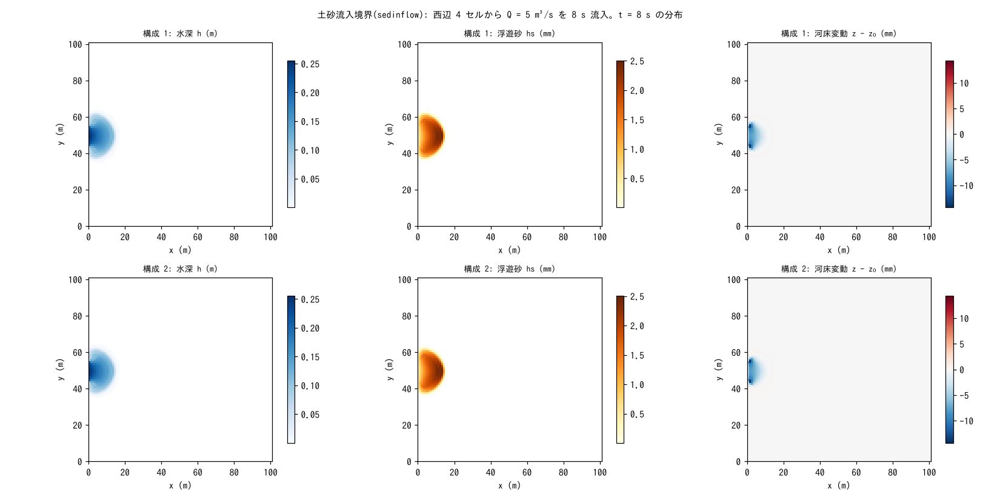

# test/sedinflow — 土砂流入境界(inflow_cs / inflow_qs)の台帳閉合

流入境界(`&list_bound_inflow`)に土砂濃度 `inflow_cs` または流砂量
`inflow_qs` の時系列を付け、水と一緒に土砂を注入する機能
(developer.md §19 の土砂流入)の検定です。乾いた閉領域の西辺 4 セルに
一定流入 Q = 5 m³/s を 8 s 与え、固体総量 Σhs + (1 − λ)Σ(z − z₀) が
流入土砂総量 C·Q·tt に機械精度で一致すること(濃度指定の注入が
「水量 × 濃度」で厳密であること)を `Check_sedinflow.py` で検定します。

## 構成

| 項目 | 値 |
|---|---|
| 領域・格子 | 101 m × 101 m、101 × 101 セル(Δx = 1 m)、平坦、乾いた床(h₀ = 0)、四周壁 |
| 流入 | 西辺 (1, 45)〜(1, 48) の 4 セル、Q = 5 m³/s 一定 |
| 土砂 | 構成 1 `param.txt`: 濃度 C = 0.001(体積濃度)。構成 2 `param_qs.txt`: 流砂量 Qs = 0.005 m³/s(= C·Q。cs と排他の指定) |
| 輸送 | 浮遊砂 `f_suspend = 1`(移流 + E-D)、sd₀ = 10 m、λ = 0.4 |
| 時間 | dt = 0.1 s、8 s |

| ファイル | 内容 |
|---|---|
| `Check_sedinflow.py <save>` | Σhs + (1 − λ)Σ(z − z₀) = C·Q·tt = 0.04 m·cell(機械精度)、Σh = Q·tt = 40 m³ |
| `Fig.py` | 下の図 `figs/sedinflow.png`(Run.sh は構成 1 を `save_serial/`、構成 2 を `save/` に残す) |

## 実行

```bash
make
./Run.sh          # 構成 1 → Check → 構成 2 → Check
./Run_MPI.sh 4
python3 Fig.py    # figs/sedinflow.png
```

## 図



上段が濃度指定、下段が流砂量指定。左: 8 s 後の水深。西辺から入った水が
扇状に広がります。中: 浮遊砂 hs。注入された土砂が流れとともに運ばれ、
右: 流入セルの直前で E-D により河床が 14 mm 洗掘されています(流入
直後の高速部)。Qs = 0.005 m³/s は cs = Qs/Q = 0.001 の等価濃度に
還元されるので、2 つの構成は同じ結果になります。

## 所見

| 構成 | Σh | 固体総量 | 流入土砂 C·Q·tt | 判定 |
|---|---|---|---|---|
| 1 濃度指定 | 40.000000 m³ | 0.0400000000 m·cell | 0.04 | PASS(閉合 ~1e-16) |
| 2 流砂量指定 | 40.000000 m³ | 0.0400000000 m·cell | 0.04 | PASS |

- 注入総量は Q·C·dt(または Qs·dt)の厳密加算で、按分は水の按分と
  連動します。Q = 0 の間は注入されず、Qs/Q ≥ 1 はクリップして警告します
  (§19)。
- 新しい保存状態はなく(時系列は入力、注入は無履歴)、save_version は
  不変です。MPI np = 1, 2, 4 の state.dat は逐次とバイト一致します。

## 関連文書

- [docs/users_guide/boundary.md](../../docs/users_guide/boundary.md) — 流入境界と `inflow_cs` / `inflow_qs`
- developer.md §19(土砂流入の実装・Qs 直接指定・検証記録)
