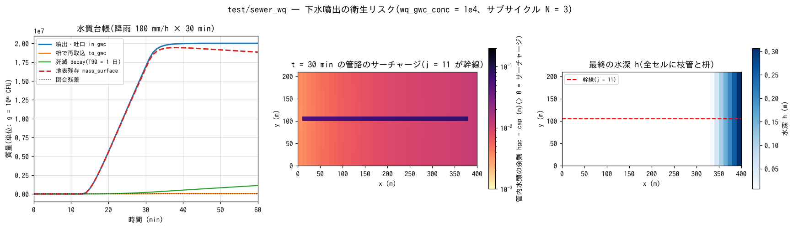

# test/sewer_wq — 下水噴出の衛生リスク(水質 × 管路連続体層)

[examples/sewer_hybrid](../../examples/sewer_hybrid/) のラン D(幹線 1 本 +
枝管網、セル別 sy / slot_sy)を短縮・自己完結化した回帰テストです。
降雨 100 mm/h × 30 min(計 51.7 mm)が管内貯留(約 16 mm)を超えて
サーチャージ・噴出を起こし、噴出水・吐口水を「下水 10⁶ CFU/100 mL」
(単位の読み替え g = 10⁶ CFU → `wq_gwc_conc = 1e4`)として大腸菌の拡散と
死滅(T90 = 1 日、`wq_k20 = 2.303`)を追います。水質モジュールの**供給側
固定濃度近似**(developer.md §30)と、管路層の (4) サブサイクリング
(dt = 0.1 s → N = 3)・(5) セル別 sy / slot_sy(§46.5)を同時に検査します。
実務手順の正本は [users_guide/wq.md](../../docs/users_guide/wq.md) の
「下水噴出の衛生リスク評価」です。

## 構成

| 項目 | 値 |
|---|---|
| 領域・格子 | 400 m × 210 m、40 × 21 セル(Δx = 10 m)。東へ下る一様斜面(z 7.975 → 6.025 m)、閉境界 |
| 降雨 | 0〜30 min に 100 mm/h、以後 0 |
| 管路層 | 全セルに枝管(D = 0.4 m、埋設 2 m)と枡、行 j = 11 に幹線(D = 1.0 m、埋設 5 m)。容量 cap・通水能 cnd・管底 bot・sy・slot_sy はセル別マップ(`data_sewer/*_T.txt`) |
| 水質 | 管路からの噴出・吐口水を濃度 1e4 の供給源とする(`f_wq_gwc_in = 1`)、死滅 k20 = 2.303 /day |
| 時間 | dt = 0.1 s、1 h。管路層はサブサイクル N = 3(dt 上限 3.72e-2 s) |

| ファイル | 内容 |
|---|---|
| `Run.sh` / `Run_MPI.sh N` | Log.txt(水収支)と wq.csv(物質収支。管路連携の in_gwc_g / to_gwc_g 列を含む)を reference と比較。release ビルドでは RTOL = 1e-5(下記) |
| `Fig.py` | 下の図 `figs/sewer_wq.png` |

## 実行

```bash
make
./Run.sh          # 1 h の計算(約 10 秒)+ reference 比較
./Run_MPI.sh 2
python3 Fig.py    # figs/sewer_wq.png
```

## 図



左: wq.csv の台帳。降雨開始から 13 分で管路が満管になり噴出が始まり
(in_gwc)、30 分の降雨終了までに 2.0e7 単位(= 2e13 CFU)が地表へ出ます。
枡からの再取込(to_gwc)は噴出の 0.25%、死滅は 1 時間で 5.6% で、残りが
地表に残ります。閉合残差(点線)はゼロです。中: 降雨終了時の管路の
サーチャージ(管内水頭 hgc − 容量 cap)。幹線は枝管の約 10 倍の余剰水頭を
持ち、枝管網は東(下流)ほどサーチャージが大きい。右: 最終の水深。噴出した
水は斜面を東へ流れ、閉境界の東端に 0.3 m 溜まります。

## 所見

| 量 | 計算値(t = 1 h) |
|---|---|
| 噴出・吐口 in_gwc | 2.0006e7 |
| 枡で再取込 to_gwc | 4.943e4 |
| 死滅 decay | 1.118e6 |
| 地表残存 mass_surface | 1.884e7 |
| 閉合 in − to − decay − surface | −0.34(相対 1.7e-8 = 表示 8 桁の丸め) |
| 水収支 S_total(1 h) | 積算雨量 51.67 mm(閉境界) |
| 回帰 | Log.txt・wq.csv が reference と一致 | 

- 本ケースは release(-Ofast -march=native -flto)の同一バイナリ以外との
  ULP = 0 比較が成立しません(Runge サブステップの閾値敏感性がビルド差を
  相対 5e-6 に増幅。§10)。release の回帰は `RTOL = 1e-5` で判定し、
  実装バグの検出は -Og -fcheck=all での逐次 = np2 ビット一致(nightly の
  debug-fcheck 層、RTOL = 0)が担います。
- 供給側固定濃度近似: 噴出水の濃度は管内の濃度を追跡せず `wq_gwc_conc`
  で与えます(管内の希釈は無視 = 安全側)。
- 管路層のみの水理は [test/coastal_drain](../coastal_drain/)、地下経路の水質は
  [test/gwseep](../gwseep/)。

## 関連文書

- [docs/users_guide/wq.md](../../docs/users_guide/wq.md) — 「下水噴出の衛生リスク評価」、`wq_gwc_conc`、`f_wq_gwc_in`
- [docs/users_guide/gwflow.md](../../docs/users_guide/gwflow.md) — 管路連続体層のセル別マップ
- developer.md §30(水質の供給側固定濃度)、§46.5 (4)(5)
