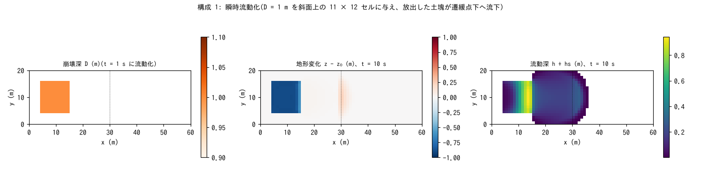
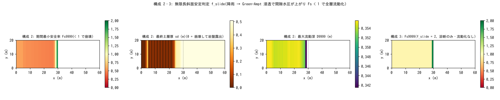

# test/slide — 瞬時流動化(f_release)と斜面安定判定(f_slide)の疎通と保存則

地滑り型の土砂流動の 2 つの発生機構の検定です(developer.md §28.1、§28.9)。

1. **瞬時流動化 f_release**(`param.txt`): 崩壊深分布 `fn_dbinit` を与え、
   指定時刻 `db_reltime` に一斉に流動化する(地滑り型の初期条件)。
   転換は hs += (1 − λ)D、z −= D、sd −= D で固体台帳が構造的に閉じ、
   間隙水 λ·relsat·D が地表水になる。
2. **斜面安定判定 f_slide**(`param_fs.txt`、`param_fs2.txt`): 無限長斜面の
   安全率 Fs = (c′ + (γt sd − γw hw) cos²θ tanφs)/(γt sd sinθ cosθ) を
   セルごとに評価し、Green-Ampt 浸透で間隙水圧が上がって Fs < 1 に
   なったセルを全層流動化する(sd = 0 = 岩盤露出)。`f_slide = 2` は
   診断のみ(Fs を出力するが流動化しない危険度マップ)。

reference 比較ではなく `Check_slide.py` の自己検定(保存則・水収支・
活性・危険度出力の整合)で合否を決めます。

## 構成

共通: slope_break 地形(tanθ = 0.4 の斜面 → x = 30 m から平坦)、
60 m × 20 m(Δx = 1 m)、クーロン + マニング合成抵抗、低速凝集で停止。

| 構成 | ファイル | 内容 | 時間 |
|---|---|---|---|
| 1 release | `param.txt` | 可動層 5 m。崩壊深 D = 1 m を i ∈ [5, 15], j ∈ [5, 16](`make_dbinit.py`)に与え、t = 1 s に流動化(relsat = 1、φ = 30°) | dt 0.02 s、10 s |
| 2 fslide | `param_fs.txt` | 薄い土層 sd₀ = 0.5 m、sy = 0.3。降雨 → Green-Ampt 浸透 → `f_slide = 1`。危険度出力 Fs9999・D9999・Dt9999・F9999・Hs を有効化 | dt 0.05 s、400 s |
| 3 fsdiag | `param_fs2.txt` | 構成 2 と同じで `f_slide = 2`(診断のみ) | 同上 |

| ファイル | 内容 |
|---|---|
| `Check_slide.py <save> release|fslide|fsdiag [result]` | release: (1) 固体総量、(2) 共動更新、(3) 水収支 Σh = λ relsat ΣD、(4) 活性。fslide: (1)(2)、(4) 斜面に sd = 0 のセル、(5) 危険度出力 min Fs9999 < 1・D9999 ≥ H9999。fsdiag: (1) 無流動化(z・sd・hs 不変)、(2) Fs の危険域検出 |
| `Fig.py` | 下の図 `figs/*.png` |

## 実行

```bash
make
./Run.sh          # dbinit 生成 → 3 構成を実行し Check。すべて PASS で PASS(数秒)
./Run_MPI.sh 4    # MPI。state.dat と出力ファイル(Fs9999 等)が逐次とバイト一致
python3 Fig.py    # figs/release.png, figs/fslide.png
```

## 図



構成 1。左: 崩壊深 D = 1 m の崩壊域。中: 10 s 後の地形変化。崩壊域は
約 0.9 m 低下し(放出 1 m のうち一部が直後に再堆積)、遷緩点の下流に
最大 0.22 m の堆積が始まっています。右: 流動深 h + hs。放出された
土塊が崩壊域から遷緩点を越えて平坦部へ扇状に広がっています。



構成 2(左 3 枚)と 3(右)。左: 期間最小安全率 Fs9999。斜面全体で
Fs < 1(最小 0.455)になり、遷緩点付近の緩い部分だけ Fs > 1 です。
中左: 最終土層厚 sd。斜面の多くのセルで sd = 0(崩壊して岩盤が露出。
240 セル)になり、崩壊した土砂が流下して再堆積した縞も見えます。
中右: 最大流動深 D9999(最大 0.36 m)。右: 構成 3 の Fs9999。流動化
しないので Fs の最小は 0.943 にとどまり、危険域(< 1)の検出だけが
行われます(診断モードの危険度マップ)。

## 所見

| 構成 | 固体総量 | 共動更新 | 水収支 / 活性 | 判定 |
|---|---|---|---|---|
| 1 release | 1e-13 | 9e-14 | Σh = 52.8000(期待 λ relsat ΣD = 52.8000)/ 崩壊域 min dz −0.90 m、域外堆積 +0.22 m | PASS |
| 2 fslide | 8e-12(許容 1e-8: 約 2 万セル回の転換の丸め累積) | 9e-14 | 斜面 min sd = 0(240 セル崩壊)/ min Fs9999 0.455、D9999 ≥ H9999 | PASS |
| 3 fsdiag | — | — | z・sd・hs 不変、min Fs 0.943 < 1 を検出(600 セル評価) | PASS |

- 流動化の発火は時刻交差判定で 1 回だけで、リスタート後も再発火しません
  (§28.1)。放出間隙水の水収支が 6 桁で一致します。
- f_slide は gwflow の浸透進行が発生時刻を決めるセル独立の判定
  (側方支持なし = SHALSTAB 系と同水準)で、堆積で sd が再生すれば再判定
  (進行性崩壊)されます。統計出力(Fs9999 等)は save に入らないため、
  ランク数不変の検証は出力ファイルで行います(`Run_MPI.sh` が恒常化)。
- 流体力 F9999 = (h + hs)V² は混合体密度込みで、τ_y ケースで ρm/ρw ≈ 2 倍に
  なることを確認しています(§28.9)。

## 関連文書

- [docs/users_guide/geomorph.md](../../docs/users_guide/geomorph.md) — `fn_dbinit`・`db_reltime`・`db_relsat`、`f_slide`、危険度出力 `f_out_fs` 等
- developer.md §28.1(f_release / f_slide の構成)、§28.9(危険度出力)、§28.3〜28.5(検証記録と MPI のビット比較の流儀)
