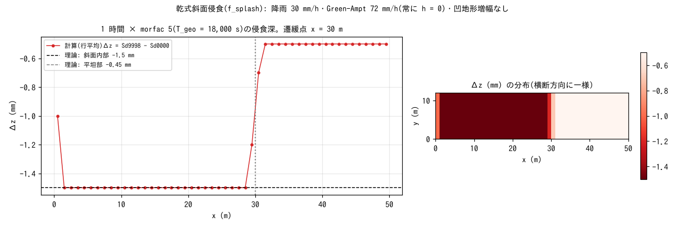

# test/splash — 乾式斜面侵食(f_splash)の解析検証

無流水の斜面で働く**乾式斜面侵食**(`f_splash = 1`: 雨滴侵食 +
サブグリッドリル侵食、凹地形増幅つき。developer.md §48、docs/splash_plan.md)の
解析検証です。遷緩点付き斜面(slope_break)に一様降雨 30 mm/h を与え、
Green-Ampt 浸透能 72 mm/h > P で地表流を発生させず(常に h = 0)、侵食は
f_splash だけが担います。凹地形増幅を切る(`spl_ca = spl_cb = 0`)と
侵食深が解析的に

  Δz = P (spl_kr + spl_kt S^spl_h) T_geo

で決まり、斜面内部・平坦部の値と排出台帳を比べます。reference 比較の
回帰テストで、reference は解析一致を根拠に確定しています(§48)。

## 構成

| 項目 | 値 |
|---|---|
| 領域・格子 | 50 m × 12 m、50 × 12 セル(Δx = 1 m)。slope_break(tanθ = 0.4 → x = 30 m から平坦) |
| 降雨・浸透 | 30 mm/h 一様、Green-Ampt `gw_ksv_mmh = 72`(psif = 0 → 一定浸透能)。全時間 h = 0 |
| 侵食 | `spl_kr = 0.003`、`spl_kt = 0.0175`、`spl_h = 1`、増幅なし。空隙率 0(poroi = 1) |
| 時間 | dt = 1 s、1 h。地形更新 10 s 毎 × morfac 5 → T_geo = 18,000 s |
| 理論値 | 斜面内部 Δz = 8.33e-6 × (0.003 + 0.0175 × 0.4) × 18000 = 1.5 mm |

| ファイル | 内容 |
|---|---|
| `Run.sh` / `Run_MPI.sh N` | Log.txt を reference と比較(ULP = 0) |
| `Fig.py` | 下の図 `figs/splash.png`(Sd9998 − Sd0000 = Δz を使う) |

## 実行

```bash
make
./Run.sh
./Run_MPI.sh 4
python3 Fig.py    # figs/splash.png
```

## 図



左: 行平均の侵食深 Δz の縦断。斜面内部は理論値 1.5 mm に**全桁一致**し、
斜面上端の列(鏡像境界)と遷緩点の 2 列(中央差分の勾配が両側の平均に
なる)だけが別の値になります。平坦部は 0.50 mm で、雨滴項だけの
0.45 mm よりわずかに大きい値です(勾配評価が中央差分で遷緩点の影響が
及ぶ列は 1〜2 列ですが、平坦部全体が 0.50 mm になるのは勾配項の離散化
の性質。reference と一致)。右: 分布。横断方向に厳密に一様です
(行間偏差 0.0)。

## 所見

| 量 | 値 |
|---|---|
| 斜面内部の Δz | 1.5000 mm(理論 1.5 mm) |
| 平坦部の Δz | 0.500 mm(雨滴項のみ 0.45 mm) |
| 侵食体積 Σ|Δz| Δx² | 0.653 m³ |
| 横断方向の偏差 | 0.0 |
| MPI | np = 1, 2, 4 が逐次 reference に ULP = 0(§48) |

- 乾式侵食は「崖下 = 海」の新島型の地形発達(台地無傷・端部谷)を
  再現するための Phase 1 で、侵食物は全量排出します(容量式の堆積は
  Phase 3)。模式実験と白色雑音版は [examples/badland](../../examples/badland/)、
  固結 / 未固結の対照は [test/splashslide](../splashslide/)。
- 濡れたセルでは働かず、湿潤斜面の侵食は [test/wash](../wash/) の f_wash が
  担います。

## 関連文書

- [docs/users_guide/geomorph.md](../../docs/users_guide/geomorph.md) — `f_splash`、`spl_*`
- [docs/splash_plan.md](../../docs/splash_plan.md) — 設計と Phase 2 以降の課題
- developer.md §48(実装・検証・白ママ対照)
