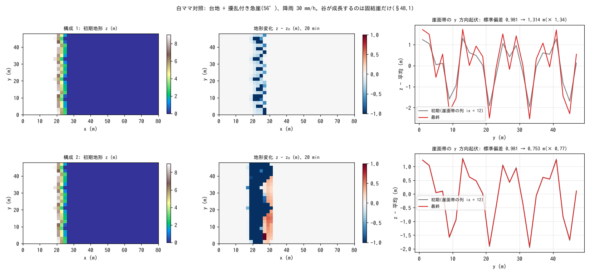

# test/splashslide — 固結 / 未固結の崖の対照(白ママ対照テスト)

乾式斜面侵食 f_splash で崖に谷が刻まれるかどうかは崖の固結度で決まる、
という仮説(新島の白ママ: 固結した火山灰の崖には谷が刻まれ、未固結の
崖は崩れて平滑になる)を数値で再現する対照テストです(developer.md
§48.1、docs/splash_plan.md §6.4)。同じ地形(台地 + 擾乱付きの 56° 崖)、
同じ降雨、同じ splash 係数で、

1. **固結崖**(`param_c.txt`): f_splash + 弱いクリープ。崖縁の y 方向起伏
   (谷の指標)が初期擾乱から成長する。
2. **未固結崖**(`param_l.txt`): + f_debris(等価流体)+ f_slide(c′ = 0、
   φs = 35°)。凹部が Fs < 1 で流動化し埋め戻されて起伏がリセットされる。

を走らせ、`Check_contrast.py` で起伏の成長率を検定します。

## 構成

| 項目 | 値 |
|---|---|
| 領域・格子 | 80 m × 48 m、40 × 24 セル(Δx = 2 m)。`make_terrain.py` が `z.txt`(台地 z = 9 m → 崖 → 平坦)を生成し、崖縁に ±0.5 m の y 方向擾乱を入れる |
| 降雨・浸透 | 30 mm/h、Green-Ampt(地表流なし) |
| 侵食 | `f_splash = 1`、`spl_kr = 0.0005`、凹地形増幅あり |
| 土層 | sd₀ = 1.3 m(≤ Δx·tanφs: c′ = 0 の連鎖崩壊が 1 セル段差で止まる条件) |
| 時間 | dt = 0.05 s、20 min。地形更新 1 s 毎 |

| ファイル | 内容 |
|---|---|
| `Check_contrast.py` | (1) 固結: relief(final)/relief(init) ≥ 1.25、(2) 未固結: ≤ 0.9、(3) 台地内部(x ≤ 6 m)は無傷(|Δz| < 0.05 m)、(4) 侵食の下限が有界(z ≥ −1.5 m) |
| `Fig.py` | 下の図 `figs/splashslide.png` |

## 実行

```bash
make
./Run.sh          # 地形生成 → 構成 1 → 2 → Check(数十秒)
./Run_MPI.sh 4    # MPI。state.dat が逐次とバイト一致
python3 Fig.py    # figs/splashslide.png
```

## 図



上段が固結崖、下段が未固結崖。左: 初期地形(崖縁の擾乱は両者同じ)。
中: 20 分後の地形変化。固結崖では崖面が擾乱の凹部ほど深く削られ
(谷の深化)、未固結崖では崖全体が崩れて斜面の下に堆積しています
(赤)。右: 崖面帯の列の y 方向起伏。固結では振幅が 0.98 → 1.31 m
(× 1.34)に成長し、未固結では 0.98 → 0.75 m(× 0.77)に減衰します。

## 所見

| 検定 | 固結崖 | 未固結崖 | 判定 |
|---|---|---|---|
| 起伏の成長率 | × 1.34(≥ 1.25) | × 0.77(≤ 0.9) | PASS |
| 台地内部 |Δz| | 0.0 | 0.0 | PASS |
| 最低標高 z | −1.22 m | −1.30 m(≥ −1.5) | PASS |

- 「谷形成の臨界条件は固結度」の仮説を、同一条件の 2 構成で数値的に
  再現しています。
- 設定の要点(splash_plan.md §6.4): c′ = 0 の連鎖崩壊は 1 セル段差の
  勾配 sd/Δx が tanφs を超える限り止まらないため sd₀ ≤ Δx·tanφs に
  する。土石流は `f_dbed = 0` + `f_dbstop = 1` の等価流体モードに限定
  (E-D 連行の自己加速を遮断)。
- このケースは帯界面のバグ(splash が帯内 z を更新した後に creep /
  fluvial がハロ行の古い z を読む)を実検出したケースでもあり、修正後は
  np = 1, 2, 4 がバイト一致します(§48.1)。creep は sd に触れないため
  z − sd は厳密不変ではありません(既知の妥協)。

## 関連文書

- [test/splash](../splash/)(乾式侵食の解析検証)、[test/slide](../slide/)(f_slide)
- [docs/splash_plan.md](../../docs/splash_plan.md) §6.4〜6.5、developer.md §48.1
