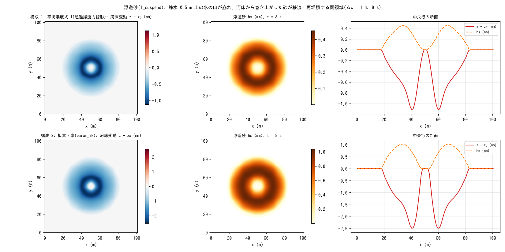

# test/suspend — 浮遊砂(f_suspend)の疎通と保存則: 2 つの平衡濃度式

浮遊砂モジュール(`&list_geomorph` の `f_suspend = 1`。河床との巻き上げ・
沈降 E-D と水柱内の移流。developer.md §19)の疎通・保存則の検定です。
閉領域の静水の上に水の山(wave_hump、+1 m)を置いて崩し、環状波の下で
巻き上がった砂が運ばれ再堆積する過程を、平衡濃度式 2 種で走らせます。
固体総量の保存・共動更新の恒等・活性を `Check_suspend.py` で検定します
([test/fluvial](../fluvial/) の掃流砂版に対応)。

## 構成

| 項目 | 値 |
|---|---|
| 領域・格子 | 101 m × 101 m、101 × 101 セル(Δx = 1 m)、平坦、四周壁 |
| 初期条件 | 静水 h₀ = 0.5 m + コサイン型の山(+1 m、半径 15 m) |
| 土層 | sd₀ = 10 m、空隙率 λ = 0.4 |
| 時間 | dt = 0.1 s、8 s(毎ステップ更新、morfac = 1) |

| 構成 | ファイル | 平衡濃度式 `f_esform` |
|---|---|---|
| 1 | `param.txt` | 1: 超過掃流力に線形(係数 `susp_esa = 1e-4`) |
| 2 | `param_ik.txt` | 2: 板倉・岸 |

| ファイル | 内容 |
|---|---|
| `Check_suspend.py <save>` | (1) 固体総量 |Σhs + (1 − λ)Σ(z − z₀)| < 1e-9、(2) 共動更新 max|(sd − sd₀) − (z − z₀)| < 1e-10、(3) 活性 max hs > 閾値かつ max|z − z₀| > 閾値 |
| `Fig.py` | 下の図 `figs/suspend.png`(Run.sh は構成 1 を `save_serial/`、構成 2 を `save/` に残す) |

## 実行

```bash
make
./Run.sh          # 構成 1 → Check → 構成 2 → Check(数秒)
./Run_MPI.sh 4    # MPI。state.dat が逐次とバイト一致
python3 Fig.py    # figs/suspend.png
```

## 図



上段が構成 1、下段が構成 2。左: 河床変動。水の山が崩れて流速が最大に
なる半径 5〜10 m の環で洗掘され(構成 1 で 1.1 mm、2 で 2.5 mm)、
中心と外側に再堆積します。中: 水柱内の浮遊砂 hs。環状波の下で
巻き上がった砂が波とともに外へ運ばれています。右: 中央行の断面。
板倉・岸式は同じ流れで 2 倍以上の巻き上げになり、式の違いが
そのまま量に出ます(どちらも校正前提の経験式)。

## 所見

| 構成 | 固体総量 | 共動更新 | max hs / max|dz| | 判定 |
|---|---|---|---|---|
| 1 線形式 | 0.0 | 1.2e-14 | 0.45 mm / 1.13 mm | PASS |
| 2 板倉・岸 | 0.0 | 1.3e-14 | 1.04 mm / 2.53 mm | PASS |

- morfac = 1 では E-D の交換が厳密に反対称で、固体総量は機械精度で保存
  されます(MORFAC の台帳分離: 水柱側は水理時間、河床側は × morfac。§19)。
- 乾燥セル(h ≤ dd)では浮遊分を全量河床へ繰り入れ、水のない浮遊砂を
  残しません。
- 土砂流入境界は [test/sedinflow](../sedinflow/)、斜面侵食(ウォッシュ
  ロード)は [test/wash](../wash/)、Kd 分配との結合は [test/kdpart](../kdpart/)。

## 関連文書

- [docs/users_guide/geomorph.md](../../docs/users_guide/geomorph.md) — `f_suspend`、`f_esform`、沈降速度(`susp_wf` / Rubey 式)
- developer.md §19(浮遊砂の実装・MORFAC の台帳分離・検証記録)、§62(係数の既定値)
