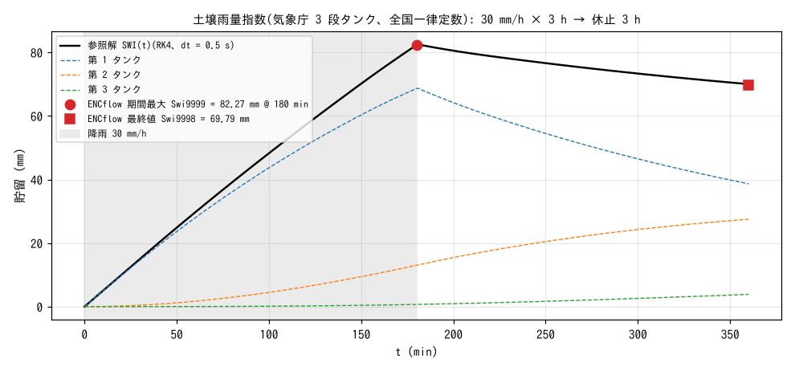

# test/swi — 土壌雨量指数(f_swi)の 3 段タンク参照解との比較

土砂災害警戒の実務指標「土壌雨量指数」(SWI)をセル別に計算する
純診断モジュール(`fn_swi`、developer.md §49)の検定です。気象庁の
3 段直列タンク(石原・小葉竹 1979 の全国一律定数)を、RK4(dt = 0.5 s)で
高分解能に積分した参照解と比べ、最終値・期間最大・発生時刻・空間一様性
を `Check_swi.py` で判定します(reference 比較なし)。

## 構成

| 項目 | 値 |
|---|---|
| 領域・格子 | 10 km × 8 km、10 × 8 セル(np = 4 でもランクあたり 2 行)、平坦 |
| 降雨 | 30 mm/h を 3 h、その後 1 分の線形ランプで 0 へ、休止 3 h(計 6 h) |
| SWI | `f_swi = 1`、初期貯留 0(先行降雨なし)。dt = 60 s(気象庁の計算間隔 10 分以下) |
| タンク定数 | 流出孔高さ L1〜L4 = 15, 60, 15, 15 mm、流出係数 A1〜A4 = 0.1, 0.15, 0.05, 0.01 /h、浸透係数 B1〜B3 = 0.12, 0.05, 0.01 /h |
| 出力 | SWI 現在値 Swi、期間最大 Swi9999、発生時刻 Swit9999(有効時は常時出力) |

**注意**: 降雨テーブル(`prtype = 1`)は線形補間です。矩形波のつもりで
(0, 30), (180, 0) と書くと 3 時間かけて漸減します。ベンチマークでは
終端を二重に打って明示的な短いランプにしています(§49。実検出)。

| ファイル | 内容 |
|---|---|
| `Check_swi.py <result>` | (1) 最終値 Swi9998 が参照解に相対 1% 以内、(2) 期間最大 Swi9999、(3) 発生時刻 Swit9999 が ±2 min、(4) 全セル同値 |
| `Fig.py` | 下の図 `figs/swi.png`(参照解の計算は Check と同じ) |

## 実行

```bash
make
./Run.sh          # 実行 → Check(1 秒)
./Run_MPI.sh 4    # MPI。state.dat・swi.dat・Swi 出力が逐次とビット一致
python3 Fig.py    # figs/swi.png
```

## 図



参照解の SWI(t)(黒)と 3 つのタンクの貯留(破線)。降雨中は第 1 タンクが
2 つの流出孔(15 mm、60 mm)を跨いで増え、降雨停止直後(180.8 min)に
SWI が最大 82.5 mm に達し、休止中は第 1 タンクから第 2・3 タンクへ水が
移りながら全体が減ります。ENCflow の期間最大(●)と最終値(■)は
参照解に 0.3% で乗っています。

## 所見

| 検定 | ENCflow | 参照解 | 判定 |
|---|---|---|---|
| 最終値 SWI(6 h) | 69.79 mm | 70.02 mm(−0.33%、許容 1%) | PASS |
| 期間最大 | 82.27 mm | 82.49 mm(−0.28%) | PASS |
| 発生時刻 | 180.0 min | 180.8 min(±2 min) | PASS |
| 空間一様性 | max − min = 0.0 | — | PASS |

- dt = 60 s の陽解法で参照解に 0.3% の差は、第 1 タンクの流出孔を跨ぐ
  区間の時間離散化によるもので、気象庁の 10 分間隔より十分細かい
  条件です。
- タンク貯留 3 面はモジュール私有の `swi.dat` でリスタートされ、
  最大値統計は save 対象外です(§7 の流儀)。3 h で分割したリスタート
  往復で SWI・swi.dat ともビット一致(§49)。

## 関連文書

- [docs/users_guide/swi.md](../../docs/users_guide/swi.md) — `&list_swi`、出力
- developer.md §49(実装・検証・降雨テーブルの注意)
