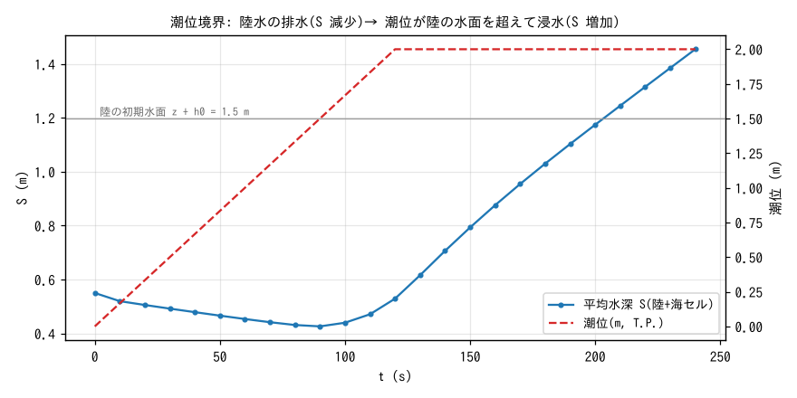
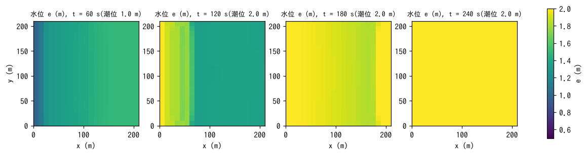

# test/tide — 潮位境界(m_tide)の疎通と既定値の同値検定

海域セルに潮位の時系列を与える潮位境界(`fn_tide`、
[ユーザーガイドの潮位の章](../../docs/users_guide/tide.md))の最小ケース
です。平坦な陸(z = 1 m、初期水深 0.5 m)の西縁 1 列を海域マスク
(`sw.txt`)で海にし、潮位を 0 → 2 m に上げます。陸の水は海へ排水
され(S 減少)、潮位が陸の水面 1.5 m を超えると陸へ浸水する(S 増加)
という、排水と浸水の両方向の疎通を 4 分間で確かめます。あわせて、
`&list_tide` を空にした既定値の構成と既定値を明示した構成が
ビット一致することを検定します(developer.md §67)。

## 構成

| 項目 | 値 |
|---|---|
| 領域・格子 | 210 m × 210 m、21 × 21 セル(Δx = 10 m) |
| 地形・粗度 | 陸 z = 1 m 一様、Manning n = 0.02 |
| 海域 | 西縁 1 列(x < 10 m)が海(`sw.txt`)。`f_masktype = 2` で領域マスクを海域マスクから自動生成 |
| 初期条件 | 陸の水深 0.5 m(水面 1.5 m T.P.)、流速 0 |
| 潮位 | `titype = 2` の一様時系列: 0 min で 0 m、2 min で 2 m、以後 2 m。更新間隔 0.1 min。海セルの見かけ水柱厚 `hsea0 = 1 m` |
| 時間刻み | dt = 0.2 s、240 s。水位 E を 60 s 毎に出力 |

海セルは「水位を規定する境界」で、`s%z = 潮位 − hsea0`、`s%h = hsea0`
に毎更新で強制されます。海セル自体の流れは解かず、陸側の排水・浸水は
通常の浅水計算です。

| ファイル | 内容 |
|---|---|
| `param.txt` | 構成 1(上記。reference あり) |
| `param_min.txt` | 構成 2: `&list_tide` を空にする(既定 = 一様固定潮位 0 m、hsea0 = 1 m) |
| `param_minx.txt` | 構成 2': 既定値を明示(`titype = 1`、`ti0 = 0`、`hsea0 = 1`) |
| `sw.txt` | 海域マスク(西縁 1 列が 1) |
| `Fig.py` | 下の図 `figs/*.png` を描く |

## 実行

```bash
make
./Run.sh          # 構成 1 を reference と比較 → 構成 2 と 2' を実行し result_min と result_minx の
                  # バイト一致(diff -r)と "(default)" 表示を検定。両方通れば PASS
./Run_MPI.sh 4    # MPI 4 ランク(構成 1)
python3 Fig.py    # figs/storage.png, figs/map.png
```

## 図



画面出力の平均水深 S(陸と海セルの合計を領域面積で割った値)と潮位
です。潮位が陸の初期水面 1.5 m より低い間(t < 90 s)は陸水が海へ
排水されて S が減り、潮位が 1.5 m を超えた t = 90 s でちょうど極小
(0.426 m)になり、以後は海から陸へ浸水して S が増え続けます。
潮位が 2 m で頭打ちになった後(t > 120 s)も、陸の水面が 2 m に
追いつくまで一定の速さで浸水が進みます。



水位 e = z + h の分布です。t = 60 s は排水中で西縁(海側)ほど水面が
低く、t = 120 s は浸水の前線が海から 60 m ほど入ったところ、
t = 180 s では前線が東端近くまで達し、t = 240 s には全域が潮位 2 m
の水面に揃います。

## 所見

| 量 | 値 |
|---|---|
| S(t = 0) | 0.5500 m(陸 0.5 m × 20 列 + 海 1 m × 1 列の平均) |
| S の極小 | 0.4261 m(t = 90 s。潮位 = 陸の水面 1.5 m の時刻) |
| S(t = 240 s) | 1.4544 m(全域が水面 2 m に接近) |
| 構成 2 と 2' | result/ がバイト一致、Screen に `titype = 1 (default)` の表示 |

- 排水 → 浸水の切り替わりが潮位と陸の水面の大小関係どおりの時刻に
  起きること、浸水の前線が海から一様に進むこと(y 方向一様)が確認
  できます。
- 既定値の同値検定は、「`&list_tide` を書くだけで固定潮位 0 m の海に
  なる」最簡の使い方(干潮排水・流域の海への出口)を保証するものです
  (§67)。
- 潮位境界の上に沿岸堤防(天端高)を置く検証(天端未満では陸が不変、
  超過後に浸水、フラップゲート)は developer.md §17 の検証記録に
  あります。
- 回帰テストの規律: 構成 1 の Log.txt が reference に一致(Runge 列を
  除き ULP = 1)、MPI np = 1, 2, 4 も同一であること。

## 関連文書

- [docs/users_guide/tide.md](../../docs/users_guide/tide.md) — 潮位の与え方(titype 1〜4)、hsea0、更新間隔
- [docs/users_guide/geoinfo.md](../../docs/users_guide/geoinfo.md) — 海域マスク `fn_sw`、`f_masktype = 2`
- developer.md §17(沿岸堤防と海域の扱い)、§67(潮位の最小入力と既定値)
