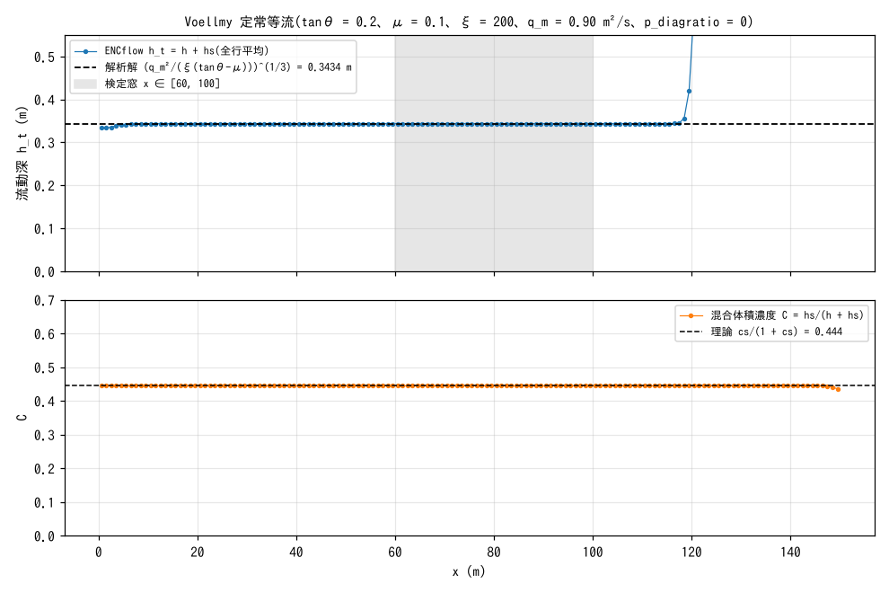
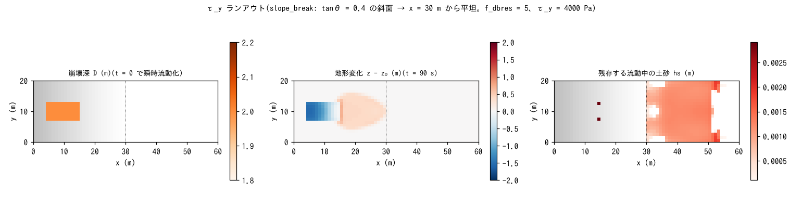

# test/volcano — 火山流動の等価流体モード: Voellmy 定常等流の解析解と τ_y ランアウト

火砕流・ラハール・溶岩様の重力流を、河床との土砂交換なしの**等価流体**
(`f_debris = 1`、`f_dbed = 0`)として流す構成の検証ケースです
(developer.md §28.8)。2 つの構成からなります。

1. **Voellmy 定常等流**(`param.txt`): 等勾配斜面に混合体を一定流入させ、
   Voellmy 抵抗則(`f_dbres = 4`: μ + g V²/(ξ h))の等流深の解析解
   h_t = (q_m²/(ξ(tanθ − μ)))^{1/3} と比べる定量ベンチマーク。水・固体の
   台帳(収支)も検定する。
2. **τ_y ランアウト**(`param_ty.txt`): 一定停止応力 τ_y + マニング合成
   (`f_dbres = 5`)で、斜面上の土塊を瞬時流動化 → 流下 → 平坦部で堆積 →
   停止・河床固定、という一連の挙動と固体台帳を検定する。

reference 比較ではなく `Check_volcano.py` の自己検定で合否を決めます。
同じ等価流体構成は流れ型雪崩にも使います([test/avalanche](../avalanche/))。

## 構成

| 項目 | 構成 1: Voellmy 等流 | 構成 2: τ_y ランアウト |
|---|---|---|
| 地形 | 等勾配斜面 tanθ = 0.2、150 m × 8 m(Δx = 1 m。`make_init.py z`) | slope_break: tanθ = 0.4 の斜面 → x = 30 m から平坦。60 m × 20 m |
| 供給 | 西端 8 セルから 4 m³/s、土砂濃度 cs = 0.8 → 単位幅 q_m = 0.9 m²/s | 崩壊深 D = 2 m を斜面上 i ∈ [5, 15], j ∈ [8, 13] に与え t = 0 で瞬時流動化(`f_release`) |
| 抵抗則 | Voellmy μ = 0.1、ξ = 200 m/s² | τ_y = 4000 Pa + マニング n = 0.03 |
| ENC | `p_diagratio = 0`(4 近傍化。下記注意) | 既定(8 方向) |
| 時間 | dt = 0.02 s、120 s(定常到達) | dt = 0.02 s、90 s(全停止) |
| 空隙率 | λ = 0.4(C* = 0.6。台帳の (1 − λ) に使用) | 同左 |

**注意(構成 1 の 4 近傍化)**: 解析解との比較は `p_diagratio = 0` で行います。
8 方向配分では、斜めエッジの「勾配低下 × 降伏 μ」の非線形により実効
通水能が下がり、1 次元の解析解と 24% ずれます。これはスキームの特性で
あってバグではなく、実地形計算では既定の 8 方向のまま使います(§28.8)。
また帯分割はランクあたり 2 行以上が必要なため ny = 8 にしています。

| ファイル | 内容 |
|---|---|
| `param.txt` / `param_ty.txt` | 構成 1 / 2 |
| `make_init.py z` / `db` | `zinit.txt`(等勾配斜面)/ `dbinit.txt`(崩壊深分布) |
| `Check_volcano.py <save> voellmy|tauy` | 構成 1: (1) 水台帳、(2) 固体台帳、(3) 検定窓 x ∈ [60, 100] の <h_t> と解析解・等流性・濃度。構成 2: (1) 固体台帳、(2) 活性(放出域の低下と平坦部の堆積)、(3) 停止(残存 hs の割合) |
| `Fig.py` | 下の図 `figs/*.png` |

## 実行

```bash
make
./Run.sh          # 入力生成 → 構成 1 → Check → 構成 2 → Check。すべて PASS で PASS
./Run_MPI.sh 4    # MPI。save/state.dat が逐次とバイト一致するのが規律
python3 Fig.py    # figs/voellmy.png, figs/tauy.png
```

## 図



上: 定常状態の流動深 h_t = h + hs(全行平均)。流入部の数 m で等流深に
達し、検定窓(灰)では解析解 0.3434 m に **0.00%**(変動係数 0.0001)で
一致します。下流端で立ち上がるのは東辺が壁(流出境界なし)のため
せき上げている部分で、120 s の間に検定窓には届きません。
下: 混合体積濃度 C = hs/(h + hs) は流入濃度から決まる cs/(1 + cs) = 0.444
を全域で保ちます(交換なしなので濃度は保存量)。



左: 崩壊深 D = 2 m の放出域。中: 90 s 後の地形変化。放出域は 1.5〜2 m
低下し、その直下から遷緩点の手前に扇状に堆積しています(停止応力
4000 Pa では斜面上で止まる)。右: 残存する流動中の土砂 hs は平坦部に
mm 以下の薄い裾が残るだけで、放出量の 0.6% です(99.4% が河床に固定)。

## 所見

| 検定 | 計算値 | 判定 |
|---|---|---|
| 構成 1 (1) 水台帳 Σh − Q tt | −6.0e-12 m·cell | PASS(機械精度) |
| 構成 1 (2) 固体台帳 Σhs + (1 − λ)Σdz − cs Q tt | −5.1e-12 m·cell | PASS |
| 構成 1 (3) <h_t> 対 解析解 | 0.3434 / 0.3434 m(0.0%)、CV 0.000、C 0.444(理論 0.444) | PASS |
| 構成 2 (1) 固体台帳 | 1.6e-11 m·cell | PASS |
| 構成 2 (2) 活性 | 放出域 min dz = −1.56 m、平坦部 max dz = 0.050 m | PASS |
| 構成 2 (3) 停止 | 残存 Σhs / 放出固体 = 0.006(< 0.3) | PASS |

- Voellmy 等流は解析解に 4 桁で一致し、水・固体の台帳は機械精度で
  閉じます。火山流動・雪崩の等価流体モードの基準値です。
- 停止と河床固定(`f_dbstop = 1`: 低速凝集)により、τ_y ケースでは
  流動体がほぼ全量停止します。
- Voellmy 等流の横断方向の一様性は §28.11 の修正(降伏停止判定を辺の
  速さで行う)で確保されました。[test/curvature](../curvature/) は同じ
  等流に曲率項を加えた検定です。

## 関連文書

- [docs/users_guide/geomorph.md](../../docs/users_guide/geomorph.md) — 混合体流動の抵抗則(`f_dbres` 1〜5)、等価流体モード、雪崩への援用
- developer.md §28.8(等価流体モードの設計と検証)、§28.10〜11(曲率項と横断一様性)
