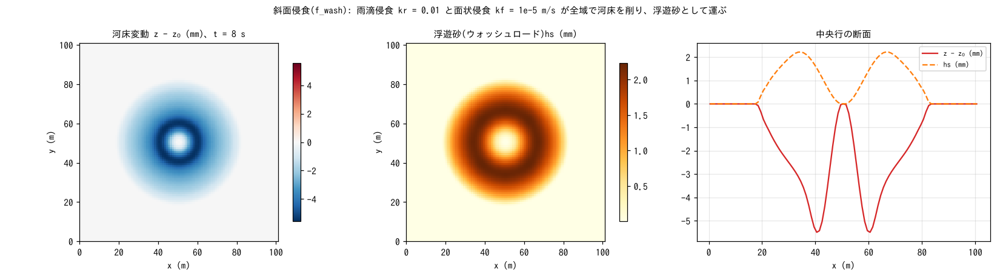

# test/wash — 斜面侵食(f_wash: 雨滴 + 面状侵食)の疎通と保存則

降雨による斜面侵食モジュール(`f_wash = 1`。雨滴侵食 `wash_kr` と
面状侵食 `wash_kf` で河床を削り、浮遊砂 `f_suspend` が輸送を担う。
developer.md §19)の疎通・保存則の検定です。一様降雨 50 mm/h と閉領域
ダムブレイク(wave_hump)を重ね、固体総量の保存・共動更新・活性を
`Check_suspend.py`(共用)で検定します。

## 構成

| 項目 | 値 |
|---|---|
| 領域・格子 | 101 m × 101 m、101 × 101 セル(Δx = 1 m)、平坦、四周壁 |
| 初期条件 | 静水 h₀ = 0.5 m + コサイン型の山(+1 m) |
| 降雨 | 50 mm/h 一様 |
| 侵食 | `wash_kr = 0.01`(雨滴)、`wash_kf = 1e-5 m/s`(面状)。輸送は `f_suspend = 1` |
| 土層 | sd₀ = 10 m、空隙率 0.4。dt = 0.1 s、8 s |

| ファイル | 内容 |
|---|---|
| `Run.sh` | 実行して `../suspend/Check_suspend.py save` で検定 |
| `Fig.py` | 下の図 `figs/wash.png` |

## 実行

```bash
make
./Run.sh          # 実行 → 固体総量・共動更新・活性の検定(1 秒)
./Run_MPI.sh 4    # MPI。state.dat が逐次とバイト一致
python3 Fig.py    # figs/wash.png
```

## 図



左: 河床変動。山の崩れた環で面状侵食が集中し(最大 5.6 mm)、雨滴
侵食は全域に薄く乗ります。中: 浮遊砂 hs。削られた土砂が水柱内に
運ばれています(最大 2.2 mm)。右: 中央行の断面。[test/suspend](../suspend/)
より 1 桁大きい変動で、流れが速い環での面状侵食が支配的です。

## 所見

| 検定 | 計算値 | 判定 |
|---|---|---|
| 固体総量 Σhs + (1 − λ)Σ(z − z₀) | 0.0(機械精度) | PASS |
| 共動更新 max|(sd − sd₀) − (z − z₀)| | 1.9e-14 m | PASS |
| 活性 max hs / max|z − z₀| | 2.24 mm / 5.58 mm | PASS |

- wash は近傍を読まない 1 パスの地形プロセスなので OpenMP でも安全で、
  np = 1, 2, 4 の state.dat は逐次とバイト一致します(§19)。
- 侵食係数は経験係数で校正前提です(§62: `wash_kr` / `wash_kf` の既定は
  このケースの値)。土地利用別の係数構築やリル・ガリー侵食は残作業です。
- 無流水の乾式斜面侵食(雨滴・サブグリッドリル)は [test/splash](../splash/)。

## 関連文書

- [docs/users_guide/geomorph.md](../../docs/users_guide/geomorph.md) — `f_wash`、`wash_kr`、`wash_kf`
- developer.md §19(実装と検証記録)
