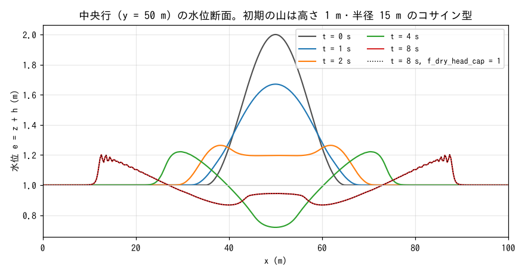
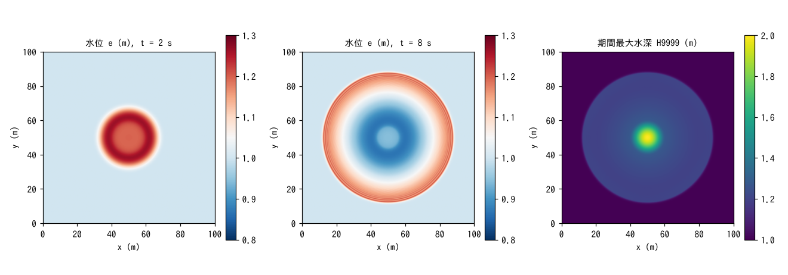
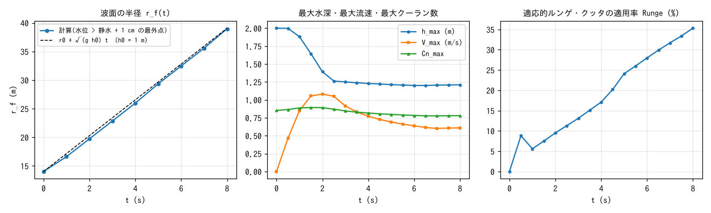

# test/wave — 静水に立てた水の山の拡がり(浅水流の最小例・回帰テストの基準ケース)

ENCflow の最小構成を確かめる基準ケースです。平坦・無摩擦・閉じた正方形
水槽の静水(h₀ = 1 m)の中央に、高さ 1 m・半径 15 m のコサイン型の水の山
(user_initial `wave_hump`: η = 0.5 (1 + cos(2πr/30)) m、r < 15 m)を
立て、8 秒間の広がりを計算します。地形・境界・降雨・摩擦のどれも使わず、
浅水方程式の圧力項・移流項と ENC 格子の 8 方向交換だけが働くので、
数値スキームの変更がそのまま結果に現れます。
[tutorials/wave](../../tutorials/wave/README.md) はこのケースを教材化した
もので、画面表示の読み方・パラメータファイルの構造・波面の振動の正体
(格子の細分と物理分散)はそちらで説明しています。

## 構成

| 項目 | 値 |
|---|---|
| 領域・格子 | 100 m × 100 m、385 × 385 セル(Δx ≈ 0.26 m) |
| 地形・粗度 | z = 0、Manning n = 0(無摩擦) |
| 初期条件 | h₀ = 1 m + コサイン型の山(高さ 1 m、半径 15 m)。流速 0 |
| 境界 | 四周とも既定の不透過壁(`&list_bound` は空) |
| 時間刻み | dt = 0.05 s、8 s(Cn_max ≈ 0.89)。出力 1 s 毎に水位 E・水深 H |
| ENC 設定 | `&list_enc` で全項目を明示(重力補正・超過流出抑制・hcap は 0、風上係数 1.0、p_diagratio 0.578、適応 RK 閾値 1.2) |

`&list_enc` を明示しているのは、既定値が変わっても reference との比較が
ぶれないようにするためです(回帰テストとしての役割)。ENCflow の現行の
既定(運動量保存形+MUSCL の移流スキーム 3、hcap 1 など)で動かす
一般の例題とは設定が異なることに注意してください。

| ファイル | 内容 |
|---|---|
| `param.txt` | 上記の基準ケース(reference あり) |
| `param_cap.txt` | 同じ設定に `f_dry_head_cap = 1`(乾燥セルへ向かうエッジ水深のエネルギー頭による頭打ち、developer.md §68.16)を加えたもの。全域が湿潤なので一度も効かず、reference とビット一致することを確かめる |
| `Plot_wave.plt` | gnuplot で水位・最大水深・流速の分布を順に表示(対話用) |
| `Fig.py` | 下の図 `figs/*.png` を描く |

## 実行

```bash
make                      # bin/ の実行ファイルへのリンク
./Run.sh                  # 逐次。Log.txt を reference と比較(ULP = 1、Runge 列は除外)
./Run_MPI.sh 4            # MPI 4 ランク。逐次と同じ Log になるのが規律
./encflow param_cap.txt   # f_dry_head_cap = 1(result_cap/)。Log は reference に一致
python3 Fig.py            # figs/profile.png, map.png, log.png
```

Run.sh は共通エンジン [../Scripts/Run_case.sh](../Scripts/Run_case.sh) を
呼び、画面出力(Log.txt)の各列を印字の最終桁を単位とした許容誤差 1
(`ULP=1`)で比較します。第 4 列(適応ルンゲ・クッタの適用率 Runge)は
スレッド数で変わりうるため比較から外しています(`SKIPCOLS=4`)。

## 図



中央行(y = 50 m)の水位 e = z + h の断面です。山は崩れて外向きの環状波に
なり(t = 2 s で山頂が平らに、t = 4 s で中央が静水面より 0.27 m 凹む)、
t = 8 s には半径 39 m の環として外へ広がります。中央は t = 4 s の凹みから
戻りつつあります(0.94 m)。環の外縁の細かい振動は格子スケールの数値
分散で、格子を細かくすると縮みます(tutorials/wave の補足節)。
点線は `param_cap.txt`(f_dry_head_cap = 1)の t = 8 s で、実線に完全に
重なります。



左・中: 水位分布(t = 2, 8 s)。環状波は格子の向きによらず円形を保って
います(ENC 格子の 8 方向交換による等方性)。右: 期間最大水深 H9999。
初期の山(2 m)の外側は環状波の通過時の 1.2 m 前後で、波が届いていない
隅は 1 m のままです。



左: 水位が静水面 + 1 cm を超える最外点の半径 r_f(t)。平均の進行速度は
3.19 m/s で、静水深の長波速度 √(g h₀) = 3.13 m/s に一致します(+2% は
前面が盛り上がった水面の上を進む分)。中: h_max は 2.0 → 1.20 m に
下がって環の高さに落ち着き、V_max は t = 2 s の 1.08 m/s を頂点に減衰、
Cn_max は 0.85〜0.89 で安定条件内です。右: 適応的ルンゲ・クッタの
適用率は、波の前面が広がるにつれ 0 → 35% へ増えます。

## 所見

| 量 | 値 |
|---|---|
| 平均水深 S | 1.02101897412350 m で全時刻一定(表示 15 桁。閉じた水槽の質量保存) |
| h_max | 2.000 → 1.200 m(t = 6.5 s 以降は環の高さ 1.20〜1.21 m) |
| V_max の最大 | 1.080 m/s(t = 2.0 s) |
| Cn_max の最大 | 0.893(dt = 0.05 s) |
| 波面速度(1〜8 s) | 3.19 m/s(√(g h₀) = 3.13 m/s) |
| ex_flux | 0(超過流出の抑制は無効のまま一度も必要にならない) |

- 質量は印字桁で完全に保存され、環状波は等方的に広がり、波面速度は
  長波速度に一致します。基準ケースとして確認すべきことはこの 3 点です。
- `param_cap.txt`(f_dry_head_cap = 1)は Log・分布ともビット一致します。
  全域が湿潤なので頭打ちが一度も発動しないためで、この保護機構が既存の
  湿潤計算を変えないことの確認になっています(developer.md §68.16)。
- 回帰テストの規律: 逐次と MPI(np = 1, 2, 4)の Log が一致すること。
  reference の更新(`./Run.sh -u`)は、結果の妥当性を目視で確かめてから
  行います(CLAUDE.md の絶対規律)。

## 関連文書

- [tutorials/wave/README.md](../../tutorials/wave/README.md) — 教材版。
  時間刻みの粗密、適応ルンゲ・クッタ、透過境界、斜めの壁、波面の振動の正体
- [docs/users_guide/swflow.md](../../docs/users_guide/swflow.md) —
  `&list_enc` の各項目と現行既定
- developer.md §68.16(f_dry_head_cap)
