# チュートリアル 2: chichibu — 実地形の流域に降る雨

荒川上流の秩父流域(約 715 km²)を 200 m 格子で覆い、豪雨
(200 mm/h × 30 分)を降らせて、降雨流出と洪水波の伝搬を計算します。
実地形データを使う実務的な計算の型を、次の順で学びます。

- **Step 1**: 実地形データでの最小構成、窪地除去の必要性
- **Step 2**: GeoTIFF 入出力、河道マスクと粗度
- **Step 3**: 計測(プローブ・フラックス測線)と分布出力
- **Step 4**: パラメータ調整 — ex_flux の読み方、限界水深、移流の風上化
- **Step 5**: 降雨遮断と地下浸透(バケツモデル)、3 列の水収支
- **Step 6**: 流域出口の境界条件、実地形データに由来する流量振動の理解
- **Step 7**: ParaView での 3D 可視化(アニメーション)

[wave チュートリアル](../wave/README.md)を先に済ませていることを
前提とします(実行のしかた・画面表示の各列・パラメータファイルの
構造はそちらで説明しています)。以降の作業はすべてこのディレクトリ
(`tutorials/chichibu`)の中で行います。

## データを眺める

`data_chichibu/` に、次のラスタデータが入っています。

| データ | 内容 |
|---|---|
| `Chichibu_200m_filled.*` | 地盤高 (m)。GIS ソフトで D8 の窪地除去(fill)を施したもの |
| `Chichibu_200m_raw.tif` | 地盤高 (m)。窪地除去をしていない元データ(比較実験用) |
| `Chichibu_200m_basin.*` | 流域マスク(1: 流域内、0: 流域外) |
| `Chichibu_200m_river.*` | 河道マスク(1: 河道セル) |

いずれも **280×150 セル(dx = dy = 200 m)**の同じ格子に載って
います(領域 56 km × 30 km)。テキスト(`.txt`)、
bil(`.bil` + `.hdr`)、GeoTIFF(`.tif`)の 3 形式が同じ内容で
用意されており、入出力形式の練習に使います。

データの由来: 標高データは国土地理院の基盤地図情報数値標高モデルより
作成、河道マスクは国土数値情報河川データから作成された河道位数データ
([DOI:10.3178/jjshwr.36.1812](https://doi.org/10.3178/jjshwr.36.1812))
より作成しています。

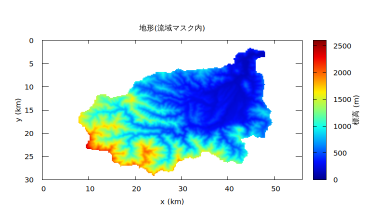

北東の隅(標高 100 m 台)が流域の出口で、南西の主稜線には 2,500 m 級の
山々が並びます。流域の大部分は急峻な山地です。

## Step 1: 実地形データでの最小構成

### 実行

wave と同じように、`make` で実行ファイルへのリンクを作り、
`param_step1.txt` を実行します。

```bash
make
./encflow param_step1.txt
```

```
reading list_sysparam in param_step1.txt
reading list_geoinfo in param_step1.txt
 reading data_chichibu/Chichibu_200m_basin.txt
 reading data_chichibu/Chichibu_200m_filled.txt
reading list_precip in param_step1.txt
number of processes : 1
number of threads : 4
real precision : 64 bit
number of valid cells : 17885
time, progress, S(m), Runge, ex_flux, Cn_max, h_max(m), V_max(m/s)
  0:00:00.00   0.0%    0.0000   0.0%      0    0.0000    0.0000    0.0000
  0:30:00.00   8.3%    0.0487  97.7%      0    0.3876    2.3735   10.3884
  1:00:00.00  16.7%    0.1000   6.0%      0    0.6716    8.0311   18.2975
  1:30:00.00  25.0%    0.1000   3.5%      1    0.7116    8.6295   19.6093
  2:00:00.00  33.3%    0.1000   1.9%     15    0.6868   14.8529   18.9331
  ...
  6:00:00.00 100.0%    0.1000   0.9%    190    0.5896   33.0043    6.7073
```

パラメータファイルの構成は wave の Step 1 とほとんど同じで、
違いは `&list_geoinfo` が地形と流域マスクをファイルから読むことと、
`&list_precip` で雨を降らせることだけです。

```
&list_geoinfo
  nx = 280
  ny = 150
  dx = 200.0
  dy = 200.0

  f_ztype = 1          ! 地盤高タイプ (0:デフォルト固定値, 1:ファイル)
  f_masktype = 1       ! 領域マスクの有無 (0:なし, 1:流域マスク)

  fn_z = "Chichibu_200m_filled.txt"        ! 地盤高ファイル名
  fn_mask = "Chichibu_200m_basin.txt"      ! 領域マスクファイル名
/

&list_precip
  prtype = 1
  ! 降水の時系列 (時刻(min) 雨量強度(mm/h))
  prval(:,1) =   0,   0
  prval(:,2) =  30, 200
  prval(:,3) =  60,   0
/
```

画面表示から次のことが読み取れます。

- `number of valid cells : 17885` — 格子全体は 280×150 = 42,000 セル
  ですが、流域マスクにより計算対象は 17,885 セルだけです。マスク外は
  メモリも計算時間も消費しません。
- S 列は雨とともに増え、雨が終わる t = 1:00 に **0.1000** m
  (= 200 mm/h × 30 min = 総雨量 100 mm の流域平均)でぴたりと止まり、
  以後一定です。計算領域の外縁はデフォルトでは不透過の壁なので、
  この流域は**水の出口のない閉じた器**であり、S 列の一定は質量保存の
  確認になります。
- 一方で h_max 列は 8 m → 33 m へと成長し続けます。出ていけない水が
  どこかに溜まり続けているということです。

最終時刻の水深分布(`result/H9998.txt`)を見ると、溜まっている場所が
わかります。

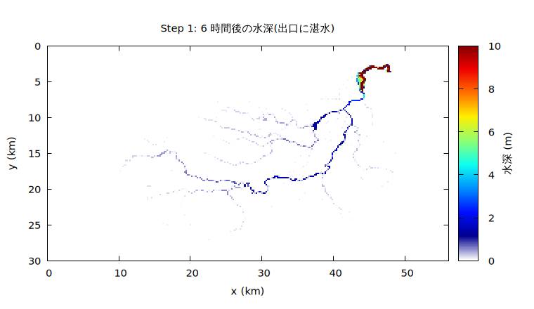

流域出口(北東の隅)の手前に、深さ 30 m を超える湛水が育っています。
壁で堰き止められた流出水のこの湛水は、Step 6 で境界条件を設定して
解消します。それまでの Step では、出口の湛水は承知の上で計算を
進めます(上流側の計測にはほとんど影響しません)。

### 窪地除去はなぜ必要か

`&list_geoinfo` の `fn_z` を `Chichibu_200m_raw.tif` に差し替えると、
窪地除去をしていない元の DEM で計算できます(GeoTIFF を読むため、
Step 2 の `param_step2.txt` で試すのが手軽です)。最大水深の分布を
比べると:

| 窪地除去済み(filled) | 未処理(raw) |
|---|---|
| 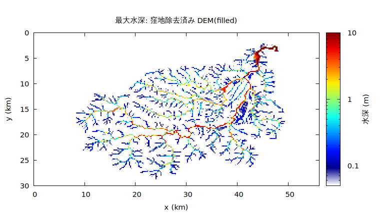 | 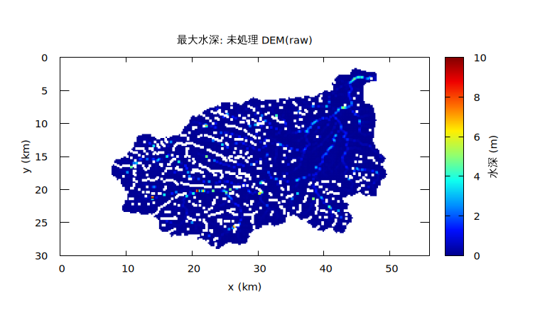 |

filled では支流が本川に集まり、出口へ向かう一本の河川網が描かれるのに
対し、raw では水が流域中の窪地に捕まってしまい、河川網がぶつ切りに
なります。流速の最大値も末期には 1.5 m/s 程度まで落ち、流域全体で
流れが死んでいることがわかります。

一般に、地形の勾配が大きくセルサイズも大きい場合、DEM の階段状の
段差が大きくなります。段差が水深のオーダーを超えると水の流れは
著しく阻害されるため、**流出計算には事前の窪地除去が必須**です。

なお、格子に対して斜め方向に水が移動できない通常の構造格子モデルでは、
一般的な GIS ソフトの D8 法(8 方向流下)で窪地除去した DEM でも
斜め方向の流路で水が引っ掛かるため、追加の窪地処理や解像度の引き上げが
必要になることがあります。ENC 格子は 8 方向に水をやり取りできるため
D8 と相性が良く、**D8 で窪地除去した DEM がそのまま使えます**。

## Step 2: GeoTIFF 入出力と河道の表現

`param_step2.txt` では、入出力を GeoTIFF に切り替え、河道マスクと
粗度を追加します。

```
&list_sysparam
  ...
  f_input_mode = 4           ! matrix入力形式(1:text, 2:bil, 4:geotiff)
  f_output_mode = 5          ! matrix出力形式(1:text, 2:bil, 4:geotiff)
/

&list_geoinfo
  ...
  f_rntype = 0         ! 粗度係数タイプ (0:デフォルト固定値, 1:ファイル)
  rn0 = 0.05           ! 粗度係数固定値
  rn0_rw = 0.02        ! 河道マスク部の固定粗度係数

  fn_z = "Chichibu_200m_filled.tif"        ! 地盤高ファイル名
  fn_mask = "Chichibu_200m_basin.tif"      ! 領域マスクファイル名
  fn_rw = "Chichibu_200m_river.tif"        ! 河道マスクファイル名
/
```

- `f_input_mode = 4` / `f_output_mode = 5` で、分布データの読み書きが
  GeoTIFF になります(出力モード 5 はテキストと GeoTIFF の両方を出力)。
  出力された `.tif` は座標参照情報を引き継ぐので、**QGIS などの GIS に
  ドラッグするだけで地図に重なります**。
- 粗度は「基本 `rn0 = 0.05`(山地・原野相当)、河道セルだけ
  `rn0_rw = 0.02`(河道相当)で上書き」という 2 段構えです。
  `rn0_rw` は粗度の与え方(固定値・ファイル)によらず河道セルを
  上書きします。
- 河道マスク `fn_rw` はこの段階では粗度の差し替えにだけ使っています。
  地形からの掘り込み(`depth_rw`)やサブグリッド河道(`fn_channel`)
  へは、ここから段階的に精緻化できます([ユーザーガイド](../../docs/users_guide.md))。

実行すると、画面の数値は Step 1 と少し変わります(粗度が変わった
ため)。結果ディレクトリには `H0001.tif` などが並びます。

## Step 3: 計測と分布出力

流量や水深の時系列がほしい場所は、あらかじめ**プローブ**(点)と
**フラックス測線**(線)で指定しておきます。`param_step3.txt` では
本川に沿って 4 点・4 本を置きました。

```
&list_sysparam
  ...
  dt_recrd_c = "1 min"       ! プローブ出力時間刻み

  f_out_h = 1                ! ファイル出力(水深H0001)
  f_out_vv = 1               ! ファイル出力(流速絶対値V0001)
  f_out_qq = 1               ! ファイル出力(流量絶対値Q0001)
  f_out_cn = 1               ! ファイル出力(クーラン数Cn0001)
  f_out_hmax = 1             ! ファイル出力(最大水深H9999)
  f_out_vvmax = 1            ! ファイル出力(最大流速V9999)
/

&list_record
  ! プローブの位置のタイプ (0:セル番号, 1:実座標(m))
  ! プローブの位置 (x座標, y座標)
  pbxytype = 0
  pbxy(:,1) =  82, 105
  pbxy(:,2) = 107, 102
  pbxy(:,3) = 147, 103
  pbxy(:,4) = 216,  40

  ! フラックス測線の座標のタイプ (0:セル番号, 1:実座標(m))
  ! フラックス測線の始点終点 (右岸x, 右岸y, 左岸x, 左岸y)
  flxytype = 0
  flxy(:,1) =  82, 106,   82, 103
  flxy(:,2) = 107, 103,  107, 100
  flxy(:,3) = 147, 105,  147, 102
  flxy(:,4) = 216,  43,  216,  37
/
```

セル番号は Fortran の流儀で **1 スタート**です(QGIS のラスタの
行列番号は 0 スタートなので、GIS で調べたセル番号を使うときは
1 を足してください)。測線は「始点から終点に向かって右側が正」
なので、右岸 → 左岸の向きに書くと下流向きの流量が正になります。
実座標(m)での指定(`pbxytype = 1` / `flxytype = 1`)もできます
([ユーザーガイドの計測の章](../../docs/users_guide/record.md))。

実行すると、画面の数値は Step 2 と**完全に一致**します — 計測と
ファイル出力は計算そのものには一切影響しません。結果には
`fluxes/flux0001.csv`(測線の流量時系列)と
`probes/probe0001.csv`(プローブの水深・流速時系列)が加わります。

```bash
gnuplot -p -c Plot_flux.plt result
```

で 4 本の測線のハイドログラフを順に表示できます(同梱の
`Plot_flux.plt` / `Plot_map.plt` は結果の目視用スクリプトです)。

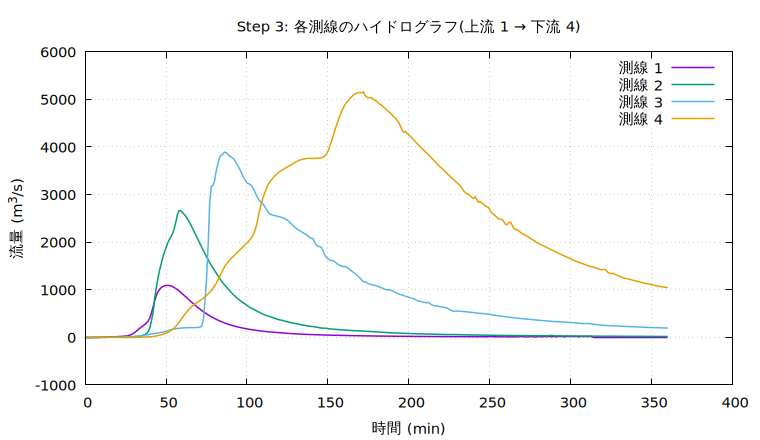

上流の測線 1 から下流の測線 4 へ、洪水波が遅れながら成長していく
流域スケールの洪水追跡が 1 分刻みで得られました。

## Step 4: パラメータの調整

Step 3 の画面表示をよく見ると、**ex_flux 列が時間とともに増えて
います**(終盤には 30 分あたり 190 回)。ex_flux は「運動方程式から
求めた流出量が、そのセルの水量を上回りかけたので抑制した」回数です。
安全装置なので質量は保たれますが、多発するのは計算が荒れている
サインです。今回の場合、時間刻み dt を小さくする・適応的ルンゲクッタの
閾値 `p_adprunge_thresh` を小さくする、といった定石を試しても
改善しません。効いたのは**限界水深 dd と仮想水深 dv を小さくする**
ことでした。

```
&list_sysparam
  ...
  dd = 0.0001                ! この水深以上なら水の移動を計算する(限界水深)
  dv = 0.0001                ! これ以下なら強制的にこの水深にする(仮想水深)
/
```

デフォルト(いずれも 0.001)を 1/10 にしています。これらの値は
小さいほど薄い水膜まで丁寧に扱うため精度が上がりますが、湿潤セルが
増えて計算時間が延びるケースもあります。精度と速度のバランスで
決めてください(この例題では `param_step4.txt` の実行で
ex_flux が 0 になります)。

もう一つの調整は**移流項の風上化**です。

```
&list_enc
  p_adv_upwind_index = 0.0        ! 風上差分の割合 (0.0 ~ 1.0)
  p_adprunge_thresh = 1.5         ! 適応的ルンゲクッタの閾値 (1.1 ~)
/
```

セルサイズが大きい計算では移流項の寄与は他の項に比べ相対的に小さく
なる一方、風上差分(デフォルトは `p_adv_upwind_index = 0.5` の混合)の
数値拡散が洪水波形を過剰に鈍らせます。そこで安定性に問題のない範囲で
風上係数を小さくします(ここでは 0 = 中心差分)。移流項そのものを
落とした拡散波(`&list_sysparam` の `f_govequation = 1`)で解くことも
選択肢です。

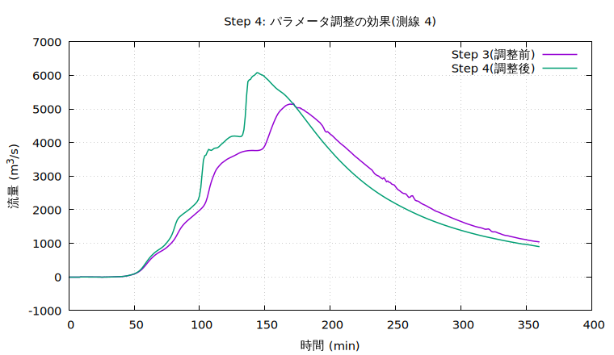

調整後(`param_step4.txt`)はピークが立ち上がり、鈍っていた波形が
シャープになりました(測線 4 のピーク流量で 18% の差)。粗い格子の
実地形計算では、このように**波形の鈍りが数値設定に敏感**です。
観測ハイドログラフとの比較で粗度を調整する前に、数値設定由来の鈍りを
取り除いておくことが大切です。

## Step 5: 降雨遮断と地下浸透

ここまでの計算は「降った雨が全部流れる」ものでした。実流域では
樹冠による遮断と地中への浸透が流出を減らします。`param_step5.txt`
では、最も簡単な 2 つの損失モデルを重ねます。

```
&list_sysparam
  ...
  fn_intercept = "-"         ! 降雨遮断条件設定ファイル
  fn_gwflow = "-"            ! 地下水条件設定ファイル
/

&list_intercept
  f_icmodel = 1              ! 1:固定遮断率モデル
/
&list_intercept_fixed
  ic_alpha = 0.2             ! 遮断率(有効雨量 = (1-α)P)
/

&list_gwflow
  f_gwvertical = 1           ! 1:バケツモデル
/
&list_gwflow_bucket
  gw_infil_mmh = 5.0         ! 浸透能 (mm/h)
  gw_capacity = 0.2          ! 地下貯留容量(柱状換算水深) (m)
/
```

機能の有効化は ENCflow 共通の流儀で、`fn_*` を書けば有効・書かなければ
完全に無効(メモリも計算時間も追加ゼロ)です。実行すると、画面の
水量表示が 1 列から **3 列**に変わります。

```
time, progress, S_surf(m), S_grnd(m), S_total(m), Runge, ex_flux, Cn_max, h_max(m), V_max(m/s)
  0:00:00.00   0.0%    0.0000     0.0000     0.0000    0.0%      0    0.0000    0.0000    0.0000
  0:30:00.00   8.3%    0.0365     0.0024     0.0389   97.7%      0    0.2246    0.8761    5.3816
  1:00:00.00  16.7%    0.0751     0.0049     0.0800   11.5%      0    0.4056    4.2749   11.3883
  1:30:00.00  25.0%    0.0728     0.0072     0.0800   26.3%  17319    0.4968    5.5541   12.6021
  ...
  6:00:00.00 100.0%    0.0689     0.0111     0.0800   10.3%   7285    0.6518   27.0961   11.8937
```

- `S_surf` は地表水、`S_grnd` は地下貯留、`S_total` はその合計です。
  雨が終わった後の S_total は **0.0800** m で一定 — 総雨量 100 mm の
  8 割、つまり遮断率 α = 0.2 を除いた有効雨量と一致し、地表と地下の
  間で水が移っても合計は保存されていることが確かめられます。
- 時間とともに S_surf が減り S_grnd が増える — 浸透の進行がそのまま
  読めます。

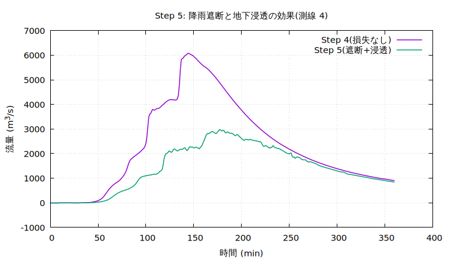

ハイドログラフではピーク流量がおよそ半減しました(6,080 → 2,970 m³/s)。
遮断は総量を 2 割削り、浸透は薄く広がる斜面の水を吸い続けるため、
立ち上がりと逓減部の両方が下がります。

2 つ、目につく変化があります。ex_flux 列が 30 分あたり 1〜2 万回に
跳ね上がったこと、そしてハイドログラフに**細かい振動**が乗ったこと
です。これらは Step 6 の後半でまとめて説明します。

## Step 6: 流域出口の境界条件

Step 1 から見て見ぬふりをしてきた出口の湛水(h_max ≈ 27 m)を
解消します。流域出口は計算領域の外縁(4 辺)ではなく領域内部に
あるため、辺の境界条件ではなく**水位規定セル群**を使います。
`param_step6.txt` では、出口の河道セル 2 つの水位を低い値に固定して
「排水口」にします。

```
&list_sysparam
  ...
  fn_boundary = "-"          ! 境界条件設定ファイル
/

&list_bound_stage
  ! 群1: 流域出口(河床より低い水位で完全排水)
  stage_cell(:,1,1) = 239, 19
  stage_cell(:,2,1) = 240, 19
  stage_eta(1) = 111.0
/
```

出口セルの番号は、河道マスクと DEM を GIS で重ねて「流域マスク内で
最も下流の河道セル」を読み取って決めました(前述のとおり 1 スタートに
直すのを忘れずに)。`stage_eta` は標高値で指定します。水位を河床より
低くしたセルは常に空の「完全排水口」になります(ここでは 111 m。
上流側セルの河床 113 m より低いため、届いた水はただちに系外へ
除去されます)。実行すると:

```
time, progress, S_surf(m), S_grnd(m), S_total(m), Runge, ex_flux, Cn_max, h_max(m), V_max(m/s)
  ...
  3:00:00.00  50.0%    0.0650     0.0095     0.0745   20.5%  14129    0.4305    5.8031    9.8904
  6:00:00.00 100.0%    0.0317     0.0110     0.0428   10.3%   7278    0.3185    4.7565    5.6587
```

- S_total が減少に転じました — 出口から系外へ出た水の分です。
- h_max は 27 m から 4.8 m へ。湛水が消えたことは水深分布でも
  確かめられます。

| Step 5(出口なし) | Step 6(完全排水口) |
|---|---|
| 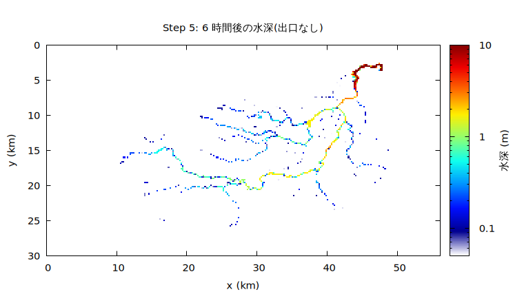 | 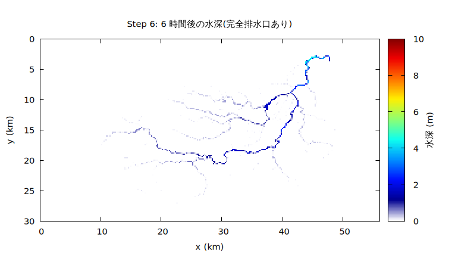 |

上流側の測線 1〜4 のハイドログラフは Step 5 とほとんど変わりません
(出口の湛水は最下流のごく狭い範囲にしか影響しないためです)。

なお、時系列で水位を規定すれば(`stage_val`)、下流河川の水位や
潮位を与える開境界にもなります。辺境界(自由流出・長波放射)、
流入境界などの使い分けは[ユーザーガイドの境界条件の章](../../docs/users_guide/boundary.md)を
参照してください。

### ハイドログラフの細かい振動について

Step 5 以降の 1 分値のハイドログラフには、細かい振動が乗っています。
浸透能を変えても消えず、出口を設けた Step 6 でも残ります。これは
モデルの不具合ではなく、**実地形データを使う流出計算で普遍的に
出会う現象**なので、正体を説明しておきます。

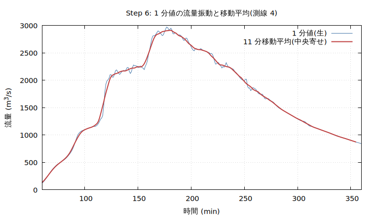

原因は地形データにあります。窪地除去(fill)後の DEM の河道沿いには、
「完全に平坦な区間」が随所にできます(元 DEM が河川水面・峡谷・
貯水池を平坦に記録していた場所や、窪地を埋めた跡)。計算では
この平坦区間に深さ数 m の「池」が湛まり、池は水面動(せいしゅ)や
越流の変動といった応答をもつ振動体になります。地下浸透のような
**面的に分布した損失**が加わると、池とそれをつなぐ急流の水収支が
常時揺さぶられ、下流ほど増幅された振動がハイドログラフに乗ります。
同時に、浸透で水膜が薄くなったセルが安全装置に頻繁に掛かるため
ex_flux も跳ね上がりますが、これは保護機構の正常動作で、質量は
保存されています(S_total 列で確認できます)。

対処は段階的に考えます。

1. **さしあたっては出力の後処理(平滑化)で十分です。** 振動は
   計算の水収支を損なっておらず、流出解析で意味を持つ時間スケール
   (数十分〜)には影響しません。プロット時に移動平均を重ねます。

   ```gnuplot
   set datafile separator comma
   N = 11                     # 窓幅(点数)= 11 分
   array A[N]
   ma(x) = (A[(int($0) % N) + 1] = x, $0 < N-1 ? NaN : (sum [i=1:N] A[i]) / N)
   plot "result/fluxes/flux0004.csv" us 2:3 w l title "1 分値", \
        "" us ($2 - (N-1)/2.0):(ma($3)) w l lw 2 title "11 分移動平均"
   ```

   gnuplot 5.2 以降の配列機能だけで動きます。行番号 `$0` を使った
   リングバッファで後方 N 点平均を取り、x 座標を (N−1)/2 分だけ
   戻して中央寄せにしています(ピーク時刻がずれません)。生値を
   重ねて描けば、平滑化が何を消したかも読者に見えます。

   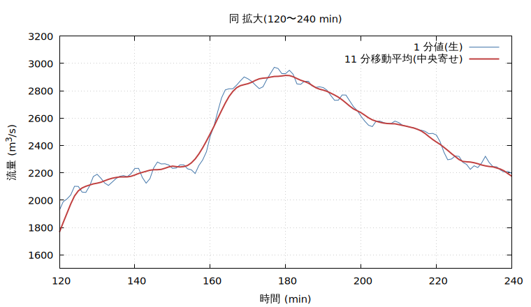

2. **本質的な対策は地形データの改良です。** 河道の縦断勾配が
   単調になるように前処理する(平坦区間の解消)、あるいは河道を
   サブグリッド河道(`fn_channel`)へ移行して河床縦断を独立に
   与えることで、平坦な池そのものをなくせます。

3. 計測位置の選び方でも軽減できます。水深数 m の平坦区間(池)に
   置いた測線は池の水面動を直接拾うので、**縦断勾配のある通常の
   河道区間に測線を置く**のが安全です。

## Step 7: ParaView での 3D 可視化

最後に、分布出力を 3D アニメーションとして眺めます。使うのは
無料の可視化ソフト [ParaView](https://www.paraview.org/)
(Windows / macOS / Linux。インストールは
[インストールガイドの 2.5 節](../../docs/install.md)を参照)と、
同梱の変換ユーティリティ utils/out2vtk です。

`param_step7.txt` は Step 4 の設定をアニメーション向けに変えた
ものです: 計算時間を 4 時間に短縮し(`tt_c`)、分布出力を 2 分毎に
細かくし(`dt_file_c`)、出力形式を GeoTIFF のみ(`f_output_mode = 4`)
にしています。動きの滑らかさは出力間隔で決まるので、可視化目的の
計算では出力を細かめにします。

### 変換の実行

```bash
make -C ../../utils/out2vtk install   # 初回のみ: 変換ツールをビルド
./encflow param_step7.txt
../../bin/out2vtk param_step7.txt
```

out2vtk には計算に使ったパラメータファイルをそのまま渡します
(結果ディレクトリと格子情報を引き継ぎます)。`result/vtk/` に
次のファイルができます。

| ファイル | 内容 |
|---|---|
| `flood.pvd` + `flood_0000.vts` 〜 | 水面の時系列(2 分毎の 121 時刻)。pvd がアニメーションの入口 |
| `terrain.vts` | 地形面(3D) |
| `summary.vts` | 最大水深などの統計量 |

流域の外は自動で非表示になります(encflow が常時出力する領域マスク
`X0000` を out2vtk が読み、既定で陸域だけを残すためです)。

### まずは最小の手順で

ParaView を起動して、次の 4 操作だけでアニメーションになります。

1. **File → Open** で `result/vtk/flood.pvd` を開き、**Apply** を押す
2. ツールバーの Coloring を **H**(水深)にする
3. **Edit Color Map**(虹色のアイコン)で **NaN 色を灰色**に変える
   (乾いたセルは水深が NaN で、既定では黄色に塗られるため)
4. **▶(再生)**を押す

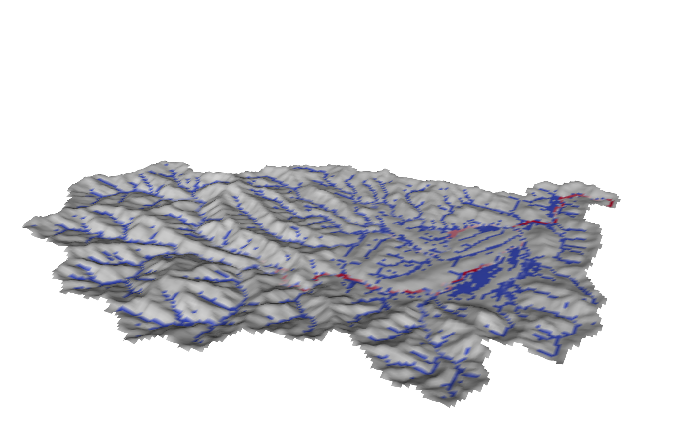

これだけで「立体地形に水深の色が張り付いた」画になります。
このファイルの面は水面標高(地盤高+水深)の曲面なので、乾いた
場所は地形の起伏そのもの、濡れた場所だけがわずかに持ち上がります。
マウスのドラッグで回転、ホイールで拡大縮小、タイムラインの時刻は
計算の実時刻(秒)です。前半 30 分で斜面に雨水が広がり、その後
河道網に集まって洪水波が下っていく様子が見えます。

### 見栄えを良くする

上の最小手順に、それぞれ独立に足せる改善です。

- **水を水らしく**: `terrain.vts` も開いて Apply し、Coloring を
  `Solid Color`(灰色系)にする。`flood.pvd` 側は Edit Color Map の
  **NaN の不透明度(Opacity)を 0** にすると乾いた場所が消えて、
  地形の上に水だけが残ります。カラーマップを青系のプリセット
  (Blues など)にするとより水らしくなります。
  (NaN 不透明度の代わりに **Filters → Threshold** で H ≥ 0.01 を
  残す方法もあります。幅 1 セルの河道まで表示したいときは
  Threshold の「All Scalars」のチェックを外してください)
- **起伏の強調**: 両方のオブジェクトに **Filters → Transform** を
  掛け、Scale を `(1, 1, 3)` にする(鉛直 3 倍)。フィルタ適用後は
  元のオブジェクトを目玉アイコンで非表示に。
- **時刻の表示**: **Filters → Annotate Time**。
- **動画ファイルへ**: **File → Save Animation**(連番 PNG や AVI)。

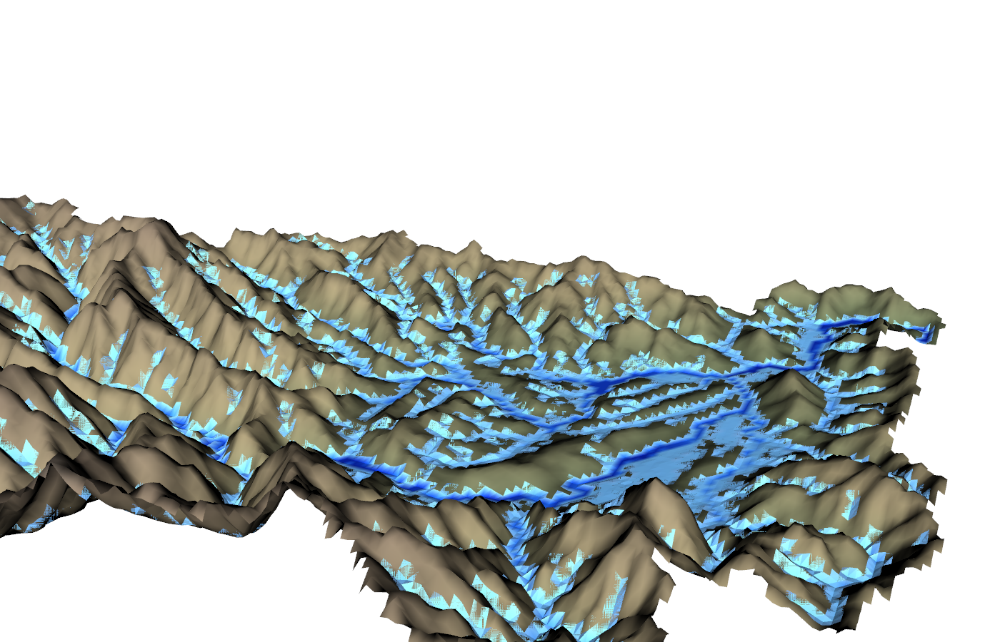

### さらに: 地図・衛星写真の重ね合わせ

`terrain.vts` にはテクスチャ座標が入っており、QGIS で書き出した
同範囲の地図・衛星画像を地形に貼れます(ドレープ)。その手順と、
水膜閾値 `hmin`・変数の絞り込み・海域の扱いなどの設定は
[utils/out2vtk/README.md](../../utils/out2vtk/README.md) を参照して
ください。

## おわりに

このチュートリアルでは、実地形データを使う流域計算の型 —
データ準備(窪地除去)→ 最小構成 → 計測 → 数値設定の調整 →
物理過程の追加 → 境界条件 → 3D 可視化 — を一巡しました。
ここから先は:

- 地下水モデルの精緻化(Green-Ampt、側方流動)、粗度の分布指定、
  サブグリッド河道など —
  [ユーザーガイド](../../docs/users_guide.md)
- 各機能の namelist の書き方 —
  [examples/List_samples/](../../examples/List_samples/)
- 大きな計算を MPI で並列実行するには `mpirun -np 4 ./encflow_mpi
  param_step6.txt`(結果は逐次実行とビット単位で一致します)

この文書の図(`figs/`)は `./Fig_chichibu.sh` で一括再生成できます
(gnuplot が必要です。本文の手順と同じ計算を順に実行して描画します。
Step 7 の 3D 図のみ対象外で、`Fig_step7.py` で再生成できます —
ParaView と同じ VTK ライブラリによる描画です)。
