# チュートリアル 2: chichibu — 実地形の流域に降る雨

荒川上流の秩父流域(約 715 km²)を 200 m 格子で覆い、豪雨
(200 mm/h × 30 分)を降らせて、降雨流出と洪水波の伝搬を計算します。
実地形データを使う実務的な計算の型を、次の順で学びます。

- **Step 1**: 実地形データでの最小構成、窪地除去の必要性
- **Step 2**: GeoTIFF 入出力、河道マスクと粗度
- **Step 3**: 計測(プローブ・フラックス測線)と分布出力
- **Step 4**: パラメータ調整 — ex_flux の読み方、限界水深
- **Step 5**: 降雨遮断と地下浸透(バケツモデル)、3 列の水収支
- **Step 6**: 流域出口の境界条件、実地形データに由来する流量振動の理解
- **Step 7**: ParaView での 3D 可視化(アニメーション)

[wave チュートリアル](../wave/README.md)を先に済ませていることを
前提とします(実行のしかた・画面表示の各列・パラメータファイルの
構造はそちらで説明しています)。以降の作業はすべてこのディレクトリ
(`tutorials/chichibu`)の中で行います。

## データを眺める

`data_chichibu/` に、次のラスタデータが入っています。

| データ | 内容 |
|---|---|
| `Chichibu_200m_filled.*` | 地盤高 (m)。GIS ソフトで D8 の窪地除去(fill)を施したもの |
| `Chichibu_200m_raw.tif` | 地盤高 (m)。窪地除去をしていない元データ(比較実験用) |
| `Chichibu_200m_basin.*` | 流域マスク(1: 流域内、0: 流域外) |
| `Chichibu_200m_river.*` | 河道マスク(1: 河道セル) |

いずれも **280×150 セル(dx = dy = 200 m)**の同じ格子に載って
います(領域 56 km × 30 km)。テキスト(`.txt`)、
bil(`.bil` + `.hdr`)、GeoTIFF(`.tif`)の 3 形式が同じ内容で
用意されており、入出力形式の練習に使います。

データの由来: 標高データは国土地理院の基盤地図情報数値標高モデルより
作成、河道マスクは国土数値情報河川データから作成された河道位数データ
([DOI:10.3178/jjshwr.36.1812](https://doi.org/10.3178/jjshwr.36.1812))
より作成しています。

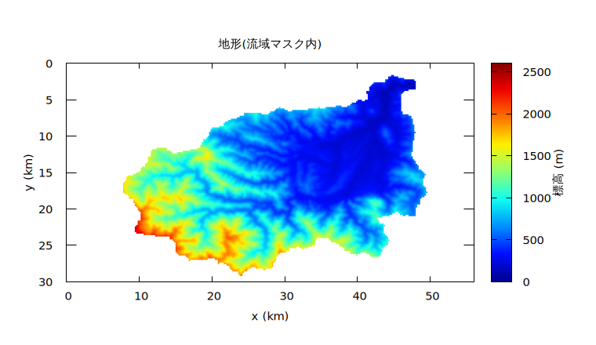

北東の隅(標高 100 m 台)が流域の出口で、南西の主稜線には 2,500 m 級の
山々が並びます。流域の大部分は急峻な山地です。

## Step 1: 実地形データでの最小構成

### 実行

wave と同じように、`make` で実行ファイルへのリンクを作り、
`param_step1.txt` を実行します。

```bash
make
./encflow param_step1.txt
```

```
reading list_sysparam in param_step1.txt
reading list_geoinfo in param_step1.txt
 reading data_chichibu/Chichibu_200m_basin.txt
 reading data_chichibu/Chichibu_200m_filled.txt
reading list_precip in param_step1.txt
main: number of processes: 1
main: number of threads: 4
main: real precision: 64 bit
main: number of valid cells: 17885
time, progress, S(m), Runge, ex_flux, Cn_max, h_max(m), V_max(m/s)
  0:00:00.00   0.0%    0.0000   0.0%      0    0.0000    0.0000    0.0000
  0:30:00.00   8.3%    0.0487  97.7%      0    0.1487    1.0481    3.2564
  1:00:00.00  16.7%    0.1000  12.3%      0    0.3094    4.6692    6.8169
  1:30:00.00  25.0%    0.1000   6.0%      0    0.3654    7.5746    6.8456
  2:00:00.00  33.3%    0.1000   3.2%      0    0.3760    7.8556    7.1534
  ...
  6:00:00.00 100.0%    0.1000   2.2%     59    0.4852   26.4711    4.1836
main: program terminated normally
```

`param_step1.txt` の中身(先頭の表題コメントを除く全文)は次のとおり
です。構成は wave の Step 1 とほとんど同じで、違いは `&list_geoinfo` が
地形と流域マスクをファイルから読み、粗度係数 `rn0` を与えることと、
`&list_precip` で雨を降らせることだけです(`&list_sysparam` の
`dir_data` は入力データのディレクトリで、以下のファイル名はこの
ディレクトリからの相対パスになります)。

```
!======================================================================
! システムパラメータ設定
!======================================================================
&list_sysparam
  dt = 6.0                       ! 時間刻み (s)
  tt_c = "6 hour"                ! 計算終了時刻
  dt_disp_c = "30 min"           ! 画面表示時間刻み
  dt_file_c = "30 min"           ! ファイル出力時間刻み

  fn_geoinfo = "-"               ! 地理情報設定ファイル
  fn_precip  = "-"               ! 降水条件設定ファイル

  dir_data   = "data_chichibu"   ! 入力データディレクトリ
/

!======================================================================
! 地理情報設定
!======================================================================
&list_geoinfo
  nx = 280
  ny = 150
  dx = 200.0
  dy = 200.0

  f_ztype = 1          ! 地盤高タイプ (0:デフォルト固定値, 1:ファイル)
  f_masktype = 1       ! 領域マスクの有無 (0:なし, 1:流域マスク)
  rn0 = 0.05           ! 粗度係数固定値(山地斜面の目安。既定 0.015 は水路向け)

  fn_z = "Chichibu_200m_filled.txt"        ! 地盤高ファイル名
  fn_mask = "Chichibu_200m_basin.txt"      ! 領域マスクファイル名
/

!======================================================================
! 降水条件設定
!======================================================================
&list_precip
  ! 降水データのタイプ (0:降水なし, 1:一様分布で時系列)
  prtype = 1
  ! 降水の時系列 (時刻(min) 雨量強度(mm/h))
  prval(:,1) =   0,   0
  prval(:,2) =  30, 200
  prval(:,3) =  60,   0
/
```

画面表示から次のことが読み取れます。

- `number of valid cells: 17885` — 格子全体は 280×150 = 42,000 セル
  ですが、流域マスクにより計算対象は 17,885 セルだけです。マスク外は
  メモリも計算時間も消費しません。
- `rn0 = 0.05` は Manning の粗度係数です。既定値 0.015 は水路向けの
  値で、山地の斜面全体に使うと流れが速くなりすぎます(出口のない
  この器では水が一箇所に集中しすぎて計算が不安定になります)。
  ここでは山地斜面の目安 0.05 を与え、Step 2 で河道だけ別の値に
  します。
- S 列は雨とともに増え、雨が終わる t = 1:00 に **0.1000** m
  (= 200 mm/h × 30 min = 総雨量 100 mm の流域平均)でぴたりと止まり、
  以後一定です。計算領域の外縁はデフォルトでは不透過の壁なので、
  この流域は**水の出口のない閉じた器**であり、S 列の一定は質量保存の
  確認になります。
- 一方で h_max 列は 8 m → 26 m へと成長し続けます。出ていけない水が
  どこかに溜まり続けているということです。

最終時刻の水深分布(`result/H9998.txt`)を見ると、溜まっている場所が
わかります(水深分布図は、水深 0 を白、深いほど暖色となる配色で
示します。流れて出払った場所は白く抜け、溜まった場所だけが
色になります)。同梱の gnuplot スクリプトで、4 時刻の水深分布を 1 画面に
並べて表示できます(要 gnuplot。表示後、ターミナルで Enter を押すと
終了します)。

```bash
gnuplot Plot_step1.plt
```

雨の間に斜面から河道網へ水が集まり(t = 0:30, 1:00)、雨が止むと
河道の水が下流へ抜けて(t = 3:00)、最後は北東の隅の手前に水が
溜まっていく様子が読み取れます。

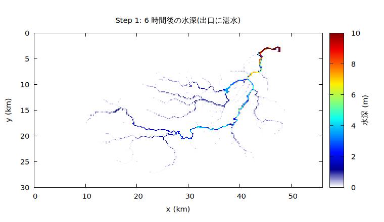

流域出口(北東の隅)の手前に、深さ 25 m を超える湛水が育っています。
壁で堰き止められた流出水のこの湛水は、Step 6 で境界条件を設定して
解消します。それまでの Step では、出口の湛水は承知の上で計算を
進めます(上流側の計測にはほとんど影響しません)。

### 窪地除去はなぜ必要か

`&list_geoinfo` の `fn_z` を `Chichibu_200m_raw.tif` に差し替えると、
窪地除去をしていない元の DEM で計算できます(GeoTIFF を読むため、
Step 2 の `param_step2.txt` で試すのが手軽です)。河道の水が出口の池に
ほぼ集まり切るよう計算時間を 12 時間に延ばし(`tt_c = "12 hour"`)、
12 時間後の水深分布を比べると:

| 窪地除去済み(filled) | 未処理(raw) |
|---|---|
| 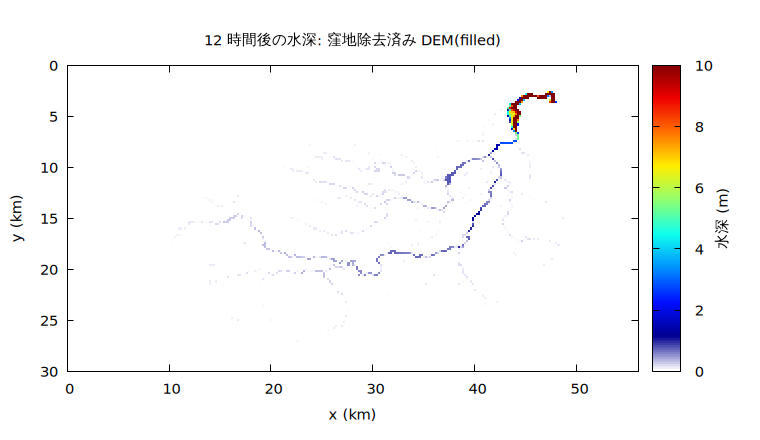 | 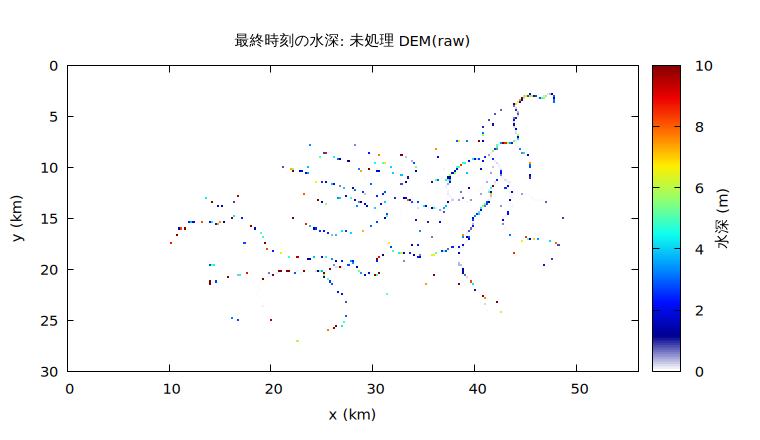 |

filled では流域がほぼ真っ白です — 降った水が斜面から河道へ、河道から
下流へと正しく流下しきって、(出口が壁のこの段階では)出口の湛水
一点に集まっています。raw では流域のあちこちに色が散在します —
水が途中の窪地に捕まってしまい、出口までたどり着けません。流速の
最大値も末期には 0.9 m/s 程度まで落ち、流域全体で流れが死んでいる
ことがわかります。

一般に、地形の勾配が大きくセルサイズも大きい場合、DEM の階段状の
段差が大きくなります。段差が水深のオーダーを超えると水の流れは
著しく阻害されるため、**流出計算には事前の窪地除去が必須**です。

窪地は計算の安定性の面でも危険です。流出先のない窪地では水深が
増え続け、浅水方程式の波速(≒ √(gh))が水深とともに大きくなる
ため、クーラン数 Cn(= 波速 × dt / セルサイズ)が増加して安定条件
(Cn ≲ 1)が破綻しやすくなります
([時間刻みの章](../../docs/users_guide/time.md))。
この連鎖は窪地に限らないトラブルシューティングの定石でもあります:
**計算が破綻(発散)したときは、まず「どこかで水深が増える →
波速が増す → 安定条件の破綻」を疑ってください**。画面の Cn_max 列で
増加傾向を確かめ、最大水深 H9999 の分布で水が異常に溜まる場所を
探すのが第一歩です。

なお、格子に対して斜め方向に水が移動できない通常の構造格子モデルでは、
一般的な GIS ソフトの D8 法(8 方向流下)で窪地除去した DEM でも
斜め方向の流路で水が引っ掛かるため、追加の窪地処理や解像度の引き上げが
必要になることがあります。ENC 格子は 8 方向に水をやり取りできるため
D8 と相性が良く、**D8 で窪地除去した DEM がそのまま使えます**。

このことは実験で確かめられます。`fn_enc = "-"` と `&list_enc` の
`p_diagratio = 0.0` を指定すると、ENC 格子の対角方向の交換を閉じた
「4 近傍」の計算になります。同じ窪地除去済み DEM でも、水は斜め方向の
流路で引っ掛かり、12 時間後の水深は raw のときと同じように流域中で
寸断されて出口に届きません(末期の最大流速も 0.7 m/s 程度まで落ち、
流れが死にます)。

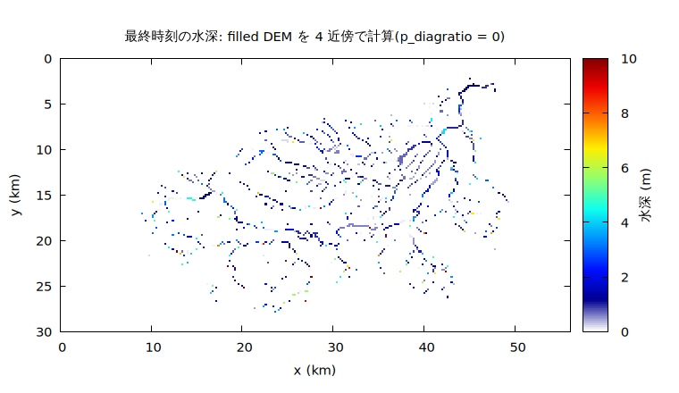

## Step 2: GeoTIFF 入出力と河道の表現

`param_step2.txt` では、入出力を GeoTIFF に切り替え、河道マスクと
粗度を追加します。

```
&list_sysparam
  ...
  f_input_mode = 4           ! matrix入力形式(1:text, 2:bil, 4:geotiff)
  f_output_mode = 5          ! matrix出力形式(1:text, 2:bil, 4:geotiff)
/

&list_geoinfo
  ...
  f_rntype = 0         ! 粗度係数タイプ (0:デフォルト固定値, 1:ファイル)
  rn0 = 0.05           ! 粗度係数固定値
  rn0_rw = 0.02        ! 河道マスク部の固定粗度係数

  fn_z = "Chichibu_200m_filled.tif"        ! 地盤高ファイル名
  fn_mask = "Chichibu_200m_basin.tif"      ! 領域マスクファイル名
  fn_rw = "Chichibu_200m_river.tif"        ! 河道マスクファイル名
/
```

- `f_input_mode = 4` / `f_output_mode = 5` で、分布データの読み書きが
  GeoTIFF になります(出力モード 5 はテキストと GeoTIFF の両方を出力)。
  出力された `.tif` は座標参照情報を引き継ぐので、**QGIS などの GIS に
  ドラッグするだけで地図に重なります**。
- 粗度は「基本 `rn0 = 0.05`(山地・原野相当)、河道セルだけ
  `rn0_rw = 0.02`(河道相当)で上書き」という 2 段構えです。
  `rn0_rw` は粗度の与え方(固定値・ファイル)によらず河道セルを
  上書きします。
- 河道マスク `fn_rw` はこの段階では粗度の差し替えにだけ使っています。
  地形からの掘り込み(`depth_rw`)やサブグリッド河道(`fn_channel`)
  へは、ここから段階的に精緻化できます([ユーザーガイド](../../docs/users_guide.md))。

2 つのマスクを図にすると次のようになります(値 1 のセルだけを塗って
います)。

| 流域マスク `Chichibu_200m_basin` | 河道マスク `Chichibu_200m_river` |
|---|---|
| 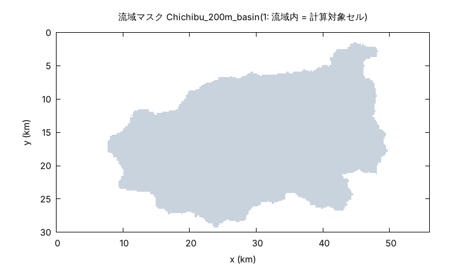 | 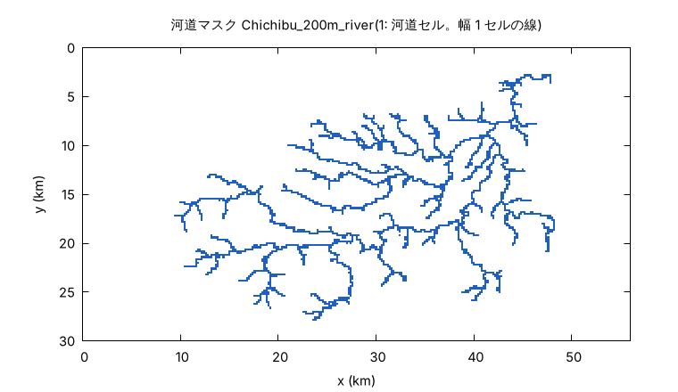 |

流域マスクで塗られたセルが計算対象で、Step 1 の画面に出た
`number of valid cells: 17885` はこのセルの数です。河道マスクは
河道網を**幅 1 セルの線**として与えていて、このセルだけ粗度が
`rn0_rw` に置き換わります。どちらも「1 か 0 か」だけのラスタで、
GIS で作ったものをそのまま渡しています(河道の幅や河床高は
持たせていません — 200 m 格子では河道はセル幅より細いので、
「どのセルが河道か」だけを与えて粗度で表現します)。

実行すると、画面の数値は Step 1 と少し変わります(河道の粗度が変わった
ため)。結果ディレクトリには `H0001.tif` などが並びます。

## Step 3: 計測と分布出力

流量や水深の時系列がほしい場所は、あらかじめ**プローブ**(点)と
**フラックス測線**(線)で指定しておきます。`param_step3.txt` では
本川に沿って 4 点・4 本を置きました。

```
&list_sysparam
  ...
  dt_recrd_c = "1 min"       ! プローブ出力時間刻み

  f_out_h = 1                ! ファイル出力(水深H0001)
  f_out_vv = 1               ! ファイル出力(流速絶対値V0001)
  f_out_qq = 1               ! ファイル出力(流量絶対値Q0001)
  f_out_cn = 1               ! ファイル出力(クーラン数Cn0001)
  f_out_hmax = 1             ! ファイル出力(最大水深H9999)
  f_out_vvmax = 1            ! ファイル出力(最大流速V9999)
/

&list_record
  ! プローブの位置のタイプ (0:セル番号, 1:実座標(m))
  ! プローブの位置 (x座標, y座標)
  pbxytype = 0
  pbxy(:,1) =  82, 105
  pbxy(:,2) = 107, 102
  pbxy(:,3) = 147, 104
  pbxy(:,4) = 216,  39

  ! フラックス測線の座標のタイプ (0:セル番号, 1:実座標(m))
  ! フラックス測線の始点終点 (右岸x, 右岸y, 左岸x, 左岸y)
  flxytype = 0
  flxy(:,1) =  82, 107,   82, 103
  flxy(:,2) = 107, 103,  107, 100
  flxy(:,3) = 147, 105,  147, 102
  flxy(:,4) = 216,  43,  216,  37
/
```

セル番号は Fortran の流儀で **1 スタート**です(QGIS のラスタの
行列番号は 0 スタートなので、GIS で調べたセル番号を使うときは
1 を足してください)。測線は「始点から終点に向かって右側が正」
なので、右岸 → 左岸の向きに書くと下流向きの流量が正になります。
実座標(m)での指定(`pbxytype = 1` / `flxytype = 1`)もできます
([ユーザーガイドの計測の章](../../docs/users_guide/record.md))。

測線とプローブを Step 2 の河道マスクに重ねると、次の図になります
(上: 全体、下: 各測線のまわりの拡大。拡大図の軸は**セル番号**で、
上の `flxy` / `pbxy` の数値と直接対応します)。

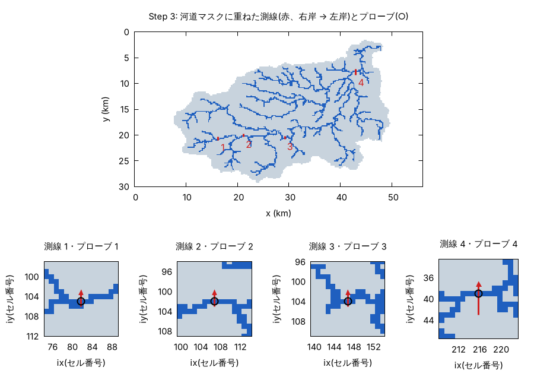

- 測線(赤)は本川を**またぐように**、河道セルの両側の斜面セルまで
  含めて 4〜7 セルの長さにしてあります。河道マスクは幅 1 セルですが、
  洪水時の水は隣のセルにもあふれるので、測線を河道セルだけに
  限ると流量を取りこぼします。矢印の向きが「右岸 → 左岸」で、
  4 本とも南から北へ引いてあります(本川はおおむね西から東へ
  流れるので、下流を向いて右手にあたる南側が右岸です)。
- プローブ(○)は、各測線が河道マスクを横切るセルに置いてあります
  (拡大図で○が青いセルの上に乗っていることを確かめてください)。
  プローブはセル単位の点計測なので、1 セルずれて斜面側に乗ると
  河道の水深・流速はほとんど記録されません(試しに `pbxy(:,3)` を
  `147, 103` にして実行すると、`probes/probe0003.csv` の水深は
  最大でも 1〜2 cm になります)。**設定した位置をこのようにマスクに
  重ねて目で確かめる**のが、計測を置くときの基本動作です。

実行すると、画面の数値は Step 2 と**完全に一致**します — 計測と
ファイル出力は計算そのものには一切影響しません。結果には
`fluxes/flux0001.csv`(測線の流量時系列)と
`probes/probe0001.csv`(プローブの水深・流速時系列)が加わります。

```bash
gnuplot -p -c Plot_flux.plt result
```

で 4 本の測線のハイドログラフを順に表示できます(同梱の
`Plot_flux.plt` / `Plot_map.plt` は結果の目視用スクリプトです)。

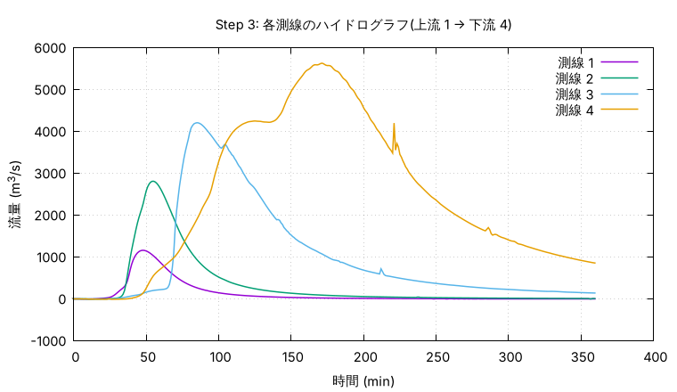

上流の測線 1 から下流の測線 4 へ、洪水波が遅れながら成長していく
流域スケールの洪水追跡が 1 分刻みで得られました。

分布出力の方は、最終時刻と期間最大の 6 枚を 1 画面に並べる
`Plot_step3.plt` で一望できます。

```bash
gnuplot Plot_step3.plt
```

上段が最終時刻の水深・流速・流量、下段が最大水深・最大流速と
最終時刻のクーラン数です。また、Step 1 で使った `Plot_step1.plt` は
第 1 引数で変数を切り替えられるので、`gnuplot -c Plot_step1.plt V`
(または `Q`)とすれば、流速・流量の時間変化も同じ 4 時刻表示で
見られます。

## Step 4: パラメータの調整

Step 3 の画面表示をよく見ると、**ex_flux 列が時間とともに増えて
います**(終盤には 30 分あたり 100 回近く)。ex_flux は「運動方程式から
求めた流出量が、そのセルの水量を上回りかけたので抑制した」回数です。
安全装置なので質量は保たれますが、多発するのは計算が荒れている
サインです。今回の場合、時間刻み dt を小さくする・適応的ルンゲクッタの
閾値 `p_adprunge_thresh` を小さくする、といった定石を試しても
改善しません。効いたのは**限界水深 dd と仮想水深 dv を小さくする**
ことでした。

```
&list_sysparam
  ...
  dd = 0.0001                ! この水深以上なら水の移動を計算する(限界水深)
  dv = 0.0001                ! これ以下なら強制的にこの水深にする(仮想水深)
/
```

デフォルト(いずれも 0.001)を 1/10 にしています。これらの値は
小さいほど薄い水膜まで丁寧に扱うため精度が上がりますが、湿潤セルが
増えて計算時間が延びるケースもあります。精度と速度のバランスで
決めてください(この例題では `param_step4.txt` の実行で
ex_flux が 0 になります)。

なお、以前のバージョンのこのチュートリアルでは、ここで移流項の
風上係数 `p_adv_upwind_index` を下げる調整も行っていました。現在の
既定の移流スキーム(運動量保存形+MUSCL、`f_advection_scheme = 3`)
ではこの係数は使われず(スキーム 1 専用)、風上化の調整は不要です。
移流項そのものを落とした拡散波(`&list_sysparam` の
`f_govequation = 1`)で解くことは引き続き選択肢です
([ユーザーガイドの浅水流の章](../../docs/users_guide/swflow.md))。

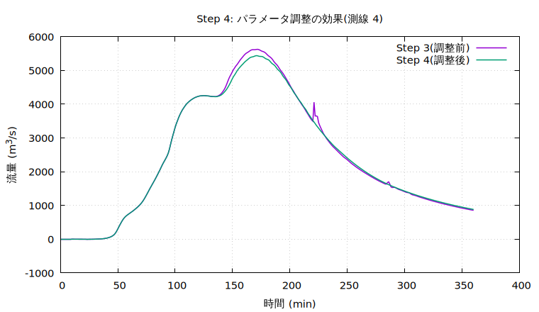

調整後(`param_step4.txt`)は、逓減部の t ≈ 220 min に出ていた
不自然な跳ね(ex_flux が出始めた時間帯に重なります)が消え、波形が
滑らかになりました。ピーク流量の差は 3% ほどです。粗い格子の
実地形計算では、このように**数値設定由来の人工的な変動**が波形に
乗ります。観測ハイドログラフとの比較で粗度を調整する前に、こうした
変動を取り除いておくことが大切です。

## Step 5: 降雨遮断と地下浸透

ここまでの計算は「降った雨が全部流れる」ものでした。実流域では
樹冠による遮断と地中への浸透が流出を減らします。`param_step5.txt`
では、最も簡単な 2 つの損失モデルを重ねます。

```
&list_sysparam
  ...
  fn_intercept = "-"         ! 降雨遮断条件設定ファイル
  fn_gwflow = "-"            ! 地下水条件設定ファイル
/

&list_intercept
  f_icmodel = 1              ! 1:固定遮断率モデル
/
&list_intercept_fixed
  ic_alpha = 0.2             ! 遮断率(有効雨量 = (1-α)P)
/

&list_gwflow
  f_gwvertical = 1           ! 1:バケツモデル
/
&list_gwflow_bucket
  gw_infil_mmh = 5.0         ! 浸透能 (mm/h)
  gw_capacity = 0.2          ! 地下貯留容量(柱状換算水深) (m)
/
```

機能の有効化は ENCflow 共通の流儀で、`fn_*` を書けば有効・書かなければ
完全に無効(メモリも計算時間も追加ゼロ)です。実行すると、画面の
水量表示が 1 列から **3 列**に変わります。

```
time, progress, S_surf(m), S_grnd(m), S_total(m), Runge, ex_flux, Cn_max, h_max(m), V_max(m/s)
  0:00:00.00   0.0%    0.0000     0.0000     0.0000    0.0%      0    0.0000    0.0000    0.0000
  0:30:00.00   8.3%    0.0365     0.0024     0.0389   97.7%      0    0.2653    0.9525    6.8056
  1:00:00.00  16.7%    0.0751     0.0049     0.0800    9.7%      0    0.4797    5.0006   13.5299
  1:30:00.00  25.0%    0.0728     0.0072     0.0800   26.0%  17235    0.5348    6.7023   13.5372
  ...
  6:00:00.00 100.0%    0.0690     0.0110     0.0800   10.1%   7170    0.5027   28.5067    5.6094
```

- `S_surf` は地表水、`S_grnd` は地下貯留、`S_total` はその合計です。
  雨が終わった後の S_total は **0.0800** m で一定 — 総雨量 100 mm の
  8 割、つまり遮断率 α = 0.2 を除いた有効雨量と一致し、地表と地下の
  間で水が移っても合計は保存されていることが確かめられます。
- 時間とともに S_surf が減り S_grnd が増える — 浸透の進行がそのまま
  読めます。

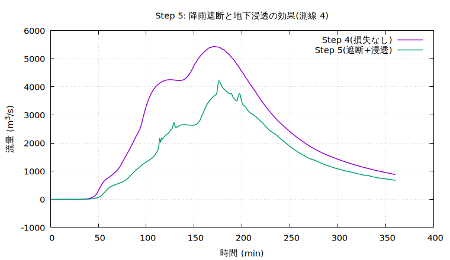

ハイドログラフではピーク流量が 2 割あまり減りました(5,440 → 4,210 m³/s)。
遮断は総量を 2 割削り、浸透は薄く広がる斜面の水を吸い続けるため、
立ち上がりと逓減部の両方が下がります。

2 つ、目につく変化があります。ex_flux 列が 30 分あたり 1〜2 万回に
跳ね上がったこと、そしてハイドログラフに**細かい振動**が乗ったこと
です。これらは Step 6 の後半でまとめて説明します。

## Step 6: 流域出口の境界条件

Step 1 から見て見ぬふりをしてきた出口の湛水(h_max ≈ 28 m)を
解消します。流域出口は計算領域の外縁(4 辺)ではなく領域内部に
あるため、辺の境界条件ではなく**水位規定セル群**を使います。
`param_step6.txt` では、出口の河道セル 2 つの水位を低い値に固定して
「排水口」にします。

```
&list_sysparam
  ...
  fn_boundary = "-"          ! 境界条件設定ファイル
/

&list_bound_stage
  ! 群1: 流域出口(河床より低い水位で完全排水)
  stage_cell(:,1,1) = 239, 19
  stage_cell(:,2,1) = 240, 19
  stage_eta(1) = 111.0
/
```

出口セルの番号は、河道マスクと DEM を GIS で重ねて「流域マスク内で
最も下流の河道セル」を読み取って決めました(前述のとおり 1 スタートに
直すのを忘れずに)。`stage_eta` は標高値で指定します。水位を河床より
低くしたセルは常に空の「完全排水口」になります(ここでは 111 m。
上流側セルの河床 113 m より低いため、届いた水はただちに系外へ
除去されます)。実行すると:

```
time, progress, S_surf(m), S_grnd(m), S_total(m), Runge, ex_flux, Cn_max, h_max(m), V_max(m/s)
  ...
  3:00:00.00  50.0%    0.0620     0.0095     0.0715   20.1%  13922    0.5128    6.4992   13.3706
  6:00:00.00 100.0%    0.0242     0.0110     0.0352   10.1%   7171    0.3209    3.9349    6.9709
```

- S_total が減少に転じました — 出口から系外へ出た水の分です。
- h_max は 28 m から 3.9 m へ。湛水が消えたことは水深分布でも
  確かめられます。

| Step 5(出口なし) | Step 6(完全排水口) |
|---|---|
| 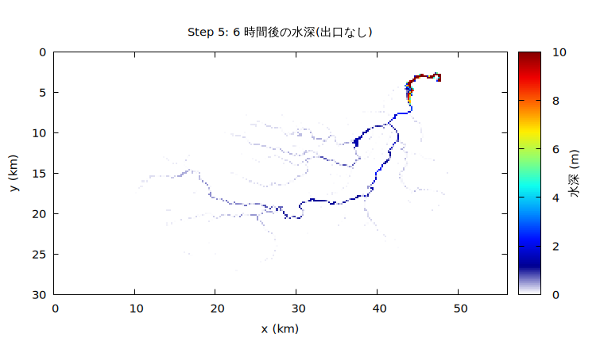 | 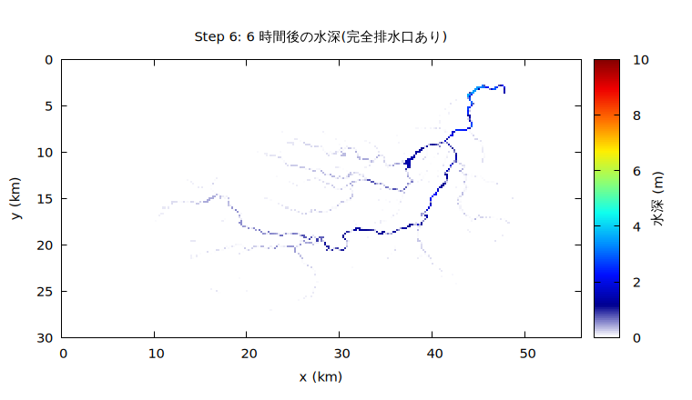 |

上流側の測線 1〜4 のハイドログラフは Step 5 とほとんど変わりません
(出口の湛水は最下流のごく狭い範囲にしか影響しないためです)。

なお、時系列で水位を規定すれば(`stage_val`)、下流河川の水位や
潮位を与える開境界にもなります。辺境界(自由流出・長波放射)、
流入境界などの使い分けは[ユーザーガイドの境界条件の章](../../docs/users_guide/boundary.md)を
参照してください。

### ハイドログラフの細かい振動について

Step 5 以降の 1 分値のハイドログラフには、細かい振動が乗っています。
浸透能を変えても消えず、出口を設けた Step 6 でも残ります。これは
モデルの不具合ではなく、**実地形データを使う流出計算で普遍的に
出会う現象**なので、正体を説明しておきます。

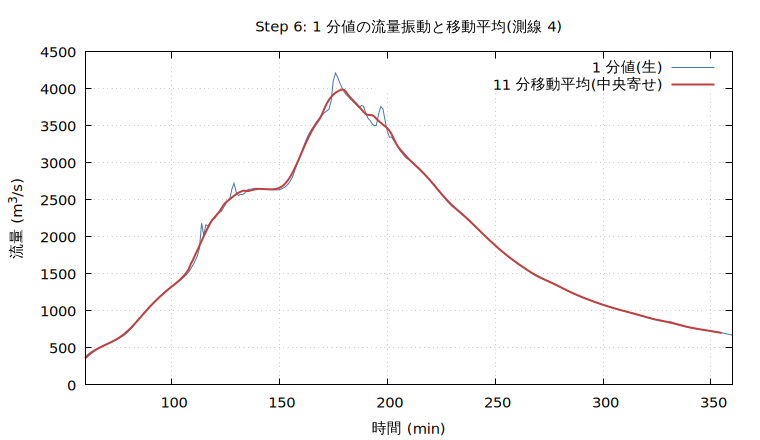

原因は地形データにあります。窪地除去(fill)後の DEM の河道沿いには、
「完全に平坦な区間」が随所にできます(元 DEM が河川水面・峡谷・
貯水池を平坦に記録していた場所や、窪地を埋めた跡)。計算では
この平坦区間に深さ数 m の「池」が湛まり、池は水面動(せいしゅ)や
越流の変動といった応答をもつ振動体になります。地下浸透のような
**面的に分布した損失**が加わると、池とそれをつなぐ急流の水収支が
常時揺さぶられ、下流ほど増幅された振動がハイドログラフに乗ります。
同時に、浸透で水膜が薄くなったセルが安全装置に頻繁に掛かるため
ex_flux も跳ね上がりますが、これは保護機構の正常動作で、質量は
保存されています(S_total 列で確認できます)。

対処は段階的に考えます。

1. **さしあたっては出力の後処理(平滑化)で十分です。** 振動は
   計算の水収支を損なっておらず、流出解析で意味を持つ時間スケール
   (数十分〜)には影響しません。プロット時に移動平均を重ねます。
   同梱の `Plot_ma.plt` がその例で、

   ```bash
   gnuplot -p -c Plot_ma.plt result
   ```

   とすると測線 4 の 1 分値と 11 分移動平均を重ねて表示します。
   スクリプトの中身は次の数行です。

   ```gnuplot
   set datafile separator comma
   N = 11                     # 窓幅(点数)= 11 分
   array A[N]
   ma(x) = (A[(int($0) % N) + 1] = x, $0 < N-1 ? NaN : (sum [i=1:N] A[i]) / N)
   plot "result/fluxes/flux0004.csv" us 2:3 w l title "1 分値", \
        "" us ($2 - (N-1)/2.0):(ma($3)) w l lw 2 title "11 分移動平均"
   ```

   初めて見ると難しそうですが、やっていることは「直近 N 点の平均を
   取って描く」だけです。1 行ずつ読むと:

   - `set datafile separator comma` — 結果の CSV はカンマ区切り
     なので、そう gnuplot に伝えます(既定は空白区切り)。
   - `N = 11` — 平均を取る窓の幅(点数)。出力が 1 分刻みなので
     11 分の平均になります。
   - `array A[N]` — 直近 N 点の値を入れておく箱(配列)です。
     gnuplot 5.2 以降で使えます。
   - `ma(x)` — 平均を計算する関数の定義。gnuplot はデータを 1 行ずつ
     読みながら `$0`(0 から数えた行番号)を更新するので、行番号を
     N で割った余りの位置に値 x を入れると、配列には常に直近 N 点が
     残ります(リングバッファ)。N 点そろうまで(`$0 < N-1`)は
     NaN を返して何も描かず、そろったら N 点の合計 / N を返します。
   - `plot ... us 2:3 w l` — CSV の 2 列目(時刻 min)を x、3 列目
     (流量 m³/s)を y にした生の 1 分値を線(`w l` = with lines)で
     描きます(`us` は `using` の略)。
   - `"" us ($2 - (N-1)/2.0):(ma($3))` — 同じファイル(`""`)を
     もう一度読み、3 列目を `ma()` に通した移動平均を描きます。
     「直近 N 点の平均」は時刻が (N−1)/2 分だけ遅れるので、x 座標を
     その分だけ戻して中央寄せにしています(こうしないとピークの
     時刻がずれて見えます)。

   生値を重ねて描けば、平滑化が何を消したかも読者に見えます。

   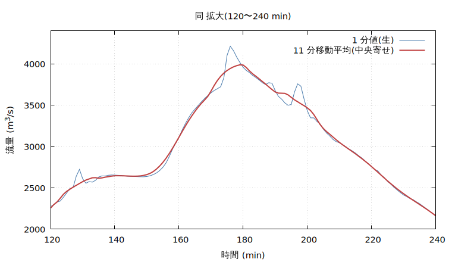

2. **本質的な対策は地形データの改良です。** 河道の縦断勾配が
   単調になるように前処理する(平坦区間の解消)、あるいは河道を
   サブグリッド河道(`fn_channel`)へ移行して河床縦断を独立に
   与えることで、平坦な池そのものをなくせます。

3. 計測位置の選び方でも軽減できます。水深数 m の平坦区間(池)に
   置いた測線は池の水面動を直接拾うので、**縦断勾配のある通常の
   河道区間に測線を置く**のが安全です。

## Step 7: ParaView での 3D 可視化

最後に、分布出力を 3D アニメーションとして眺めます。使うのは
無料の可視化ソフト [ParaView](https://www.paraview.org/)
(Windows / macOS / Linux。インストールは
[インストールガイドの 2 章](../../docs/install.md)を参照)と、
同梱の変換ユーティリティ utils/out2vtk です。

`param_step7.txt` は Step 4 の設定をアニメーション向けに変えた
ものです: 計算時間を 4 時間に短縮し(`tt_c`)、分布出力を 2 分毎に
細かくし(`dt_file_c`)、出力形式を GeoTIFF のみ(`f_output_mode = 4`)
にしています。動きの滑らかさは出力間隔で決まるので、可視化目的の
計算では出力を細かめにします。

### アニメーション用データの作成

まず、このパラメータファイルで計算を実行し、2 分毎の分布出力
(GeoTIFF)を作ります。これがアニメーションの元データです。

```bash
./encflow param_step7.txt
```

`result/` に水深 `H0000.tif` 〜 `H0120.tif`(t = 0 から 2 分毎 × 4 時間
= 121 枚)などの GeoTIFF が並べば準備完了です。

### VTK 形式への変換

ParaView は GeoTIFF の時系列をそのままアニメーションとして扱えない
ので、同梱の変換ユーティリティ out2vtk で VTK 形式に変換します。

```bash
make -C ../../utils/out2vtk install   # 初回のみ: 変換ツールをビルド
../../bin/out2vtk param_step7.txt
```

out2vtk には計算に使ったパラメータファイルをそのまま渡します
(結果ディレクトリと格子情報を引き継ぎます)。`result/vtk/` に
次のファイルができます。

| ファイル | 内容 |
|---|---|
| `flood.pvd` + `flood_0000.vts` 〜 | 水面の時系列(2 分毎の 121 時刻)。pvd がアニメーションの入口 |
| `terrain.vts` | 地形面(3D) |
| `summary.vts` | 最大水深などの統計量 |

流域の外は自動で非表示になります(encflow が常時出力する領域マスク
`X0000` を out2vtk が読み、既定で陸域だけを残すためです)。

### まずは最小の手順で

ParaView を起動して、次の 4 操作だけでアニメーションになります。

1. **File → Open** で `result/vtk/flood.pvd` を開き、**Apply** を押す
2. ツールバーの Coloring を **H**(水深)にする
3. **Edit Color Map**(虹色のアイコン)で **NaN 色を灰色**に変える
   (乾いたセルは水深が NaN で、既定では黄色に塗られるため)
4. **▶(再生)**を押す


これだけで「立体地形に水深の色が張り付いた」画になります。
このファイルの面は水面標高(地盤高+水深)の曲面なので、乾いた
場所は地形の起伏そのもの、濡れた場所だけがわずかに持ち上がります。
マウスのドラッグで回転、ホイールで拡大縮小、タイムラインの時刻は
計算の実時刻(秒)です。前半 30 分で斜面に雨水が広がり、その後
河道網に集まって洪水波が下っていく様子が見えます。

### 見栄えを良くする

上の最小手順に、それぞれ独立に足せる改善です。

- **水を水らしく**: `terrain.vts` も開いて Apply し、Coloring を
  `Solid Color`(灰色系)にする。`flood.pvd` 側は Edit Color Map の
  **NaN の不透明度(Opacity)を 0** にすると乾いた場所が消えて、
  地形の上に水だけが残ります。カラーマップを青系のプリセット
  (Blues など)にするとより水らしくなります。
  (NaN 不透明度の代わりに **Filters → Threshold** で H ≥ 0.01 を
  残す方法もあります。幅 1 セルの河道まで表示したいときは
  Threshold の「All Scalars」のチェックを外してください)
- **起伏の強調**: 両方のオブジェクトに **Filters → Transform** を
  掛け、Scale を `(1, 1, 3)` にする(鉛直 3 倍)。フィルタ適用後は
  元のオブジェクトを目玉アイコンで非表示に。
- **時刻の表示**: **Filters → Annotate Time**。
- **動画ファイルへ**: **File → Save Animation**(連番 PNG や AVI)。


### さらに: 地図・衛星写真の重ね合わせ

`terrain.vts` にはテクスチャ座標が入っており、QGIS で書き出した
同範囲の地図・衛星画像を地形に貼れます(ドレープ)。その手順と、
水膜閾値 `hmin`・変数の絞り込み・海域の扱いなどの設定は
[utils/out2vtk/README.md](../../utils/out2vtk/README.md) を参照して
ください。

## おわりに

このチュートリアルでは、実地形データを使う流域計算の型 —
データ準備(窪地除去)→ 最小構成 → 計測 → 数値設定の調整 →
物理過程の追加 → 境界条件 → 3D 可視化 — を一巡しました。
ここから先は:

- 地下水モデルの精緻化(Green-Ampt、側方流動)、粗度の分布指定、
  サブグリッド河道など —
  [ユーザーガイド](../../docs/users_guide.md)
- 各機能の namelist の書き方 —
  [examples/List_samples/](../../examples/List_samples/)
- 大きな計算を MPI で並列実行するには `mpirun -np 4 ./encflow_mpi
  param_step6.txt`(結果は逐次実行とビット単位で一致します)

この文書の図(`figs/`)は `./Fig_chichibu.sh` で一括再生成できます
(gnuplot が必要です。本文の手順と同じ計算を順に実行して描画します。
Step 7 の 3D 図のみ対象外で、`Fig_step7.py` で再生成できます —
ParaView と同じ VTK ライブラリによる描画です。この後の補足の図は
`./Fig_supp.sh` で別に再生成します)。

## 補足: 解像度の影響と ENC 格子の特性

**ここから先は補足です。** チュートリアルの手順はここまでで完結して
いて、以下は「格子を細かくすると結果はどう変わるのか」「ENC 格子の
8 方向交換は何をもたらしているのか」「移流項は何をしているのか」に
興味のある人が読めばよい内容です。計算の再現には 50 m 格子のケースを
含むため 1〜2 時間かかります。結論だけ知りたい人は、各小節の末尾の
太字と「ENC 格子の特性として理解してほしいこと」を読んでください。

このチュートリアルは 200 m 格子で通してきました。格子を細かくすると
結果はどう変わるのかを、Step 4 の設定(損失なし・出口なし)を
100 m・50 m 格子に移して比べます。地形データは `test/chichibu/` に
ある同じ範囲の 100 m・50 m 版(テキスト形式)を使い、パラメータは
`param_supp_200m.txt` / `param_supp_100m.txt` / `param_supp_50m.txt`
です(200 m 版は Step 4 の設定で入力をテキストに変えただけのもの)。
あわせて、Step 1 の最後に触れた **4 近傍**(`p_diagratio = 0.0`、
斜め方向の交換を閉じた計算)を同じ 3 解像度で実行し、ENC 格子の
8 方向交換が何をもたらしているかを見ます。これら 6 ケース(と後述の
河道幅を揃えた 3 ケース、移流項の扱いを変えた 6 ケース)の実行と作図は
`./Fig_supp.sh` で一括して再現できます(50 m 格子を 5 本含むため、
4 コアのノート PC で 3 時間前後かかります)。

### 測線の対応づけ

4 本の測線とプローブは、Step 3 と**同じ場所**を各格子のセル番号で
指定し直しています(200 m の測線 1 = ix 82 なら、100 m では ix 164、
50 m では ix 327。長さも 1.0〜1.4 km で揃えています)。解像度が
変わると河道マスクの線も引き直されるので、測線が河道を跨いで
いるかを必ず確かめます。下図がその確認で、どの解像度でも測線(赤)は
河道(青)を 1 回だけ横切り、プローブ(○)は河道セルに乗っています。

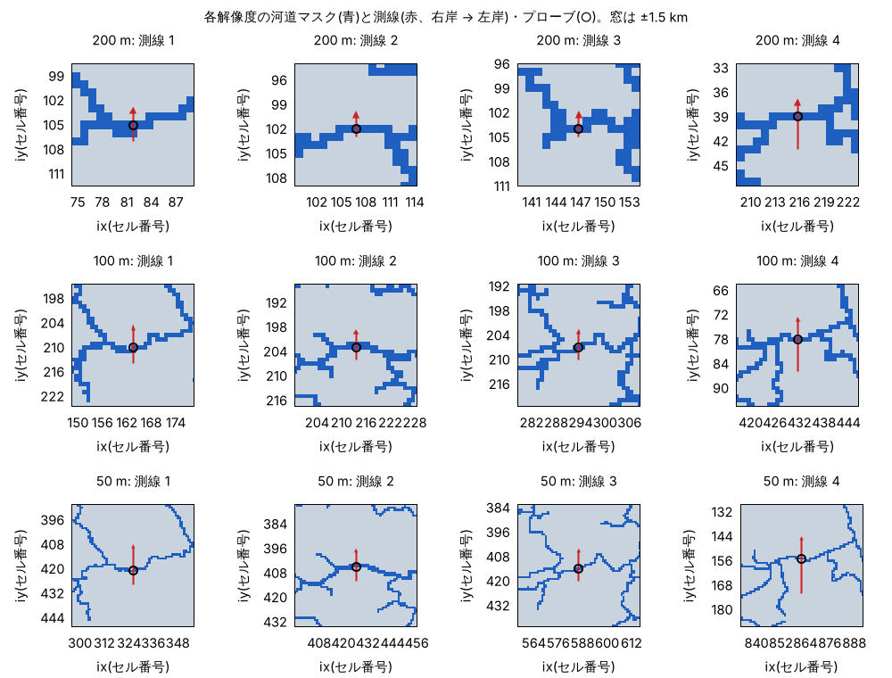

### 時間刻みと計算量

時間刻みは 200 m の 6 s に対し、100 m で 1.5 s、50 m で 0.75 s に
しました。格子比どおり(3 s・1.5 s)に縮めただけでは、100 m の計算が
降雨中に Courant 数 1 を超えて停止します。格子を細かくすると急な
支川の谷筋が解像されて最大流速が増える(200 m で 16 m/s、100 m で
30 m/s、50 m で 34 m/s)ためで、**細かい格子ほど計算量が
「セル数 × ステップ数」の比以上に増える**ことは、解像度を選ぶときに
覚えておく価値があります。

| 格子 | 計算対象セル数 | dt | ステップ数 | 計算時間(ENC、4 スレッド) |
|---|---|---|---|---|
| 200 m | 17,885 | 6 s | 3,600 | 16 s |
| 100 m | 71,486 | 1.5 s | 14,400 | 211 s |
| 50 m | 285,843 | 0.75 s | 28,800 | 1,355 s |

### 結果 1: 解像度を変えると(ENC)

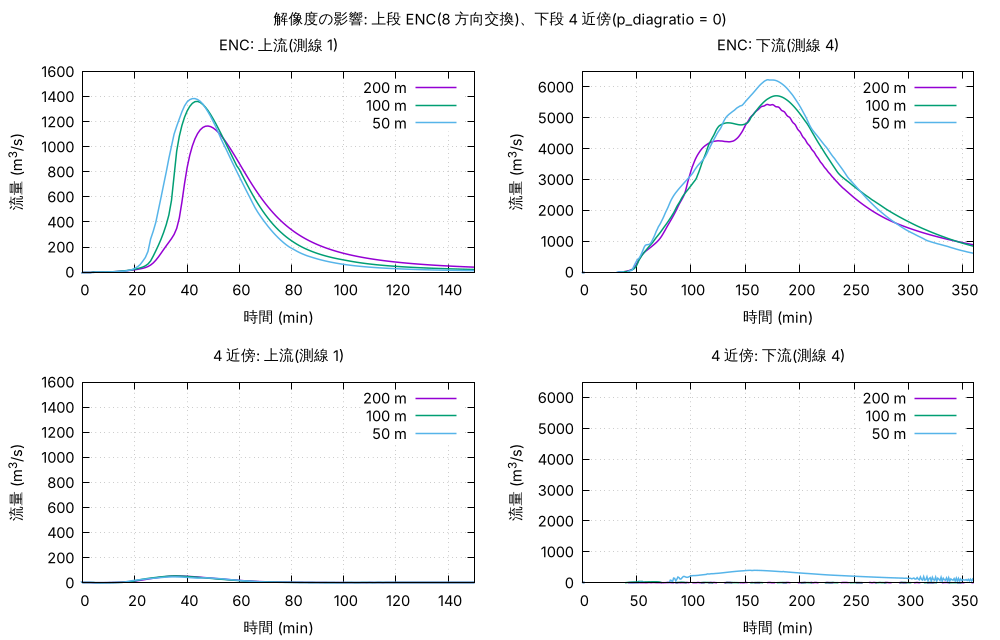

上段が ENC です。測線 1〜4 のピーク流量(m³/s)を表にします
(括弧は 1 段粗い格子からの変化率)。

| 測線(上流 → 下流) | 200 m | 100 m | 50 m |
|---|---|---|---|
| 1(集水面積 小) | 1,165 | 1,361 (+17%) | 1,384 (+2%) |
| 2 | 2,815 | 3,244 (+15%) | 3,333 (+3%) |
| 3 | 4,094 | 4,484 (+10%) | 5,165 (+15%) |
| 4(流域出口近く) | 5,434 | 5,712 (+5%) | 6,232 (+9%) |

- **上流(測線 1・2)**: 格子が粗いほどピークが小さく、200 → 100 m で
  15〜17% 変わりますが、100 → 50 m では 2〜3% しか変わらず、100 m
  以下で収束しています。粗い格子で流出が減る原因は、200 m セルでは
  谷底と斜面が 1 つのセルに混在して、斜面から河道へ水が集まる過程が
  鈍ること(段差が大きくなり、短い支川は 1〜2 セルに潰れる)と、
  河道幅がセル幅になって河道の貯留が増え、小流域の短い波形ほど
  鈍されることにあると推測しています。
- **下流(測線 3・4)**: 200 → 100 m の変化は 5〜10% と上流より小さい
  一方、100 → 50 m でもさらに 9〜15% 増えています。ピークの時刻は
  3 解像度でほとんど変わりません(測線 4 で 170〜180 分)。
  ラスタでは河道幅 = セル幅なので、細かい格子ほど河道が狭く深く
  なり(プローブ 4 の最大水深は 7.3 → 10.3 → 16.3 m)、長い本川を
  下る間の波形の平坦化(河道貯留)が減ることが主因と考えています。
  この推測を確かめるため、サブグリッド河道(`fn_channel`、
  [ユーザーガイドの河道の章](../../docs/users_guide/channel.md))で
  200 m・100 m 格子の河道幅を 50 m 格子と同じ 50 m に揃えて計算して
  みました(`./Fig_supp.sh` が `result_supp_*_w50` として実行します)。
  測線 3・4 のピークは 200 m で 4,258 / 4,868、100 m で 4,063 / 4,756
  となり、**200 m と 100 m の差は 5% 以内に縮まりました** — 河道
  セルの貯留が 2 つの粗い格子の差の主因だったことは確かです。ただし
  どちらも、河道を解像した 50 m 格子(5,165 / 6,232)には届かず、
  ピークは 25〜35 分遅れます。

  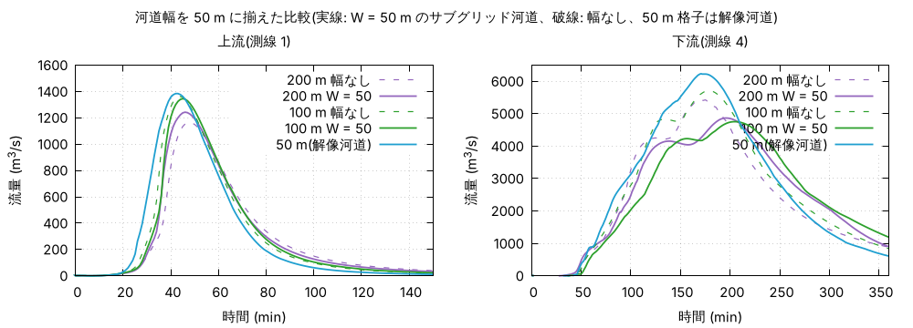

  図では、W = 50 の 200 m と 100 m(実線)が下流でほぼ重なる一方、
  50 m 格子(水色)より低く遅く、幅なし(破線)よりも遅れていることが
  見て取れます(上流の測線 1 では幅の影響はわずかです)。なお、50 m 格子に
  W = 50 m(= セル幅)を与えた計算(図の水色の破線)は解像河道の 50 m 格子と
  重なり、ピークの差は 0.01% 以下、流量の差は最大 1.4 m³/s(2 × 10⁻⁴)でした。
  幅がセル幅に等しいとき、サブグリッド河道は設計どおり解像表現に退化します
  (桁までの一致ではなく、斜めエッジの扱いなどの丸めの差が残ります)。
  幅 50 m の
  サブグリッド河道はセル幅の
  1/4〜1/2 の通水断面に流れを押し込むので、貯留は減っても通水が
  上限に掛かって波が遅れるのに対し、50 m 格子では河道セルの両隣の
  谷底セルも流下に加わります。河道の表現を揃えても、**谷底と斜面が
  どう解像されているかの違い**は残る、ということです。
- どの解像度でも S 列は雨の後 0.1000 m で一定です。総量は同じで、
  違うのは**水の配分と速さ**だけだということを確認してください。

### 結果 2: 4 近傍で同じ計算をすると

下段が 4 近傍で、ピーク流量は次のとおりです。

| 測線 | 200 m | 100 m | 50 m |
|---|---|---|---|
| 1 | 53 | 54 | 47 |
| 2 | 40 | 51 | 61 |
| 3 | 0 | 864 | 324 |
| 4 | 4 | 30 | 402 |

200 m では流域出口近くの測線 4 に 4 m³/s(ENC の 0.1%)しか届かず、
100 m でも 30 m³/s、河道セルが 50 m 幅になる 50 m 格子でようやく
402 m³/s(ENC の 6%)です。**格子を 4 倍細かくしても、4 近傍では
河道網はほぼ寸断されたまま**です。100 m の測線 3 だけ 864 m³/s が
出ているのは、この測線のすぐ上流で河道が格子の行に沿って 1 km ほど
真っすぐ東西に走っているためで、軸に揃った区間は水を通し、斜めの
区間で止まる — 流量が出るかどうかが**解像度ではなく河道の向き**で
決まる、4 近傍の異方性を示しています。

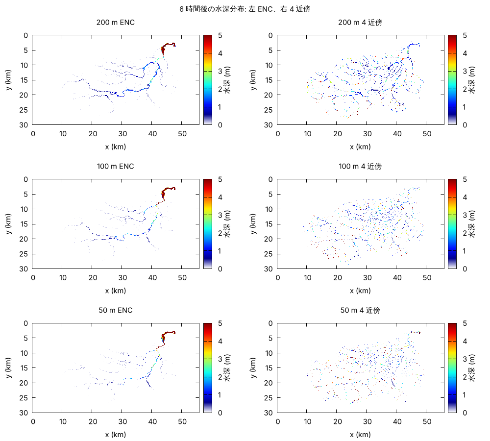

6 時間後の水深分布を見ると、ENC(左)ではどの解像度でも河道の水が
出口に集まって流域は白く抜けているのに対し、4 近傍(右)では河道網の
至る所に点状の湛水が残り、斜めに走る区間ごとに水が止まっています。
この寸断された「池」は Step 6 で説明した流量振動の発生源にもなり、
50 m 格子の 4 近傍のハイドログラフ(測線 4)には振動が見えます。

### 結果 3: 移流項と解像度依存

ここまでの計算は既定の運動量保存形の移流スキーム(`f_advection_scheme = 3`)
でした。同じ 3 解像度を、**移流項を落とした拡散波(局所慣性方程式。
`f_govequation = 1`)**と、**旧移流スキーム(`f_advection_scheme = 1`。
非保存形・風上重み)**でも実行し、移流項の扱いで解像度依存がどう変わるかを
見ます(`./Fig_supp.sh` が `result_supp_*_noadv` / `result_supp_*_s1` として
実行します)。

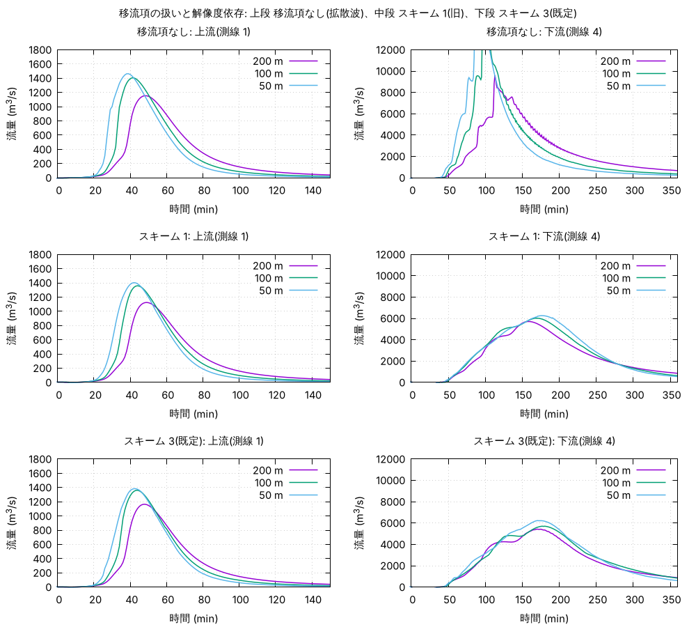

上段が移流項なし、中段がスキーム 1、下段がスキーム 3(既定)で、左が
上流の測線 1、右が下流の測線 4 です。**上段右の縦軸だけ範囲が 2.5 倍**
なことに注意してください。測線 4 のピーク流量(m³/s)とその時刻(min)を
表にします。

| 移流項 | 200 m | 100 m | 50 m |
|---|---|---|---|
| なし(拡散波) | 9,611 @113 | 15,601 @102 | 17,996 @92 |
| スキーム 1(旧) | 5,714 @158 | 6,024 @169 | 6,261 @176 |
| スキーム 3(既定) | 5,434 @170 | 5,712 @178 | 6,232 @180 |

補足として、各計算の最大流速(Log の V_max)は 100 m 格子で移流項なし
41 m/s、スキーム 1 25 m/s、スキーム 3 30 m/s でした。移流項なしの 50 m
格子は dt = 0.75 s では 43 分で発散した(段差で流速が 60 m/s に達し
Courant 数が 1 を超えた)ので、この 1 本だけ dt = 0.4 s にしています。

#### 移流項を落とすと、細かい格子ほどピークが大きく早くなる

移流項なしの拡散波(局所慣性方程式)では、測線 4 のピークは 200 m → 100 m
→ 50 m で 9,611 → 15,601 → 17,996 m³/s、時刻は 113 → 102 → 92 分 と、**格子を細かくするほど大きく早く**なり、既定の
スキーム 3(5,434 → 5,712 → 6,232、時刻はほぼ不変)と比べて解像度依存が
桁違いに強いうえ、値そのものも 2〜3 倍です。理由は次のように考えています。

- 拡散波の流速は、その場の水面勾配と摩擦の釣り合い(Manning 則)だけで
  決まり、慣性(加速に時間がかかること、速い水が遅い水と混ざって減速
  すること)がありません。実 DEM の河床は格子スケールの段差の連なりで
  (100 m 格子の河道セルでは隣接河道セルへの落差が勾配にして中央値
  0.12。developer.md §68.20)、格子を細かくするほど段差が解像されて
  局所の勾配が急になり、河道も狭く深くなります。Manning 則はこれに
  そのまま応答して流速を上げる(上の V_max)一方、現実に段差で起きる
  跳水や乱れによるエネルギー散逸を表す項がないので、波は格子を細かく
  するほど速く、鋭くなります(慣性による制限がないため洪水波が段波に
  成長する。§68.20)。粗い格子では段差が平均化されて平均勾配に近い
  緩い斜面として扱われるため、遅く小さい側に出ます。
- つまり拡散波の解像度依存は、「河床の段差をどこまで解像したか」が
  そのまま流速に反映されることから来ており、格子を細かくしても収束
  しません。既往の拡散波・キネマティックウェーブの流域モデルは、この
  分を**解像度ごとに校正した粗度係数**に吸収させて使うのが普通です。

#### 移流項は何を減速させているのか

このケースで移流項が波を遅く小さくしている中身は、developer.md §68.17〜
68.20 の診断ビルドによる切り分けから、次の 3 つに分けられます。

1. **段差での散逸**: 1 セル水路の階段状河床(test/bendloss の stair3)で、
   移流項なしは段差ごとに過大な流速を出し洪水波が段波に成長するのに
   対し、移流項(運動量保存形)は跳水相当の散逸を与えて波を抑えます
   (ピーク 2.3 倍の差。§68.20)。実 DEM の河床は段差の連なりなので、
   この効果が移流項なしとの差の大部分を占めると考えています。
2. **横流入による減速**: 降雨流出では河道の流量の大半が斜面や支川から
   横に入り、流下方向の運動量を持ちません。運動量保存形はこの水を
   混ぜて河道の水を減速させる項(−u·q_L/h)を自然に含みます(空間変化流
   の解析解に 1〜2% で一致。§68.17)。直感的にも主要な減速要因に見えますが、
   スキーム 1 と 3 の差について測った寄与は約 2 割でした。
3. **浸水した谷底との運動量交換**: 100 m 格子では洪水時の本流断面が
   河道マスクの 1 セルを超えて谷底セルに広がり、その遅い水が屈曲・合流で
   風上側の供給元になって運動量を奪います。スキーム 1 と 3 の差の約 65%
   はこれで、供給元を河道セルに限る `f_advection_donor = 1` を試すと
   100 m のピークは +16% 上がります(§68.18、§68.19)。細かい格子ほど
   本流が河道セルに収まるのでこの損失は減り、スキーム 3 のピークが
   解像度とともに緩やかに増える方向と整合します。

#### 「山地の流出では移流項の効果は小さい」と言われる理由

急勾配の河道では、運動方程式の中で河床勾配 S₀ が水面勾配の変化や
速度水頭の変化より圧倒的に大きいため、河床勾配と摩擦の釣り合い
(キネマティックウェーブ)、あるいは水面勾配まで入れた拡散波で、
**区間スケールの波の伝播**が十分に再現できる、というのが根拠です。
数値的な目安としては、Woolhiser & Liggett (1967) の kinematic flow
number k = S₀L/(h Fr²) が 20 を超えればキネマティック近似でよい、
Ponce ら (1978) の T·S₀·√(g/h) ≥ 30 なら拡散波でよい、といった判定が
知られていて、勾配が急で波の時間スケール T(数時間)が水深の時間
スケールより十分長い山地流出はこれを満たします。
ただしこれらは、河床と流れを**区間スケールで滑らかに**見たときの話です。
ラスタ DEM の格子スケールでは河床は段差の連なりで、流れは局所的に
急変流になり、慣性項は無視できる大きさではありません。「移流項の
効果は小さい」は波の運動学の話であって、段差ごとの局所のエネルギー
収支の話ではない、と区別するのがよいと思います。既往モデルではこの
局所の散逸を粗度係数に含めて扱っており、それは工学的に妥当なやり方
です(本書に既往のモデルを低く見る意図はありません)。

#### 1 次元河道モデルとの関係

1 次元河道モデルでも移流項を落とした解析はよく行われます。側方流入
の運動量項(−u·q_L/h)を加えれば、上の 2 の分(ここでは差の 2 割程度)は
取り込めますが、1 の段差での散逸と 3 の谷底との交換は、断面を与えた
1 次元モデルでは別の形(粗度、局所損失係数、複断面の運動量交換)で
与えることになります。したがって側方流入の運動量を入れた 1 次元
モデルは ENCflow の移流項つきの結果に**近づくが同じにはならない**、と
予想しています(未検証)。

#### 解像度依存が小さければ現実に近いと言えるか

言えません。格子を細かくしても答えが大きく動かないことは、物理に
基づくと称するモデルが満たしてほしい性質(収束)ではありますが、
収束先が観測に合う保証はありません(実際 `f_advection_donor` の有無で
100 m のピークは 16% 動きます)。このチュートリアルの流域には観測との
照合がなく、**現実に近いかどうかは未検証**です。一方、拡散波でも解像度
ごとに粗度係数を校正すれば観測に合わせることはできるでしょう。それでも、
解像度を変えるたびに校正し直さなくてよいモデルは、粗い格子で全体を
掴んでから必要な場所だけ細かくする、という使い方ができる点で
**「便利」**です。「便利」であって「正しい」ではない、という区別は
残しておいてください。

#### スキーム 1 の解像度依存

旧スキーム 1 は非保存形で、横流入や谷底との運動量交換を一貫して表せず
(§68.17)、風上重み(`p_adv_upwind_index`)による数値粘性は Δx に比例して
解像度に依存します。このケースの測線 4 では、スキーム 1 のピークは
5,714 → 6,024 → 6,261 m³/s で、スキーム 3 より 5%・5%・0.5% 大きく
12〜10 分早いだけで、格子を細かくするほどスキーム 3 に近づきました。
拡散波に近づく傾向はなく、解像度依存の傾向もスキーム 3 とほぼ同じです。test/chichibu の設定(斜面粗度 0.15、風上
重み 0.1)では 100 m 格子でスキーム 1 が 3 より 41% 大きく 1.2 時間早い
(§68.17)ので、**2 つのスキームの差の大きさはケースに強く依存**します。
このデータだけで数値粘性の解像度依存を切り分けることはできませんが、
ENCflow の「解像度依存が小さい」という性質は、既定の運動量保存形
スキーム(と動的開口補正)を前提にしたものだ、という点は確かです。

#### このケースの特殊性

このケースは 1 時間に 100 mm の雨を損失なしで流し、流域出口近くで
5,000〜6,000 m³/s(比流量 10 m³/s/km² 近く)という極端な流量です。
段差の散逸も横流入も流量とともに効くので、一般的な出水より移流項の
影響が大きく出ていると思われます。穏やかな出水では 3 つの計算の差は
もっと小さいはずで、その確認は読者への宿題にします(`param_supp_*.txt`
の降雨を変えて `./Fig_supp.sh` を再実行するだけです)。

### ENC 格子の特性として理解してほしいこと

- **格子依存が小さい**: 200 → 50 m(セル数 16 倍、計算時間 85 倍)で、
  下流のピークは +15%、上流でも +19%、ピーク時刻はほぼ不変でした。
  流域全体の洪水波の概算なら 200 m 格子で十分に用が足り、上流の
  小流域の絶対値まで欲しいときに 100 m 以下へ進む、という使い分けが
  できます。
- **粗い解像度でも流れが阻害されない**: 多くの構造格子モデルは
  軸方向(4 近傍)の交換が基本で、幅 1 セルの河道を斜めに通せない
  ため、河道網を**別途 1 次元河道モデルとして結合**する必要があります。
  ENC 格子は 8 方向の交換で河道網をラスタのまま流せるので、
  200 m 格子でも**1 次元河道モデルや流下方向(D8)データの導入が
  不要**です。D8 で窪地除去した DEM と河道マスクだけで流域計算が
  成り立つのは、この性質によります。
- **解像度の代償は計算量**: 格子を 1/2 にするとセル数は 4 倍、
  ステップ数は流速の増加に合わせて dt を縮めるため 2〜4 倍になり、
  計算時間は 6〜13 倍になります。まず 200 m 程度で全体の挙動を掴み、必要な場所・目的に
  応じて細かくしていくのが実務的です。
