> English mirror of tutorials/chichibu/README.md (based on commit 957715e). The Japanese file is the master copy.

# Tutorial 2: chichibu -- rain on a real-terrain catchment

We cover the Chichibu catchment in the upper Arakawa River basin
(about 715 km^2) with a 200 m grid, apply a heavy rainstorm
(200 mm/h x 30 min), and compute rainfall runoff and flood wave
propagation. You will learn the standard workflow of a practical
computation with real terrain data, in the following order.

- **Step 1**: Minimal configuration with real terrain data; why
  depression filling is necessary
- **Step 2**: GeoTIFF input/output, channel mask and roughness
- **Step 3**: Measurement (probes and flux transects) and distributed
  output
- **Step 4**: Parameter tuning -- how to read ex_flux, threshold depth
- **Step 5**: Rainfall interception and subsurface infiltration (bucket
  model), the three water-storage columns
- **Step 6**: Boundary condition at the catchment outlet; understanding
  discharge oscillations caused by real terrain data
- **Step 7**: 3D visualization (animation) with ParaView

We assume you have completed the [wave tutorial](../../wave/README.md)
first (it explains how to run the model, the meaning of each screen
column, and the structure of parameter files). All work below is done
in the case directory (`tutorials/chichibu`); run the English parameter
files from there as `./encflow en/param_step1.txt` etc.

## A look at the data

`../data_chichibu/` contains the following raster data.

| Data | Contents |
|---|---|
| `Chichibu_200m_filled.*` | Ground elevation (m), with D8 depression filling applied in GIS software |
| `Chichibu_200m_raw.tif` | Ground elevation (m), original data without depression filling (for a comparison experiment) |
| `Chichibu_200m_basin.*` | Catchment mask (1: inside the catchment, 0: outside) |
| `Chichibu_200m_river.*` | Channel mask (1: channel cell) |

All of them sit on the same grid of **280 x 150 cells (dx = dy =
200 m)** (a 56 km x 30 km domain). Each dataset is provided with the
same contents in three formats -- text (`.txt`), bil (`.bil` + `.hdr`),
and GeoTIFF (`.tif`) -- for practicing the input/output formats.

Data sources: the elevation data were derived from the Digital
Elevation Model of the Fundamental Geospatial Data by the Geospatial
Information Authority of Japan (GSI); the channel mask was derived from
stream-order data
([DOI:10.3178/jjshwr.36.1812](https://doi.org/10.3178/jjshwr.36.1812))
built from the river data of Kokudo Suuchi Jouhou (National Land
Numerical Information).

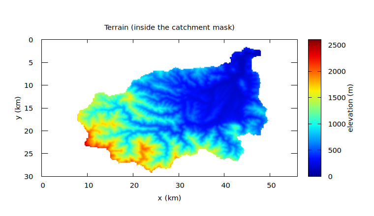

The northeast corner (elevation around 100 m) is the outlet of the
catchment, and peaks of the 2,500 m class line up along the main ridge
in the southwest. Most of the catchment is steep mountainous terrain.

## Step 1: Minimal configuration with real terrain data

### Running

As in wave, create the link to the executable with `make`, then run
`en/param_step1.txt` from the case directory (`tutorials/chichibu`).

```bash
make
./encflow en/param_step1.txt
```

```
reading list_sysparam in en/param_step1.txt
reading list_geoinfo in en/param_step1.txt
 reading data_chichibu/Chichibu_200m_basin.txt
 reading data_chichibu/Chichibu_200m_filled.txt
reading list_precip in en/param_step1.txt
main: number of processes: 1
main: number of threads: 4
main: real precision: 64 bit
main: number of valid cells: 17885
time, progress, S(m), Runge, ex_flux, Cn_max, h_max(m), V_max(m/s)
  0:00:00.00   0.0%    0.0000   0.0%      0    0.0000    0.0000    0.0000
  0:30:00.00   8.3%    0.0487  97.7%      0    0.1487    1.0481    3.2564
  1:00:00.00  16.7%    0.1000  12.3%      0    0.3094    4.6692    6.8169
  1:30:00.00  25.0%    0.1000   6.0%      0    0.3654    7.5746    6.8456
  2:00:00.00  33.3%    0.1000   3.2%      0    0.3760    7.8556    7.1534
  ...
  6:00:00.00 100.0%    0.1000   2.2%     59    0.4852   26.4711    4.1836
main: program terminated normally
```

The contents of `en/param_step1.txt` (the full file, apart from the
title comment at the top) are shown below. It is structured almost
identically to Step 1 of wave; the only differences are that
`&list_geoinfo` reads the terrain and the catchment mask from files and
sets the roughness `rn0`, and that `&list_precip` makes it rain
(`dir_data` in `&list_sysparam` is the input data directory, and the
file names below are relative to it).

```
!======================================================================
! System parameter settings
!======================================================================
&list_sysparam
  dt = 6.0                       ! time step (s)
  tt_c = "6 hour"                ! end time of the computation
  dt_disp_c = "30 min"           ! screen display interval
  dt_file_c = "30 min"           ! file output interval

  fn_geoinfo = "-"               ! geographic information settings file
  fn_precip  = "-"               ! precipitation settings file

  dir_data   = "data_chichibu"   ! input data directory
/

!======================================================================
! Geographic information settings
!======================================================================
&list_geoinfo
  nx = 280
  ny = 150
  dx = 200.0
  dy = 200.0

  f_ztype = 1          ! ground elevation type (0: default constant, 1: file)
  f_masktype = 1       ! domain mask (0: none, 1: catchment mask)
  rn0 = 0.05           ! fixed roughness (typical of mountain slopes; the default 0.015 is for channels)

  fn_z = "Chichibu_200m_filled.txt"        ! ground elevation file name
  fn_mask = "Chichibu_200m_basin.txt"      ! domain mask file name
/

!======================================================================
! Precipitation settings
!======================================================================
&list_precip
  ! precipitation data type (0: no precipitation, 1: uniform, time series)
  prtype = 1
  ! precipitation time series (time (min), intensity (mm/h))
  prval(:,1) =   0,   0
  prval(:,2) =  30, 200
  prval(:,3) =  60,   0
/
```

The screen output tells us the following.

- `number of valid cells: 17885` -- the full grid has 280 x 150 =
  42,000 cells, but thanks to the catchment mask only 17,885 cells are
  actually computed. Cells outside the mask consume neither memory nor
  computation time.
- `rn0 = 0.05` is Manning's roughness coefficient. The default 0.015
  is a channel value; applied to whole mountain hillslopes it makes the
  flow too fast (in this closed vessel with no outlet the water then
  concentrates so much that the computation becomes unstable). Here we
  give 0.05, typical of mountain slopes, and in Step 2 override it for
  the channel cells only.
- The S column grows with the rain and, at t = 1:00 when the rain ends,
  stops exactly at **0.1000** m (= 200 mm/h x 30 min = total rainfall
  of 100 mm averaged over the catchment), remaining constant
  afterwards. By default the outer rim of the computational domain is
  an impermeable wall, so this catchment is a **closed vessel with no
  water outlet**; the constant S column confirms mass conservation.
- Meanwhile the h_max column keeps growing from 8 m to 26 m: the water
  that cannot get out keeps accumulating somewhere.

The depth distribution at the final time (`result/H9998.txt`) shows
where it accumulates (the depth maps use a palette in which zero depth
is white and deeper water is warmer: places the water has drained from
fade to white, and only the places it accumulates take on color). The bundled gnuplot script displays the depth
distributions at four times side by side on one screen (gnuplot is
required; after the plot appears, press Enter in the terminal to
quit; the bundled scripts sit in the case directory, so run this from
there):

```bash
gnuplot Plot_step1.plt
```

You can read how the water gathers from the hillslopes into the
channel network while it rains (t = 0:30, 1:00), drains downstream
after the rain stops (t = 3:00), and finally piles up just short of
the northeast corner.

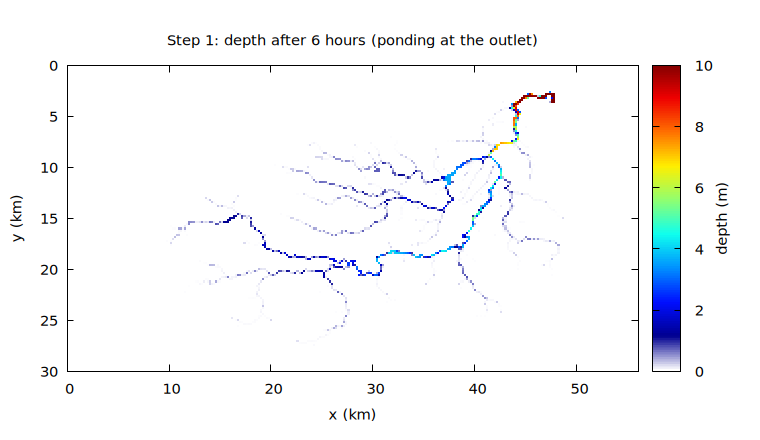

Just upstream of the catchment outlet (the northeast corner), ponded
water over 25 m deep has grown. This ponding of runoff dammed by the
wall will be resolved in Step 6 by setting a boundary condition. Until
then we proceed with the outlet ponding as a known artifact (it hardly
affects the measurements further upstream).

### Why depression filling is necessary

If you replace `fn_z` in `&list_geoinfo` with `Chichibu_200m_raw.tif`,
you can run on the original DEM without depression filling (since this
reads a GeoTIFF, the easiest way is to try it in Step 2's
`en/param_step2.txt`). Extending the computation to 12 hours
(`tt_c = "12 hour"`) so that the channel water has almost all gathered
in the outlet pond, and comparing the depth distributions after 12
hours:

| Depression-filled (filled) | Unprocessed (raw) |
|---|---|
| 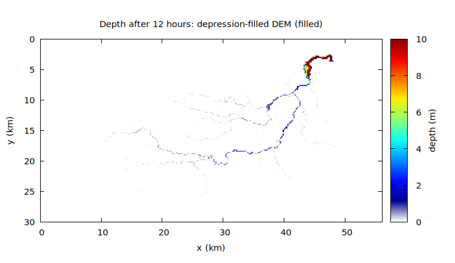 | 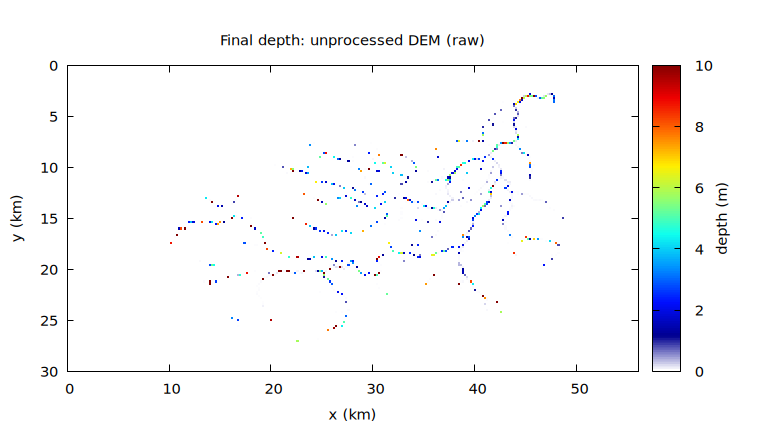 |

With the filled DEM the catchment is almost entirely white: the rain
has drained properly from the hillslopes into the channels and on
downstream, gathering at the single ponded spot at the outlet (which is
still a wall at this stage). With the raw DEM, color is scattered all
over the catchment: the water gets trapped in depressions along the way
and never reaches the outlet. The maximum velocity also drops to
about 0.9 m/s toward the end, showing that the flow has died across the
whole catchment.

In general, when the terrain slope is steep and the cell size is large,
the step-like jumps of the DEM become large. Once the jumps exceed the
order of the water depth, the flow is severely obstructed, so **prior
depression filling is essential for runoff computations**.

Depressions are also dangerous for numerical stability. In a
depression with no outlet the water depth keeps growing, and the wave
speed of the shallow water equations (≈ √(gh)) grows with it, so the
Courant number Cn (= wave speed × dt / cell size) increases and the
stability condition (Cn ≲ 1) becomes easy to violate
(see [the time-step chapter](../../../docs/en/users_guide/time.md)).
This chain is a general troubleshooting rule beyond depressions:
**when a computation blows up (diverges), first suspect "water depth
grows somewhere → wave speed grows → stability condition breaks"**.
Check the Cn_max column on screen for a rising trend, and look for
places where water piles up abnormally in the maximum-depth
distribution H9999 — that is the first step.

Note that in ordinary structured-grid models, where water cannot move
diagonally across the grid, a DEM filled with the common D8
(eight-direction flow) method of GIS software can still leave water
stuck on diagonal flow paths, requiring extra depression processing or
higher resolution. The ENC grid exchanges water in eight directions, so
it is a natural match for D8: **a D8-filled DEM can be used as is**.

You can confirm this by experiment. Specifying `fn_enc = "-"` and
`p_diagratio = 0.0` in `&list_enc` closes the diagonal exchange of the
ENC grid, giving a "4-neighbor" computation. Even on the same
depression-filled DEM, the water now gets stuck on diagonal flow paths:
the depth distribution after 12 hours is chopped up all over the
catchment just like with the raw DEM, and the water never reaches the
outlet (the maximum velocity also drops to about 0.7 m/s toward the end — the flow
dies).

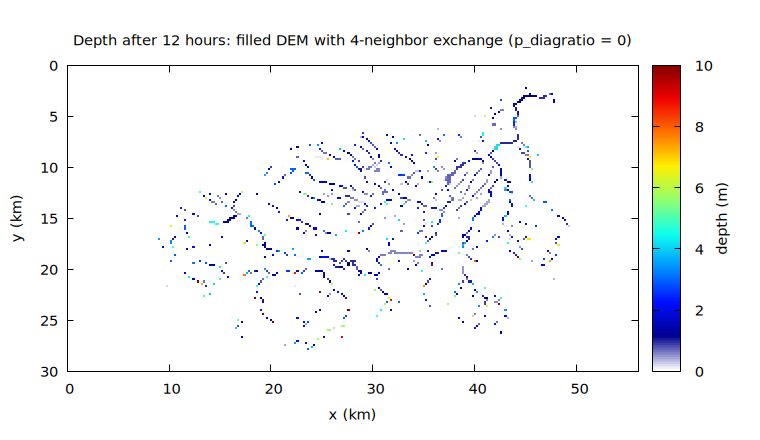

## Step 2: GeoTIFF input/output and representing the channel

`en/param_step2.txt` switches the input/output to GeoTIFF and adds the
channel mask and roughness.

```
&list_sysparam
  ...
  f_input_mode = 4           ! matrix input format (1: text, 2: bil, 4: geotiff)
  f_output_mode = 5          ! matrix output format (1: text, 2: bil, 4: geotiff)
/

&list_geoinfo
  ...
  f_rntype = 0         ! roughness type (0: default constant, 1: file)
  rn0 = 0.05           ! constant roughness value
  rn0_rw = 0.02        ! constant roughness for channel-mask cells

  fn_z = "Chichibu_200m_filled.tif"        ! ground elevation file name
  fn_mask = "Chichibu_200m_basin.tif"      ! domain mask file name
  fn_rw = "Chichibu_200m_river.tif"        ! channel mask file name
/
```

- With `f_input_mode = 4` / `f_output_mode = 5`, distributed data are
  read and written as GeoTIFF (output mode 5 writes both text and
  GeoTIFF). The output `.tif` files carry over the coordinate reference
  information, so **you can simply drag them into a GIS such as QGIS
  and they overlay on the map**.
- Roughness is a two-tier setup: the base value `rn0 = 0.05`
  (mountain/wildland-like) is overridden on channel cells by
  `rn0_rw = 0.02` (channel-like). `rn0_rw` overrides channel cells
  regardless of how roughness is given (constant or file).
- At this stage the channel mask `fn_rw` is used only to swap the
  roughness. From here you can refine step by step toward incision
  below the terrain (`depth_rw`) or subgrid channels (`fn_channel`)
  ([users guide](../../../docs/en/users_guide.md)).

Drawn as figures, the two masks look like this (only cells with value
1 are colored).

| catchment mask `Chichibu_200m_basin` | channel mask `Chichibu_200m_river` |
|---|---|
| 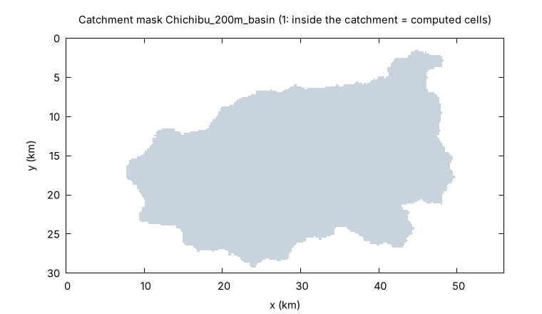 | 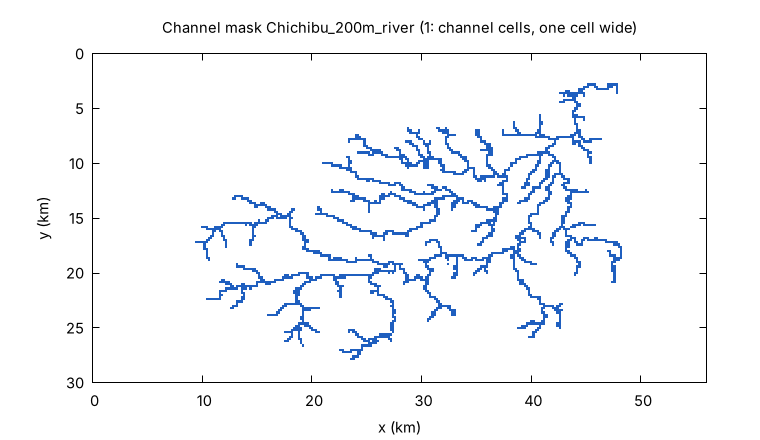 |

The colored cells of the catchment mask are the computed cells; the
`number of valid cells: 17885` printed in Step 1 is the number of these
cells. The channel mask gives the channel network as **lines one cell
wide**, and only these cells get the roughness `rn0_rw`. Both are
plain 1-or-0 rasters, passed on as they were made in a GIS (they carry
no channel width or bed elevation: on a 200 m grid the channels are
narrower than a cell, so we only say *which* cells are channel and
express the channel through its roughness).

When you run it, the numbers on screen change slightly from Step 1
(because the channel roughness changed). The result directory now contains
`H0001.tif` and friends.

## Step 3: Measurement and distributed output

Places where you want time series of discharge or depth are specified
in advance with **probes** (points) and **flux transects** (lines).
`en/param_step3.txt` places four of each along the main stem.

```
&list_sysparam
  ...
  dt_recrd_c = "1 min"       ! probe output interval

  f_out_h = 1                ! file output (depth H0001)
  f_out_vv = 1               ! file output (velocity magnitude V0001)
  f_out_qq = 1               ! file output (discharge magnitude Q0001)
  f_out_cn = 1               ! file output (Courant number Cn0001)
  f_out_hmax = 1             ! file output (maximum depth H9999)
  f_out_vvmax = 1            ! file output (maximum velocity V9999)
/

&list_record
  ! probe position type (0: cell indices, 1: real coordinates (m))
  ! probe positions (x, y)
  pbxytype = 0
  pbxy(:,1) =  82, 105
  pbxy(:,2) = 107, 102
  pbxy(:,3) = 147, 104
  pbxy(:,4) = 216,  39

  ! flux transect coordinate type (0: cell indices, 1: real coordinates (m))
  ! flux transect endpoints (right-bank x, right-bank y, left-bank x, left-bank y)
  flxytype = 0
  flxy(:,1) =  82, 107,   82, 103
  flxy(:,2) = 107, 103,  107, 100
  flxy(:,3) = 147, 105,  147, 102
  flxy(:,4) = 216,  43,  216,  37
/
```

Cell indices are **1-based**, Fortran style (raster row/column numbers
in QGIS are 0-based, so add 1 when using cell indices looked up in a
GIS). For a transect, "the right side looking from the start point
toward the end point is positive", so writing it in the right-bank to
left-bank direction makes downstream discharge positive. Specification
in real coordinates (m) (`pbxytype = 1` / `flxytype = 1`) is also
available ([the record chapter of the users
guide](../../../docs/en/users_guide/record.md)).

Overlaying the transects and probes on the channel mask of Step 2
gives the following figure (top: whole catchment; bottom: close-ups
around each transect. The axes of the close-ups are **cell numbers**,
corresponding directly to the `flxy` / `pbxy` values above).

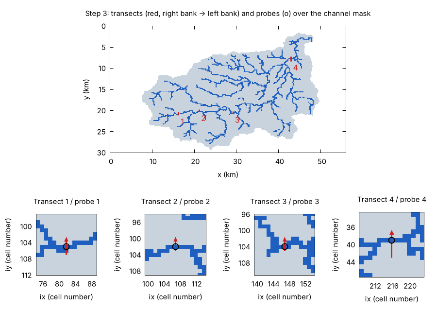

- The transects (red) are 4 to 7 cells long so that they **straddle**
  the main river, including the slope cells on both sides of the
  channel cells. The channel mask is one cell wide, but flood water
  spills into the neighboring cells too, so a transect restricted to
  the channel cells alone would miss part of the discharge. The arrow
  points from the right bank to the left bank; all four are drawn from
  south to north (the main river flows roughly from west to east, so
  the right bank, on your right when facing downstream, is the south
  side).
- The probes (circles) are placed on the cell where each transect
  crosses the channel mask (check in the close-ups that the circles sit
  on blue cells). A probe is a point measurement on a single cell, so
  if it lands one cell off, on the slope side, it records almost none of
  the channel depth and velocity (try setting `pbxy(:,3)` to `147, 103`
  and running: the depth in `probes/probe0003.csv` then stays within
  1 to 2 cm). **Checking the configured positions against the mask by
  eye, as done here,** is the basic routine when placing measurements.

When you run it, the numbers on screen match Step 2 **exactly**:
measurement and file output have no effect whatsoever on the
computation itself. The results now include `fluxes/flux0001.csv`
(transect discharge time series) and `probes/probe0001.csv` (probe
depth and velocity time series).

```bash
gnuplot -p -c Plot_flux.plt result
```

displays the hydrographs of the four transects in turn (the bundled
`../Plot_flux.plt` / `../Plot_map.plt` are scripts for visual
inspection of results; run them from the case directory).

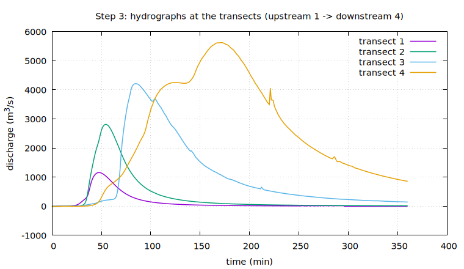

We obtained catchment-scale flood routing at 1-minute resolution, with
the flood wave growing and lagging from upstream transect 1 to
downstream transect 4.

The distributed outputs can be surveyed with `../Plot_step3.plt`,
which arranges six maps of the final-time and maximum fields on one
screen:

```bash
gnuplot Plot_step3.plt
```

The top row shows the final-time depth, velocity and discharge; the
bottom row shows the maximum depth, the maximum velocity and the
final-time Courant number. `Plot_step1.plt` from Step 1 also takes
the variable as its first argument, so `gnuplot -c Plot_step1.plt V`
(or `Q`) shows the time evolution of the velocity or the discharge
with the same four-time layout.

## Step 4: Parameter tuning

Looking closely at the screen output of Step 3, **the ex_flux column
grows over time** (nearly 100 counts per 30 minutes near the end).
ex_flux counts the events where "the outflow computed from the momentum
equation was about to exceed the water volume of the cell and was
therefore limited". It is a safety device, so mass is conserved, but
frequent triggering is a sign that the computation is getting rough. In
this case the usual remedies -- reducing the time step dt, reducing the
adaptive Runge-Kutta threshold `p_adprunge_thresh` -- do not help. What
worked was **reducing the threshold depth dd and the virtual depth
dv**.

```
&list_sysparam
  ...
  dd = 0.0001                ! water movement is computed above this depth (threshold depth)
  dv = 0.0001                ! depths below this are forced to this value (virtual depth)
/
```

The defaults (both 0.001) are reduced to 1/10. The smaller these
values, the more carefully thin films of water are treated, which
improves accuracy; but there are also cases where more wetted cells
mean longer computation time. Choose them as a balance of accuracy and
speed (in this example, running `en/param_step4.txt` brings ex_flux
down to 0).

One more note: earlier versions of this tutorial also lowered the
upwind fraction of the advection term, `p_adv_upwind_index`, at this
point. With the current default advection scheme (momentum-conserving
with MUSCL, `f_advection_scheme = 3`) this coefficient is not used (it
belongs to scheme 1 only), so no upwinding adjustment is needed.
Solving with the diffusive wave (`f_govequation = 1` in
`&list_sysparam`), which drops the advection term altogether, remains
an option ([the shallow-water flow chapter of the users
guide](../../../docs/en/users_guide/swflow.md)).

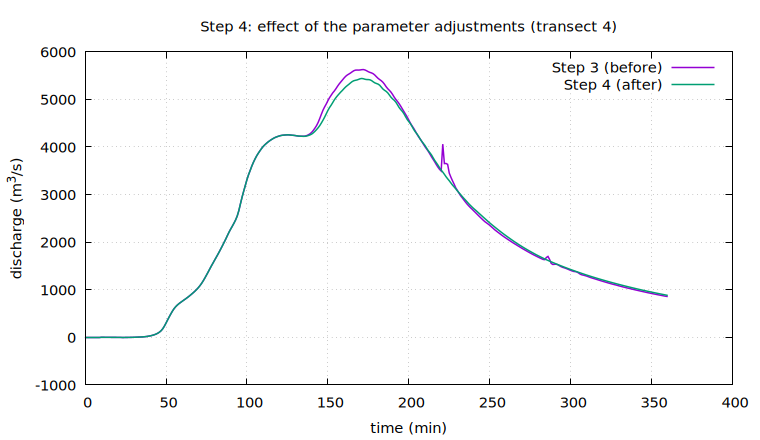

After tuning (`en/param_step4.txt`), the spurious bump that appeared on
the recession limb at t = 220 min or so (in the period when ex_flux
starts to occur) disappears and the waveform becomes smooth. The peak
discharge differs by about 3%. In real-terrain computations on coarse
grids, **artifacts of the numerical settings** ride on the waveform
like this. Before tuning roughness against observed hydrographs, it is
important to remove them.

## Step 5: Rainfall interception and subsurface infiltration

So far, all the rain that fell has run off. In a real catchment,
interception by the canopy and infiltration into the ground reduce the
runoff. `en/param_step5.txt` stacks the two simplest loss models.

```
&list_sysparam
  ...
  fn_intercept = "-"         ! rainfall interception settings file
  fn_gwflow = "-"            ! groundwater settings file
/

&list_intercept
  f_icmodel = 1              ! 1: fixed interception rate model
/
&list_intercept_fixed
  ic_alpha = 0.2             ! interception rate (effective rainfall = (1-alpha)P)
/

&list_gwflow
  f_gwvertical = 1           ! 1: bucket model
/
&list_gwflow_bucket
  gw_infil_mmh = 5.0         ! infiltration capacity (mm/h)
  gw_capacity = 0.2          ! subsurface storage capacity (water-column equivalent depth) (m)
/
```

Enabling features follows the common ENCflow convention: write `fn_*`
to enable, omit it to disable completely (zero additional memory and
computation time). When you run it, the water storage display on screen
changes from one column to **three columns**.

```
time, progress, S_surf(m), S_grnd(m), S_total(m), Runge, ex_flux, Cn_max, h_max(m), V_max(m/s)
  0:00:00.00   0.0%    0.0000     0.0000     0.0000    0.0%      0    0.0000    0.0000    0.0000
  0:30:00.00   8.3%    0.0365     0.0024     0.0389   97.7%      0    0.2653    0.9525    6.8056
  1:00:00.00  16.7%    0.0751     0.0049     0.0800    9.7%      0    0.4797    5.0006   13.5299
  1:30:00.00  25.0%    0.0728     0.0072     0.0800   26.0%  17235    0.5348    6.7023   13.5372
  ...
  6:00:00.00 100.0%    0.0690     0.0110     0.0800   10.1%   7170    0.5027   28.5067    5.6094
```

- `S_surf` is surface water, `S_grnd` is subsurface storage, and
  `S_total` is their sum. After the rain ends, S_total stays constant
  at **0.0800** m -- 80% of the 100 mm total rainfall, i.e. it matches
  the effective rainfall after removing the interception rate
  alpha = 0.2, confirming that the total is conserved even as water
  moves between the surface and the subsurface.
- S_surf decreases and S_grnd increases over time -- you can read the
  progress of infiltration directly.

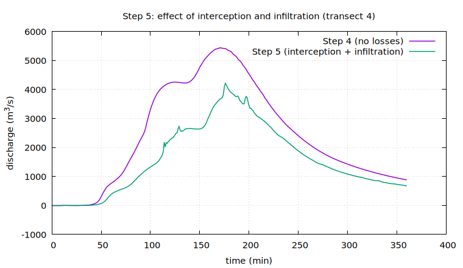

In the hydrograph the peak discharge drops by a little over 20% (5,440
to 4,210 m^3/s). Interception cuts the total by 20%, and infiltration keeps
sucking up the thinly spread hillslope water, so both the rising limb
and the recession drop.

Two changes catch the eye: the ex_flux column jumps to 10,000-20,000
counts per 30 minutes, and **fine oscillations** appear on the
hydrograph. These are explained together in the second half of Step 6.

## Step 6: Boundary condition at the catchment outlet

We now resolve the outlet ponding (h_max of about 28 m) that we have
been turning a blind eye to since Step 1. The catchment outlet is not
on the outer rim (the four edges) of the computational domain but in
its interior, so instead of an edge boundary condition we use
**prescribed-stage cell groups**. `en/param_step6.txt` fixes the water
level of the two outlet channel cells at a low value, turning them into
a "drain".

```
&list_sysparam
  ...
  fn_boundary = "-"          ! boundary condition settings file
/

&list_bound_stage
  ! group 1: catchment outlet (level below the bed for perfect drainage)
  stage_cell(:,1,1) = 239, 19
  stage_cell(:,2,1) = 240, 19
  stage_eta(1) = 111.0
/
```

The outlet cell indices were determined by overlaying the channel mask
and the DEM in a GIS and reading off "the most downstream channel cells
inside the catchment mask" (remember to convert to 1-based indices as
noted above). `stage_eta` is specified as an elevation. Cells whose
prescribed level is below the bed are always empty, acting as a
"perfect drain" (here 111 m, lower than the 113 m bed of the upstream
neighbor cell, so arriving water is removed from the system
immediately). Running it gives:

```
time, progress, S_surf(m), S_grnd(m), S_total(m), Runge, ex_flux, Cn_max, h_max(m), V_max(m/s)
  ...
  3:00:00.00  50.0%    0.0620     0.0095     0.0715   20.1%  13922    0.5128    6.4992   13.3706
  6:00:00.00 100.0%    0.0242     0.0110     0.0352   10.1%   7171    0.3209    3.9349    6.9709
```

- S_total now decreases -- that is the water that left the system
  through the outlet.
- h_max drops from 28 m to 3.9 m. The disappearance of the ponding can
  also be confirmed in the depth distribution.

| Step 5 (no outlet) | Step 6 (perfect drain) |
|---|---|
| 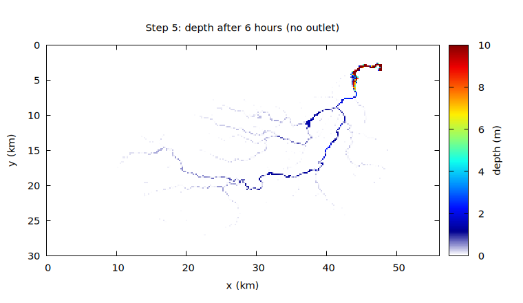 | 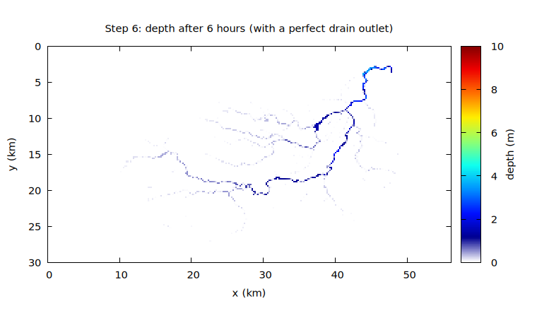 |

The hydrographs at the upstream transects 1-4 barely change from Step 5
(the outlet ponding affects only a very small area at the far
downstream end).

Note that if you prescribe the water level as a time series
(`stage_val`), this also serves as an open boundary supplying a
downstream river stage or a tide level. For the use of edge boundaries
(free outflow, long-wave radiation), inflow boundaries, and so on, see
[the boundary condition chapter of the users
guide](../../../docs/en/users_guide/boundary.md).

### About the fine oscillations in the hydrograph

From Step 5 on, the 1-minute hydrographs carry fine oscillations. They
do not disappear when the infiltration capacity is changed, and they
remain in Step 6 with the outlet in place. This is not a defect of the
model but **a phenomenon you will universally encounter in runoff
computations using real terrain data**, so let us explain what it is.

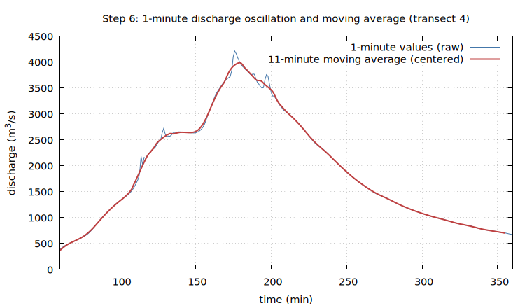

The cause lies in the terrain data. Along the channels of a
depression-filled DEM, "perfectly flat reaches" appear here and there
(places where the original DEM recorded a river water surface, a gorge,
or a reservoir as flat, or where a depression was filled in). In the
computation, a "pond" several meters deep forms on such a flat reach,
and the pond becomes an oscillator with responses such as seiching and
fluctuating overtopping. When a **spatially distributed loss** such as
subsurface infiltration is added, the water balance between the ponds
and the rapids connecting them is constantly perturbed, and the
oscillations, amplified toward downstream, ride on the hydrograph. At
the same time, cells whose water film has been thinned by infiltration
frequently trip the safety device, so ex_flux also jumps up -- but this
is the protection mechanism working normally, and mass is conserved
(as the S_total column confirms).

Deal with it in stages.

1. **For the time being, post-processing (smoothing) of the output is
   sufficient.** The oscillations do not harm the water balance of the
   computation and do not affect the time scales that matter in runoff
   analysis (tens of minutes and longer). Overlay a moving average when
   plotting. The bundled `Plot_ma.plt` is an example:

   ```bash
   gnuplot -p -c Plot_ma.plt result
   ```

   draws the 1-minute values at transect 4 together with their 11-minute
   moving average. The script is just these few lines:

   ```gnuplot
   set datafile separator comma
   N = 11                     # window width (points) = 11 minutes
   array A[N]
   ma(x) = (A[(int($0) % N) + 1] = x, $0 < N-1 ? NaN : (sum [i=1:N] A[i]) / N)
   plot "result/fluxes/flux0004.csv" us 2:3 w l title "1-min values", \
        "" us ($2 - (N-1)/2.0):(ma($3)) w l lw 2 title "11-min moving average"
   ```

   It looks intimidating at first, but all it does is "average the most
   recent N points and draw them". Line by line:

   - `set datafile separator comma` -- the result CSV files are
     comma-separated, so we tell gnuplot so (the default is whitespace).
   - `N = 11` -- the width of the averaging window (in points). The
     output is written every minute, so this is an 11-minute average.
   - `array A[N]` -- a box (array) holding the most recent N values.
     Arrays are available in gnuplot 5.2 and later.
   - `ma(x)` -- the function that computes the average. gnuplot reads
     the data one row at a time and updates `$0` (the row number,
     counted from 0), so storing the value x at the position given by
     the row number modulo N keeps the most recent N points in the
     array at all times (a ring buffer). Until N points are available
     (`$0 < N-1`) it returns NaN, so nothing is drawn; after that it
     returns the sum of the N points divided by N.
   - `plot ... us 2:3 w l` -- the raw 1-minute values, with column 2 of
     the CSV (time in min) as x and column 3 (discharge in m³/s) as y,
     drawn as a line (`w l` = with lines; `us` is short for `using`).
   - `"" us ($2 - (N-1)/2.0):(ma($3))` -- reads the same file (`""`)
     again and draws column 3 passed through `ma()`, i.e. the moving
     average. The "average of the most recent N points" lags by
     (N-1)/2 minutes, so the x coordinate is shifted back by that much
     to center it (otherwise the peak would appear at the wrong time).

   Drawing the raw values on top also shows the reader what the
   smoothing removed.

   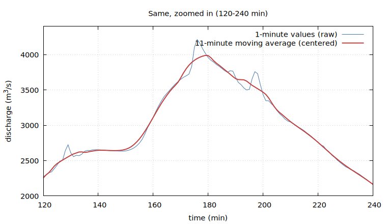

2. **The fundamental remedy is improving the terrain data.**
   Preprocessing the channels so that the longitudinal profile is
   monotone (eliminating the flat reaches), or moving the channels to
   subgrid channels (`fn_channel`) with an independently specified bed
   profile, removes the flat ponds themselves.

3. The choice of measurement locations also mitigates it. A transect
   placed on a flat reach (pond) several meters deep picks up the
   pond's surface motion directly, so **place transects on ordinary
   channel reaches with a longitudinal slope**.

## Step 7: 3D visualization with ParaView

Finally, let us look at the distributed outputs as a 3D animation. We
use the free visualization software
[ParaView](https://www.paraview.org/) (Windows / macOS / Linux; see
section 2 of the [installation guide](../../../docs/en/install.md)
for installing it) and the bundled converter utility utils/out2vtk.

`en/param_step7.txt` is the Step 4 configuration adapted for
animation: the run is shortened to 4 hours (`tt_c`), distributed
output is written every 2 minutes (`dt_file_c`), and the output format
is GeoTIFF only (`f_output_mode = 4`). The smoothness of the animation
is set by the output interval, so runs made for visualization use a
finer one.

### Creating the data for the animation

First, run the computation with this parameter file to produce the
distributed output (GeoTIFF) every 2 minutes. This is the raw material
of the animation.

```bash
./encflow en/param_step7.txt
```

Once `result/` holds the depth files `H0000.tif` to `H0120.tif` (121
files: from t = 0, every 2 minutes for 4 hours) and the other GeoTIFFs,
the data are ready.

### Converting to VTK format

ParaView cannot animate a GeoTIFF time series directly, so we convert
it to VTK format with the bundled converter utility out2vtk.

```bash
make -C ../../utils/out2vtk install   # first time only: build the converter
../../bin/out2vtk en/param_step7.txt
```

out2vtk takes the parameter file used for the computation as it is
(it inherits the result directory and the grid information). The
following files appear in `result/vtk/`.

| file | contents |
|---|---|
| `flood.pvd` + `flood_0000.vts` ... | water surface time series (121 times, every 2 min); the pvd is the entry point of the animation |
| `terrain.vts` | terrain surface (3D) |
| `summary.vts` | statistics such as the maximum depth |

The outside of the catchment is hidden automatically (out2vtk reads
the domain mask `X0000` that encflow always writes, and by default
keeps the land area only).

### Start with the minimal procedure

Launch ParaView; the following four operations already give you the
animation.

1. **File → Open** `result/vtk/flood.pvd` and press **Apply**
2. Set Coloring in the toolbar to **H** (water depth)
3. In **Edit Color Map** (the rainbow icon), change the **NaN color to
   gray** (dry cells carry NaN depth and are painted yellow by default)
4. Press **▶ (play)**

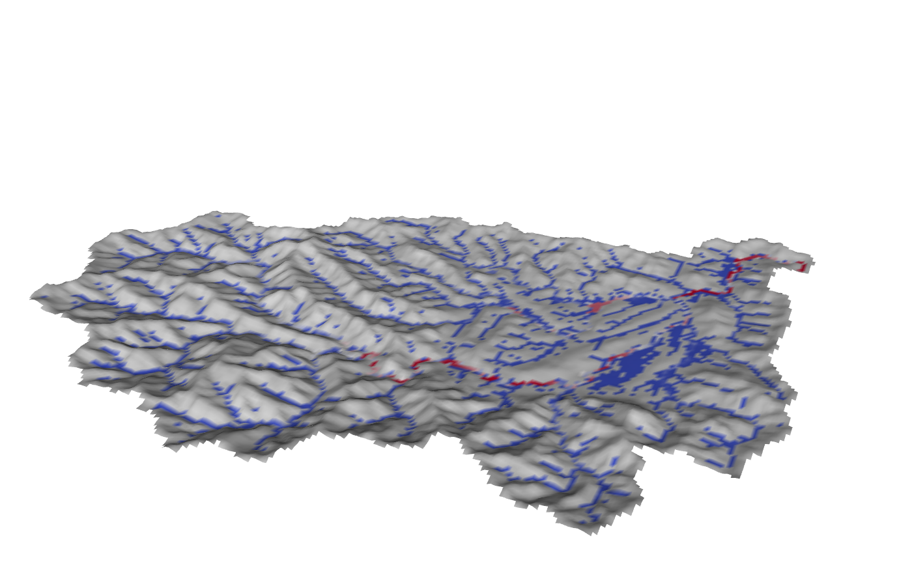

This alone gives a picture of "depth colors draped on the 3D
terrain". The surface in this file is the water surface elevation
(ground elevation + depth), so dry places show the terrain relief
itself and wet places rise slightly above it. Drag to rotate, use the
wheel to zoom; the timeline shows the real time of the computation in
seconds. You can watch the rain spread over the hillslopes in the
first 30 minutes and then gather into the channel network as the flood
wave travels down.

### Making it look better

Independent refinements you can add to the minimal procedure.

- **Water that looks like water**: open `terrain.vts` too, press
  Apply, and set its Coloring to `Solid Color` (grayish). On the
  `flood.pvd` side, set the **NaN opacity to 0** in Edit Color Map so
  that dry places disappear and only the water remains on the terrain.
  A bluish colormap preset (e.g. Blues) makes it more water-like.
  (Instead of the NaN opacity you can use **Filters → Threshold**
  keeping H ≥ 0.01; when channels one cell wide disappear, uncheck
  "All Scalars" in the Threshold panel.)
- **Emphasizing the relief**: apply **Filters → Transform** to both
  objects with Scale = `(1, 1, 3)` (3x vertical exaggeration). Hide
  the original objects with the eye icons after applying the filter.
- **Showing the time**: **Filters → Annotate Time**.
- **To a movie file**: **File → Save Animation** (PNG sequence or AVI).

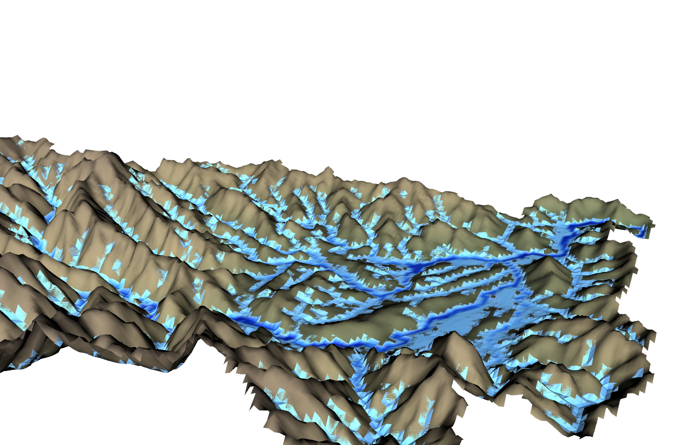

### Further: overlaying maps and satellite imagery

`terrain.vts` carries texture coordinates, so a map or satellite image
of the same extent exported from QGIS can be draped on the terrain.
For that procedure and for settings such as the water-film threshold
`hmin`, variable selection and the handling of sea areas, see
[utils/out2vtk/README.md](../../../utils/out2vtk/README.md)
(in Japanese).

## Closing remarks

In this tutorial we went once around the standard workflow of a
catchment computation with real terrain data: data preparation
(depression filling) -> minimal configuration -> measurement -> tuning
of numerical settings -> adding physical processes -> boundary
conditions -> 3D visualization. From here:

- Refining the groundwater model (Green-Ampt, lateral flow),
  distributed roughness, subgrid channels, and more --
  [users guide](../../../docs/en/users_guide.md)
- How to write the namelists of each feature --
  [examples/List_samples/](../../../examples/List_samples/)
- To run a large computation in parallel with MPI:
  `mpirun -np 4 ./encflow_mpi en/param_step6.txt` (the results match
  the serial run bit for bit)

The figures of this document (`figs/`, i.e. `en/figs/`) can be
regenerated in one go with `./Fig_chichibu.sh` run from the case
directory (gnuplot is required; it runs the same computations as in
the text, in order, and draws both the Japanese and the English
figures). Only the 3D figures of Step 7 are outside its scope; they
are regenerated with `Fig_step7.py`, which draws with the same VTK
library that ParaView uses. The figures of the supplement are
regenerated separately with `./Fig_supp.sh`.

## Supplement: effect of resolution and the character of the ENC grid

**Everything from here on is supplementary.** The tutorial procedure is
complete at this point; the following is for readers who are curious about
how the results change with a finer grid, what the 8-direction exchange of
the ENC grid buys, and what the advection term does. Reproducing the
computations takes one to two hours because they include 50 m grid cases.
If you only want the conclusions, read the bold sentences at the end of each
subsection and "What to take away about the ENC grid".

This tutorial has used a 200 m grid throughout. To see how the results
change with a finer grid, we move the Step 4 configuration (no losses,
no outlet) to 100 m and 50 m grids. The terrain data are the 100 m and
50 m versions of the same area kept in `test/chichibu/` (text format),
and the parameter files are `en/param_supp_200m.txt` /
`en/param_supp_100m.txt` / `en/param_supp_50m.txt` (the 200 m one is
the Step 4 configuration with text input only). We also run the
**4-neighbor** computation mentioned at the end of Step 1
(`p_diagratio = 0.0`, diagonal exchange closed) at the same three
resolutions, to see what the 8-direction exchange of the ENC grid
brings. These six runs (plus the three width-equalized runs and the six
runs with a different treatment of advection described below) and the
figures are reproduced in one go with `./Fig_supp.sh` from the case
directory (it includes five 50 m grid runs, so it takes about three hours
on a 4-core laptop).

### Mapping the transects

The four transects and probes are placed at the **same places** as in
Step 3, re-specified as cell numbers of each grid (transect 1 at
ix 82 on the 200 m grid becomes ix 164 on the 100 m grid and ix 327 on
the 50 m grid; the lengths are kept at 1.0 to 1.4 km too). Since the
channel mask is redrawn when the resolution changes, we always check
that the transects straddle the channel. The figure below is that
check: at every resolution each transect (red) crosses the channel
(blue) exactly once and the probe (circle) sits on a channel cell.

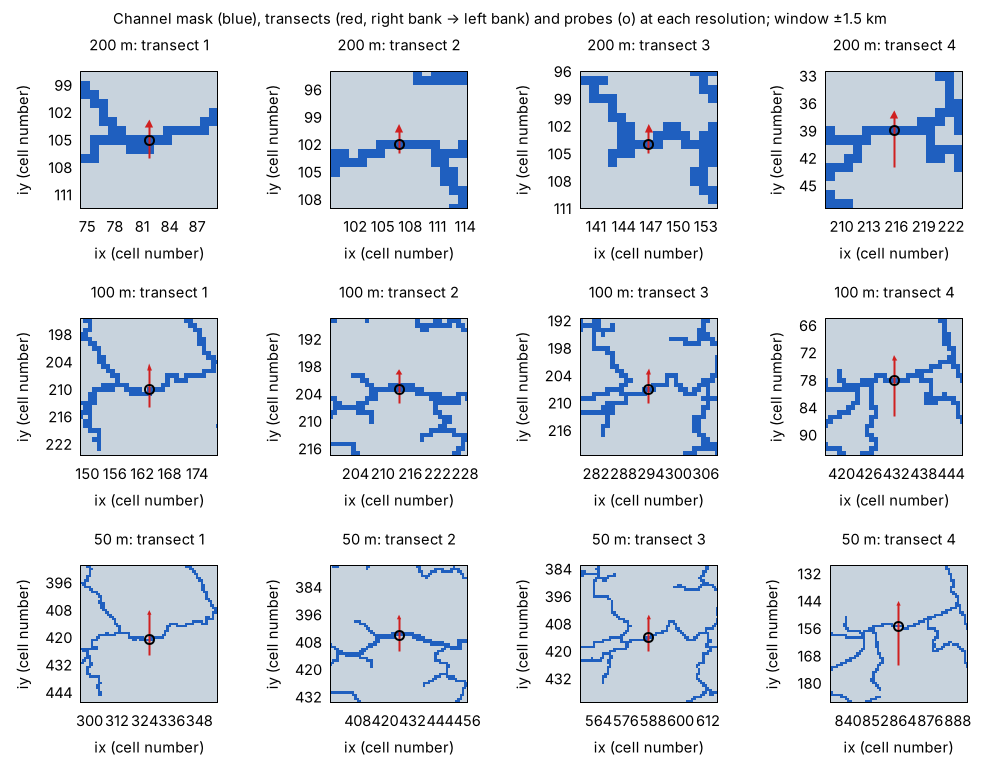

### Time step and computational cost

The time step is 6 s at 200 m, 1.5 s at 100 m and 0.75 s at 50 m.
Shrinking it only in proportion to the grid (3 s and 1.5 s) made the
100 m run stop during the rainfall with a Courant number above 1. A
finer grid resolves the valleys of steep tributaries and the maximum
velocity grows (16 m/s at 200 m, 30 m/s at 100 m, 34 m/s at 50 m), so
**the cost of a finer grid grows faster than "cells x steps"**, which
is worth remembering when choosing a resolution.

| grid | computed cells | dt | steps | run time (ENC, 4 threads) |
|---|---|---|---|---|
| 200 m | 17,885 | 6 s | 3,600 | 16 s |
| 100 m | 71,486 | 1.5 s | 14,400 | 211 s |
| 50 m | 285,843 | 0.75 s | 28,800 | 1,355 s |

### Result 1: changing the resolution (ENC)

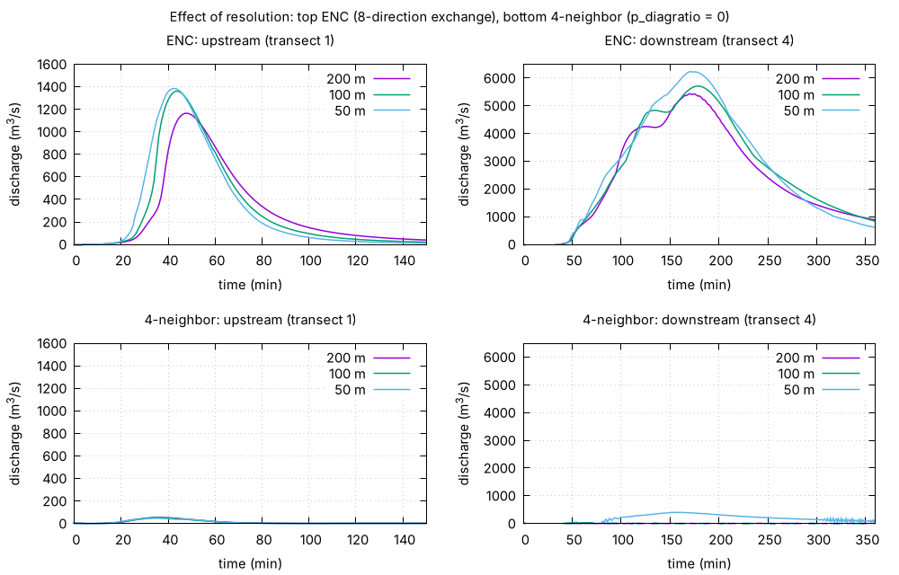

The top row is ENC. The peak discharges (m³/s) at transects 1 to 4 are
tabulated below (in parentheses: change from the next coarser grid).

| transect (upstream to downstream) | 200 m | 100 m | 50 m |
|---|---|---|---|
| 1 (small catchment area) | 1,165 | 1,361 (+17%) | 1,384 (+2%) |
| 2 | 2,815 | 3,244 (+15%) | 3,333 (+3%) |
| 3 | 4,094 | 4,484 (+10%) | 5,165 (+15%) |
| 4 (near the catchment outlet) | 5,434 | 5,712 (+5%) | 6,232 (+9%) |

- **Upstream (transects 1 and 2)**: the coarser the grid, the smaller
  the peak. It changes by 15 to 17% from 200 to 100 m but only by 2 to
  3% from 100 to 50 m, i.e. it has converged at 100 m and below. We
  attribute the smaller runoff on the coarse grid to two things: in a
  200 m cell the valley floor and the hillslopes are mixed in one cell,
  which blunts the concentration of water from the slopes into the
  channel (the steps become larger and short tributaries collapse into
  one or two cells); and the channel width becomes the cell width,
  which increases channel storage and damps the short hydrographs of
  small catchments the most.
- **Downstream (transects 3 and 4)**: the change from 200 to 100 m is
  5 to 10%, smaller than upstream, but the peaks still grow by another
  9 to 15% from 100 to 50 m. The peak times hardly change across the
  three resolutions (170 to 180 min at transect 4). On a raster the
  channel width equals the cell width, so a finer grid makes the
  channel narrower and deeper (the maximum depth at probe 4 is 7.3,
  10.3 and 16.3 m), and we consider the reduced flattening of the
  wave (channel storage) along the long main river to be the main
  cause.
  To test this, we equalized the channel width of the 200 m and
  100 m grids to the 50 m of the 50 m grid with a subgrid channel
  (`fn_channel`, [the channel chapter of the users
  guide](../../../docs/en/users_guide/channel.md); `./Fig_supp.sh` runs
  these as `result_supp_*_w50`). The peaks at transects 3 and 4 become
  4,258 / 4,868 at 200 m and 4,063 / 4,756 at 100 m: **the difference
  between 200 m and 100 m shrinks to within 5%**, so channel-cell
  storage was indeed the main cause of the gap between the two coarse
  grids. Neither, however, reaches the 50 m grid with its resolved
  channel (5,165 / 6,232), and the peaks arrive 25 to 35 minutes later.

  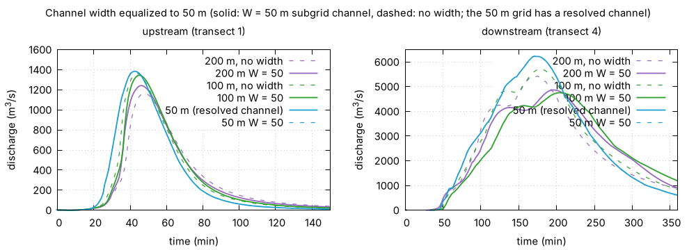

  In the figure, the W = 50 curves of 200 m and 100 m (solid) nearly
  coincide downstream, yet they are lower and later than the 50 m grid
  (light blue) and even later than the no-width runs (dashed); at the
  upstream transect 1 the width hardly matters. Giving the 50 m grid
  W = 50 m (= the cell width; light-blue dashed line) coincides with the
  resolved 50 m grid: the peaks differ by less than 0.01% and the discharge
  by at most 1.4 m³/s (2 × 10⁻⁴). When the width equals the cell width, the
  subgrid channel reduces to the resolved representation as designed (not to
  the last digit; rounding differences such as the treatment of diagonal
  edges remain). A 50 m subgrid channel
  squeezes the flow into a conveyance section of
  1/4 to 1/2 of the cell width, so the storage decreases but the
  conveyance hits its cap and the wave is delayed, whereas on the 50 m
  grid the valley-floor cells on both sides of the channel cell join the
  flow. Even with the channel representation equalized, **the
  difference in how the valley floor and the slopes are resolved**
  remains.
- At every resolution the S column stays at 0.1000 m after the rain.
  The total volume is the same; only **the distribution and the speed
  of the water** differ. Check this yourself.

### Result 2: the same computation with 4 neighbors

The bottom row is the 4-neighbor case, with the following peaks.

| transect | 200 m | 100 m | 50 m |
|---|---|---|---|
| 1 | 53 | 54 | 47 |
| 2 | 40 | 51 | 61 |
| 3 | 0 | 864 | 324 |
| 4 | 4 | 30 | 402 |

At 200 m only 4 m³/s (0.1% of ENC) reaches transect 4 near the
catchment outlet; at 100 m it is 30 m³/s, and on the 50 m grid, where
the channel cells are 50 m wide, it finally reaches 402 m³/s (6% of
ENC). **Even with a grid four times finer, the channel network stays
essentially cut into pieces with 4 neighbors.** The 864 m³/s at
transect 3 on the 100 m grid appears because, just upstream of this
transect, the channel runs straight east-west along a grid row for
about 1 km: reaches aligned with the axes pass water, diagonal reaches
stop it. Whether discharge appears is decided **by the orientation of
the channel, not by the resolution**, which is the anisotropy of the
4-neighbor scheme.

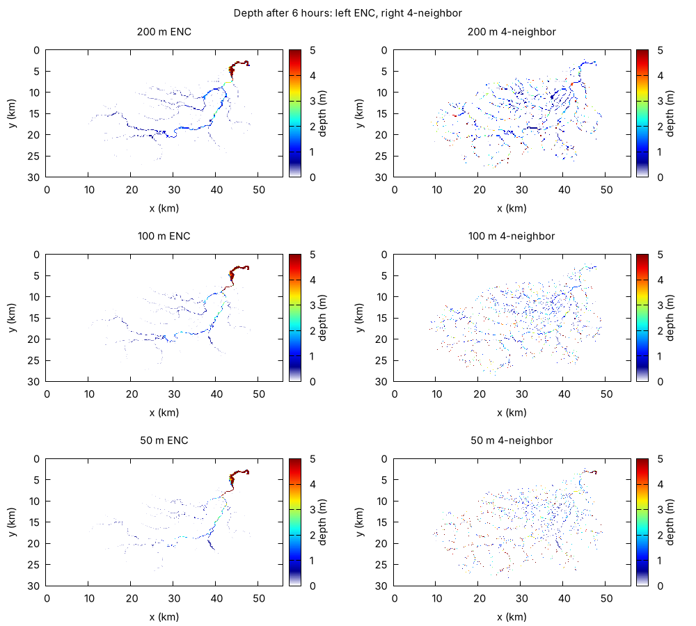

In the depth distributions after 6 hours, ENC (left) has gathered the
channel water at the outlet at every resolution and the catchment is
blank, whereas with 4 neighbors (right) spots of ponded water remain
all over the channel network, stopped at every diagonal reach. These
fragmented "ponds" are also a source of the discharge oscillations
explained in Step 6, and the 4-neighbor hydrograph on the 50 m grid
(transect 4) shows them.

### Result 3: the advection term and resolution dependence

The computations so far used the default momentum-conserving advection
scheme (`f_advection_scheme = 3`). We now run the same three resolutions
with **the advection term dropped (diffusion wave, i.e. the local inertia
equation, `f_govequation = 1`)** and with **the old advection scheme
(`f_advection_scheme = 1`, non-conservative with upwind weighting; the upwind
index `p_adv_upwind_index` is tried at the default 0.5 and at 0.1, the value
used in test/chichibu)** to see how the treatment of advection changes the
resolution dependence (`./Fig_supp.sh` runs them as `result_supp_*_noadv` /
`result_supp_*_s1` / `result_supp_*_s1u`).

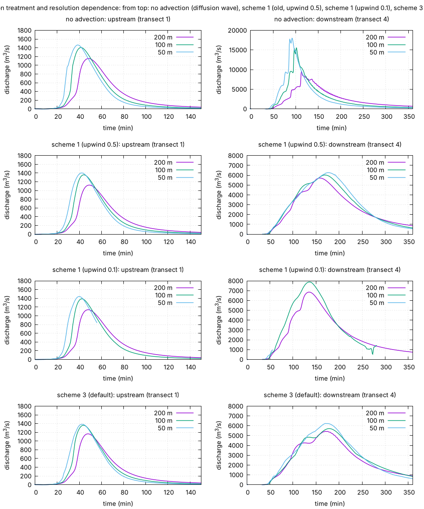

From top: no advection; scheme 1 (upwind index 0.5 = default); scheme 1
(upwind index 0.1); scheme 3 (default). Left: upstream transect 1; right:
downstream transect 4. **Note that the vertical axis of the top-right panel
spans 2.5 times the others.** Peak discharge
(m³/s) and its time (min) at transect 4 (near the basin outlet):

| advection | 200 m | 100 m | 50 m |
|---|---|---|---|
| none (diffusion wave) | 9,611 @113 | 15,601 @102 | 17,996 @92 |
| scheme 1 (old, upwind 0.5 = default) | 5,714 @158 | 6,024 @169 | 6,261 @176 |
| scheme 1 (upwind 0.1) | 6,856 @135 | XXU100 | XXU50 |
| scheme 3 (default) | 5,434 @170 | 5,712 @178 | 6,232 @180 |

For reference, the maximum velocity of each computation (V_max in the Log)
on the 100 m grid was 41 m/s without advection, 25 m/s with scheme 1
(upwind 0.5) and 30 m/s with scheme 3. The 50 m case without advection
diverged after 43 minutes at dt = 0.75 s (the velocity reached 60 m/s at bed
steps and the Courant number exceeded 1), so that one run uses dt = 0.4 s.
Scheme 1 with upwind 0.1 also diverged on the 100 m grid at dt = 1.5 s during
the recession (4.6 h, with 33 m of ponded water at the outlet), so those runs
use dt = 1.0 s at 100 m and 0.5 s at 50 m.

#### Dropping the advection term makes the peak larger and earlier on finer grids

Without the advection term (diffusion wave, local inertia equation), the peak
at transect 4 goes 9,611 → 15,601 → 17,996 m³/s and 113 → 102 → 92 min from 200 m to 100 m to 50 m: **the finer the grid,
the larger and earlier the peak**. The resolution dependence is an order of
magnitude stronger than with the default scheme 3 (5,434 → 5,712 → 6,232,
with the timing almost unchanged), and the values themselves are 2 to 3
times larger. We read this as follows.

- The velocity of a diffusion wave is set only by the local balance of
  water-surface slope and friction (Manning), with no inertia (no time
  needed to accelerate, no deceleration when fast water mixes with slow
  water). The bed of a real DEM is a succession of grid-scale steps (on the
  100 m grid the median drop between adjacent channel cells is a slope of
  0.12; developer.md §68.20). A finer grid resolves more of these steps, so
  the local slopes get steeper and the channel narrower and deeper. Manning
  responds by raising the velocity (see V_max above), while nothing in the
  equations represents the energy dissipated in reality by hydraulic jumps
  and turbulence at the steps, so the wave becomes faster and steeper the
  finer the grid (with no inertial limit, the flood wave grows into a bore;
  §68.20). On a coarse grid the steps are averaged into a gentle slope close
  to the mean, and the wave comes out slower and smaller.
- In other words, the resolution dependence of the diffusion wave comes from
  how much of the bed steps is resolved being passed straight into the
  velocity, and it does not converge with refinement. Existing
  diffusion-wave and kinematic-wave catchment models normally absorb this
  into a **roughness coefficient calibrated for each resolution**.

#### What is the advection term decelerating?

From the diagnostic builds recorded in developer.md §68.17 to §68.20, what
the advection term does to slow and flatten the wave in this case splits
into three parts.

1. **Dissipation at bed steps**: in a one-cell channel with a stepped bed
   (stair3 in test/bendloss), the run without advection produces excessive
   velocities at every step and the flood wave grows into a bore, whereas
   the momentum-conserving advection term supplies a hydraulic-jump-like
   dissipation that holds the wave down (a factor 2.3 in peak; §68.20). Since
   the bed of a real DEM is such a succession of steps, we believe this
   accounts for most of the difference from the run without advection.
2. **Deceleration by lateral inflow**: in rainfall runoff most of the channel
   discharge enters from the side, from hillslopes and tributaries, carrying
   no streamwise momentum. The conservative form naturally contains the term
   that mixes this water in and slows the channel flow (−u·q_L/h; it matches
   the analytic solution of spatially varied flow within 1 to 2%; §68.17).
   Intuitively this looks like the main braking mechanism, but its measured
   share of the scheme 1 vs scheme 3 difference was about 20%.
3. **Momentum exchange with the inundated valley floor**: on the 100 m grid
   the flood cross-section of the main river spreads beyond the single
   channel-mask cell onto valley-floor cells, and at bends and confluences
   that slow water becomes the upwind donor and drains momentum. About 65%
   of the scheme 1 vs scheme 3 difference is this; restricting the donor to
   channel cells (`f_advection_donor = 1`) raises the 100 m peak by 16%
   (§68.18, §68.19). On a finer grid the main river fits within the channel
   cells and this loss shrinks, consistent with the gentle increase of the
   scheme 3 peak with resolution.

#### Why it is said that advection matters little in mountain runoff

In steep channels the bed slope S₀ dominates the momentum equation over the
changes of water-surface slope and velocity head, so the balance of bed slope
and friction (kinematic wave), or the diffusion wave that adds the surface
slope, reproduces **the propagation of the wave at the reach scale** well.
Known quantitative criteria are the kinematic flow number of Woolhiser &
Liggett (1967), k = S₀L/(h Fr²) > 20 for the kinematic approximation, and the
condition of Ponce et al. (1978), T·S₀·√(g/h) ≥ 30 for the diffusion wave;
mountain runoff, with steep slopes and a wave time scale T of hours much
longer than the time scale of the flow depth, satisfies them.
These statements, however, treat the bed and the flow as **smooth at the
reach scale**. At the grid scale of a raster DEM the bed is a succession of
steps, the flow is locally rapidly varied, and the inertia terms are not
negligible. It helps to keep apart "advection matters little" as a statement
about wave kinematics from the local energy balance at each step. Existing
models fold this local dissipation into the roughness coefficient, which is a
sound engineering practice (nothing here is meant to disparage them).

#### Relation to one-dimensional channel models

One-dimensional channel models are also often run without the advection
term. Adding the lateral-inflow momentum term (−u·q_L/h) captures part 2
above (about 20% of the difference here), but the step dissipation of part 1
and the valley-floor exchange of part 3 would have to enter a 1-D model with
prescribed cross-sections in other forms (roughness, local loss
coefficients, compound-channel momentum exchange). We therefore expect a 1-D
model with lateral-inflow momentum to **move toward, but not coincide with**,
the ENCflow result with advection (untested).

#### Does weak resolution dependence mean closeness to reality?

No. A result that moves little under grid refinement is a property one
wants from a model that claims to be physically based (convergence), but
there is no guarantee that the converged value matches observations (the
100 m peak moves by 16% with `f_advection_donor`, for instance). This
tutorial catchment has no comparison with observations, and **closeness to
reality is unverified**. Conversely, a diffusion wave calibrated with a
roughness coefficient per resolution can surely be made to match
observations. Still, a model that need not be recalibrated each time the
resolution changes is **"convenient"**, because one can grasp the whole on a
coarse grid and refine only where needed. Keep the distinction between
"convenient" and "correct".

#### Resolution dependence of scheme 1 and the upwind index

The old scheme 1 is non-conservative; it cannot represent the momentum
exchange with lateral inflow and the valley floor consistently (§68.17), and
the numerical viscosity of its upwind weighting (`p_adv_upwind_index`) scales
with Δx and therefore with resolution. The upwind index changed the result a
great deal.

- **Upwind 0.5 (default)**: the transect 4 peak goes 5,714 → 6,024 → 6,261
  m³/s, only 5%, 5% and 0.5% larger than scheme 3 and 12 to 10 minutes
  earlier. It approaches scheme 3 as the grid is refined, with the same
  trend of resolution dependence as scheme 3.
- **Upwind 0.1**: 6,856 → XXU100 → XXU50 m³/s, XXUDIFF larger than scheme 3
  and XXUTIME earlier. **The finer the grid, the further it moves away from
  scheme 3 toward the run without advection**, the same trend as recorded
  with the settings of test/chichibu (hillslope roughness 0.15, upwind 0.1):
  "scheme 1 is 41% larger and 1.2 hours earlier than scheme 3 on the 100 m
  grid" (§68.17).

The difference is explained by the amount of numerical viscosity. A larger
upwind weight means a numerical viscosity proportional to Δx·u that smooths
velocity extremes and the accelerations at steps, which incidentally acts
like the step dissipation (item 1 above). A smaller weight removes this
"accidental dissipation", leaving the momentum losses that the
non-conservative form cannot represent (items 2 and 3) missing, so the wave
becomes faster and larger. Since the numerical viscosity itself shrinks with
Δx, with upwind 0.1 the result approaches the diffusion wave as the grid is
refined. The resolution dependence of scheme 1 thus comes both from the
physical approximation (non-conservative form) and from the numerical
viscosity (upwind weight × Δx), and the result moves with the choice of the
upwind weight: a scheme that carries one extra calibration parameter. The
weak resolution dependence of ENCflow presupposes the default
momentum-conserving scheme (and the dynamic opening correction).

#### What is special about this case

This case routes 100 mm of rain in one hour with no losses and produces
5,000 to 6,000 m³/s near the basin outlet (a specific discharge close to
10 m³/s/km²), an extreme flow. Both the step dissipation and the lateral
inflow scale with discharge, so the influence of the advection term is
probably larger here than in an ordinary flood. For a milder event the three
computations should differ much less; checking this is left to the reader
(change the rainfall in `param_supp_*.txt` and rerun `./Fig_supp.sh`).

### What to take away about the ENC grid

- **Weak grid dependence**: from 200 to 50 m (16 times the cells, 85
  times the run time) the downstream peak changed by +15% and the
  upstream one by +19%, with the peak times almost unchanged. For an
  estimate of the flood wave over the whole catchment a 200 m grid is
  enough; go to 100 m and below when the absolute values in small
  upstream catchments matter.
- **Flow is not obstructed even at coarse resolution**: most
  structured-grid models exchange water along the axes only (4
  neighbors) and cannot carry a one-cell-wide channel diagonally, so
  the channel network has to be **coupled separately as a 1D channel
  model**. The ENC grid carries the channel network as a raster through
  its 8-direction exchange, so **no 1D channel model or flow-direction
  (D8) data are needed** even on a 200 m grid. That a catchment
  computation works with nothing but a D8-filled DEM and a channel
  mask rests on this property.
- **The price of resolution is computation**: halving the grid
  multiplies the cells by 4 and, because dt must shrink with the
  growing velocities, the steps by 2 to 4, so the run time grows 6 to
  13 times. In
  practice, first grasp the overall behavior at about 200 m, then
  refine where the location and purpose require it.
