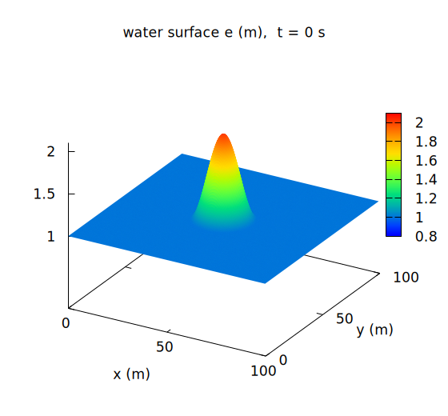
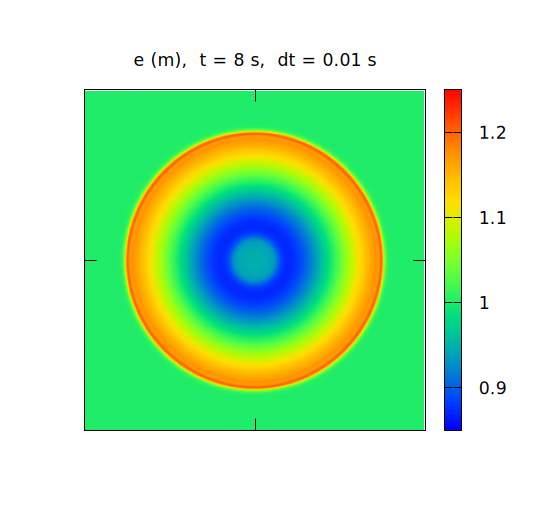
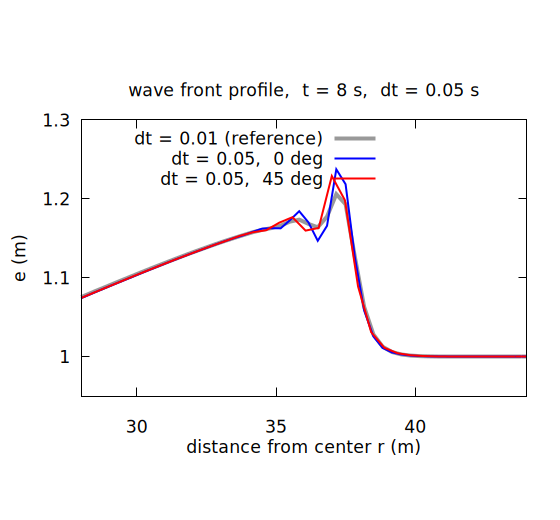
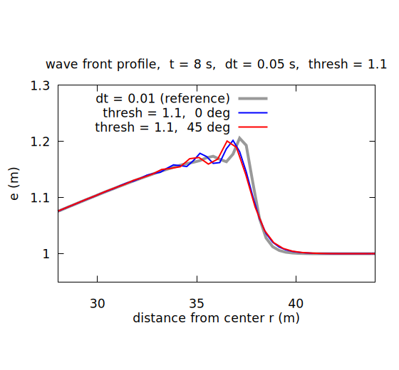
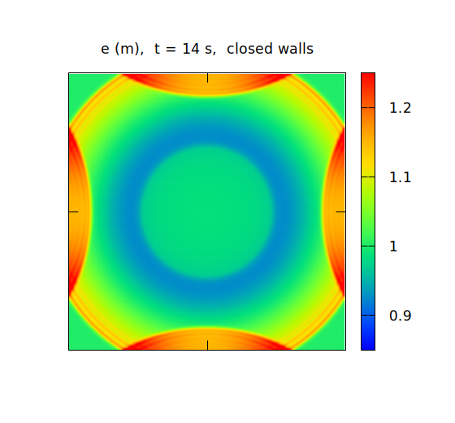
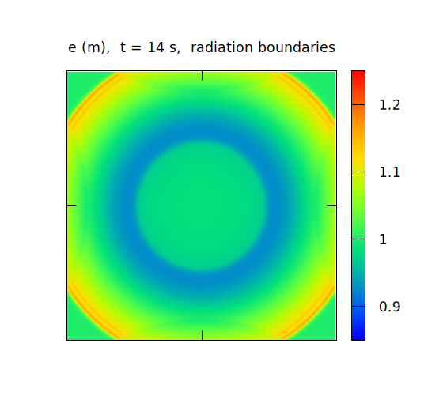
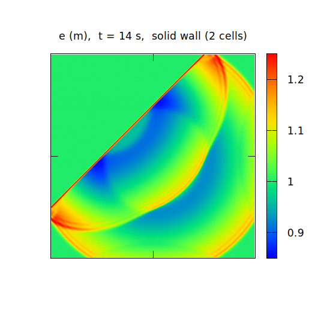
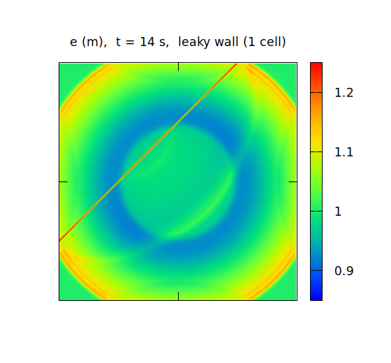

# チュートリアル 1: wave — 静水に広がる波

静水面に立てた「水の山」が崩れ、同心円状の波となって広がる —
ENCflow の最小構成の例題です。地形も降雨もない正方形の水槽ひとつで、
次のことを学びます。

- **Step 1**: 実行のしかた、出力の読み方、パラメータファイルの構造
- **Step 2**: 時間刻みと精度、適応的ルンゲクッタ法(ENC パラメータ)
- **Step 3**: 境界条件の設定(壁面と長波放射)
- **Step 4**: ENC 格子ならではの壁の性質(不透過壁と半透過壁)

コンパイラの準備は [インストールガイド](../../docs/install.md) を
参照してください。結果の可視化には gnuplot を使います(インストール
方法は同ガイドの 2 章)。以降の作業はすべてこのディレクトリ
(`tutorials/wave`)の中で行います。

> `test/wave` にも同名のケースがありますが、あちらは開発用の回帰テスト
> (基準値との自動比較)です。チュートリアルはこの `tutorials/` 以下で
> 行います。

## Step 1: はじめの一歩

### 準備

まず、いまいる場所を確認します。チュートリアルはリポジトリの
`tutorials/wave` ディレクトリで行うので、そこまで移動します:

```bash
pwd     # 現在地を表示
ls      # いまの場所のファイル一覧(ls .. で「ひとつ上」の一覧)
```

インストール直後(`test/wave` で `./Run.sh` を実行した直後)なら
`cd ../../tutorials/wave` で移動できます。別の場所にいる場合も、
`ls` で確かめながら `cd` で `tutorials/wave` までたどってください。
**移動したら `pwd` で確認**する癖をつけておくと、場所違いによる
失敗を避けられます:

```bash
pwd     # → .../ENCflow/tutorials/wave にいれば OK
```

このディレクトリで

```bash
make
```

と実行すると、実行ファイル `encflow` へのシンボリックリンクが作られます
(まだビルドしていない場合は、先に `src/` でのビルドが自動で走ります)。

### 実行

パラメータファイル `param_step1.txt` を与えて実行します。

```bash
./encflow param_step1.txt
```

計算は数十秒で終わり、次のような画面表示が現れます
(`number of threads` などの実行環境の表示はお使いの環境によって
変わります)。

```
reading list_sysparam in param_step1.txt
reading list_geoinfo in param_step1.txt
reading list_initial in param_step1.txt
main: number of processes: 1
main: number of threads: 4
main: real precision: 64 bit
main: number of valid cells: 90000
time, progress, S(m), Runge, ex_flux, Cn_max, h_max(m), V_max(m/s)
  0:00:00.00   0.0%    1.0210   0.0%      0    0.1328    1.9994    0.0000
  0:00:01.00  12.5%    1.0210   8.0%      0    0.1386    1.9993    0.8665
  0:00:02.00  25.0%    1.0210   3.7%      0    0.1394    1.6615    1.0814
  0:00:03.00  37.5%    1.0210   4.1%      0    0.1358    1.2632    1.0533
  0:00:04.00  50.0%    1.0210   4.6%      0    0.1289    1.2380    0.8270
  0:00:05.00  62.5%    1.0210   5.5%      0    0.1251    1.2190    0.7192
  0:00:06.00  75.0%    1.0210   5.7%      0    0.1225    1.2044    0.6512
  0:00:07.00  87.5%    1.0210   6.2%      0    0.1206    1.1967    0.6026
  0:00:08.00 100.0%    1.0210   6.6%      0    0.1214    1.2093    0.6062
main: program terminated normally
```

表の各列の意味は次のとおりです。

| 列 | 意味 |
|---|---|
| time | 計算内の時刻 |
| progress | 進捗率 |
| S(m) | 領域内の全水量(有効セル平均の水深換算)。閉じた領域では一定に保たれ、質量保存の確認になります |
| Runge | ルンゲクッタ法で再計算されたフラックス計算の割合(Step 2 で説明します) |
| ex_flux | 過大な流出フラックスを検出・抑制した回数(この例題では 0 のままです) |
| Cn_max | 最大クーラン数(数値安定性の目安) |
| h_max(m) | 最大水深 |
| V_max(m/s) | 最大流速 |

ENCflow の計算結果はスレッド数・MPI ランク数をどう変えてもビット単位で
再現します。`number of threads` の値が違っても、表の数値は上と完全に
一致するはずです。

### 計算結果

計算結果は、デフォルトで `result` というディレクトリに保存されます。

```
$ ls result/
E0000.txt
E0001.txt
...
E0008.txt
E9998.txt
FILENUMBER.csv
H0000.txt
...
H0008.txt
H9998.txt
H9999.txt
Log.txt
Z0000.txt
param_step1.txt
```

それぞれの内容は次のとおりです。分布はいずれも計算格子と同じ並びの
行列テキストで、GIS・Python・Excel などでそのまま読めます。

- `E000n.txt` / `H000n.txt` — 出力時間刻み(`dt_file`)ごとの
  水位・水深の分布(`n` と時刻の対応表が `FILENUMBER.csv`)
- `E9998.txt` / `H9998.txt` — 最終タイムステップの水位・水深の分布
- `H9999.txt` — 計算期間を通じた最大水深の分布
- `Z0000.txt` — 計算開始時の地盤高の分布
- `Log.txt` — 計算ログ(画面表示と同一内容)
- `param_step1.txt` — 計算に使用したパラメータファイルの控え
  (後から計算条件を確かめられるように、入力をそのままコピーしたもの)

### 可視化

同梱の gnuplot スクリプトで最終時刻の水位 `E9998.txt` を表示できます。

```bash
gnuplot Plot_wave.plt
```

3D 表示と平面表示が順に現れます(Enter キーで次の図へ進み、
最後の図で Enter を押すと終了します)。

| 初期水位(t = 0 s) | 最終水位(t = 8 s) |
|---|---|
|  |  |

初期条件として置かれた半径 15 m・高さ 1 m のコサイン型の水の山(左)が
崩れ、同心円状の波紋となって広がっていきます(右)。

> この文書の図は、同梱の `./Fig_wave.sh` で一括再生成できます
> (gnuplot が必要です)。

### パラメータファイルの中身

ここで、パラメータファイルの中身を見てみましょう。内容は以下に
転載しますが、**ぜひ実物の `param_step1.txt` を自分で開いてください**。
Windows(WSL)の方は、エクスプローラーで `tutorials/wave` を開き、
メモ帳などで開くのが手軽です
([Windows での使い方](../../docs/windows.md)の
「ファイルの閲覧・編集」の節)。以降の Step でも、新しいパラメータ
ファイルが出てきたら同じように開いて、本文と見比べながら進めて
ください。

```
!======================================================================
! システムパラメータ設定
!======================================================================
&list_sysparam
  dt = 0.01                 ! 時間刻み (s)
  !dt = 0.05                 ! 時間刻み (s)
  tt = 8.0                  ! 計算終了時刻 (s)
  dt_disp = 1.0             ! 画面表示時間刻み (s)
  dt_file = 1.0             ! ファイル出力時間刻み (s)
  f_out_e = 1               ! 水位分布ファイル出力
  fn_geoinfo = "-"          ! 地理情報設定ファイル
  fn_initial = "-"          ! 初期条件設定ファイル
/

!======================================================================
! 地理情報設定
!======================================================================
&list_geoinfo
  lx = 100.0, ly = 100.0    ! 計算領域の大きさ (m)
  nx = 300, ny = 300        ! 計算格子数
/

!======================================================================
! 初期条件設定
!======================================================================
&list_initial
  h0 = 1.0                       ! 初期水深固定値 (m)
  f_user_routine = "wave_hump"   ! ユーザールーチン識別名(円形コサイン型の初期水位)
/
```

パラメータファイルは Fortran の namelist 形式で、`&グループ名` から
`/` までがひとまとまり、`!` 以降はコメントです。ここでは3つの
グループを使っています。

- `&list_sysparam` — 時間刻み・終了時刻・出力間隔などのシステム設定と、
  各機能の設定ファイル名。`fn_geoinfo` などのファイル名パラメータに
  `"-"` を指定すると「**同じファイルの中から読む**」という意味になり、
  この例題では全設定を1枚にまとめています(実務では地形データなどを
  別ファイルに分けられます)。
- `&list_geoinfo` — 計算領域と格子。100 m 四方を 300×300 格子
  (格子幅約 33 cm)で覆います。
- `&list_initial` — 初期条件。水深 1 m の静水に、ユーザールーチン
  `wave_hump` が円形コサイン型の水位の山を重ねます。

### 時間刻みを粗くすると

`param_step1.txt` の時間刻みを 0.01 秒から 0.05 秒に長くして、
再度 `./encflow param_step1.txt` と実行してみましょう。
コメントの `!` を入れ替えるだけです。

```
  !dt = 0.01                 ! 時間刻み (s)
  dt = 0.05                 ! 時間刻み (s)
```

```
time, progress, S(m), Runge, ex_flux, Cn_max, h_max(m), V_max(m/s)
  0:00:00.00   0.0%    1.0210   0.0%      0    0.6640    1.9994    0.0000
  0:00:01.00  12.5%    1.0210   8.0%      0    0.6921    1.9974    0.8616
  0:00:02.00  25.0%    1.0210   9.6%      0    0.6961    1.6338    1.0799
  0:00:03.00  37.5%    1.0210  11.4%      0    0.6770    1.2628    1.0440
  0:00:04.00  50.0%    1.0210  12.7%      0    0.6444    1.2387    0.8249
  0:00:05.00  62.5%    1.0210  14.9%      0    0.6262    1.2205    0.7203
  0:00:06.00  75.0%    1.0210  14.5%      0    0.6137    1.2067    0.6550
  0:00:07.00  87.5%    1.0210  14.6%      0    0.6129    1.2194    0.6337
  0:00:08.00 100.0%    1.0210  14.4%      0    0.6274    1.2475    0.6909
```

時間刻みを5倍にしたため、Cn_max 列のクーラン数が 0.1 台から 0.6 台へと
増加しています。平面図は一見変わりませんが、波面を拡大して
0°方向(x 軸沿い)と 45°方向(対角線沿い)の水位分布を比べると、
違いがはっきり現れます。



`dt = 0.01`(灰色)では波形はどの方向でも同じ = きれいな同心円ですが、
`dt = 0.05` では波面に数値振動が生じ、その形が 0°方向(青)と
45°方向(赤)で食い違っています。同心円のはずの波形が、計算格子の
向きに依存して崩れているということです。

このような誤差を減らすには、時間刻みを小さくするか、時間積分を高次
スキームに変更することが正攻法ですが、いずれも計算コストの増加が
避けられません。ENCflow の ENC 計算モジュールには、少ない計算コストで
精度の低下を最小限に抑える**適応的ルンゲクッタ法**が実装されています。
次の Step で試してみましょう。

## Step 2: ENC パラメータの設定

### 適応的ルンゲ・クッタ法の適用条件を変更する

適応的ルンゲクッタ法は、1回のタイムステップをまず陽的オイラー法で
計算し、流速の変動率が閾値を超えたセルだけを4段ルンゲクッタ法で
再計算する手法です。全セルをルンゲクッタ法で計算するよりも大幅に
計算量を減らせますが、選択的な適用のため精度は完全なルンゲクッタ法
には及びません — 「必要な場所にだけ高次精度を投入する」方式です。

この閾値を変更するには、まず ENC 計算モジュールのパラメータファイルを
読み込む設定を追加します。`&list_sysparam` の中の `fn_geoinfo` や
`fn_initial` が書かれている場所に、次の行を追加します。

```
  fn_enc = "-"              ! ENCパラメータ設定ファイル
```

ファイル名として `"-"`(同じファイルから読む)を指定したので、
同じファイルの末尾に次の内容を追加します。

```
!======================================================================
! ENC計算条件
!======================================================================
&list_enc
  p_adprunge_thresh = 1.1        ! 適応的ルンゲクッタの閾値 (1.1 ~)
/
```

`p_adprunge_thresh = 1.1` は、1回のタイムステップで流速が 1.1 倍以上
または 1/1.1 倍以下に変動したセルをルンゲクッタ法で再計算することを
指定します。無指定のときのデフォルト値は 1.5 です。つまり、より小さな
変動に対してもルンゲクッタ法を適用するように設定したことになります。

これらの変更を適用したパラメータファイルが `param_step2.txt` として
作成済みです(時間刻みは `dt = 0.05` のまま)。実行してみましょう。

```bash
./encflow param_step2.txt
```

```
time, progress, S(m), Runge, ex_flux, Cn_max, h_max(m), V_max(m/s)
  0:00:00.00   0.0%    1.0210   0.0%      0    0.6640    1.9994    0.0000
  0:00:01.00  12.5%    1.0210  10.8%      0    0.6907    1.9974    0.8448
  0:00:02.00  25.0%    1.0210  15.5%      0    0.6952    1.6429    1.0749
  0:00:03.00  37.5%    1.0210  20.4%      0    0.6773    1.2620    1.0442
  0:00:04.00  50.0%    1.0210  25.2%      0    0.6442    1.2383    0.8252
  0:00:05.00  62.5%    1.0210  33.0%      0    0.6262    1.2210    0.7198
  0:00:06.00  75.0%    1.0210  37.2%      0    0.6141    1.2090    0.6556
  0:00:07.00  87.5%    1.0210  41.8%      0    0.6089    1.2075    0.6218
  0:00:08.00 100.0%    1.0210  45.6%      0    0.6074    1.2070    0.6134
```

クーラン数はほとんど変わっていませんが、Runge 列のルンゲクッタ適用率が
14% 台から最大 45.6% へと大きく増加し、h_max・V_max の値が
`dt = 0.01` のときの値に近付いています。波面を拡大してみると:



0°方向と 45°方向の食い違いが小さくなり、波形が `dt = 0.01`(灰色)の
同心円に近付いていることがわかります。時間刻みは5倍のまま、
再計算はセルの半分以下 — これが適応的ルンゲクッタ法の狙いです。

### 計算時間を延長すると

今度は `param_step2.txt` の計算終了時刻を延長して、波が領域の端まで
届いた後の挙動を見てみましょう。

```
  tt = 14.0                 ! 計算終了時刻 (s)
```

```
time, progress, S(m), Runge, ex_flux, Cn_max, h_max(m), V_max(m/s)
  0:00:11.00  78.6%    1.0210  40.3%      0    0.5974    1.1933    0.5656
  0:00:12.00  85.7%    1.0210  33.9%      0    0.5923    1.3292    0.5425
  0:00:13.00  92.9%    1.0210  27.4%      0    0.5871    1.3270    0.5196
  0:00:14.00 100.0%    1.0210  24.0%      0    0.5945    1.3205    0.4956
```

t = 12 s 以降、減り続けていたはずの h_max が 1.33 m に跳ね上がりました。
可視化してみると、波が計算領域の四辺で反射しています。



ENCflow の計算領域の外縁は、デフォルトでは**不透過の壁**です
(S 列が一定のままなのはこのためで、水は領域から一切出ていません)。
水槽の計算ならこれが正しい挙動ですが、広い水面の一部を切り出した
計算では、波にはそのまま領域の外へ出ていってほしいところです。
これが次の Step のテーマです。

## Step 3: 境界条件の設定

### 四周の壁面を透過条件に設定

境界条件を設定するには、`&list_sysparam` に境界条件設定ファイルの
読み込みを追加し(ここでも `"-"` = 同じファイルから読む)、

```
  fn_boundary = "-"         ! 境界条件設定ファイル
```

ファイル末尾に、計算領域外縁の4辺それぞれの境界条件型を指定する
`&list_bound_edge` を追加します。

```
!======================================================================
! 辺境界条件: 計算領域外縁の4辺それぞれの境界条件型
!   0: 不透過(壁面。既定)
!   1: 自由流出(洪水氾濫向け)
!   2: 長波放射(津波・波動伝搬向け)
!   方角と格子添字の対応(ラスタの行順=北→南):
!     西 = i=1(左端)、東 = i=nx(右端)、
!     北 = j=1(上端)、南 = j=ny(下端)
!======================================================================
&list_bound_edge
  f_bc_w = 2
  f_bc_e = 2
  f_bc_n = 2
  f_bc_s = 2
/
```

型 `2`(長波放射)は、境界に達した長波を反射させずに領域外へ逃がす
条件です。この例題のような波の伝搬には放射条件が適し、洪水氾濫計算で
氾濫水を領域外へ流し去るには型 `1`(自由流出)を使います。4辺は
それぞれ独立に指定できます。

これらの変更を適用したパラメータファイルが `param_step3.txt` として
作成済みです(`tt = 14` も適用済み)。実行してみましょう。

```
time, progress, S(m), Runge, ex_flux, Cn_max, h_max(m), V_max(m/s)
  0:00:11.00  78.6%    1.0210  40.3%      0    0.5974    1.1933    0.5656
  0:00:12.00  85.7%    1.0183  33.9%      0    0.5923    1.1860    0.5495
  0:00:13.00  92.9%    1.0106  26.2%      0    0.5871    1.1777    0.5401
  0:00:14.00 100.0%    1.0019  20.7%      0    0.5821    1.1700    0.5196
```

今度は t = 12 s 以降も h_max は跳ね上がらず、代わりに S 列の全水量が
減り始めました — 波が境界を抜けて領域外へ出て行き、その分の水が
系から失われていることが S 列で追えます。可視化して比べてみましょう。

| 不透過(既定)| 長波放射 |
|---|---|
|  |  |

壁での反射がなくなり、波はそのまま領域外へ流れ去っています。

## Step 4: ENC 格子の特性を確認

最後に、ENCflow の名前の由来でもある **ENC 格子(八近傍連結
コロケート格子)**ならではの性質を見てみます。ENC 格子では、
セルは上下左右の4方向に加えて**斜め4方向**ともつながっており、
8方向のリンクで水をやり取りします。このことは、壁や堤防のような
線状の障害物をラスタ格子で表現するときに、4方向連結のモデルには
ない性質として現れます。

`param_step4.txt` は、`&list_geoinfo` のユーザールーチンで
計算領域を斜め 45° に横切る壁(地盤高 1.5 m・計算対象外のセル)を
置きます。

```
&list_geoinfo
  lx = 100.0, ly = 100.0    ! 計算領域の大きさ (m)
  nx = 300, ny = 300        ! 計算格子数

  ! ユーザールーチン識別名(未指定なら障害物なし)
  f_user_routine = "wave_solid_wall"   ! 斜めの不透過壁(2セル厚)
  !f_user_routine = "wave_leaky_wall"   ! 斜めの半透過壁(1セル厚)
/
```

### 不透過となる壁面

まず **2セル厚**の壁 `wave_solid_wall` のまま実行してみましょう。

```bash
./encflow param_step4.txt
```

開始表示の `number of valid cells` が 90000 から 89550 に減っています —
壁にしたセルは計算対象から外れ、メモリも計算時間も消費しません。



波は壁で完全に遮られ、反射しながら壁の手前側だけに広がります。
壁の向こう側は静水のままです。

### 半透過となる壁面

次に `param_step4.txt` のユーザールーチンを **1セル厚**の壁
`wave_leaky_wall` に入れ替えて(コメントの `!` を入れ替えて)
実行してみましょう。



壁は同じ場所にあるのに、今度は波が壁を**透過**して向こう側にも
広がっています。

これが ENC 格子の8方向連結の現れです。斜め 45° の壁を1セル厚で
並べると、壁セルどうしは角と角で接します。ENC 格子にはこの角を
横切る**斜め方向のリンク**があるため、壁の両側の水セルが対角方向に
つながったままになり、水が通り抜けるのです。2セル厚にすれば角を
横切るリンクは存在せず、壁は不透過になります(x・y 軸に平行な壁は
1セル厚でも不透過です)。

堤防・防波堤のような細い線状の構造物を地形データで表現するときは、
この性質に注意してください — **斜めの区間は2セル厚以上でラスタ化する**
のが確実です。なお実務の河川堤防・海岸堤防には、セルの太らせを
必要としない専用の仮想壁面機能(`fn_bank` / `fn_seawall`)も
用意されています。

## おわりに

このチュートリアルでは、ENCflow の実行と出力の読み方から始めて、
時間積分の精度と適応的ルンゲクッタ法、境界条件、ENC 格子の壁の性質
までを見てきました。ここから先は:

- [チュートリアル 2: chichibu](../chichibu/README.md) — 実地形データを
  使った流域の降雨流出計算へ。実務的な計算の型はこちらで学べます
- [examples/](../../examples/) — 設定ファイルのサンプル集
- [test/](../../test/) — 検証済みの例題(回帰テストを兼ねています)
- MPI 並列で実行したい場合は `make.inc` の設定でビルドした
  `encflow_mpi` を `mpirun -np 4 ./encflow_mpi param_step1.txt` の
  ように使います([インストールガイド](../../docs/install.md))。
  もちろん結果は逐次実行とビット単位で一致します。

この文書の図(`figs/`)は `./Fig_wave.sh` で一括再生成できます
(gnuplot が必要です。本文の手順と同じ計算を順に実行して描画します)。
