> English mirror of tutorials/wave/README.md (based on commit 87ddaae). The Japanese file is the master copy.

# Tutorial 1: wave -- waves spreading over still water

A "mound of water" placed on a still water surface collapses and spreads
as concentric waves -- the minimal example of ENCflow. With a single
square basin, no terrain and no rainfall, you will learn:

- **Step 1**: how to run the model, how to read the output, and the
  structure of parameter files
- **Step 2**: time step and accuracy, the adaptive Runge-Kutta method
  (ENC parameters)
- **Step 3**: setting boundary conditions (walls and long-wave radiation)
- **Step 4**: wall properties unique to the ENC grid (impermeable and
  semi-permeable walls)

See the [installation guide](../../../docs/en/install.md) for preparing a
compiler. Visualization uses gnuplot (see section 2 of the same
guide for installation). All commands below are run in the case directory
(`tutorials/wave`), one level above this `en/` directory; the English
parameter files are passed as `en/param_step1.txt` etc.

> A case with the same name also exists in `test/wave`, but that one is
> a regression test for development (automatic comparison against
> reference values). Tutorials are done here under `tutorials/`.

## Step 1: first steps

### Preparation

First, check where you are. The tutorial is done in the repository's
`tutorials/wave` directory, so move there:

```bash
pwd     # show your current location
ls      # list the files here (ls .. lists "one level up")
```

Right after installation (just after running `./Run.sh` in
`test/wave`), `cd ../../tutorials/wave` takes you there. From
anywhere else, work your way to `tutorials/wave` with `ls` and `cd`.
Make it a habit to **confirm with `pwd` after every move** — it
avoids failures caused by being in the wrong place:

```bash
pwd     # → OK if it shows .../ENCflow/tutorials/wave
```

In the case directory, run

```bash
make
```

This creates a symbolic link to the executable `encflow` (if you have
not built it yet, the build in `src/` runs automatically first).

### Running

Run with the parameter file `en/param_step1.txt`.

```bash
./encflow en/param_step1.txt
```

The computation finishes in a few tens of seconds, and a display like
the following appears (execution environment lines such as
`number of threads` will vary with your machine).

```
reading list_sysparam in en/param_step1.txt
reading list_geoinfo in en/param_step1.txt
reading list_initial in en/param_step1.txt
main: number of processes: 1
main: number of threads: 4
main: real precision: 64 bit
main: number of valid cells: 122500
time, progress, S(m), Runge, ex_flux, Cn_max, h_max(m), V_max(m/s)
  0:00:00.00   0.0%    1.0210   0.0%      0    0.1549    1.9996    0.0000
  0:00:01.00  12.5%    1.0210   7.8%      0    0.1618    1.9995    0.8670
  0:00:02.00  25.0%    1.0210   2.5%      0    0.1626    1.6616    1.0829
  0:00:03.00  37.5%    1.0210   2.8%      0    0.1584    1.2631    1.0554
  0:00:04.00  50.0%    1.0210   3.1%      0    0.1505    1.2379    0.8278
  0:00:05.00  62.5%    1.0210   3.9%      0    0.1460    1.2188    0.7201
  0:00:06.00  75.0%    1.0210   3.9%      0    0.1430    1.2041    0.6516
  0:00:07.00  87.5%    1.0210   4.3%      0    0.1407    1.1922    0.6023
  0:00:08.00 100.0%    1.0210   4.6%      0    0.1400    1.1967    0.5774
main: program terminated normally
```

The columns of the table mean the following.

| column | meaning |
|---|---|
| time | time within the computation |
| progress | progress ratio |
| S(m) | total amount of water in the domain (expressed as depth averaged over the valid cells). In a closed domain it stays constant, which serves as a check of mass conservation |
| Runge | fraction of flux computations recomputed by the Runge-Kutta method (explained in Step 2) |
| ex_flux | number of times an excessive outflow flux was detected and suppressed (stays 0 in this example) |
| Cn_max | maximum Courant number (an indicator of numerical stability) |
| h_max(m) | maximum water depth |
| V_max(m/s) | maximum velocity |

ENCflow results are reproduced bit for bit no matter how you change the
number of threads or MPI ranks. Even if your `number of threads` value
differs, the numbers in the table should match the above exactly.

### Results

The results are saved, by default, in a directory named `result`.

```
$ ls result/
E0000.txt
E0001.txt
...
E0008.txt
E9998.txt
FILENUMBER.csv
H0000.txt
...
H0008.txt
H9998.txt
H9999.txt
Log.txt
Z0000.txt
param_step1.txt
```

Their contents are as follows. Each distribution is a matrix text laid
out the same way as the computational grid, directly readable with GIS,
Python, Excel, and so on.

- `E000n.txt` / `H000n.txt` -- distributions of water level and water
  depth at each file output interval (`dt_file`) (the correspondence
  between `n` and time is in `FILENUMBER.csv`)
- `E9998.txt` / `H9998.txt` -- distributions of water level and water
  depth at the final time step
- `H9999.txt` -- distribution of the maximum water depth over the whole
  computation period
- `Z0000.txt` -- distribution of the ground elevation at the start of
  the computation
- `Log.txt` -- computation log (same content as the screen display)
- `param_step1.txt` -- a copy of the parameter file used for the
  computation (the input copied verbatim, so that the settings can be
  checked afterwards)

### Visualization

The bundled gnuplot script displays the water level `E9998.txt` at the
final time.

```bash
gnuplot Plot_wave.plt
```

A 3D view and a plan view appear in turn (press Enter to advance to the
next figure; pressing Enter on the last figure exits).

| Initial water level (t = 0 s) | Final water level (t = 8 s) |
|---|---|
| 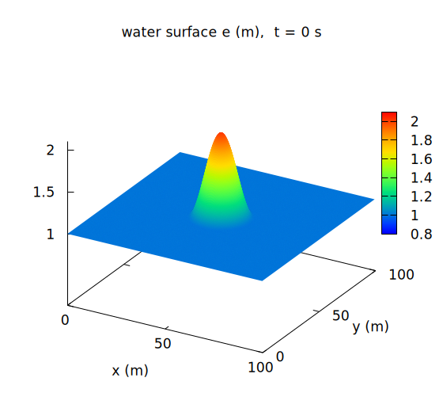 | 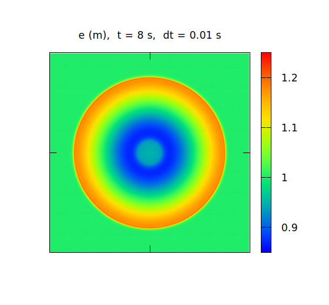 |

The cosine-shaped mound of water, radius 15 m and height 1 m, placed as
the initial condition (left) collapses and spreads as concentric
ripples (right).

> The figures in this document can be regenerated in one batch with the
> bundled `./Fig_wave.sh` (gnuplot required).

### Inside the parameter file

Now let's look inside the parameter file. Its contents are reproduced
below, but **do open the real `en/param_step1.txt` yourself**. On
Windows (WSL), it is easiest to open `tutorials/wave` in Explorer and
open the file (in its `en/` subfolder) with Notepad — see the section
"Viewing and editing files" in
[Using ENCflow on Windows](../../../docs/en/windows.md). In the later
steps too, whenever a new parameter file appears, open it in the same
way and compare it with the text as you go.

```
!======================================================================
! System parameter settings
!======================================================================
&list_sysparam
  dt = 0.01                 ! time step (s)
  !dt = 0.05                 ! time step (s)
  tt = 8.0                  ! end time of computation (s)
  dt_disp = 1.0             ! screen display interval (s)
  dt_file = 1.0             ! file output interval (s)
  f_out_e = 1               ! water level distribution file output
  fn_geoinfo = "-"          ! geographic information settings file
  fn_initial = "-"          ! initial condition settings file
/

!======================================================================
! Geographic information settings
!======================================================================
&list_geoinfo
  lx = 100.0, ly = 100.0    ! size of computational domain (m)
  nx = 350, ny = 350        ! number of grid cells
/

!======================================================================
! Initial condition settings
!======================================================================
&list_initial
  h0 = 1.0                       ! fixed initial water depth (m)
  f_user_routine = "wave_hump"   ! user routine identifier (circular cosine-shaped initial water level)
/
```

The parameter file is in Fortran namelist format: everything from
`&groupname` to `/` forms one group, and everything after `!` is a
comment. Three groups are used here.

- `&list_sysparam` -- system settings such as the time step, end time
  and output intervals, plus the settings file names for each feature.
  Specifying `"-"` for a file name parameter such as `fn_geoinfo` means
  "**read it from within the same file**"; this example keeps all
  settings in a single file (in practical use, terrain data and the
  like can be split into separate files).
- `&list_geoinfo` -- computational domain and grid. A 100 m square is
  covered with a 350x350 grid (cell size about 29 cm).
- `&list_initial` -- initial conditions. Onto still water 1 m deep, the
  user routine `wave_hump` superimposes a circular cosine-shaped mound
  of water level.

### Coarsening the time step

Let's lengthen the time step in `en/param_step1.txt` from 0.01 s to
0.05 s and run `./encflow en/param_step1.txt` again. Just swap the
comment `!` marks.

```
  !dt = 0.01                 ! time step (s)
  dt = 0.05                 ! time step (s)
```

```
time, progress, S(m), Runge, ex_flux, Cn_max, h_max(m), V_max(m/s)
  0:00:00.00   0.0%    1.0210   0.0%      0    0.7747    1.9996    0.0000
  0:00:01.00  12.5%    1.0210   7.8%      0    0.8074    1.9976    0.8604
  0:00:02.00  25.0%    1.0210   7.5%      0    0.8121    1.6356    1.0812
  0:00:03.00  37.5%    1.0210   9.3%      0    0.7901    1.2628    1.0466
  0:00:04.00  50.0%    1.0210  10.6%      0    0.7520    1.2387    0.8258
  0:00:05.00  62.5%    1.0210  13.0%      0    0.7307    1.2205    0.7214
  0:00:06.00  75.0%    1.0210  13.0%      0    0.7161    1.2065    0.6556
  0:00:07.00  87.5%    1.0210  13.6%      0    0.7086    1.2112    0.6106
  0:00:08.00 100.0%    1.0210  15.8%      0    0.7200    1.2281    0.6540
```

Because the time step is now 5 times longer, the Courant numbers in the
Cn_max column have grown from about 0.15 to 0.7-0.8. The plan view
looks unchanged at first glance, but a 3D view of the final water level
(the first figure of `gnuplot Plot_wave.plt`) shows the difference at a
glance.

| dt = 0.01 | dt = 0.05 |
|---|---|
|  | 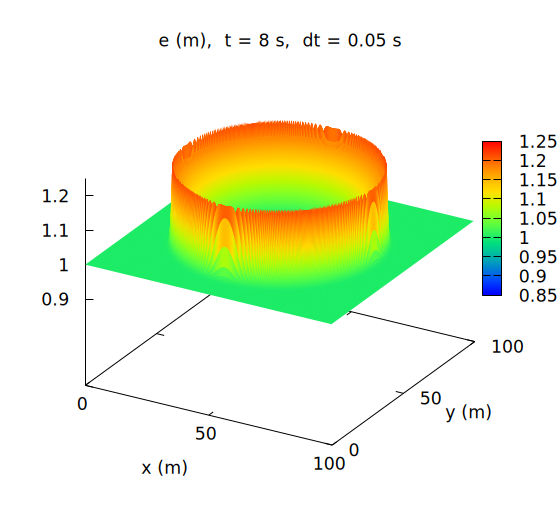 |

With `dt = 0.01` the crest of the wave is a smooth ring; with
`dt = 0.05` the crest is jagged and the whole wave is higher. The last
line of the screen display shows the same thing: h_max has grown from
1.1967 m to 1.2281 m, an **overestimate of 3%**. Zooming in on the wave
front and comparing the water level profiles along the 0-degree
direction (along the x axis) and the 45-degree direction (along the
diagonal) makes the breakdown even clearer.

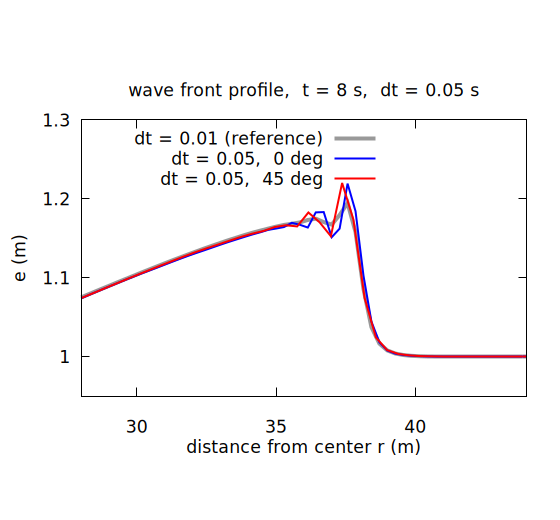

With `dt = 0.01` (gray) the waveform is the same in every direction --
clean concentric circles -- but with `dt = 0.05` numerical oscillations
arise at the wave front, their shape differs by about 4 cm between the
0-degree direction (blue) and the 45-degree direction (red), and the
crest is 2-3 cm higher than the reference. The waveform that should be
concentric is breaking down depending on the orientation of the
computational grid, and the wave height is overestimated.

The orthodox ways to reduce this kind of error are to shrink the time
step or to switch the time integration to a higher-order scheme, but
either one inevitably increases the computational cost. The ENC
computation module of ENCflow implements an **adaptive Runge-Kutta
method** that keeps the loss of accuracy to a minimum at little
computational cost. Let's try it in the next Step.

## Step 2: setting ENC parameters

### Changing the application criterion of the adaptive Runge-Kutta method

The adaptive Runge-Kutta method first computes each time step with the
explicit Euler method, then recomputes with the 4-stage Runge-Kutta
method only those cells whose velocity variation ratio exceeds a
threshold. It cuts the amount of computation drastically compared with
applying Runge-Kutta to all cells, though because of the selective
application its accuracy does not quite reach that of full Runge-Kutta
-- the approach is to "invest high-order accuracy only where it is
needed".

To change this threshold, first add a setting that reads the parameter
file of the ENC computation module. Where `fn_geoinfo` and `fn_initial`
are written inside `&list_sysparam`, add the following line.

```
  fn_enc = "-"              ! ENC parameter settings file
```

Since `"-"` (read from the same file) was specified as the file name,
append the following at the end of the same file.

```
!======================================================================
! ENC computation conditions
!======================================================================
&list_enc
  p_adprunge_thresh = 1.1        ! threshold of the adaptive Runge-Kutta method (1.1 ~)
/
```

`p_adprunge_thresh = 1.1` specifies that any cell whose velocity varied
by a factor of 1.1 or more, or 1/1.1 or less, within one time step is
recomputed with the Runge-Kutta method. The default when unspecified is
1.5, so this setting applies the Runge-Kutta method to smaller
variations as well.

A parameter file with these changes applied is provided as
`en/param_step2.txt` (the time step stays at `dt = 0.05`). Let's run it.

```bash
./encflow en/param_step2.txt
```

```
time, progress, S(m), Runge, ex_flux, Cn_max, h_max(m), V_max(m/s)
  0:00:00.00   0.0%    1.0210   0.0%      0    0.7747    1.9996    0.0000
  0:00:01.00  12.5%    1.0210  10.4%      0    0.8051    1.9976    0.8380
  0:00:02.00  25.0%    1.0210  13.2%      0    0.8106    1.6487    1.0738
  0:00:03.00  37.5%    1.0210  17.7%      0    0.7905    1.2623    1.0462
  0:00:04.00  50.0%    1.0210  21.9%      0    0.7517    1.2388    0.8245
  0:00:05.00  62.5%    1.0210  29.3%      0    0.7300    1.2209    0.7182
  0:00:06.00  75.0%    1.0210  32.9%      0    0.7158    1.2081    0.6514
  0:00:07.00  87.5%    1.0210  37.1%      0    0.7060    1.2016    0.6084
  0:00:08.00 100.0%    1.0210  41.2%      0    0.7021    1.1986    0.5875
```

The Courant number is almost unchanged, but the Runge-Kutta application
ratio in the Runge column has grown sharply from 13-16% up to 41.2%,
and the final h_max (1.1986 m) and V_max (0.5875 m/s) are close to the
`dt = 0.01` values (1.1967 m, 0.5774 m/s). Putting the three 3D views
side by side makes the effect obvious.

| dt = 0.01 | dt = 0.05 | dt = 0.05, threshold 1.1 |
|---|---|---|
|  |  | 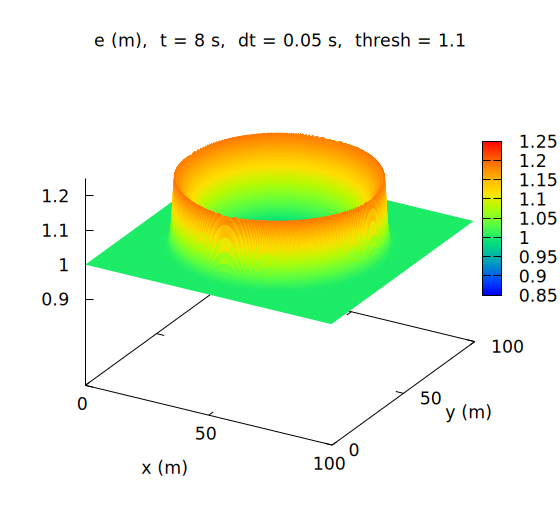 |

The jagged crest of `dt = 0.05` is gone and the wave height is back to
that of `dt = 0.01`. Zooming in on the wave front:

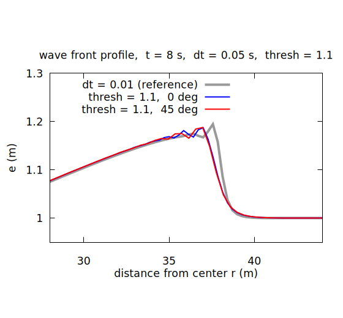

The discrepancy between the 0-degree and 45-degree directions has
shrunk from 4 cm to 1 cm, so the waveform is concentric again, and the
crest, which was 2-3 cm too high with `dt = 0.05`, now matches
`dt = 0.01` (gray). **Both the direction dependence and the
overestimated wave height are corrected.** The time step is still
5 times longer, and fewer than half of the cells are recomputed -- this
is exactly what the adaptive Runge-Kutta method aims for.

On close inspection, however, the wave front (r = 38 m or so) sits
0.1-0.2 m behind that of `dt = 0.01` and the crest is slightly
smoothed. The cells near the front that were recomputed are replaced by
a smoother (more damped) solution than the Euler step gives, so the
sharper the front, the more it lags a little. This is the price of
investing high-order accuracy selectively, and lowering the threshold
does not remove it.

The real purpose of the adaptive Runge-Kutta method is to **avoid
shrinking the time step for the whole domain just because of a few
extreme places** (a steep wave front, a wetting front climbing onto
dry ground, and the like). This example lowers the threshold to an
extreme value to show the effect, but a recomputation ratio as high as
41% is really a sign that the time step is too coarse. In practice,
choose the time step so that the Runge column stays within a few
percent to about 10%, and let the adaptive Runge-Kutta method take care
of the local problems that remain.

### Extending the computation time

This time, let's extend the end time of `en/param_step2.txt` and watch
the behavior after the wave reaches the edges of the domain.

```
  tt = 14.0                 ! end time of computation (s)
```

```
time, progress, S(m), Runge, ex_flux, Cn_max, h_max(m), V_max(m/s)
  0:00:11.00  78.6%    1.0210  38.2%      0    0.6851    1.1777    0.5210
  0:00:12.00  85.7%    1.0210  32.3%      0    0.6783    1.3168    0.4947
  0:00:13.00  92.9%    1.0210  26.4%      0    0.6771    1.3085    0.4715
  0:00:14.00 100.0%    1.0210  23.1%      0    0.6895    1.2979    0.4505
```

From t = 12 s on, h_max -- which should have kept decreasing -- jumps
up to 1.32 m. Visualizing the result shows the wave reflecting off the
four sides of the computational domain.

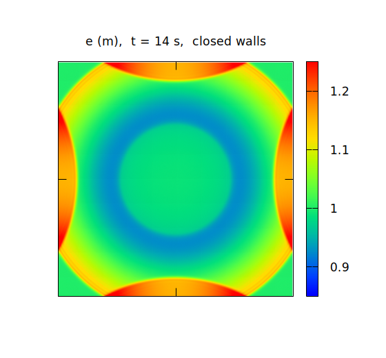

The outer rim of the ENCflow computational domain is, by default, an
**impermeable wall** (this is why the S column stays constant -- no
water leaves the domain at all). For a water tank computation this is
the correct behavior, but in a computation that cuts out part of a wide
water surface, we would rather have the wave simply leave the domain.
That is the theme of the next Step.

## Step 3: setting boundary conditions

### Setting the four walls to a transmissive condition

To set boundary conditions, add to `&list_sysparam` the reading of a
boundary condition settings file (again `"-"` = read from the same
file),

```
  fn_boundary = "-"         ! boundary condition settings file
```

and append at the end of the file a `&list_bound_edge` group that
specifies the boundary condition type for each of the four edges of the
outer rim of the computational domain.

```
!======================================================================
! Edge boundary conditions: boundary condition type for each of the
!   four edges of the outer rim of the computational domain
!   0: impermeable (wall; default)
!   1: free outflow (for flood inundation)
!   2: long-wave radiation (for tsunami / wave propagation)
!   Correspondence between compass directions and grid indices
!   (raster row order = north to south):
!     west = i=1 (left edge), east = i=nx (right edge),
!     north = j=1 (top edge), south = j=ny (bottom edge)
!======================================================================
&list_bound_edge
  f_bc_w = 2
  f_bc_e = 2
  f_bc_n = 2
  f_bc_s = 2
/
```

Type `2` (long-wave radiation) is a condition that lets long waves
reaching the boundary escape from the domain without reflection. The
radiation condition suits wave propagation like this example; to let
flood water drain out of the domain in a flood inundation computation,
use type `1` (free outflow). The four edges can each be specified
independently.

A parameter file with these changes applied is provided as
`en/param_step3.txt` (with `tt = 14` also applied). Let's run it.

```
time, progress, S(m), Runge, ex_flux, Cn_max, h_max(m), V_max(m/s)
  0:00:11.00  78.6%    1.0210  38.2%      0    0.6851    1.1777    0.5210
  0:00:12.00  85.7%    1.0187  32.3%      0    0.6783    1.1685    0.5242
  0:00:13.00  92.9%    1.0112  25.2%      0    0.6742    1.1603    0.5107
  0:00:14.00 100.0%    1.0026  20.4%      0    0.6677    1.1533    0.4846
```

This time h_max does not jump after t = 12 s; instead, the total amount
of water in the S column starts to decrease -- the wave passes through
the boundary and leaves the domain, and the corresponding loss of water
from the system can be tracked in the S column. Let's compare visually.

| Impermeable (default) | Long-wave radiation |
|---|---|
|  | 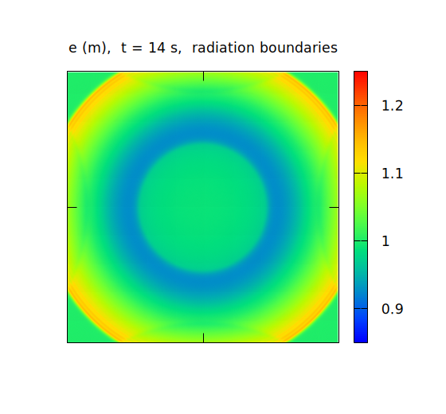 |

The reflection at the walls is gone, and the wave simply flows out of
the domain.

## Step 4: observing the characteristics of the ENC grid

Finally, let's look at a property unique to the **ENC grid
(eight-neighbor connected collocated grid)**, from which ENCflow takes
its name. In the ENC grid, each cell is connected not only to its four
neighbors up, down, left and right but also to its **four diagonal
neighbors**, exchanging water through links in eight directions. When
linear obstacles such as walls and levees are represented on a raster
grid, this shows up as a property that four-connected models do not
have.

`en/param_step4.txt` uses a user routine in `&list_geoinfo` to place a
wall -- cells with ground elevation 1.5 m, excluded from the
computation -- crossing the computational domain diagonally at 45
degrees.

```
&list_geoinfo
  lx = 100.0, ly = 100.0    ! size of computational domain (m)
  nx = 350, ny = 350        ! number of grid cells

  ! user routine identifier (no obstacle if unspecified)
  f_user_routine = "wave_solid_wall"   ! diagonal impermeable wall (2 cells thick)
  !f_user_routine = "wave_leaky_wall"   ! diagonal semi-permeable wall (1 cell thick)
/
```

### A wall that is impermeable

First, run with the **2-cell-thick** wall `wave_solid_wall` as
provided.

```bash
./encflow en/param_step4.txt
```

In the startup display, `number of valid cells` has dropped from 122500
to 121976 -- the cells turned into the wall are excluded from the
computation and consume neither memory nor computation time.

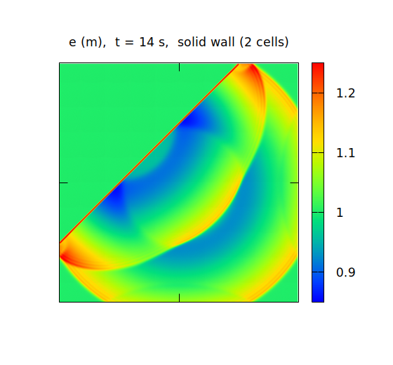

The wave is completely blocked by the wall and spreads, while
reflecting, only on the near side of the wall. The far side remains
still water.

### A wall that is semi-permeable

Next, switch the user routine in `en/param_step4.txt` to the
**1-cell-thick** wall `wave_leaky_wall` (swap the comment `!` marks)
and run again.

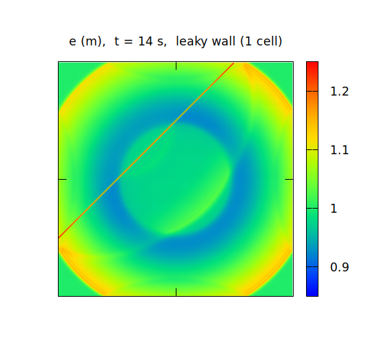

The wall is in the same place, yet this time the wave **passes
through** it and spreads to the far side as well.

This is the eight-directional connectivity of the ENC grid at work.
When a 45-degree diagonal wall is laid out one cell thick, the wall
cells touch each other only corner to corner. The ENC grid has
**diagonal links** that cross these corners, so the water cells on both
sides of the wall stay connected diagonally and water passes through.
With a thickness of two cells, no link crosses a corner and the wall
becomes impermeable (walls parallel to the x or y axis are impermeable
even at one cell thick).

When representing thin linear structures such as levees and breakwaters
in terrain data, watch out for this property -- the safe practice is to
**rasterize diagonal sections at least two cells thick**. Note that for
real-world river levees and seawalls, dedicated virtual wall features
(`fn_bank` / `fn_seawall`) that do not require thickening cells are
also available.

## Supplement: what the front oscillation is -- grid refinement and physical dispersion

The jagged wave front seen in Steps 1 and 2 is **numerical dispersion**
(a phase error of the discretization), an error in the opposite
direction from numerical diffusion (smoothing). This supplement digs a
little deeper. The runs are heavier, so they are kept apart from the
main steps (the figures are regenerated by `./Fig_supp.sh`; about
30 minutes on a 4-core laptop).

### What is happening

The initial mound is 1 m high on 1 m of water. In the hydrostatic
shallow water equations a wave as high as the depth steepens at its
front as it travels and eventually becomes a bore (a discontinuity).
The discretization can only represent this steep front over a few
cells, and there the short-wavelength components travel at the wrong
speed, so fine oscillations appear behind the front. The coarser the
time step, the larger the phase error and the oscillation -- that was
the `dt = 0.05` figure of Step 1. Even with `dt = 0.01` a small
overshoot remains at the crest (1.195 m at r = 37.6 m).

### Refining the grid

Double the number of cells, 350 → 700 → 1400, and shrink the time step
in proportion, 0.01 → 0.005 → 0.0025 s, so that the Courant number
stays the same (only `nx, ny` and `dt` change).

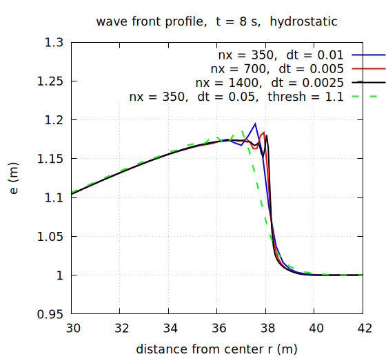

The front becomes sharper with each refinement and the overshoot at
the crest shrinks, 1.195 → 1.184 → 1.181 m. The width of the
oscillation is always a few cells and shrinks with the grid -- the
signature of numerical dispersion. The price is computing time: each
doubling means 4 times the cells and twice the steps, 8 times in all
(here 18 s → 134 s → 981 s).

The lag of `dt = 0.05` with threshold 1.1 seen in Step 2 (green dashed)
can now be placed in context. The mid-height of its front (e = 1.1 m)
is at r = 37.8 m, behind the 38.1 m of `dt = 0.01` and the
38.2 m of nx = 1400. The run closer to the refined side is
`dt = 0.01`; the lag of threshold 1.1 is the amount by which the
numerical damping of the recomputation has blunted the sharp front,
moving it away from the solution of the hydrostatic equations.

### In reality there is physical dispersion

The oscillations so far were discretization errors, but real water also has
a mechanism, of a different kind, that keeps the front from becoming a
bore. Step by step:

1. Once the front is as steep as the depth, the water is accelerated not
   only horizontally but also up and down: **the vertical acceleration can
   no longer be neglected**.
2. With vertical acceleration the pressure departs from hydrostatic, and
   **frequency dispersion** acts: the speed of a wave depends on its
   wavelength (shorter waves travel more slowly). The nonlinearity that
   steepens the front and the dispersion that spreads it balance, and the
   front settles into a gentle shape (eventually a train of waves).
3. The hydrostatic shallow water equations assume hydrostatic pressure and
   **leave out** the vertical acceleration. So however fine the grid, what
   they converge to is a bore, not the real front. The nx = 1400 result of
   the previous subsection is the "correct solution of the equations", but
   not "reality".
4. To reproduce this physical dispersion ENCflow has a **one-layer
   non-hydrostatic correction** (the vertical acceleration is approximated
   with one layer and the pressure corrected; see the non-hydrostatic
   section of the [user guide](../../../docs/en/users_guide/swflow.md)).
5. To use it, add one line to `&list_enc`.

```
  fn_enc = "-"              ! ENC parameter file
  ...
&list_enc
  f_nonhydrostatic = 1           ! one-layer non-hydrostatic correction
/
```

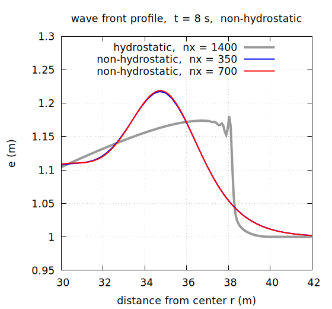

The front becomes a gentle hill and the oscillation disappears. The
crest is higher (1.22 m) and further back (r ≈ 34.7 m), the toe
reaches further forward (r ≈ 39.3 m): the shape itself differs from
the hydrostatic bore. The nx = 350 and 700 results coincide, so the
solution is already converged on this grid (the guide for the
non-hydrostatic correction is Δx ≲ H/2; the run takes 1.5 to 2 times
as long as the hydrostatic run on the same grid). Run longer, the front
splits from its head into a train of waves, an undular bore
(test/nhbore).

### Summary: converge the numerics first, add physics afterwards

What this supplement showed, arranged as an order of operations:

- **Solving the hydrostatic shallow water equations on a coarse grid with a
  coarse time step** lets the oscillation of numerical dispersion grow
  large. The maximum wave height is overestimated (h_max 3% too high with
  `dt = 0.05` in Step 1), the anisotropy of a front that should be circular
  but differs by 4 cm between the 0° and 45° directions becomes visible,
  and in the worst case the computation breaks down.
- **The proper remedy is to refine the grid and shrink the time step with
  it.** With nx = 350 → 700 → 1400 the oscillation shrank with the grid and
  the solution approached the correct solution of the equations (a bore with
  its front at r ≈ 38.2 m). The cost is 8 times per doubling of the grid
  (18 s → 134 s → 981 s).
- **The adaptive Runge-Kutta method** (Step 2) recomputes only the steps in
  which the oscillation grows, so it suppresses the oscillation and avoids
  breakdown at little cost. On the other hand the numerical damping of the
  recomputation blunts a sharp front, and can move the result away from the
  correct solution, as with the lagging front of threshold 1.1 (r = 37.8 m).
- **Whether the correct solution of the equations is close to reality is a
  separate question.** As the previous subsection showed, the converged
  hydrostatic solution is a bore, while the real front (with dispersion) is a
  gentle hill with its mid-height at r ≈ 37.1 m and its toe out to 39.3 m.
  The lagging front of threshold 1.1 happens to sit close to the
  non-hydrostatic one in position, but for a different reason; its shape
  (steepness) is still hydrostatic. **Do not try to imitate physics with
  numerical settings.**
- The order is therefore: **first converge the numerics with the grid and
  time step; if a difference still remains and it is missing physics, add
  that physics.**
- In the first stage, use the adaptive Runge-Kutta method as a trade-off
  against cost (a tool to suppress oscillation and breakdown on a grid that
  cannot be refined, not a substitute for convergence). In the second stage
  the non-hydrostatic correction is added, but it too costs 1.5 to 2 times
  the computing time, so its applicability must be judged. Dispersion
  matters only when the width of the front is comparable to the depth. This
  example, a mound of radius 15 m and height 1 m on 1 m of water, meets that
  at the front, while the back slope (r < 32 m) coincides in every run. For
  tsunamis offshore (wavelengths of tens of km over depths of km) or flood
  inundation, where the front is far wider than the depth, physical
  dispersion does not act and the converged hydrostatic solution is the
  right answer. If an oscillation appears at the front there, it is
  numerical dispersion (a discretization error), not physics, and it should
  be removed with the grid and time step (and the adaptive Runge-Kutta
  method), not by adding the non-hydrostatic correction. See the
  non-hydrostatic section of the
  [user guide](../../../docs/en/users_guide/swflow.md) for the conditions and
  settings.

## Closing

This tutorial started from running ENCflow and reading its output, and
went on to time integration accuracy and the adaptive Runge-Kutta
method, boundary conditions, and the wall properties of the ENC grid.
From here:

- [Tutorial 2: chichibu](../../chichibu/en/README.md) -- on to
  rainfall-runoff computation of a catchment with real terrain data;
  the standard workflow of practical computations is taught there
- [examples/](../../../examples/) -- a collection of setup samples
- [test/](../../../test/) -- verified example cases (they double as
  regression tests)
- To run with MPI parallelism, use the `encflow_mpi` executable built
  with the corresponding `make.inc` settings, e.g.
  `mpirun -np 4 ./encflow_mpi en/param_step1.txt`
  ([installation guide](../../../docs/en/install.md)). The results, of
  course, match the serial run bit for bit.

The figures in this document (`../figs/`) can be regenerated in one
batch with `./Fig_wave.sh` (gnuplot required; it runs the same
computations as in the text, in order, and draws the figures).
